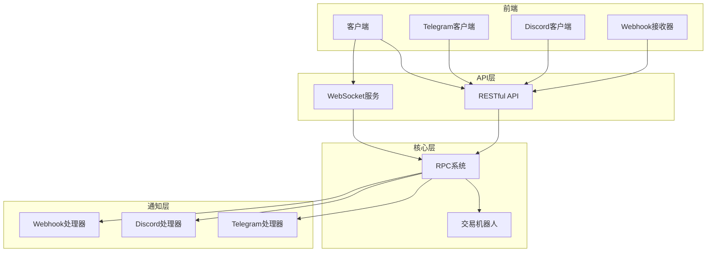
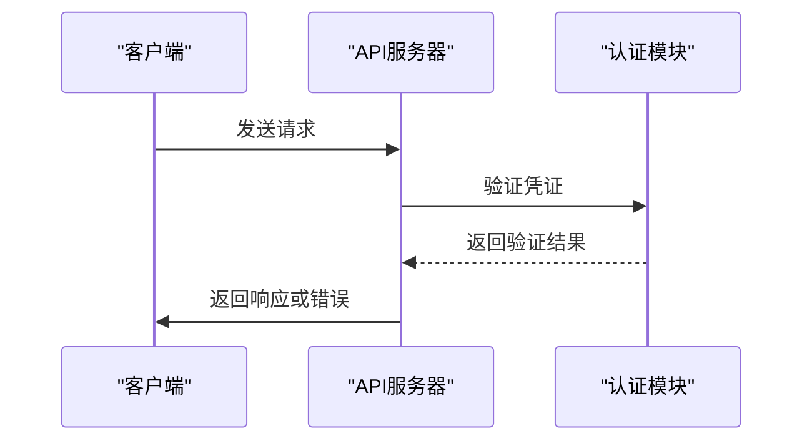
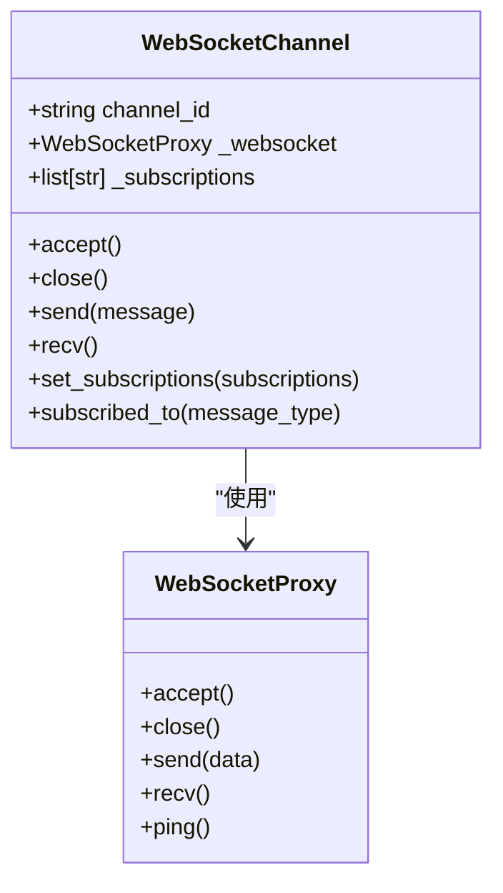
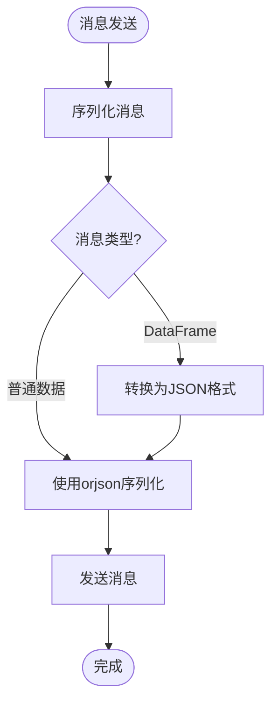
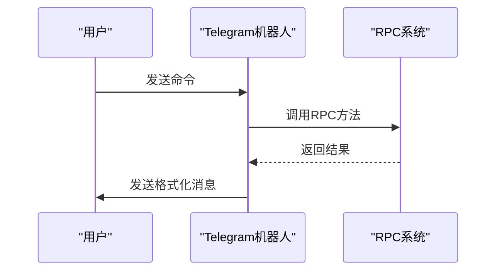
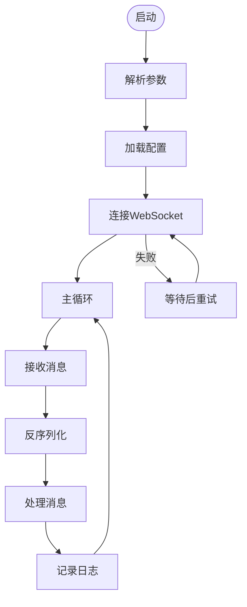
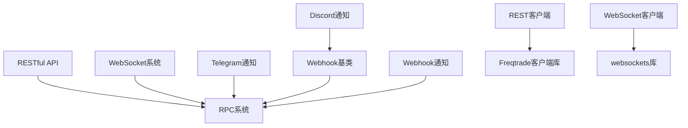

# API与远程控制

<cite>
**本文档引用的文件**
- [api_v1.py](file://freqtrade/rpc/api_server/api_v1.py)
- [api_auth.py](file://freqtrade/rpc/api_server/api_auth.py)
- [api_ws.py](file://freqtrade/rpc/api_server/api_ws.py)
- [ws/channel.py](file://freqtrade/rpc/api_server/ws/channel.py)
- [ws/serializer.py](file://freqtrade/rpc/api_server/ws/serializer.py)
- [ws/message_stream.py](file://freqtrade/rpc/api_server/ws/message_stream.py)
- [telegram.py](file://freqtrade/rpc/telegram.py)
- [discord.py](file://freqtrade/rpc/discord.py)
- [webhook.py](file://freqtrade/rpc/webhook.py)
- [rest_client.py](file://scripts/rest_client.py)
- [ws_client.py](file://scripts/ws_client.py)
</cite>

## 目录
1. [简介](#简介)
2. [项目结构](#项目结构)
3. [核心组件](#核心组件)
4. [架构概述](#架构概述)
5. [详细组件分析](#详细组件分析)
6. [依赖分析](#依赖分析)
7. [性能考虑](#性能考虑)
8. [故障排除指南](#故障排除指南)
9. [结论](#结论)

## 简介
本文档全面介绍了Freqtrade的API与远程控制功能，涵盖基于FastAPI的RESTful API设计、WebSocket实时消息系统、Telegram、Discord和Webhook等通知渠道的配置与使用方法。通过示例代码演示如何构建外部监控系统或自动化控制脚本，并包含API速率限制、错误处理和安全性最佳实践。

## 项目结构
Freqtrade项目结构清晰，主要通信接口位于`freqtrade/rpc/api_server`目录下。RESTful API端点定义在`api_v1.py`中，WebSocket实现在`api_ws.py`和`ws/`子目录中。通知渠道实现在`rpc/`目录下的`telegram.py`、`discord.py`和`webhook.py`文件中。外部客户端示例位于`scripts/`目录下的`rest_client.py`和`ws_client.py`。

**Section sources**
- [api_v1.py](file://freqtrade/rpc/api_server/api_v1.py)
- [api_ws.py](file://freqtrade/rpc/api_server/api_ws.py)
- [telegram.py](file://freqtrade/rpc/telegram.py)
- [discord.py](file://freqtrade/rpc/discord.py)
- [webhook.py](file://freqtrade/rpc/webhook.py)
- [rest_client.py](file://scripts/rest_client.py)
- [ws_client.py](file://scripts/ws_client.py)

## 核心组件
核心组件包括基于FastAPI的RESTful API、WebSocket实时消息系统以及多种通知渠道。RESTful API提供全面的交易控制和状态查询功能，WebSocket系统实现实时消息推送，通知渠道支持Telegram、Discord和Webhook等多种方式。

**Section sources**
- [api_v1.py](file://freqtrade/rpc/api_server/api_v1.py)
- [api_ws.py](file://freqtrade/rpc/api_server/api_ws.py)
- [telegram.py](file://freqtrade/rpc/telegram.py)
- [discord.py](file://freqtrade/rpc/discord.py)
- [webhook.py](file://freqtrade/rpc/webhook.py)

## 架构概述
系统采用分层架构，前端通过RESTful API或WebSocket与后端通信。RESTful API处理同步请求，WebSocket处理异步消息推送。通知系统作为独立模块，通过RPC机制接收消息并转发到相应渠道。

**Diagram sources**
- [api_v1.py](file://freqtrade/rpc/api_server/api_v1.py)
- [api_ws.py](file://freqtrade/rpc/api_server/api_ws.py)
- [telegram.py](file://freqtrade/rpc/telegram.py)
- [discord.py](file://freqtrade/rpc/discord.py)
- [webhook.py](file://freqtrade/rpc/webhook.py)

## 详细组件分析

### RESTful API分析
RESTful API基于FastAPI框架实现，提供全面的交易控制和状态查询功能。API版本为2.43，包含多个端点用于管理交易、查询状态、控制机器人等。

#### 认证机制
API支持多种认证方式，包括HTTP Basic认证和JWT令牌认证。WebSocket连接使用独立的令牌验证机制。

**Diagram sources**
- [api_auth.py](file://freqtrade/rpc/api_server/api_auth.py)
- [api_v1.py](file://freqtrade/rpc/api_server/api_v1.py)

#### 端点路由
API提供丰富的端点，包括：
- `/ping` - 健康检查
- `/version` - 版本信息
- `/balance` - 账户余额
- `/status` - 交易状态
- `/forceenter` - 强制开仓
- `/forceexit` - 强制平仓
- `/whitelist` - 白名单管理

**Section sources**
- [api_v1.py](file://freqtrade/rpc/api_server/api_v1.py)

### WebSocket实时消息系统分析
WebSocket系统实现实时消息推送，客户端可以订阅特定类型的消息，如分析后的数据帧、白名单更新等。

#### 连接管理
WebSocket连接通过`WebSocketChannel`类管理，每个连接都有唯一的通道ID，支持订阅和取消订阅消息类型。

**Diagram sources**
- [ws/channel.py](file://freqtrade/rpc/api_server/ws/channel.py)
- [ws/proxy.py](file://freqtrade/rpc/api_server/ws/proxy.py)

#### 消息序列化
消息序列化使用`HybridJSONWebSocketSerializer`，支持普通JSON数据和pandas DataFrame的序列化与反序列化。

**Diagram sources**
- [ws/serializer.py](file://freqtrade/rpc/api_server/ws/serializer.py)

#### 事件推送机制
事件推送通过`MessageStream`实现，生产者发布消息，订阅者接收消息。系统会监控通道的延迟，如果延迟过大则发出警告。

**Section sources**
- [ws/message_stream.py](file://freqtrade/rpc/api_server/ws/message_stream.py)
- [api_ws.py](file://freqtrade/rpc/api_server/api_ws.py)

### 通知渠道分析
系统支持多种通知渠道，每种渠道都有独立的处理器。

#### Telegram通知
Telegram通知通过`Telegram`类实现，支持命令处理、消息格式化和发送。

**Diagram sources**
- [telegram.py](file://freqtrade/rpc/telegram.py)

#### Discord通知
Discord通知通过`Discord`类实现，继承自`Webhook`基类，支持嵌入式消息格式。

**Section sources**
- [discord.py](file://freqtrade/rpc/discord.py)
- [webhook.py](file://freqtrade/rpc/webhook.py)

#### Webhook通知
Webhook通知通过`Webhook`类实现，支持多种格式（form、json、raw）和重试机制。

**Section sources**
- [webhook.py](file://freqtrade/rpc/webhook.py)

### 客户端示例分析
提供两个客户端示例，用于演示如何与API交互。

#### REST客户端
`rest_client.py`是一个简单的命令行客户端，用于测试RPC命令。

**Section sources**
- [rest_client.py](file://scripts/rest_client.py)

#### WebSocket客户端
`ws_client.py`是一个完整的WebSocket客户端，支持连接、消息处理和重连机制。

**Diagram sources**
- [ws_client.py](file://scripts/ws_client.py)

## 依赖分析
系统依赖关系清晰，各组件耦合度适中。API层依赖RPC系统，通知渠道依赖配置和RPC系统，客户端示例独立运行。

**Diagram sources**
- [api_v1.py](file://freqtrade/rpc/api_server/api_v1.py)
- [api_ws.py](file://freqtrade/rpc/api_server/api_ws.py)
- [telegram.py](file://freqtrade/rpc/telegram.py)
- [discord.py](file://freqtrade/rpc/discord.py)
- [webhook.py](file://freqtrade/rpc/webhook.py)

## 性能考虑
系统在设计时考虑了性能因素，如WebSocket消息发送的节流控制、序列化性能优化等。建议合理设置客户端的订阅类型，避免过多的消息推送导致性能下降。

## 故障排除指南
常见问题包括连接失败、认证错误、消息延迟等。检查配置文件中的认证信息是否正确，确保网络连接正常，监控系统日志以获取详细错误信息。

**Section sources**
- [api_auth.py](file://freqtrade/rpc/api_server/api_auth.py)
- [api_ws.py](file://freqtrade/rpc/api_server/api_ws.py)
- [ws_client.py](file://scripts/ws_client.py)

## 结论
Freqtrade的API与远程控制功能设计完善，提供了丰富的接口和灵活的配置选项。通过RESTful API和WebSocket系统，用户可以方便地监控和控制交易机器人。多种通知渠道的支持使得用户可以及时获取交易信息。外部客户端示例为开发自定义监控系统提供了良好的起点。