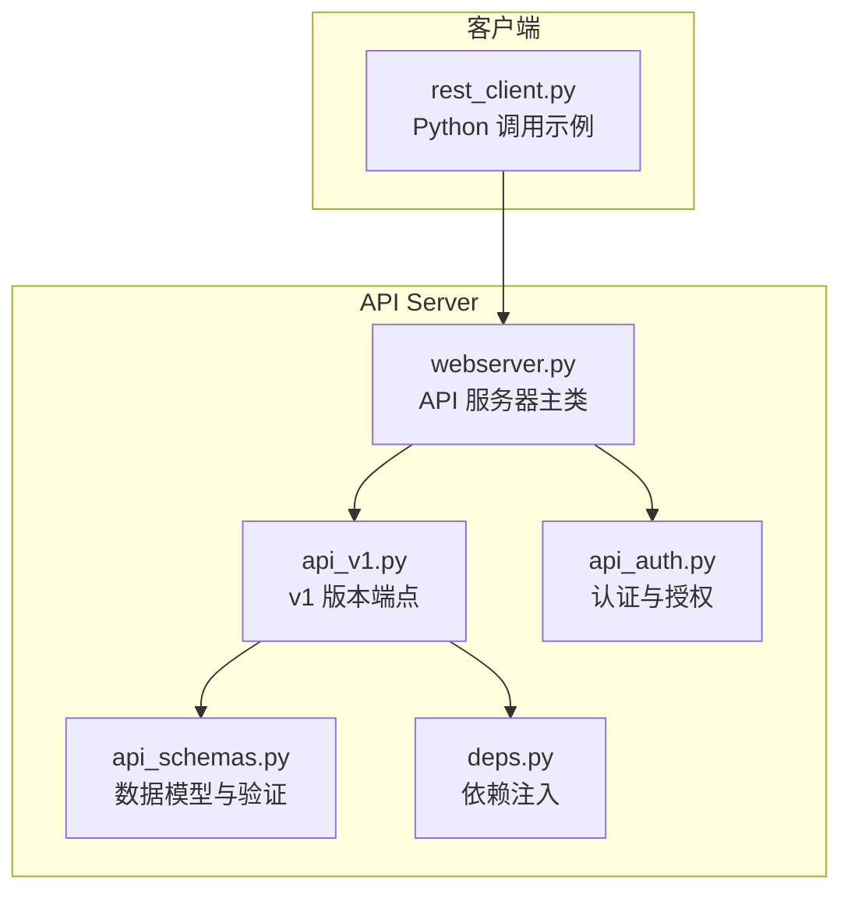
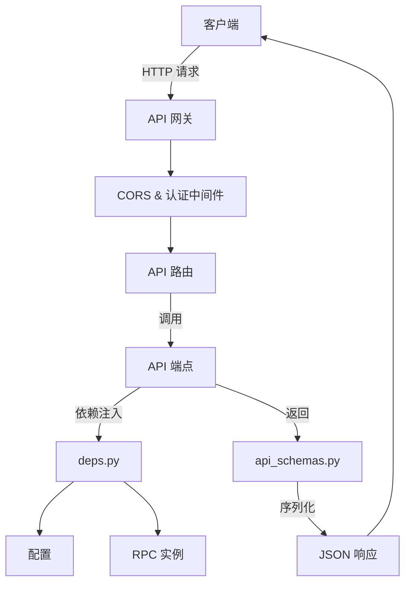
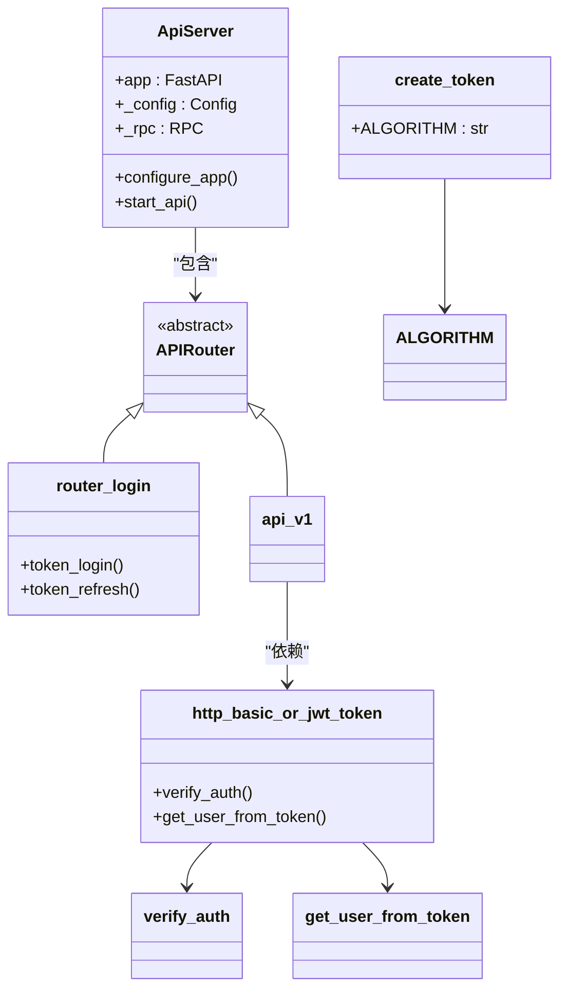
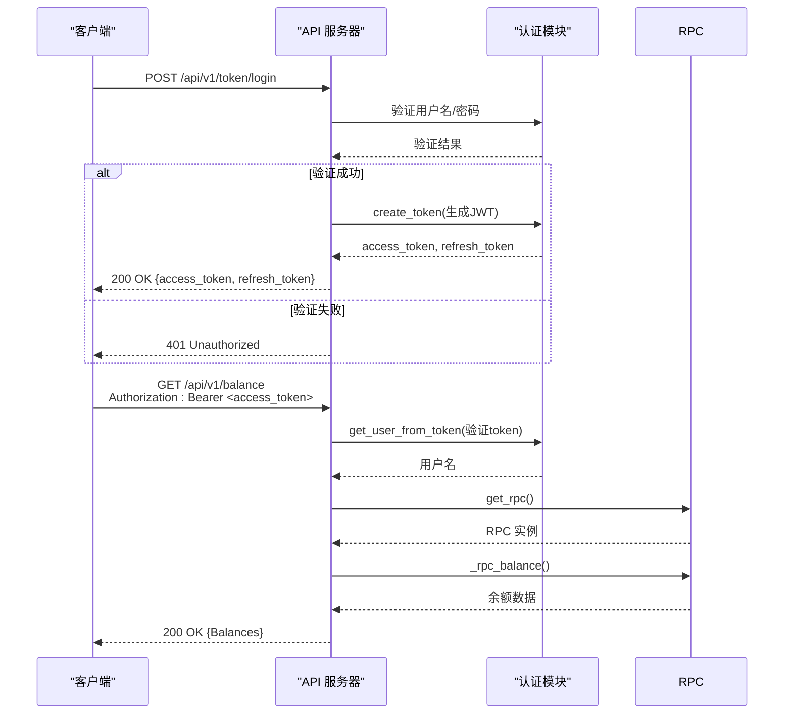
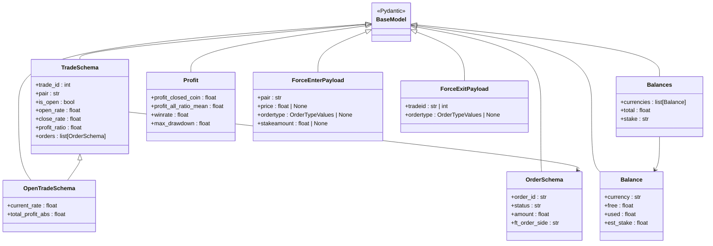
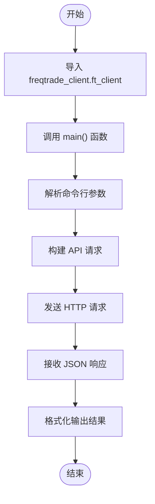
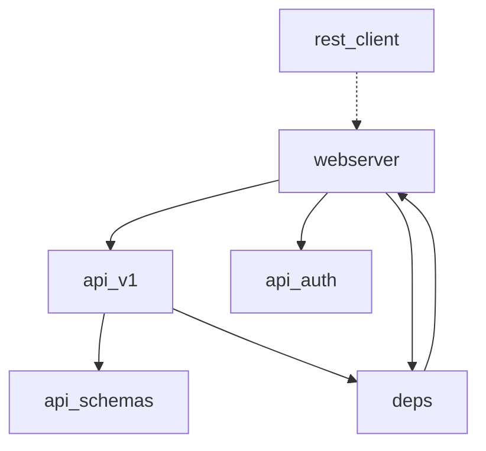

# REST API 接口

<cite>
**本文档中引用的文件**  
- [api_schemas.py](file://freqtrade/rpc/api_server/api_schemas.py)
- [api_v1.py](file://freqtrade/rpc/api_server/api_v1.py)
- [api_auth.py](file://freqtrade/rpc/api_server/api_auth.py)
- [webserver.py](file://freqtrade/rpc/api_server/webserver.py)
- [deps.py](file://freqtrade/rpc/api_server/deps.py)
- [rest_client.py](file://scripts/rest_client.py)
</cite>

## 目录
1. [简介](#简介)
2. [项目结构](#项目结构)
3. [核心组件](#核心组件)
4. [架构概述](#架构概述)
5. [详细组件分析](#详细组件分析)
6. [依赖分析](#依赖分析)
7. [性能考虑](#性能考虑)
8. [故障排除指南](#故障排除指南)
9. [结论](#结论)

## 简介
本文档详细介绍了基于 FastAPI 构建的 Freqtrade v1 REST API 接口。重点涵盖 API 的认证机制、端点路由结构、HTTP 方法使用规范，以及核心功能如机器人状态获取、交易管理、性能统计等。文档还说明了数据验证规则、错误码、速率限制策略和安全性配置建议，并通过示例代码展示如何进行自动化调用。

## 项目结构
Freqtrade 的 REST API 功能主要集中在 `freqtrade/rpc/api_server/` 目录下，采用模块化设计，各组件职责分明。

**图示来源**
- [webserver.py](file://freqtrade/rpc/api_server/webserver.py#L1-L245)
- [api_v1.py](file://freqtrade/rpc/api_server/api_v1.py#L1-L576)
- [api_auth.py](file://freqtrade/rpc/api_server/api_auth.py#L1-L162)
- [api_schemas.py](file://freqtrade/rpc/api_server/api_schemas.py#L1-L666)
- [deps.py](file://freqtrade/rpc/api_server/deps.py#L1-L72)
- [rest_client.py](file://scripts/rest_client.py#L1-L15)

**本节来源**
- [freqtrade/rpc/api_server/](file://freqtrade/rpc/api_server/)

## 核心组件
核心组件包括 API 服务器、认证系统、数据模型和端点定义。`ApiServer` 类是单例模式，负责启动和管理 FastAPI 应用。`api_auth.py` 处理 JWT 和 HTTP Basic 认证。`api_schemas.py` 使用 Pydantic 定义了所有请求和响应的数据结构，确保了数据的有效性和序列化。`api_v1.py` 则定义了所有 v1 版本的 API 端点。

**本节来源**
- [webserver.py](file://freqtrade/rpc/api_server/webserver.py#L1-L245)
- [api_auth.py](file://freqtrade/rpc/api_server/api_auth.py#L1-L162)
- [api_schemas.py](file://freqtrade/rpc/api_server/api_schemas.py#L1-L666)
- [api_v1.py](file://freqtrade/rpc/api_server/api_v1.py#L1-L576)

## 架构概述
系统采用典型的 FastAPI 分层架构。最底层是 `ApiServer` 单例，它初始化 FastAPI 应用并配置中间件（如 CORS）。中间层是路由（Routers），`api_v1` 和 `api_auth` 等模块定义了具体的端点。这些端点通过依赖注入（`deps.py`）获取配置和 RPC 实例。最上层是数据模型（`api_schemas.py`），为所有 API 交互提供类型安全和数据验证。

**图示来源**
- [webserver.py](file://freqtrade/rpc/api_server/webserver.py#L117-L177)
- [api_v1.py](file://freqtrade/rpc/api_server/api_v1.py#L1-L576)
- [deps.py](file://freqtrade/rpc/api_server/deps.py#L1-L72)
- [api_schemas.py](file://freqtrade/rpc/api_server/api_schemas.py#L1-L666)

## 详细组件分析

### 认证机制分析
API 提供了基于 JWT 和 HTTP Basic 的双重认证机制，确保了访问的安全性。

#### 认证流程类图

**图示来源**
- [webserver.py](file://freqtrade/rpc/api_server/webserver.py#L117-L177)
- [api_auth.py](file://freqtrade/rpc/api_server/api_auth.py#L1-L162)

#### 认证流程序列图

**图示来源**
- [api_auth.py](file://freqtrade/rpc/api_server/api_auth.py#L1-L162)
- [api_v1.py](file://freqtrade/rpc/api_server/api_v1.py#L1-L576)
- [deps.py](file://freqtrade/rpc/api_server/deps.py#L1-L72)

**本节来源**
- [api_auth.py](file://freqtrade/rpc/api_server/api_auth.py#L1-L162)
- [api_v1.py](file://freqtrade/rpc/api_server/api_v1.py#L1-L576)
- [deps.py](file://freqtrade/rpc/api_server/deps.py#L1-L72)

### 核心端点功能分析
v1 API 提供了丰富的端点来监控和控制交易机器人。

#### 核心端点功能表
| 端点 | HTTP 方法 | 功能描述 | 请求模型 | 响应模型 |
| :--- | :--- | :--- | :--- | :--- |
| `/ping` | GET | 健康检查 | 无 | Ping |
| `/version` | GET | 获取机器人版本 | 无 | Version |
| `/balance` | GET | 获取账户余额 | 无 | Balances |
| `/status` | GET | 获取机器人状态 | 无 | list[OpenTradeSchema] |
| `/profit` | GET | 获取利润统计 | 无 | Profit |
| `/forceenter` | POST | 强制开仓 | ForceEnterPayload | ForceEnterResponse |
| `/forceexit` | POST | 强制平仓 | ForceExitPayload | ResultMsg |
| `/start` | POST | 启动机器人 | 无 | StatusMsg |
| `/stop` | POST | 停止机器人 | 无 | StatusMsg |

**本节来源**
- [api_v1.py](file://freqtrade/rpc/api_server/api_v1.py#L1-L576)
- [api_schemas.py](file://freqtrade/rpc/api_server/api_schemas.py#L1-L666)

### 数据验证与序列化分析
API 使用 Pydantic 模型进行严格的数据验证和序列化，确保了接口的健壮性。

#### 数据模型关系图

**图示来源**
- [api_schemas.py](file://freqtrade/rpc/api_server/api_schemas.py#L1-L666)

**本节来源**
- [api_schemas.py](file://freqtrade/rpc/api_server/api_schemas.py#L1-L666)

### Python 客户端调用示例
`scripts/rest_client.py` 提供了一个简单的 Python 脚本示例，展示了如何通过命令行调用 API。

#### 客户端调用流程

**图示来源**
- [rest_client.py](file://scripts/rest_client.py#L1-L15)

**本节来源**
- [rest_client.py](file://scripts/rest_client.py#L1-L15)

## 依赖分析
API Server 模块内部依赖关系清晰。`webserver.py` 是核心，它依赖于 `api_v1.py` 和 `api_auth.py` 来注册路由，并通过 `deps.py` 进行依赖注入。`api_v1.py` 依赖于 `api_schemas.py` 来定义请求和响应模型。外部依赖主要是 FastAPI、Pydantic 和 JWT 库。

**图示来源**
- [webserver.py](file://freqtrade/rpc/api_server/webserver.py#L117-L177)
- [api_v1.py](file://freqtrade/rpc/api_server/api_v1.py#L1-L576)
- [deps.py](file://freqtrade/rpc/api_server/deps.py#L1-L72)

**本节来源**
- [webserver.py](file://freqtrade/rpc/api_server/webserver.py#L1-L245)
- [api_v1.py](file://freqtrade/rpc/api_server/api_v1.py#L1-L576)
- [deps.py](file://freqtrade/rpc/api_server/deps.py#L1-L72)

## 性能考虑
API 性能主要受后端 RPC 调用和数据库查询的影响。例如，`/trades` 端点在交易量大时响应时间会显著增加。建议使用 `limit` 和 `offset` 参数进行分页。`/pair_candles` 端点返回大量 K 线数据，应谨慎调用。API 服务器本身使用 Uvicorn，支持异步处理，能够有效应对并发请求。

## 故障排除指南
常见问题包括认证失败、端点返回 502 错误和连接超时。

**本节来源**
- [webserver.py](file://freqtrade/rpc/api_server/webserver.py#L111-L115)
- [api_auth.py](file://freqtrade/rpc/api_server/api_auth.py#L1-L162)

## 结论
Freqtrade 的 REST API 设计良好，功能全面，为自动化监控和交易提供了强大的支持。通过理解其认证机制、端点结构和数据模型，开发者可以轻松地构建自定义的监控工具或集成到其他系统中。遵循安全性配置建议可以有效保护 API 免受未授权访问。