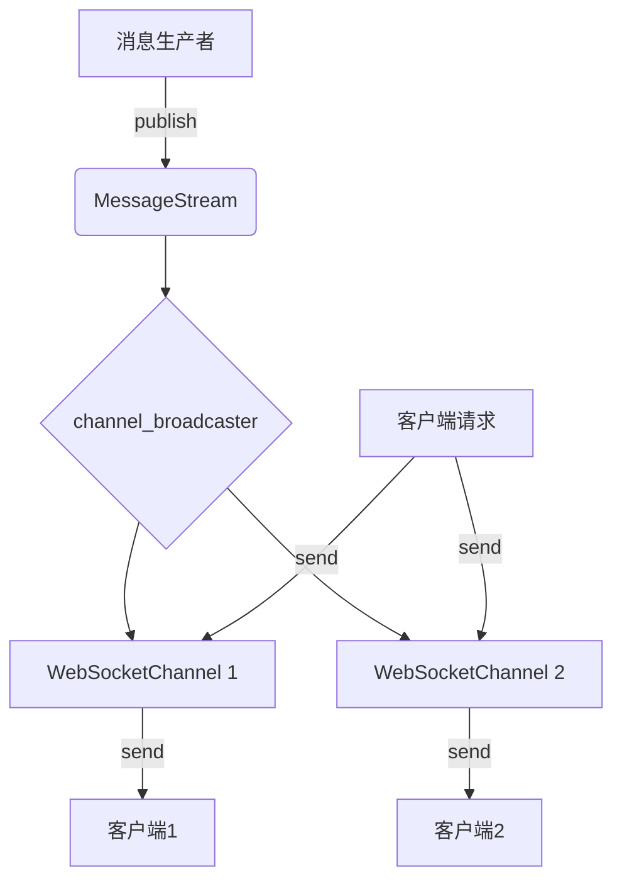
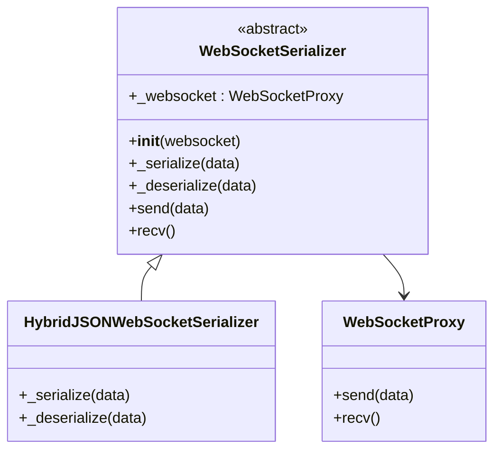
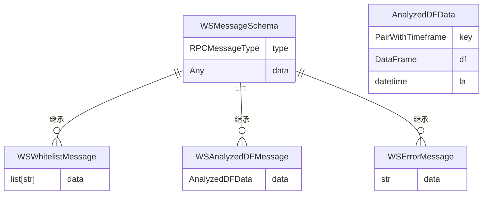
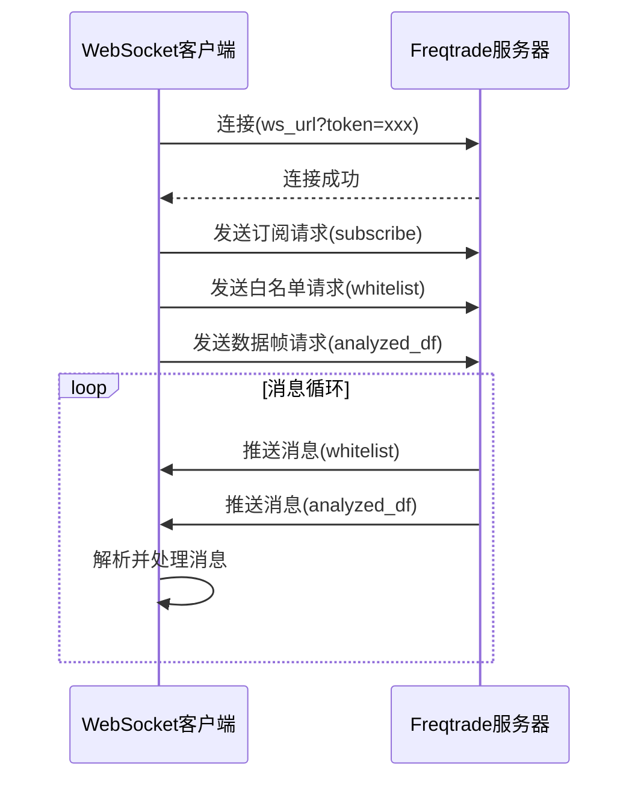

# WebSocket 实时通信

<cite>
**本文档中引用的文件**  
- [message_stream.py](file://freqtrade/rpc/api_server/ws/message_stream.py)
- [serializer.py](file://freqtrade/rpc/api_server/ws/serializer.py)
- [ws_types.py](file://freqtrade/rpc/api_server/ws/ws_types.py)
- [ws_schemas.py](file://freqtrade/rpc/api_server/ws_schemas.py)
- [ws_client.py](file://scripts/ws_client.py)
</cite>

## 目录
1. [引言](#引言)
2. [WebSocket 连接与认证机制](#websocket-连接与认证机制)
3. [消息通道管理](#消息通道管理)
4. [消息序列化与广播机制](#消息序列化与广播机制)
5. [事件类型与消息结构](#事件类型与消息结构)
6. [客户端实现与外部集成](#客户端实现与外部集成)
7. [连接保持与错误重连策略](#连接保持与错误重连策略)
8. [性能优化建议](#性能优化建议)
9. [总结](#总结)

## 引言
WebSocket 实时消息系统是 Freqtrade 架构中用于实现低延迟、双向通信的核心组件。该系统支持实时推送交易信号、白名单更新、分析数据帧等关键事件，为外部可视化系统、警报服务和监控工具提供高效的数据流接口。本文深入解析其内部实现机制，涵盖连接建立、认证、消息通道管理、序列化、广播流程及客户端集成实践。

## WebSocket 连接与认证机制
WebSocket 连接通过 `/api/v1/message/ws` 端点建立，客户端需在 URL 查询参数中提供有效的 `token` 进行身份验证。该 token 通常配置在 `config.json` 的 `external_message_consumer` 部分，确保只有授权客户端能够接入消息流。连接建立后，服务器端会初始化一个 `WebSocketChannel` 对象来管理该连接的生命周期和订阅状态。

**Section sources**
- [ws_client.py](file://scripts/ws_client.py#L245-L278)
- [api_ws.py](file://freqtrade/rpc/api_server/api_ws.py#L44-L60)

## 消息通道管理
系统使用 `WebSocketChannel` 类来抽象每个客户端连接。通道支持基于消息类型的订阅机制，客户端可通过发送 `subscribe` 类型的请求来指定其感兴趣的消息类别（如 `analyzed_df`, `whitelist`）。`MessageStream` 类作为核心消息总线，采用异步迭代器模式（`__aiter__`）实现生产者-消费者模型。所有消息首先发布到全局的 `MessageStream` 实例，然后由 `channel_broadcaster` 协程负责将消息分发给所有订阅了该消息类型的通道。

**Diagram sources**
- [message_stream.py](file://freqtrade/rpc/api_server/ws/message_stream.py#L4-L31)
- [api_ws.py](file://freqtrade/rpc/api_server/api_ws.py#L44-L60)

**Section sources**
- [message_stream.py](file://freqtrade/rpc/api_server/ws/message_stream.py#L4-L31)
- [api_ws.py](file://freqtrade/rpc/api_server/api_ws.py#L44-L60)

## 消息序列化与广播机制
消息的序列化与反序列化由 `WebSocketSerializer` 抽象基类定义，并由 `HybridJSONWebSocketSerializer` 具体实现。该实现利用 `orjson` 库进行高效的 JSON 序列化，并通过 `_json_default` 函数支持 `pandas.DataFrame` 等复杂对象的转换。反序列化则使用 `rapidjson`，并配合 `_json_object_hook` 函数将特殊标记的 JSON 对象（如 `{"__type__": "dataframe"}`）还原为原始的 DataFrame 对象。广播机制通过监听 `MessageStream` 的异步迭代器，检查每个通道的订阅列表，仅向订阅了特定消息类型的通道发送数据，从而实现高效的消息分发。

**Diagram sources**
- [serializer.py](file://freqtrade/rpc/api_server/ws/serializer.py#L16-L42)
- [proxy.py](file://freqtrade/rpc/api_server/ws/proxy.py)

**Section sources**
- [serializer.py](file://freqtrade/rpc/api_server/ws/serializer.py#L16-L42)
- [ws_types.py](file://freqtrade/rpc/api_server/ws/ws_types.py#L1-L9)

## 事件类型与消息结构
系统定义了多种事件类型，每种类型对应特定的消息结构。这些结构在 `ws_schemas.py` 中通过 Pydantic 模型进行定义。例如，`WSWhitelistMessage` 用于推送交易对白名单更新，其 `data` 字段为字符串列表；`WSAnalyzedDFMessage` 用于推送分析后的 K 线数据，其 `data` 字段包含一个嵌套模型 `AnalyzedDFData`，该模型包含 `key`（交易对和时间帧）、`df`（DataFrame 数据）和 `la`（最后分析时间）等字段。`WSErrorMessage` 用于报告异常。客户端通过订阅这些类型来接收相应的实时数据。

**Diagram sources**
- [ws_schemas.py](file://freqtrade/rpc/api_server/ws_schemas.py#L10-L69)
- [rpcmessagetype.py](file://freqtrade/enums/rpcmessagetype.py)

**Section sources**
- [ws_schemas.py](file://freqtrade/rpc/api_server/ws_schemas.py#L10-L69)
- [constants.py](file://freqtrade/constants.py)

## 客户端实现与外部集成
`ws_client.py` 提供了一个完整的客户端示例，展示了如何构建一个外部监听器。该客户端使用 `websockets` 库连接到服务器，实现 `ClientProtocol` 类来处理连接、消息接收和业务逻辑。连接建立后，它会发送初始请求，包括订阅消息类型、请求当前白名单和分析数据。收到消息后，`on_message` 方法会根据消息类型调用相应的处理函数（如 `_handle_whitelist`, `_handle_analyzed_df`），实现数据的解析和日志记录。此模式可直接用于构建可视化仪表板或警报系统。

**Diagram sources**
- [ws_client.py](file://scripts/ws_client.py#L122-L193)

**Section sources**
- [ws_client.py](file://scripts/ws_client.py#L122-L193)

## 连接保持与错误重连策略
客户端实现中包含了健壮的连接保持和错误重连机制。`create_client` 函数运行在一个无限循环中，确保连接断开后能自动重试。在消息接收循环中，设置了 `wait_timeout` 超时。如果超时，客户端会尝试发送一个 `ping` 命令来检测连接状态。如果 `ping` 在 `ping_timeout` 内没有收到响应，则判定连接已断开，跳出内层循环并触发重连。该机制能有效处理网络波动和服务器重启等情况，保证数据流的长期稳定性。

**Section sources**
- [ws_client.py](file://scripts/ws_client.py#L196-L278)

## 性能优化建议
为确保系统的高性能和低延迟，建议采取以下措施：1) 合理设置客户端的 `message_size_limit`，防止过大的数据帧阻塞连接；2) 根据实际需求精简订阅的消息类型，避免接收不必要的数据；3) 优化 `analyzed_df` 请求的 `limit` 参数，仅获取必要的历史数据量；4) 在高并发场景下，监控 `channel_broadcaster` 的日志，若频繁出现“Channel is behind MessageStream by 1 minute”的警告，应考虑减少交易对列表规模或消费者数量，以防止内存泄漏。

## 总结
Freqtrade 的 WebSocket 实时消息系统通过 `MessageStream`、`WebSocketChannel` 和 `WebSocketSerializer` 等核心组件，构建了一个高效、灵活且可靠的实时通信框架。它不仅支持多种关键事件的实时推送，还通过完善的客户端示例和重连机制，为外部系统集成提供了坚实的基础。深入理解其工作原理，有助于开发者构建高性能的监控、分析和交易辅助工具。