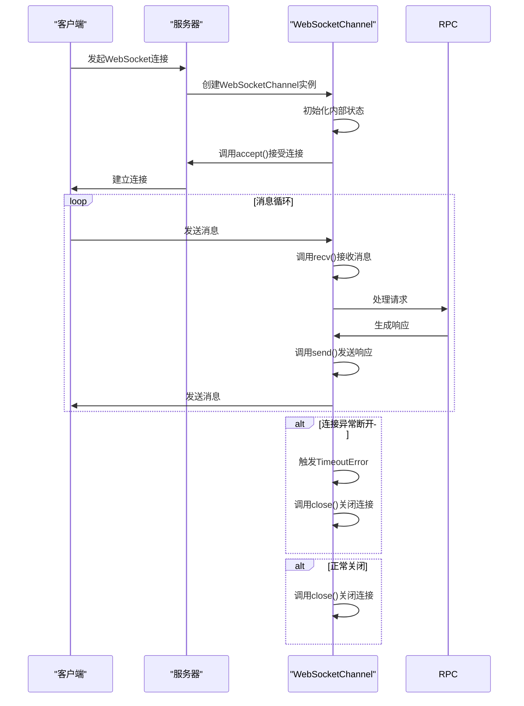
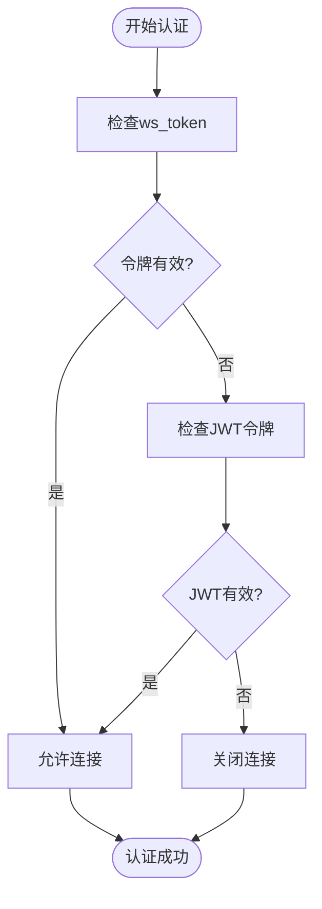
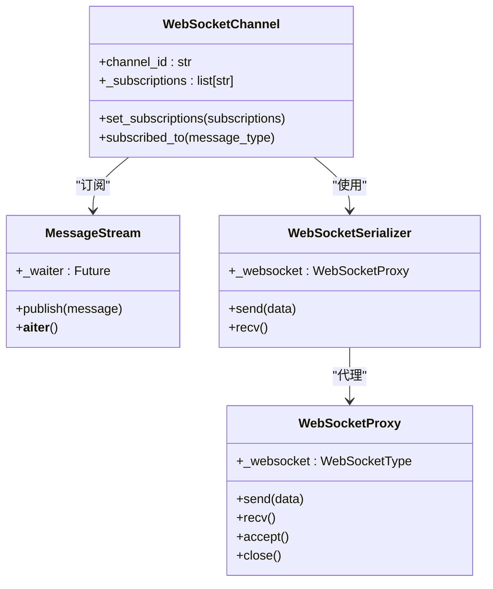
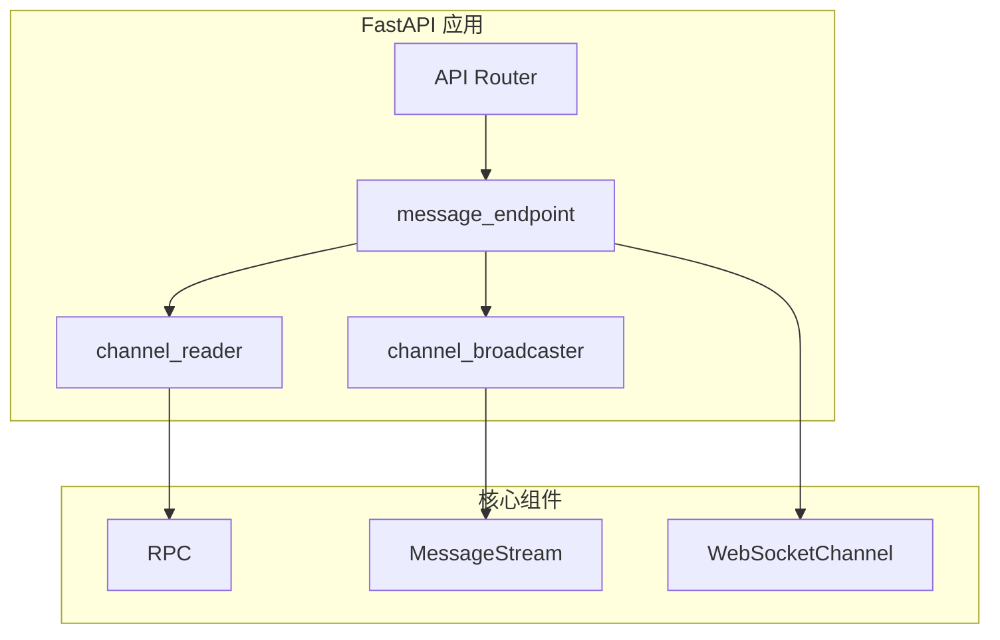
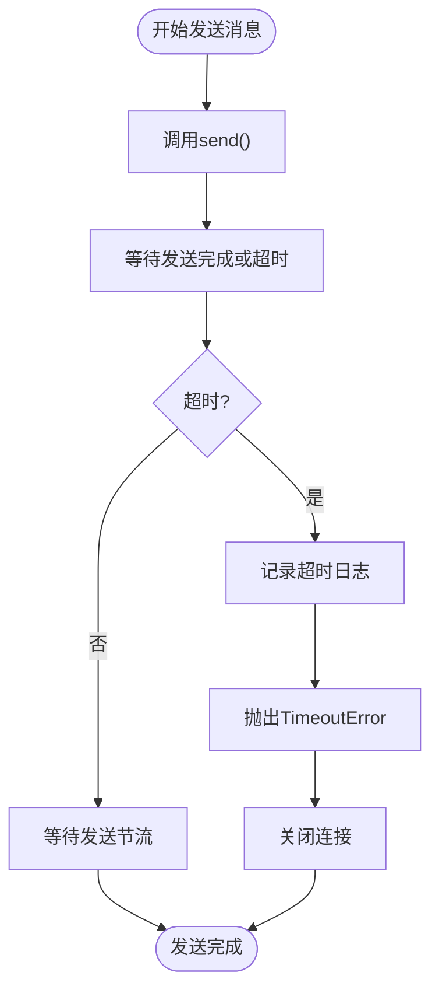

# WebSocket 连接管理

<cite>
**Referenced Files in This Document**   
- [channel.py](file://freqtrade/rpc/api_server/ws/channel.py)
- [api_ws.py](file://freqtrade/rpc/api_server/api_ws.py)
- [api_auth.py](file://freqtrade/rpc/api_server/api_auth.py)
- [message_stream.py](file://freqtrade/rpc/api_server/ws/message_stream.py)
- [serializer.py](file://freqtrade/rpc/api_server/ws/serializer.py)
- [proxy.py](file://freqtrade/rpc/api_server/ws/proxy.py)
- [rpc.py](file://freqtrade/rpc/rpc.py)
- [deps.py](file://freqtrade/rpc/api_server/deps.py)
</cite>

## 目录
1. [WebSocket 连接生命周期](#websocket-连接生命周期)
2. [认证机制](#认证机制)
3. [连接池与并发管理](#连接池与并发管理)
4. [FastAPI 集成与消息流](#fastapi-集成与消息流)
5. [异常处理与资源释放](#异常处理与资源释放)
6. [压力测试与最佳实践](#压力测试与最佳实践)

## WebSocket 连接生命周期

WebSocket 连接的生命周期由 `WebSocketChannel` 类管理，该类封装了连接的初始化、消息收发、会话保持和异常断开处理。连接的创建通过 `create_channel` 上下文管理器实现，确保连接在使用完毕后能够正确关闭。

**Diagram sources**
- [channel.py](file://freqtrade/rpc/api_server/ws/channel.py#L24-L223)
- [api_ws.py](file://freqtrade/rpc/api_server/api_ws.py#L100-L124)

**Section sources**
- [channel.py](file://freqtrade/rpc/api_server/ws/channel.py#L24-L223)
- [api_ws.py](file://freqtrade/rpc/api_server/api_ws.py#L100-L124)

## 认证机制

WebSocket 连接支持两种认证方式：API 密钥和 JWT 令牌。认证过程由 `validate_ws_token` 函数处理，该函数在连接建立时被调用。系统首先检查提供的令牌是否与配置中的 `ws_token` 匹配，如果匹配则允许连接；如果不匹配，则尝试将其解析为 JWT 令牌。JWT 令牌的验证包括检查签名、过期时间和令牌类型。

**Diagram sources**
- [api_auth.py](file://freqtrade/rpc/api_server/api_auth.py#L55-L85)

**Section sources**
- [api_auth.py](file://freqtrade/rpc/api_server/api_auth.py#L55-L85)

## 连接池与并发管理

系统通过 `MessageStream` 类实现消息流管理，允许多个消费者订阅和接收消息。每个 `WebSocketChannel` 实例维护自己的订阅列表，通过 `set_subscriptions` 方法设置。消息发送时，`channel_broadcaster` 协程会检查每个通道的订阅状态，只向订阅了相应消息类型的通道发送消息。这种设计有效地实现了连接池管理和并发连接的限制。

**Diagram sources**
- [channel.py](file://freqtrade/rpc/api_server/ws/channel.py#L24-L223)
- [message_stream.py](file://freqtrade/rpc/api_server/ws/message_stream.py#L4-L31)
- [serializer.py](file://freqtrade/rpc/api_server/ws/serializer.py#L16-L57)
- [proxy.py](file://freqtrade/rpc/api_server/ws/proxy.py#L8-L72)

**Section sources**
- [channel.py](file://freqtrade/rpc/api_server/ws/channel.py#L24-L223)
- [message_stream.py](file://freqtrade/rpc/api_server/ws/message_stream.py#L4-L31)

## FastAPI 集成与消息流

WebSocket 端点通过 FastAPI 的 `@router.websocket` 装饰器集成到应用中。`message_endpoint` 函数是 WebSocket 的入口点，它使用 `Depends` 注入依赖项，包括认证令牌、RPC 实例和消息流。连接建立后，系统同时运行两个协程：`channel_reader` 处理客户端请求，`channel_broadcaster` 向客户端广播消息。这种设计确保了双向通信的高效性。

**Diagram sources**
- [api_ws.py](file://freqtrade/rpc/api_server/api_ws.py#L100-L124)
- [deps.py](file://freqtrade/rpc/api_server/deps.py#L22-L71)

**Section sources**
- [api_ws.py](file://freqtrade/rpc/api_server/api_ws.py#L100-L124)
- [deps.py](file://freqtrade/rpc/api_server/deps.py#L22-L71)

## 异常处理与资源释放

系统实现了完善的异常处理机制，确保在连接异常断开时能够正确释放资源。`WebSocketChannel` 类的 `send` 方法包含超时检测，如果发送耗时过长，会抛出 `TimeoutError` 并触发连接关闭。`run_channel_tasks` 方法使用 `try...except` 块捕获异常，并在异常发生时取消所有相关任务。`__aiter__` 方法在连接关闭时自动停止消息接收循环。

**Diagram sources**
- [channel.py](file://freqtrade/rpc/api_server/ws/channel.py#L24-L223)

**Section sources**
- [channel.py](file://freqtrade/rpc/api_server/ws/channel.py#L24-L223)

## 压力测试与最佳实践

为了确保 WebSocket 服务的稳定性和性能，建议进行压力测试。测试应包括高并发连接、长时间会话保持和大量消息传输等场景。最佳实践包括：合理设置 `send_throttle` 参数以避免过快发送消息；监控 `avg_send_time` 以动态调整发送速率；定期检查连接状态以及时清理无效连接；使用 JWT 令牌而非 API 密钥以提高安全性。

**Section sources**
- [channel.py](file://freqtrade/rpc/api_server/ws/channel.py#L24-L223)
- [api_auth.py](file://freqtrade/rpc/api_server/api_auth.py#L55-L85)