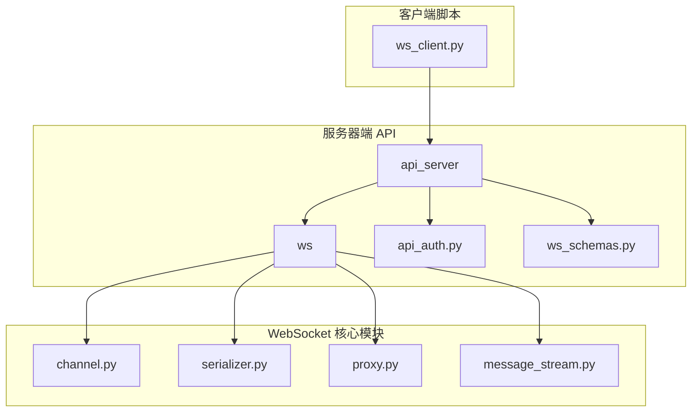
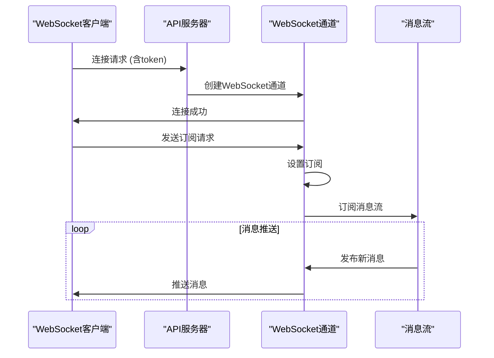
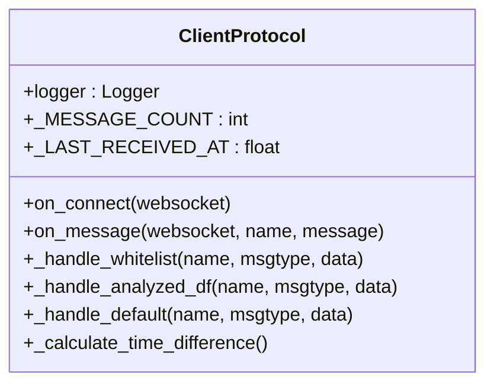
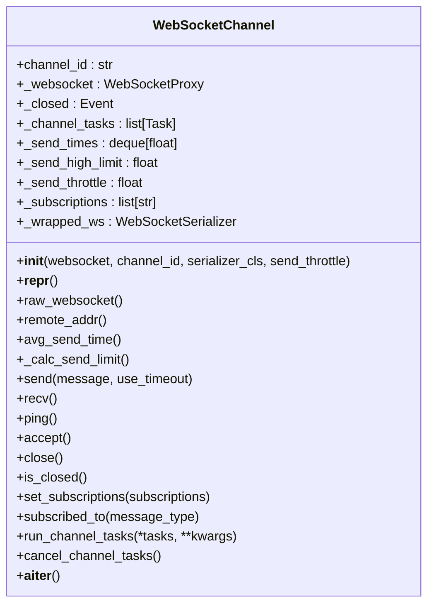
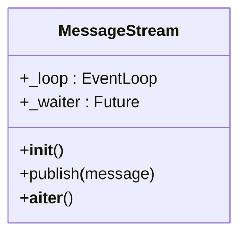
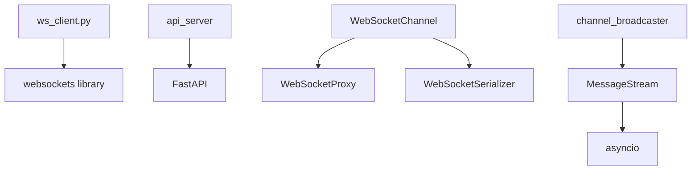

# 客户端集成与使用示例

<cite>
**本文档中引用的文件**   
- [ws_client.py](file://scripts/ws_client.py)
- [api_ws.py](file://freqtrade/rpc/api_server/api_ws.py)
- [channel.py](file://freqtrade/rpc/api_server/ws/channel.py)
- [ws_schemas.py](file://freqtrade/rpc/api_server/ws_schemas.py)
- [serializer.py](file://freqtrade/rpc/api_server/ws/serializer.py)
- [proxy.py](file://freqtrade/rpc/api_server/ws/proxy.py)
- [message_stream.py](file://freqtrade/rpc/api_server/ws/message_stream.py)
- [api_auth.py](file://freqtrade/rpc/api_server/api_auth.py)
</cite>

## 目录
1. [简介](#简介)
2. [项目结构](#项目结构)
3. [核心组件](#核心组件)
4. [架构概述](#架构概述)
5. [详细组件分析](#详细组件分析)
6. [依赖分析](#依赖分析)
7. [性能考虑](#性能考虑)
8. [故障排除指南](#故障排除指南)
9. [结论](#结论)

## 简介
本文档提供基于 `scripts/ws_client.py` 示例脚本的完整 WebSocket 客户端接入指南。详细说明如何建立安全连接、完成身份验证、订阅特定事件流（如交易更新或策略信号）并处理实时消息。涵盖错误处理机制（如网络中断、认证失败）和自动重连策略的实现。展示如何将接收到的数据用于外部可视化仪表盘、移动通知或第三方分析系统，并包含 Python 异步客户端的最佳实践代码片段。

## 项目结构
Freqtrade 项目的结构清晰地组织了其功能模块，其中 WebSocket 客户端相关功能主要集中在 `scripts/` 和 `freqtrade/rpc/api_server/` 目录下。`scripts/` 目录包含独立的客户端脚本，而 `rpc/api_server/` 目录则实现了服务器端的 WebSocket 通信逻辑。

**Diagram sources**
- [ws_client.py](file://scripts/ws_client.py)
- [api_ws.py](file://freqtrade/rpc/api_server/api_ws.py)
- [channel.py](file://freqtrade/rpc/api_server/ws/channel.py)

**Section sources**
- [ws_client.py](file://scripts/ws_client.py)
- [api_ws.py](file://freqtrade/rpc/api_server/api_ws.py)

## 核心组件
核心组件包括 `ClientProtocol` 类，它定义了客户端在连接建立、消息接收和处理方面的行为。`create_client` 函数负责管理 WebSocket 连接的生命周期，包括连接、重连和错误处理。服务器端的 `WebSocketChannel` 类封装了 WebSocket 连接的管理，而 `MessageStream` 类则负责消息的发布和订阅。

**Section sources**
- [ws_client.py](file://scripts/ws_client.py#L154-L234)
- [channel.py](file://freqtrade/rpc/api_server/ws/channel.py#L24-L223)
- [message_stream.py](file://freqtrade/rpc/api_server/ws/message_stream.py#L4-L31)

## 架构概述
系统架构采用客户端-服务器模式，通过 WebSocket 协议进行实时通信。客户端通过 `ws_client.py` 脚本发起连接，服务器端通过 `api_ws.py` 中的路由处理连接请求。`WebSocketChannel` 类作为通道管理器，协调消息的接收和发送。`MessageStream` 类作为消息总线，允许生产者发布消息，消费者订阅感兴趣的消息类型。

**Diagram sources**
- [ws_client.py](file://scripts/ws_client.py#L191-L234)
- [api_ws.py](file://freqtrade/rpc/api_server/api_ws.py#L79-L123)
- [channel.py](file://freqtrade/rpc/api_server/ws/channel.py#L170-L190)
- [message_stream.py](file://freqtrade/rpc/api_server/ws/message_stream.py#L14-L21)

## 详细组件分析

### 客户端协议分析
`ClientProtocol` 类是客户端的核心，它定义了连接建立后发送初始请求、处理接收到的消息以及处理不同类型消息的逻辑。

#### 对象导向组件

**Diagram sources**
- [ws_client.py](file://scripts/ws_client.py#L154-L234)

### 服务器端通道分析
`WebSocketChannel` 类是服务器端的核心，它管理单个 WebSocket 连接的生命周期，包括发送、接收、订阅和任务管理。

#### 对象导向组件

**Diagram sources**
- [channel.py](file://freqtrade/rpc/api_server/ws/channel.py#L24-L223)

### 消息流分析
`MessageStream` 类实现了发布-订阅模式，是系统内消息传递的中枢。

#### 对象导向组件

**Diagram sources**
- [message_stream.py](file://freqtrade/rpc/api_server/ws/message_stream.py#L4-L31)

**Section sources**
- [message_stream.py](file://freqtrade/rpc/api_server/ws/message_stream.py#L4-L31)

## 依赖分析
系统各组件之间存在明确的依赖关系。客户端脚本依赖于 `websockets` 库进行连接，服务器端依赖于 `FastAPI` 和 `websockets` 库。`WebSocketChannel` 依赖于 `WebSocketProxy` 和 `WebSocketSerializer` 来处理不同类型的 WebSocket 连接和序列化。`MessageStream` 被 `channel_broadcaster` 任务用于向所有订阅的通道广播消息。

**Diagram sources**
- [ws_client.py](file://scripts/ws_client.py)
- [channel.py](file://freqtrade/rpc/api_server/ws/channel.py)
- [api_ws.py](file://freqtrade/rpc/api_server/api_ws.py)

**Section sources**
- [ws_client.py](file://scripts/ws_client.py)
- [channel.py](file://freqtrade/rpc/api_server/ws/channel.py)
- [api_ws.py](file://freqtrade/rpc/api_server/api_ws.py)

## 性能考虑
系统在设计时考虑了性能因素。`WebSocketChannel` 的 `send` 方法实现了发送节流（`send_throttle`）和超时控制，以防止过快发送消息导致连接问题。`_calc_send_limit` 方法根据历史发送时间动态调整发送超时限制。`MessageStream` 使用 `asyncio.shield` 来保护等待的 `Future` 不被取消，确保消息不会丢失。

## 故障排除指南
常见的故障包括连接被拒绝、认证失败和网络中断。连接被拒绝通常是由于主机或端口配置错误。认证失败是由于 `ws_token` 不正确。网络中断时，客户端会自动尝试重连。服务器端会定期 ping 客户端以检测连接状态。如果发送消息超时，连接将被关闭以防止内存泄漏。

**Section sources**
- [ws_client.py](file://scripts/ws_client.py#L191-L234)
- [api_ws.py](file://freqtrade/rpc/api_server/api_ws.py#L44-L60)
- [api_auth.py](file://freqtrade/rpc/api_server/api_auth.py#L100-L120)

## 结论
本文档详细介绍了 Freqtrade 的 WebSocket 客户端接入机制。通过分析 `ws_client.py` 脚本和相关服务器端代码，我们了解了如何建立安全连接、订阅消息、处理实时数据以及实现健壮的错误处理和重连策略。该架构设计良好，支持高效的实时通信，适用于构建外部监控和分析系统。