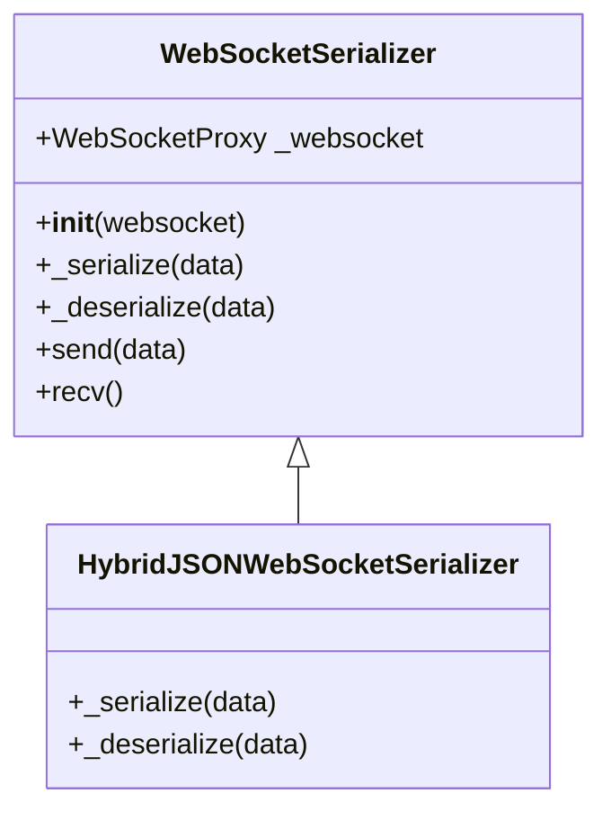
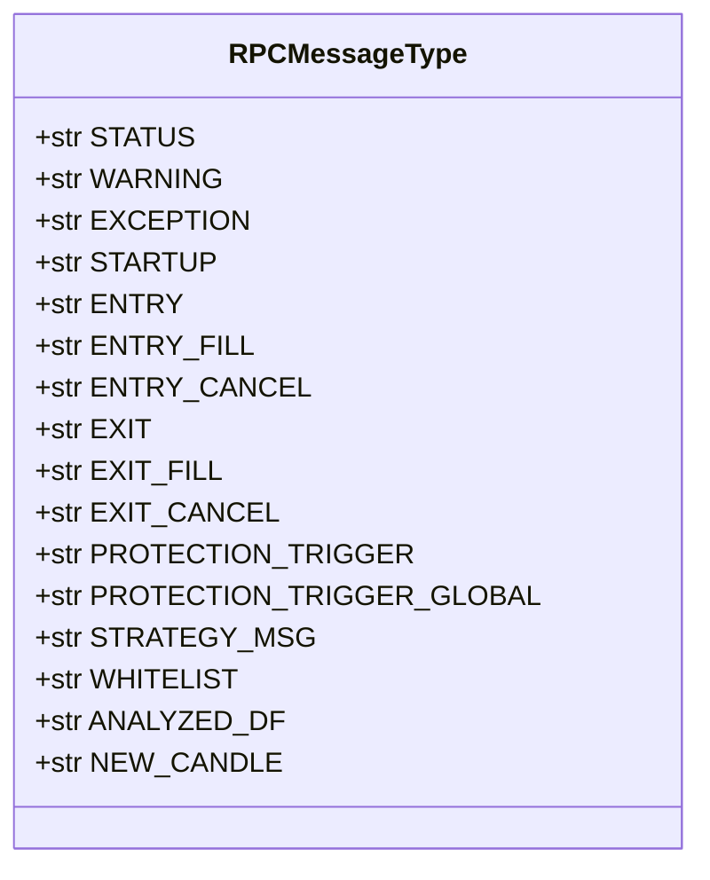
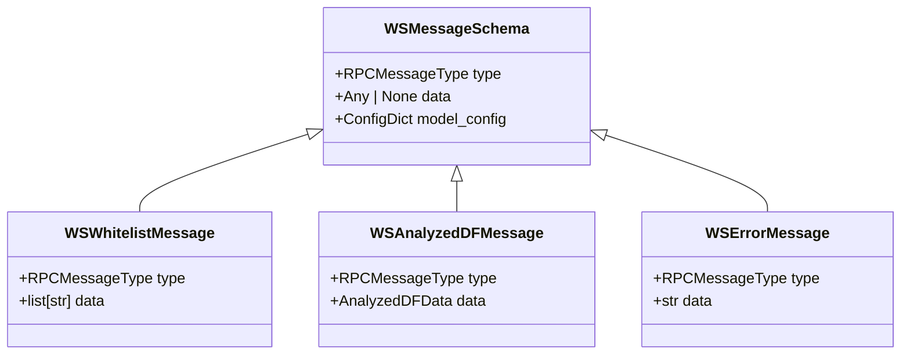

# 消息序列化与数据格式

<cite>
**Referenced Files in This Document**   
- [serializer.py](file://freqtrade/rpc/api_server/ws/serializer.py)
- [ws_types.py](file://freqtrade/rpc/api_server/ws/ws_types.py)
- [ws_schemas.py](file://freqtrade/rpc/api_server/ws_schemas.py)
- [rpcmessagetype.py](file://freqtrade/enums/rpcmessagetype.py)
</cite>

## 目录
1. [引言](#引言)
2. [核心组件](#核心组件)
3. [序列化协议与数据结构](#序列化协议与数据结构)
4. [消息类型与载荷结构](#消息类型与载荷结构)
5. [消息验证与数据一致性](#消息验证与数据一致性)
6. [客户端解析示例与兼容性](#客户端解析示例与兼容性)
7. [结论](#结论)

## 引言
本文档全面解析Freqtrade系统中WebSocket消息的序列化协议与数据结构定义。基于`serializer.py`说明JSON与二进制格式的编码/解码过程，以及自定义序列化器对性能的影响。结合`ws_types.py`中定义的事件类型枚举，解释不同类型消息的载荷结构。通过`ws_schemas.py`中的Pydantic模型，描述消息验证规则与前后端数据一致性保障机制。最后提供客户端解析示例和兼容性处理建议。

## 核心组件
本文档分析的核心组件包括WebSocket序列化器、消息类型定义和消息模式。这些组件共同构成了系统中WebSocket通信的基础，确保了消息的正确编码、解码和验证。

**Section sources**
- [serializer.py](file://freqtrade/rpc/api_server/ws/serializer.py#L1-L58)
- [ws_types.py](file://freqtrade/rpc/api_server/ws/ws_types.py#L1-L9)
- [ws_schemas.py](file://freqtrade/rpc/api_server/ws_schemas.py#L1-L74)

## 序列化协议与数据结构
### 序列化器设计
系统采用抽象基类`WebSocketSerializer`作为序列化器的接口，定义了`_serialize`和`_deserialize`两个抽象方法，以及`send`和`recv`两个具体方法。`send`方法接收`WSMessageSchemaType`或字典类型的数据，通过`_serialize`方法序列化后发送。`recv`方法接收原始数据，通过`_deserialize`方法反序列化后返回。

**Diagram sources**
- [serializer.py](file://freqtrade/rpc/api_server/ws/serializer.py#L16-L42)

### JSON序列化实现
`HybridJSONWebSocketSerializer`是`WebSocketSerializer`的具体实现，使用`orjson`库进行序列化，`rapidjson`库进行反序列化。`orjson`是一个高性能的JSON库，能够将Python对象序列化为JSON字节串。`rapidjson`则用于将JSON字符串反序列化为Python对象。

**Section sources**
- [serializer.py](file://freqtrade/rpc/api_server/ws/serializer.py#L36-L42)

### 特殊类型处理
系统通过`_json_default`和`_json_object_hook`函数处理特殊类型。`_json_default`函数在序列化时被调用，当遇到`DataFrame`类型时，将其转换为包含`__type__`和`__value__`的字典。`_json_object_hook`函数在反序列化时被调用，当遇到`__type__`为`dataframe`的字典时，将其转换回`DataFrame`对象。

**Section sources**
- [serializer.py](file://freqtrade/rpc/api_server/ws/serializer.py#L45-L57)

## 消息类型与载荷结构
### 消息类型枚举
`RPCMessageType`枚举定义了所有可能的WebSocket消息类型，包括状态消息、警告、异常、启动、交易入口、交易出口、保护触发、策略消息等。每种消息类型都有一个对应的字符串值，用于在WebSocket消息中标识消息类型。

**Diagram sources**
- [rpcmessagetype.py](file://freqtrade/enums/rpcmessagetype.py#L3-L30)

### 消息载荷结构
每种消息类型都有一个对应的载荷结构，定义了消息的具体内容。例如，`WSWhitelistMessage`消息的载荷是一个字符串列表，表示当前的白名单；`WSAnalyzedDFMessage`消息的载荷包含一个`AnalyzedDFData`对象，该对象包含`key`、`df`和`la`三个字段，分别表示数据键、数据框和最后分析时间。

**Section sources**
- [ws_schemas.py](file://freqtrade/rpc/api_server/ws_schemas.py#L52-L64)

## 消息验证与数据一致性
### 消息模式定义
系统使用Pydantic模型定义WebSocket消息的模式。`WSMessageSchema`是所有消息模式的基类，定义了`type`和`data`两个字段。`type`字段是`RPCMessageType`枚举类型，`data`字段可以是任意类型。通过继承`WSMessageSchema`，可以定义具体的消息模式，如`WSWhitelistMessage`、`WSAnalyzedDFMessage`等。

**Diagram sources**
- [ws_schemas.py](file://freqtrade/rpc/api_server/ws_schemas.py#L25-L69)

### 数据一致性保障
通过使用Pydantic模型，系统能够在消息序列化和反序列化时自动验证消息的结构和类型。这确保了前后端之间的数据一致性，避免了因消息格式错误导致的运行时异常。此外，`BaseArbitraryModel`类允许模型包含任意类型，为处理复杂数据结构提供了灵活性。

**Section sources**
- [ws_schemas.py](file://freqtrade/rpc/api_server/ws_schemas.py#L10-L11)

## 客户端解析示例与兼容性
### 客户端解析流程
客户端在接收到WebSocket消息后，首先使用`rapidjson`库将JSON字符串反序列化为Python对象。然后根据`type`字段的值，将`data`字段反序列化为相应的Pydantic模型。如果`type`字段的值为`ANALYZED_DF`，则需要将`data`字段中的`df`字段从字典转换为`DataFrame`对象。

**Section sources**
- [serializer.py](file://freqtrade/rpc/api_server/ws/serializer.py#L45-L57)
- [ws_schemas.py](file://freqtrade/rpc/api_server/ws_schemas.py#L57-L64)

### 兼容性处理建议
为了确保客户端与服务器之间的兼容性，建议客户端在解析消息时遵循以下原则：
1. 使用与服务器相同的JSON库（`orjson`和`rapidjson`）进行序列化和反序列化。
2. 在反序列化`DataFrame`对象时，使用与服务器相同的`dataframe_to_json`和`json_to_dataframe`函数。
3. 在处理未知消息类型时，应优雅地忽略或记录错误，而不是抛出异常。

**Section sources**
- [serializer.py](file://freqtrade/rpc/api_server/ws/serializer.py#L45-L57)
- [ws_schemas.py](file://freqtrade/rpc/api_server/ws_schemas.py#L25-L69)

## 结论
本文档详细解析了Freqtrade系统中WebSocket消息的序列化协议与数据结构定义。通过使用高性能的JSON库和Pydantic模型，系统实现了高效的消息编码/解码和严格的消息验证，确保了前后端之间的数据一致性。客户端在解析消息时应遵循相同的序列化和反序列化规则，以确保与服务器的兼容性。