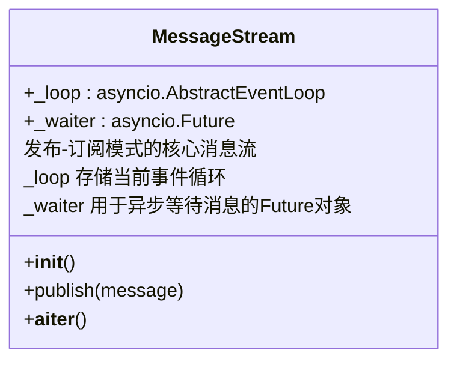
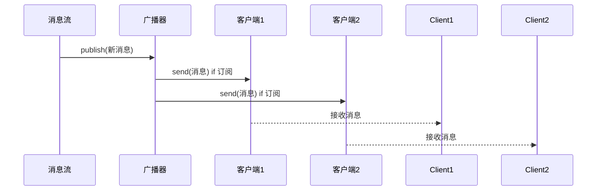
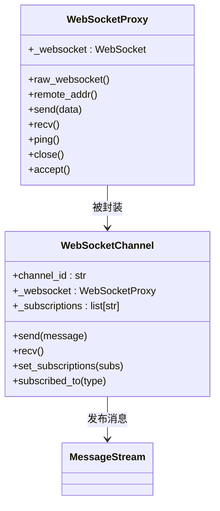
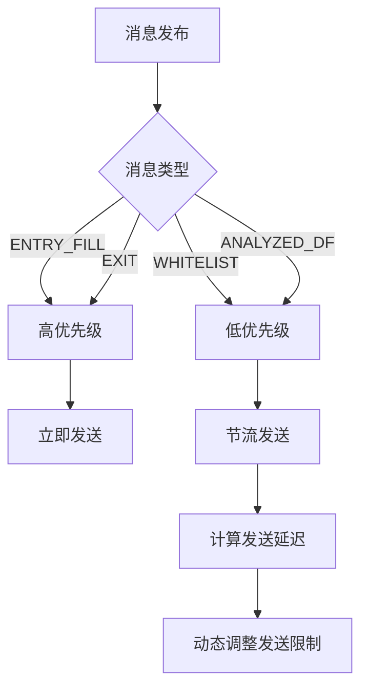
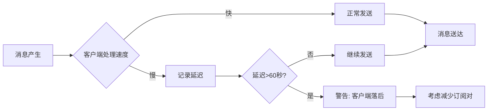
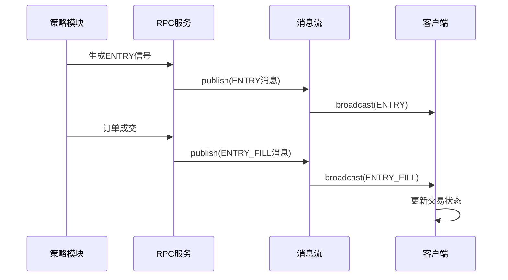
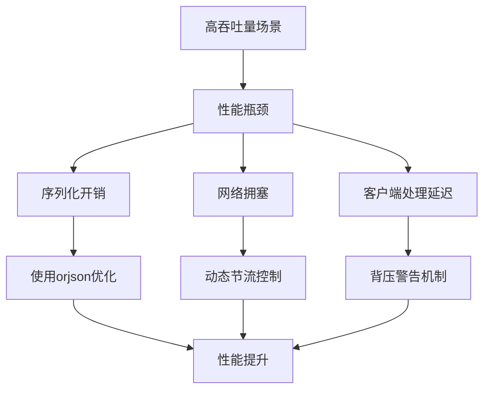

# 消息流与广播机制

<cite>
**Referenced Files in This Document**   
- [message_stream.py](file://freqtrade/rpc/api_server/ws/message_stream.py)
- [proxy.py](file://freqtrade/rpc/api_server/ws/proxy.py)
- [channel.py](file://freqtrade/rpc/api_server/ws/channel.py)
- [serializer.py](file://freqtrade/rpc/api_server/ws/serializer.py)
- [webserver.py](file://freqtrade/rpc/api_server/webserver.py)
- [api_ws.py](file://freqtrade/rpc/api_server/api_ws.py)
- [external_message_consumer.py](file://freqtrade/rpc/external_message_consumer.py)
- [rpcmessagetype.py](file://freqtrade/enums/rpcmessagetype.py)
</cite>

## 目录
1. [引言](#引言)
2. [消息流架构设计](#消息流架构设计)
3. [事件监听与跨会话广播](#事件监听与跨会话广播)
4. [代理机制与外部事件集成](#代理机制与外部事件集成)
5. [消息优先级与流量控制](#消息优先级与流量控制)
6. [背压处理与延迟优化](#背压处理与延迟优化)
7. [实际交易场景中的消息时序](#实际交易场景中的消息时序)
8. [高吞吐量下的性能优化](#高吞吐量下的性能优化)

## 引言
本文档深入分析Freqtrade系统中实时消息流的发布-订阅架构设计。核心组件包括消息队列的构建、事件监听器注册、跨会话广播逻辑以及外部事件代理机制。系统通过WebSocket通道实现低延迟通信，支持订单执行更新、策略信号触发等关键交易场景的消息推送。文档详细阐述了消息优先级调度、流量控制和背压处理机制，并提供高吞吐量下消息延迟的优化方案。

## 消息流架构设计

系统采用发布-订阅模式实现消息流，核心为`MessageStream`类，提供异步消息发布与订阅功能。该设计支持多生产者向消息流发布消息，多消费者从消息流订阅消息，实现松耦合的通信架构。

**Diagram sources**
- [message_stream.py](file://freqtrade/rpc/api_server/ws/message_stream.py#L4-L31)

**Section sources**
- [message_stream.py](file://freqtrade/rpc/api_server/ws/message_stream.py#L4-L31)
- [webserver.py](file://freqtrade/rpc/api_server/webserver.py#L42-L42)

## 事件监听与跨会话广播

系统通过`WebSocketChannel`管理WebSocket连接，实现事件监听与跨会话广播。每个连接被封装为独立的`WebSocketChannel`实例，支持订阅特定消息类型。`channel_broadcaster`函数负责将消息流中的消息广播给所有订阅了相应消息类型的客户端。

**Diagram sources**
- [api_ws.py](file://freqtrade/rpc/api_server/api_ws.py#L44-L60)
- [channel.py](file://freqtrade/rpc/api_server/ws/channel.py#L24-L223)

**Section sources**
- [api_ws.py](file://freqtrade/rpc/api_server/api_ws.py#L44-L60)
- [channel.py](file://freqtrade/rpc/api_server/ws/channel.py#L24-L223)

## 代理机制与外部事件集成

`WebSocketProxy`类作为代理层，统一了FastAPI WebSocket和websockets客户端协议的API，使系统能够无缝集成外部事件源。该代理机制允许将Telegram指令或市场信号等外部事件代理到WebSocket通道中，实现跨系统的事件通信。

**Diagram sources**
- [proxy.py](file://freqtrade/rpc/api_server/ws/proxy.py#L4-L73)
- [channel.py](file://freqtrade/rpc/api_server/ws/channel.py#L24-L223)

**Section sources**
- [proxy.py](file://freqtrade/rpc/api_server/ws/proxy.py#L4-L73)
- [external_message_consumer.py](file://freqtrade/rpc/external_message_consumer.py#L1-L389)

## 消息优先级与流量控制

系统通过`RPCMessageType`枚举定义了不同类型消息的优先级，如`ENTRY_FILL`、`EXIT`等交易相关消息具有较高优先级。流量控制通过`WebSocketChannel`的`send_throttle`和`_send_high_limit`机制实现，动态调整发送速率以防止网络拥塞。

**Diagram sources**
- [rpcmessagetype.py](file://freqtrade/enums/rpcmessagetype.py#L3-L45)
- [channel.py](file://freqtrade/rpc/api_server/ws/channel.py#L44-L86)

**Section sources**
- [rpcmessagetype.py](file://freqtrade/enums/rpcmessagetype.py#L3-L45)
- [channel.py](file://freqtrade/rpc/api_server/ws/channel.py#L44-L86)

## 背压处理与延迟优化

系统通过`MessageStream`的异步迭代器模式和`WebSocketChannel`的超时机制处理背压。当客户端处理速度跟不上消息产生速度时，系统会记录警告并可能断开连接，防止内存泄漏。消息延迟通过`_calc_send_limit`方法动态优化，基于历史发送时间调整发送限制。

**Diagram sources**
- [message_stream.py](file://freqtrade/rpc/api_server/ws/message_stream.py#L23-L31)
- [channel.py](file://freqtrade/rpc/api_server/ws/channel.py#L71-L80)

**Section sources**
- [message_stream.py](file://freqtrade/rpc/api_server/ws/message_stream.py#L23-L31)
- [channel.py](file://freqtrade/rpc/api_server/ws/channel.py#L71-L80)

## 实际交易场景中的消息时序

在订单执行更新和策略信号触发等交易场景中，系统通过精确的时序控制保障消息一致性。消息发布时附带时间戳，接收方根据时间戳判断消息的新鲜度。系统确保交易相关消息（如`ENTRY_FILL`、`EXIT_FILL`）按正确顺序送达，维护交易状态的一致性。

**Diagram sources**
- [freqtradebot.py](file://freqtrade/freqtradebot.py#L1210-L1247)
- [message_stream.py](file://freqtrade/rpc/api_server/ws/message_stream.py#L14-L21)

**Section sources**
- [freqtradebot.py](file://freqtrade/freqtradebot.py#L1210-L1247)
- [message_stream.py](file://freqtrade/rpc/api_server/ws/message_stream.py#L14-L21)

## 高吞吐量下的性能优化

为应对高吞吐量场景，系统采用多项优化措施：使用`orjson`进行高效序列化、通过`_send_throttle`控制发送频率、动态调整`_send_high_limit`防止超时。此外，系统通过减少不必要的消息回显（如`ANALYZED_DF`、`WHITELIST`）降低网络负载，提升整体性能。

**Diagram sources**
- [serializer.py](file://freqtrade/rpc/api_server/ws/serializer.py#L29-L34)
- [channel.py](file://freqtrade/rpc/api_server/ws/channel.py#L44-L86)

**Section sources**
- [serializer.py](file://freqtrade/rpc/api_server/ws/serializer.py#L29-L34)
- [channel.py](file://freqtrade/rpc/api_server/ws/channel.py#L44-L86)