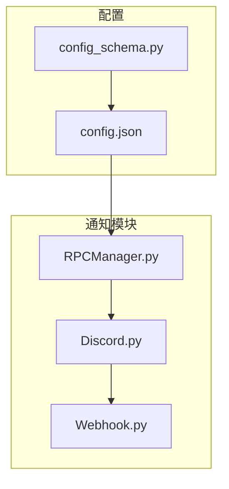
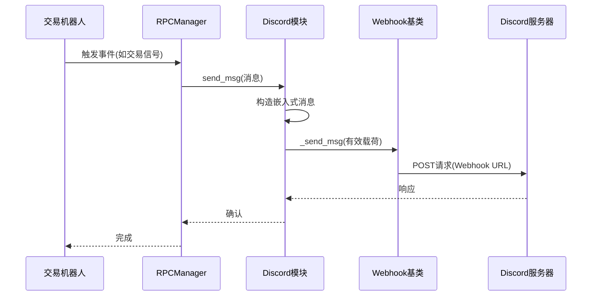
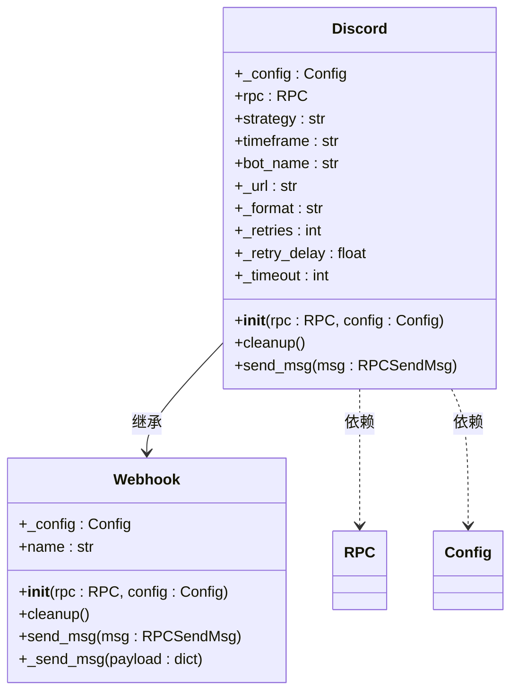
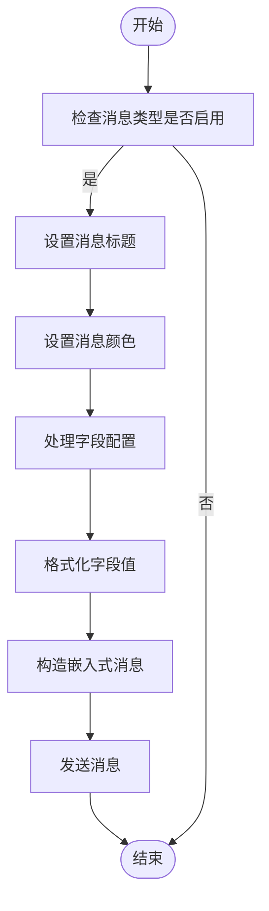
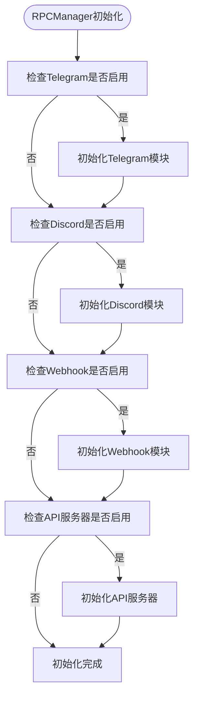
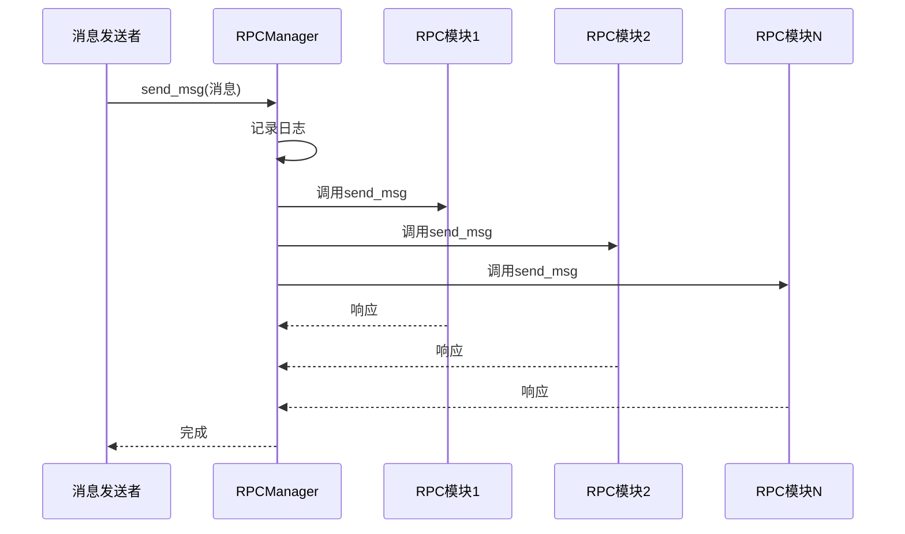
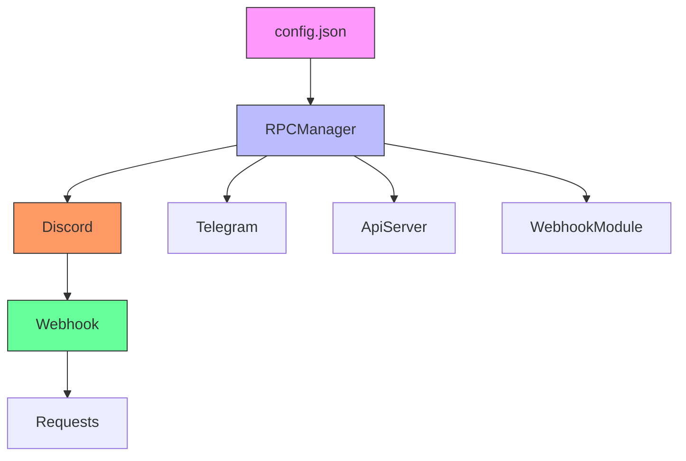

# Discord通知集成

<cite>
**本文档中引用的文件**   
- [discord.py](file://freqtrade/rpc/discord.py)
- [rpc_manager.py](file://freqtrade/rpc/rpc_manager.py)
- [config.json](file://user_data/config.json)
- [webhook.py](file://freqtrade/rpc/webhook.py)
- [config_schema.py](file://freqtrade/config_schema/config_schema.py)
</cite>

## 目录
1. [简介](#简介)
2. [项目结构](#项目结构)
3. [核心组件](#核心组件)
4. [架构概述](#架构概述)
5. [详细组件分析](#详细组件分析)
6. [依赖分析](#依赖分析)
7. [性能考虑](#性能考虑)
8. [故障排除指南](#故障排除指南)
9. [结论](#结论)
10. [附录](#附录)（如有必要）

## 简介
本文档详细说明了如何在Freqtrade中配置和使用Discord通知渠道。涵盖了从配置文件设置到消息构造逻辑的各个方面，包括Webhook URL配置、消息分发机制、自定义模板以及错误处理策略。通过分析源码，解释了Discord通知的实现原理，并与Telegram进行了对比，突出了Discord在团队协作和可视化展示方面的优势。

## 项目结构
Freqtrade的Discord通知功能主要位于`freqtrade/rpc/`目录下，通过`rpc_manager.py`统一管理所有RPC模块。配置文件位于`user_data/`目录中，采用JSON格式存储Discord相关设置。



**图示来源**
- [discord.py](file://freqtrade/rpc/discord.py#L1-L60)
- [rpc_manager.py](file://freqtrade/rpc/rpc_manager.py#L1-L141)
- [config.json](file://user_data/config.json#L1-L93)

**节来源**
- [discord.py](file://freqtrade/rpc/discord.py#L1-L60)
- [rpc_manager.py](file://freqtrade/rpc/rpc_manager.py#L1-L141)

## 核心组件
Discord通知的核心组件包括`Discord`类和`RPCManager`类。`Discord`类继承自`Webhook`基类，负责具体的消息发送逻辑；`RPCManager`类负责管理所有启用的RPC模块，包括Discord、Telegram和Webhook等。

**节来源**
- [discord.py](file://freqtrade/rpc/discord.py#L1-L60)
- [rpc_manager.py](file://freqtrade/rpc/rpc_manager.py#L1-L141)

## 架构概述
Discord通知的架构基于事件驱动模式，当交易机器人触发特定事件时，会生成相应的消息并通过RPCManager分发给所有注册的RPC模块。对于Discord模块，消息会被格式化为嵌入式消息（Embeds）并通过Webhook发送到指定的Discord频道。



**图示来源**
- [discord.py](file://freqtrade/rpc/discord.py#L1-L60)
- [rpc_manager.py](file://freqtrade/rpc/rpc_manager.py#L1-L141)
- [webhook.py](file://freqtrade/rpc/webhook.py#L1-L148)

## 详细组件分析

### Discord模块分析
Discord模块实现了基于Webhook的消息发送功能，支持丰富的消息格式和动态变量插入。

#### 类结构分析


**图示来源**
- [discord.py](file://freqtrade/rpc/discord.py#L1-L60)
- [webhook.py](file://freqtrade/rpc/webhook.py#L1-L148)

#### 消息构造逻辑
Discord模块的消息构造逻辑如下：
1. 检查配置中是否启用了对应消息类型的通知
2. 设置消息标题和颜色（盈利为绿色，亏损为红色）
3. 遍历配置中的字段定义，使用`str.format(**msg)`进行动态变量替换
4. 构造嵌入式消息（Embeds）有效载荷
5. 调用基类的`_send_msg`方法发送消息



**图示来源**
- [discord.py](file://freqtrade/rpc/discord.py#L35-L60)

**节来源**
- [discord.py](file://freqtrade/rpc/discord.py#L1-L60)

### RPC管理器分析
RPCManager负责初始化和管理所有RPC模块，确保消息能够正确分发到各个通知渠道。

#### 初始化流程


**图示来源**
- [rpc_manager.py](file://freqtrade/rpc/rpc_manager.py#L16-L60)

#### 消息分发机制


**图示来源**
- [rpc_manager.py](file://freqtrade/rpc/rpc_manager.py#L100-L120)

**节来源**
- [rpc_manager.py](file://freqtrade/rpc/rpc_manager.py#L1-L141)

## 依赖分析
Discord通知功能依赖于多个核心模块和配置文件，形成了一个完整的通知生态系统。



**图示来源**
- [rpc_manager.py](file://freqtrade/rpc/rpc_manager.py#L1-L141)
- [discord.py](file://freqtrade/rpc/discord.py#L1-L60)
- [webhook.py](file://freqtrade/rpc/webhook.py#L1-L148)

**节来源**
- [rpc_manager.py](file://freqtrade/rpc/rpc_manager.py#L1-L141)
- [discord.py](file://freqtrade/rpc/discord.py#L1-L60)

## 性能考虑
Discord通知的性能主要受网络延迟和重试机制的影响。系统配置了默认的超时时间和重试延迟，以平衡可靠性和响应速度。

- **超时设置**：默认10秒，可通过`timeout`配置项调整
- **重试机制**：默认1次重试，延迟0.1秒
- **消息格式**：使用JSON格式确保数据完整性
- **并发处理**：RPCManager并行处理多个通知模块

这些设置可以在配置文件中根据实际网络环境进行优化。

## 故障排除指南
当Discord通知出现问题时，可以按照以下步骤进行排查：

**节来源**
- [discord.py](file://freqtrade/rpc/discord.py#L1-L60)
- [rpc_manager.py](file://freqtrade/rpc/rpc_manager.py#L1-L141)
- [webhook.py](file://freqtrade/rpc/webhook.py#L1-L148)

### 常见问题及解决方案
| 问题现象 | 可能原因 | 解决方案 |
|--------|--------|--------|
| 无法发送消息 | Webhook URL错误 | 检查并重新生成Webhook URL |
| 消息格式异常 | 配置字段语法错误 | 检查字段中的动态变量语法 |
| 网络超时 | 网络连接问题 | 检查网络连接或调整超时设置 |
| 消息重复 | 重试机制触发 | 检查Discord服务器响应状态 |

### 日志分析
系统会记录详细的日志信息，帮助诊断问题：
- `Enabling rpc.discord ...`：Discord模块已启用
- `Sending discord message`：正在发送Discord消息
- `Could not call webhook url`：Webhook调用失败
- `Retrying webhook...`：正在进行重试

通过分析这些日志，可以快速定位问题根源。

## 结论
Freqtrade的Discord通知集成提供了一个强大而灵活的消息通知系统。通过合理的配置和定制，用户可以获得丰富的交易信息反馈。与Telegram相比，Discord在团队协作、消息组织和富文本展示方面具有明显优势，特别适合多用户协作的交易环境。建议用户根据实际需求配置合适的消息模板和通知策略，同时注意保护Webhook URL的安全性。

## 附录

### 配置示例
```json
"discord": {
    "enabled": true,
    "webhook_url": "https://discord.com/api/webhooks/...",
    "timeout": 10,
    "entry": [
        {"交易对": "{pair}", "方向": "{direction}"},
        {"价格": "{limit:8f}", "数量": "{amount}"}
    ],
    "exit": [
        {"交易对": "{pair}", "收益": "{profit_ratio:.2%}"},
        {"开仓价": "{open_rate:8f}", "平仓价": "{close_rate:8f}"}
    ]
}
```

### 消息类型对照表
| 消息类型 | 描述 | 默认颜色 |
|--------|----|--------|
| entry | 交易信号 | 蓝色(0x0000FF) |
| exit | 平仓信号 | 盈利绿色(0x00FF00)/亏损红色(0xFF0000) |
| status | 状态更新 | 蓝色(0x0000FF) |
| warning | 警告信息 | 蓝色(0x0000FF) |
| startup | 启动信息 | 蓝色(0x0000FF) |