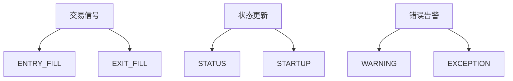
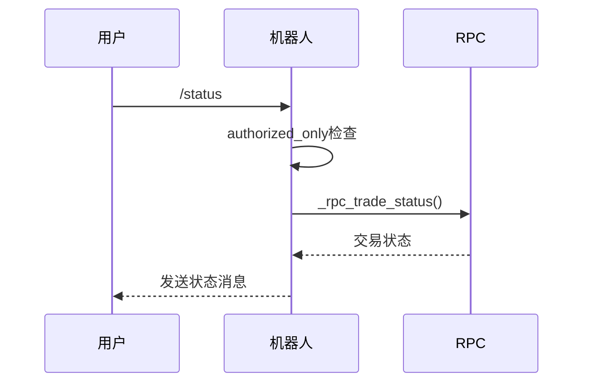

# Telegram通知集成

<cite>
**本文档引用的文件**
- [telegram.py](file://freqtrade/rpc/telegram.py)
- [rpc_manager.py](file://freqtrade/rpc/rpc_manager.py)
- [config.json](file://user_data/config.json)
- [rpcmessagetype.py](file://freqtrade/enums/rpcmessagetype.py)
</cite>

## 目录
1. [配置启用](#配置启用)
2. [消息类型与触发条件](#消息类型与触发条件)
3. [消息模板与格式化](#消息模板与格式化)
4. [命令处理与安全验证](#命令处理与安全验证)
5. [消息发送与异常处理](#消息发送与异常处理)
6. [最佳实践](#最佳实践)

## 配置启用

在配置文件中启用Telegram通知需要在`telegram`配置节中设置`enabled`为`true`，并提供有效的`token`和`chat_id`。Bot Token可通过与BotFather对话创建新机器人获得，Chat ID可通过向机器人发送消息后调用`/tg_info`命令获取。配置文件还支持自定义键盘布局和通知设置，允许用户根据需要调整界面和消息行为。

**Section sources**
- [config.json](file://user_data/config.json#L77-L80)
- [telegram.py](file://freqtrade/rpc/telegram.py#L164-L243)

## 消息类型与触发条件

系统支持多种消息类型，包括交易信号、状态更新和错误告警。交易信号在开仓（ENTRY）和平仓（EXIT）时触发，状态更新在机器人启动、停止或配置重载时发送，错误告警在发生异常时立即通知。消息类型由`RPCMessageType`枚举定义，包括`ENTRY_FILL`、`EXIT_FILL`、`WARNING`和`EXCEPTION`等。这些消息通过`RPCManager`统一调度，确保所有启用的通信渠道都能接收到相应通知。

**Diagram sources**
- [rpcmessagetype.py](file://freqtrade/enums/rpcmessagetype.py#L3-L30)
- [telegram.py](file://freqtrade/rpc/telegram.py#L540-L586)

## 消息模板与格式化

消息模板支持Markdown格式化和动态变量占位符。可用变量包括`{pair}`（交易对）、`{profit_ratio}`（收益率）、`{amount}`（数量）等。模板通过`_format_entry_msg`和`_format_exit_msg`方法生成，自动包含交易详情、收益率和持续时间。用户可通过`notification_settings`配置不同消息类型的显示方式，例如控制盈利消息的详细程度或隐藏特定类型的通知。

**Section sources**
- [telegram.py](file://freqtrade/rpc/telegram.py#L412-L449)
- [telegram.py](file://freqtrade/rpc/telegram.py#L451-L524)

## 命令处理与安全验证

Telegram机器人支持多种命令，如`/start`、`/status`和`/profit`，这些命令通过`CommandHandler`注册并由相应方法处理。安全验证通过`authorized_only`装饰器实现，检查消息来源的`chat_id`是否匹配配置值，并验证用户是否在`authorized_users`列表中。此机制防止未授权用户控制机器人，确保操作安全。

**Diagram sources**
- [telegram.py](file://freqtrade/rpc/telegram.py#L728-L741)
- [telegram.py](file://freqtrade/rpc/telegram.py#L248-L341)

## 消息发送与异常处理

消息通过`send_msg`方法发送，该方法首先确定消息的"响度"（on、off或silent），然后调用`_send_msg`实际发送。网络异常通过捕获`NetworkError`并重试发送来处理。消息长度超过Telegram限制时，系统会自动分段发送。发送失败时，错误信息将记录到日志中，但不会中断其他通知的发送流程。

**Section sources**
- [telegram.py](file://freqtrade/rpc/telegram.py#L614-L627)
- [telegram.py](file://freqtrade/rpc/telegram.py#L2243-L2279)

## 最佳实践

建议设置消息频率限制以避免通知过载，例如通过`throttle_secs`配置最小消息间隔。敏感信息如API密钥应存储在环境变量或加密文件中，而非配置文件。多用户管理可通过`authorized_users`列表实现，为不同用户分配不同权限。定期检查日志以确保通知系统正常运行，并使用`/logs`命令监控机器人状态。

**Section sources**
- [config.json](file://user_data/config.json#L90-L92)
- [telegram.py](file://freqtrade/rpc/telegram.py#L1899-L1984)