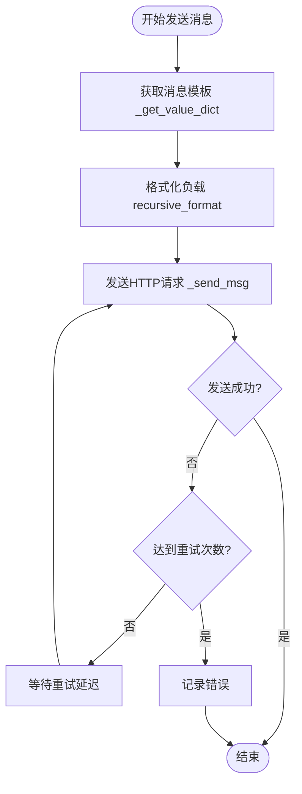
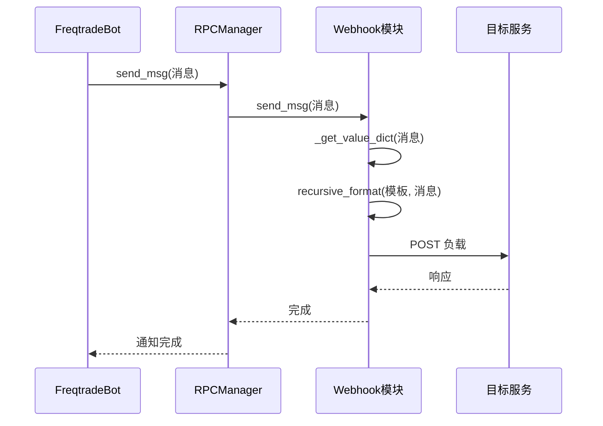

# Webhook通知集成

<cite>
**本文档中引用的文件**  
- [webhook.py](file://freqtrade/rpc/webhook.py)
- [rpc_manager.py](file://freqtrade/rpc/rpc_manager.py)
- [rpc_types.py](file://freqtrade/rpc/rpc_types.py)
</cite>

## 目录
1. [简介](#简介)
2. [配置文件设置](#配置文件设置)
3. [消息序列化与负载结构](#消息序列化与负载结构)
4. [Webhook调用流程](#webhook调用流程)
5. [请求体示例](#请求体示例)
6. [接收端服务构建](#接收端服务构建)
7. [安全性考虑](#安全性考虑)
8. [调试与日志分析](#调试与日志分析)
9. [结论](#结论)

## 简介
Webhook通知渠道允许Freqtrade将交易事件、状态更新和其他关键信息以HTTP请求的形式推送到外部系统。通过正确配置Webhook，用户可以实现与CI/CD流水线、监控平台、消息系统等的无缝集成。本文档详细说明了如何配置和使用Webhook通知功能。

**Section sources**
- [webhook.py](file://freqtrade/rpc/webhook.py#L1-L20)
- [rpc_manager.py](file://freqtrade/rpc/rpc_manager.py#L1-L20)

## 配置文件设置
Webhook的配置通过`config.json`文件中的`webhook`字段完成。必须启用Webhook并指定目标URL。支持的配置项包括：

- `enabled`: 布尔值，启用或禁用Webhook
- `url`: Webhook目标URL，必须为HTTPS以确保安全
- `format`: 负载格式，支持`form`、`json`和`raw`
- `retries`: 失败时的重试次数
- `retry_delay`: 重试之间的延迟（秒）
- `timeout`: HTTP请求超时时间（秒）
- `headers`: 自定义请求头，可包含认证令牌如Bearer Token

HTTP方法默认为POST，GET方法不被支持。认证信息可通过`headers`字段配置，例如：`"headers": {"Authorization": "Bearer xxx"}`。

**Section sources**
- [webhook.py](file://freqtrade/rpc/webhook.py#L25-L40)
- [rpc_manager.py](file://freqtrade/rpc/rpc_manager.py#L20-L30)

## 消息序列化与负载结构
Webhook的消息序列化过程由`Webhook`类的`send_msg`方法处理。消息首先通过`_get_value_dict`方法根据消息类型（如ENTRY、EXIT、STATUS）查找对应的模板配置。然后使用`recursive_format`方法将消息中的占位符替换为实际值。

负载结构支持嵌套JSON格式，允许构建复杂的消息体。例如，状态消息可以包含多个层级的结构化数据。序列化后的负载根据`format`配置以`application/x-www-form-urlencoded`、`application/json`或纯文本形式发送。



**Diagram sources**
- [webhook.py](file://freqtrade/rpc/webhook.py#L85-L148)
- [webhook.py](file://freqtrade/rpc/webhook.py#L46-L81)

**Section sources**
- [webhook.py](file://freqtrade/rpc/webhook.py#L85-L148)
- [webhook.py](file://freqtrade/rpc/webhook.py#L46-L81)

## Webhook调用流程
Webhook调用由`RPCManager`统一管理。当交易事件发生时，`FreqtradeBot`生成消息并通过`RPCManager.send_msg`方法广播给所有注册的RPC模块。`RPCManager`遍历`registered_modules`列表，调用每个模块的`send_msg`方法。

对于Webhook模块，`send_msg`方法会根据消息类型选择相应的配置模板，序列化消息，并通过`_send_msg`执行HTTP POST请求。整个流程实现了交易事件到标准HTTP请求的转换，确保了通知的可靠传递。



**Diagram sources**
- [rpc_manager.py](file://freqtrade/rpc/rpc_manager.py#L65-L83)
- [webhook.py](file://freqtrade/rpc/webhook.py#L85-L148)

**Section sources**
- [rpc_manager.py](file://freqtrade/rpc/rpc_manager.py#L65-L83)
- [webhook.py](file://freqtrade/rpc/webhook.py#L85-L148)

## 请求体示例
以下是不同消息类型的请求体示例：

### 交易入场消息 (ENTRY)
```json
{
  "type": "entry",
  "trade_id": 123,
  "pair": "BTC/USDT",
  "enter_tag": "buy_signal",
  "leverage": 3.0,
  "stake_amount": 100.0,
  "open_rate": 50000.0,
  "order_rate": 50000.0,
  "order_type": "limit",
  "open_date": "2023-01-01T00:00:00Z"
}
```

### 交易出场消息 (EXIT)
```json
{
  "type": "exit",
  "trade_id": 123,
  "pair": "BTC/USDT",
  "exit_reason": "roi",
  "close_rate": 55000.0,
  "profit_amount": 50.0,
  "profit_ratio": 0.1,
  "gain": "profit",
  "close_date": "2023-01-01T01:00:00Z"
}
```

### 状态消息 (STATUS)
```json
{
  "type": "status",
  "status": "Bot is running"
}
```

所有字段的数据类型和含义在`rpc_types.py`中有明确定义，确保了消息格式的一致性和可预测性。

**Section sources**
- [rpc_types.py](file://freqtrade/rpc/rpc_types.py#L50-L130)

## 接收端服务构建
构建接收端服务时，应实现一个HTTP服务器来处理POST请求。服务需要：

1. 验证请求来源（通过IP白名单或签名）
2. 解析JSON或表单数据
3. 验证消息完整性（可选签名验证）
4. 处理业务逻辑（如触发CI/CD流水线）
5. 返回适当的HTTP状态码

推荐使用轻量级框架如Flask或FastAPI快速搭建接收端。服务应具备错误处理和日志记录能力，以便于调试和监控。

**Section sources**
- [webhook.py](file://freqtrade/rpc/webhook.py#L100-L148)

## 安全性考虑
安全性是Webhook集成的关键方面。必须启用HTTPS以加密传输数据。建议配置IP白名单，仅允许来自Freqtrade服务器的请求。对于认证，使用Bearer Token等安全的认证机制，避免在URL中传递敏感信息。

签名验证可进一步增强安全性。虽然当前实现未内置签名，但可在接收端通过共享密钥对消息内容进行HMAC签名验证，确保消息的完整性和来源可信。

**Section sources**
- [webhook.py](file://freqtrade/rpc/webhook.py#L25-L40)
- [webhook.py](file://freqtrade/rpc/webhook.py#L100-L148)

## 调试与日志分析
调试Webhook连接问题时，首先检查Freqtrade日志中的`Sending rpc message`和`Could not call webhook url`条目。这些日志提供了请求失败的具体原因，如网络超时或HTTP错误。

使用`retries`和`retry_delay`配置可以缓解临时网络问题。在开发环境中，可使用工具如ngrok暴露本地服务进行测试。确保接收端返回200状态码，否则Freqtrade会认为请求失败并可能重试。

**Section sources**
- [webhook.py](file://freqtrade/rpc/webhook.py#L120-L148)
- [rpc_manager.py](file://freqtrade/rpc/rpc_manager.py#L70-L83)

## 结论
Webhook通知渠道为Freqtrade提供了强大的外部集成能力。通过合理配置和安全实践，用户可以可靠地将交易信号推送至各种外部系统。理解消息序列化过程和调用流程有助于构建健壮的接收端服务。遵循本文档的指导，可以有效实现自动化交易与外部系统的无缝对接。