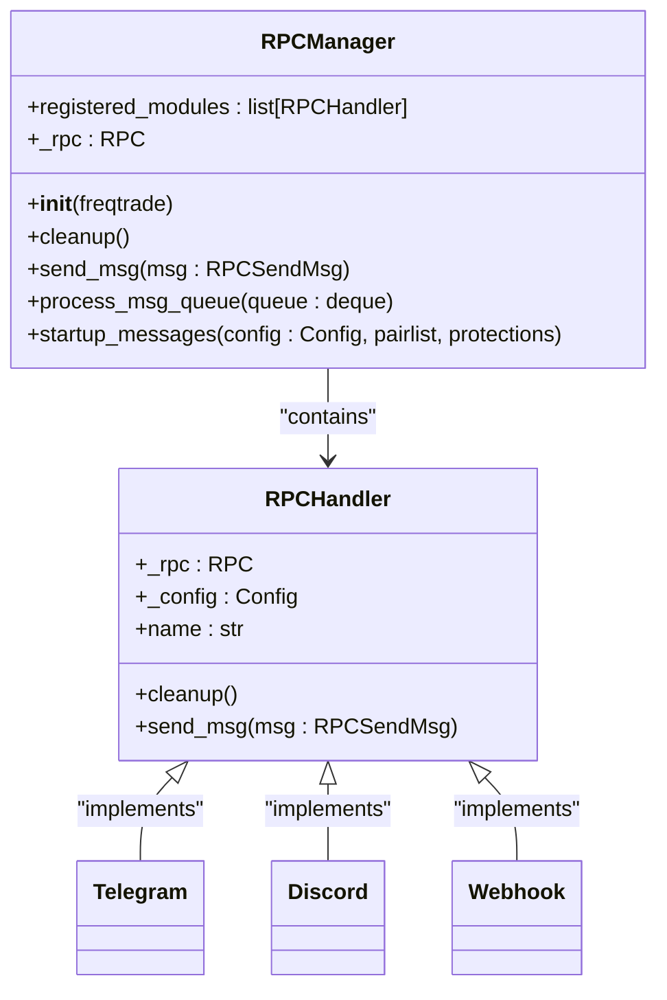

# 通知渠道集成

<cite>
**本文档中引用的文件**  
- [rpc_manager.py](file://freqtrade/rpc/rpc_manager.py)
- [telegram.py](file://freqtrade/rpc/telegram.py)
- [discord.py](file://freqtrade/rpc/discord.py)
- [webhook.py](file://freqtrade/rpc/webhook.py)
- [config.json](file://user_data/config.json)
</cite>

## 目录
1. [简介](#简介)
2. [通知渠道配置](#通知渠道配置)
3. [消息模板与变量](#消息模板与变量)
4. [统一调度机制](#统一调度机制)
5. [异常处理流程](#异常处理流程)
6. [实际消息示例](#实际消息示例)
7. [适用场景对比](#适用场景对比)
8. [安全与最佳实践](#安全与最佳实践)

## 简介
本指南详细说明了如何在Freqtrade中配置和使用Telegram、Discord和Webhook三种通知渠道。这些渠道允许用户接收交易状态、警告、启动信息等关键通知，帮助监控和管理自动化交易机器人。通过合理配置，用户可以实现个性化的消息推送策略，满足不同场景下的需求。

## 通知渠道配置

### Telegram配置
Telegram是一种流行的即时通讯工具，适合个人监控和快速响应。启用Telegram通知需要在配置文件中设置以下参数：

- **enabled**: 启用或禁用Telegram通知。
- **token**: Telegram机器人的API令牌。
- **chat_id**: 接收消息的聊天或群组ID。
- **topic_id**: （可选）群组中的特定话题ID。
- **authorized_users**: 允许控制机器人的授权用户列表。

```json
"telegram": {
    "enabled": true,
    "token": "your_telegram_token",
    "chat_id": "your_telegram_chat_id",
    "topic_id": "your_topic_id",
    "authorized_users": ["user1", "user2"]
}
```

**安全验证机制**：通过`authorized_users`列表限制可发送命令的用户，防止未授权访问。

**Section sources**
- [config.json](file://user_data/config.json#L80-L93)
- [telegram.py](file://freqtrade/rpc/telegram.py#L226-L261)

### Discord配置
Discord是一种广泛用于社区和团队协作的平台，适合团队共享交易信息。其配置与Telegram类似，但使用Webhook URL进行通信：

- **enabled**: 启用或禁用Discord通知。
- **webhook_url**: Discord频道的Webhook URL。

```json
"discord": {
    "enabled": true,
    "webhook_url": "https://discord.com/api/webhooks/..."
}
```

**安全验证机制**：Discord通过Webhook URL的保密性来保证安全，确保只有知道URL的用户才能发送消息。

**Section sources**
- [discord.py](file://freqtrade/rpc/discord.py#L10-L34)

### Webhook配置
Webhook提供了一种灵活的HTTP回调机制，适合集成CI/CD管道或外部系统。配置参数包括：

- **enabled**: 启用或禁用Webhook通知。
- **url**: 接收消息的Webhook端点URL。
- **format**: 消息格式（form、json、raw）。
- **retries**: 发送失败时的重试次数。
- **retry_delay**: 重试之间的延迟时间（秒）。
- **timeout**: 请求超时时间（秒）。

```json
"webhook": {
    "enabled": true,
    "url": "https://example.com/webhook",
    "format": "json",
    "retries": 3,
    "retry_delay": 0.1,
    "timeout": 10
}
```

**安全验证机制**：通过HTTPS和身份验证（如API密钥）保护Webhook端点，防止未授权访问。

**Section sources**
- [webhook.py](file://freqtrade/rpc/webhook.py#L20-L44)

## 消息模板与变量

### 消息模板定制
每种通知渠道都支持通过模板定制消息内容。模板使用占位符（如`{pair}`、`{profit_ratio}`）来动态插入实际值。

#### Telegram消息模板
Telegram的消息模板内置于代码中，无法通过配置文件直接修改。例如，进入交易的消息格式如下：

```
🔵 *Binance (dry):* New Trade (#{trade_id})
*Pair:* `{pair}`
*Enter Tag:* `{enter_tag}`
*Amount:* `{amount}`
*Open Rate:* `{open_rate}`
*Total:* `{stake_amount}{profit_fiat_extra}`
```

#### Webhook消息模板
Webhook允许在配置文件中定义消息模板，支持更灵活的格式。例如：

```json
"webhook": {
    "entry": {
        "value1": "Buying {pair}",
        "value2": "limit {limit:8f}",
        "value3": "{stake_amount:8f} {stake_currency}"
    },
    "exit": {
        "value1": "Selling {pair}",
        "value2": "limit {limit:8f}",
        "value3": "profit: {profit_amount:8f} {stake_currency} ({profit_ratio})"
    }
}
```

### 支持的变量占位符
以下是一些常用的消息变量占位符：

- `{pair}`: 交易对（如BTC/USDT）
- `{trade_id}`: 交易ID
- `{amount}`: 交易数量
- `{open_rate}`: 开仓价格
- `{close_rate}`: 平仓价格
- `{profit_ratio}`: 利润率
- `{profit_amount}`: 利润金额
- `{stake_currency}`: 押注货币（如USDT）
- `{fiat_currency}`: 法币货币（如USD）
- `{exit_reason}`: 退出原因（如roi、stop_loss）

### 格式化规则
- **数字格式化**：使用`:8f`等格式化字符串控制小数位数。
- **条件显示**：某些字段仅在特定条件下显示（如杠杆信息）。
- **嵌套对象**：支持嵌套JSON对象的递归格式化。

**Section sources**
- [webhook.py](file://freqtrade/rpc/webhook.py#L83-L125)
- [telegram.py](file://freqtrade/rpc/telegram.py#L570-L597)

## 统一调度机制

### RPCManager概述
`RPCManager`是Freqtrade中负责管理所有RPC模块的核心类。它根据配置文件中的设置，动态加载和初始化启用的通知渠道。



**Diagram sources**
- [rpc_manager.py](file://freqtrade/rpc/rpc_manager.py#L16-L141)
- [telegram.py](file://freqtrade/rpc/telegram.py#L146-L147)
- [discord.py](file://freqtrade/rpc/discord.py#L10-L11)
- [webhook.py](file://freqtrade/rpc/webhook.py#L14-L15)

### 初始化流程
1. **读取配置**：从配置文件中读取各通知渠道的启用状态和参数。
2. **动态导入**：使用`from freqtrade.rpc.telegram import Telegram`等语句动态导入相应的处理类。
3. **实例化**：为每个启用的渠道创建实例，并将其添加到`registered_modules`列表中。
4. **启动服务**：调用各模块的初始化方法（如`_init`），开始监听和发送消息。

### 消息分发
当需要发送消息时，`RPCManager`会遍历`registered_modules`列表，将消息转发给所有注册的模块。每个模块根据其配置决定是否发送以及如何发送消息。

**Section sources**
- [rpc_manager.py](file://freqtrade/rpc/rpc_manager.py#L16-L141)

## 异常处理流程

### 发送失败重试
对于Webhook和Discord等基于HTTP的渠道，系统实现了自动重试机制：

- **重试次数**：由`retries`参数控制，默认为0（不重试）。
- **重试延迟**：由`retry_delay`参数控制，单位为秒。
- **异常捕获**：捕获`RequestException`等网络异常，并在日志中记录警告信息。

```python
def _send_msg(self, payload: dict) -> None:
    success = False
    attempts = 0
    while not success and attempts <= self._retries:
        if attempts:
            if self._retry_delay:
                time.sleep(self._retry_delay)
            logger.info("Retrying webhook...")
        attempts += 1
        try:
            response = post(self._url, json=payload, timeout=self._timeout)
            response.raise_for_status()
            success = True
        except RequestException as exc:
            logger.warning("Could not call webhook url. Exception: %s", exc)
```

### 模块级异常处理
每个通知模块都有自己的异常处理逻辑：

- **Telegram**：捕获`NetworkError`和`TelegramError`，在网络错误时尝试重新发送。
- **Discord/Webhook**：捕获`RequestException`，记录警告但不中断主流程。

### 全局异常处理
`RPCManager`在调用`mod.send_msg(msg)`时使用了try-except块，确保单个模块的异常不会影响其他模块的消息发送。

```python
for mod in self.registered_modules:
    logger.debug("Forwarding message to rpc.%s", mod.name)
    try:
        mod.send_msg(msg)
    except NotImplementedError:
        logger.error(f"Message type '{msg['type']}' not implemented by handler {mod.name}.")
    except Exception:
        logger.exception("Exception occurred within RPC module %s", mod.name)
```

**Section sources**
- [webhook.py](file://freqtrade/rpc/webhook.py#L125-L147)
- [telegram.py](file://freqtrade/rpc/telegram.py#L2174-L2199)
- [rpc_manager.py](file://freqtrade/rpc/rpc_manager.py#L100-L113)

## 实际消息示例

### Telegram消息示例
**交易进入通知**：
```
🔵 *Binance (dry):* New Trade (#123)
*Pair:* `BTC/USDT`
*Enter Tag:* `buy_signal`
*Amount:* `0.01`
*Open Rate:* `50000.00`
*Total:* `500.00 USDT`
```

**交易退出通知**：
```
🚀 *Binance (dry):* Exited BTC/USDT (#123)
*Profit:* `+10.00% (50.00 USDT)`
*Exit Reason:* `roi`
*Exit Rate:* `55000.00`
*Duration:* `2 hours (120.0 min)`
```

### Discord消息示例
Discord使用嵌入式消息（embeds）来格式化通知：

```json
{
    "embeds": [
        {
            "title": "Trade: BTC/USDT EXIT_FILL",
            "color": 65280,
            "fields": [
                {"name": "Pair", "value": "BTC/USDT", "inline": true},
                {"name": "Profit", "value": "+10.00%", "inline": true},
                {"name": "Exit Rate", "value": "55000.00", "inline": true}
            ]
        }
    ]
}
```

### Webhook消息示例
**JSON格式的进入通知**：
```json
{
    "msgtype": "text",
    "text": {
        "content": "Buying BTC/USDT\nlimit 50000.00000000\n0.01000000 BTC"
    }
}
```

**表单格式的退出通知**：
```
value1=Selling BTC/USDT
value2=limit 55000.00000000
value3=profit: 0.00500000 BTC (10.00%)
```

**Section sources**
- [telegram.py](file://freqtrade/rpc/telegram.py#L570-L597)
- [discord.py](file://freqtrade/rpc/discord.py#L36-L60)
- [webhook.py](file://freqtrade/rpc/webhook.py#L83-L125)

## 适用场景对比

| 渠道 | 适用场景 | 优点 | 缺点 |
|------|---------|------|------|
| **Telegram** | 个人监控、快速响应 | 实时性强、支持命令交互、界面友好 | 需要手机应用、可能受网络限制 |
| **Discord** | 团队协作、社区分享 | 支持丰富媒体、易于组织讨论、集成度高 | 需要加入服务器、可能有延迟 |
| **Webhook** | CI/CD集成、外部系统对接 | 极高灵活性、可定制性强、易于自动化 | 需要自行搭建接收端、安全性要求高 |

- **Telegram**最适合个人用户进行实时监控和手动干预，因为它支持双向通信，用户可以通过发送命令来控制机器人。
- **Discord**适合团队环境，多个成员可以同时查看交易状态并进行讨论，特别适合量化交易社区。
- **Webhook**是技术集成的首选，可以轻松地将交易信号发送到Slack、企业微信、钉钉等第三方平台，或触发自动化工作流。

**Section sources**
- [telegram.py](file://freqtrade/rpc/telegram.py#L146-L147)
- [discord.py](file://freqtrade/rpc/discord.py#L10-L11)
- [webhook.py](file://freqtrade/rpc/webhook.py#L14-L15)

## 安全与最佳实践

### 敏感信息保护
- **环境变量**：将敏感信息（如API密钥、Webhook URL）存储在环境变量中，而不是硬编码在配置文件里。
- **配置文件权限**：确保配置文件的文件权限设置为仅限所有者读写（如`chmod 600 config.json`）。
- **Git忽略**：将配置文件添加到`.gitignore`，防止意外提交到版本控制系统。

### 消息频率控制
- **通知级别**：通过`notification_settings`配置不同消息类型的发送级别（on、off、silent）。
  - `on`: 正常发送，有通知提示。
  - `off`: 完全禁用该类型消息。
  - `silent`: 发送但不触发通知（适用于频繁更新）。
- **避免洪水**：对于高频交易策略，建议将`entry`和`entry_fill`设为`silent`或`off`，只关注`exit`和`exit_fill`。

### 最佳实践
1. **测试配置**：在生产环境启用前，先在干运行（dry_run）模式下测试通知配置。
2. **监控日志**：定期检查日志文件，确保消息发送正常，及时发现网络或配置问题。
3. **备份配置**：定期备份配置文件，防止意外丢失。
4. **更新依赖**：保持Freqtrade和相关库的最新版本，以获得最新的安全补丁和功能。

**Section sources**
- [config.json](file://user_data/config.json#L80-L93)
- [telegram.py](file://freqtrade/rpc/telegram.py#L570-L597)
- [webhook.py](file://freqtrade/rpc/webhook.py#L20-L44)