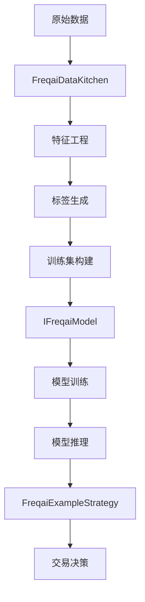
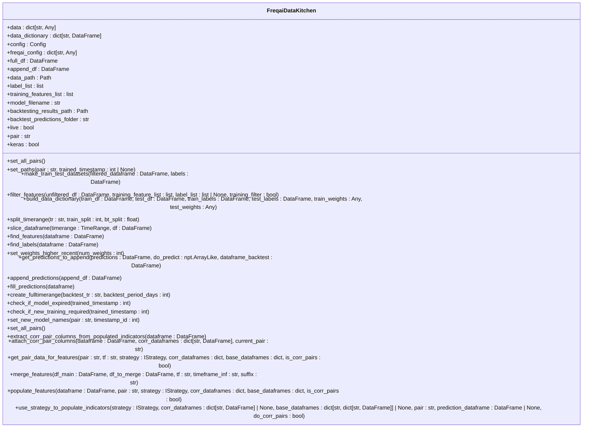
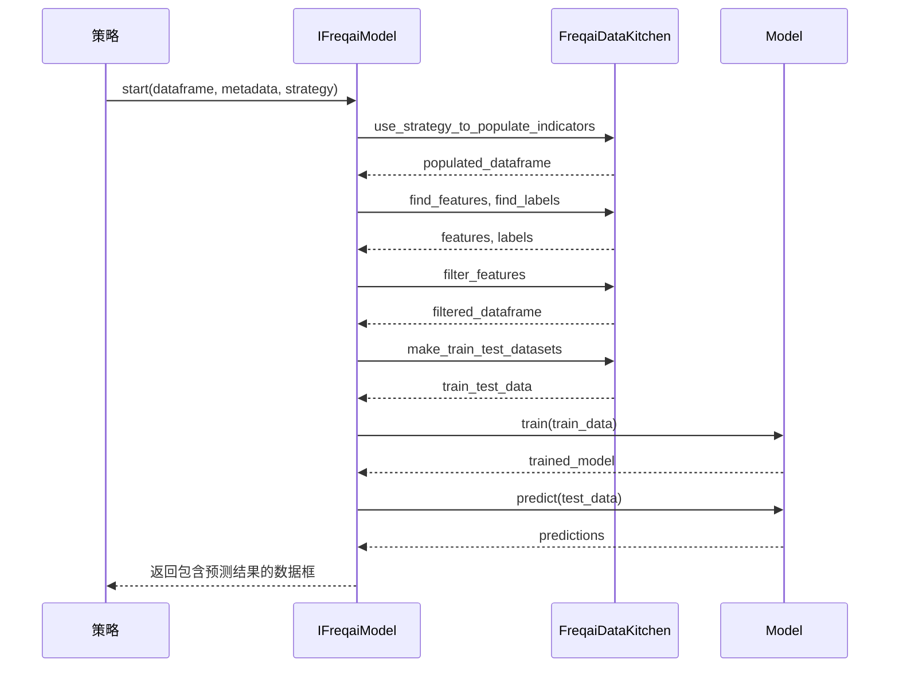
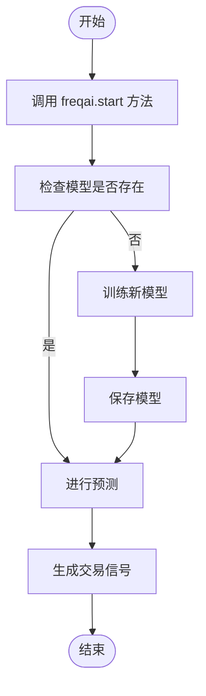
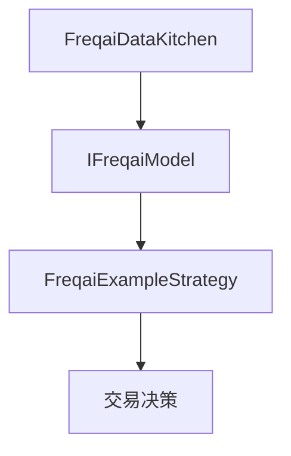

# FreqAI机器学习框架

<cite>
**本文档引用的文件**   
- [data_kitchen.py](file://freqtrade/freqai/data_kitchen.py)
- [freqai_interface.py](file://freqtrade/freqai/freqai_interface.py)
- [FreqaiExampleStrategy.py](file://freqtrade/templates/FreqaiExampleStrategy.py)
- [data_drawer.py](file://freqtrade/freqai/data_drawer.py)
- [BaseRegressionModel.py](file://freqtrade/freqai/base_models/BaseRegressionModel.py)
- [BasePyTorchClassifier.py](file://freqtrade/freqai/base_models/BasePyTorchClassifier.py)
</cite>

## 目录
1. [简介](#简介)
2. [项目结构](#项目结构)
3. [核心组件](#核心组件)
4. [架构概述](#架构概述)
5. [详细组件分析](#详细组件分析)
6. [依赖分析](#依赖分析)
7. [性能考虑](#性能考虑)
8. [故障排除指南](#故障排除指南)
9. [结论](#结论)

## 简介
FreqAI是Freqtrade框架中的一个机器学习模块，旨在将预测模型无缝集成到交易决策流程中。该框架支持监督学习、强化学习（RL）和多输出模型等多种模式，通过自动化特征工程、模型训练和推理过程，帮助用户构建智能交易策略。FreqAI的核心组件包括数据厨房（Data Kitchen）、模型接口（Model Interface）和示例策略（Example Strategy），它们共同协作以实现高效的模型生命周期管理。

## 项目结构
FreqAI框架位于`freqtrade/freqai`目录下，主要包含以下几个子模块：
- `base_models`：基础模型类，如`BaseRegressionModel`和`BasePyTorchClassifier`。
- `prediction_models`：具体的预测模型实现，如Catboost、LightGBM等。
- `RL`：强化学习相关类。
- `tensorboard`：TensorBoard集成。
- `torch`：PyTorch相关工具。
- `data_drawer.py`：持久化存储和管理模型及数据。
- `data_kitchen.py`：负责数据预处理、特征工程和训练集构建。
- `freqai_interface.py`：定义模型的生命周期管理。

**Diagram sources**
- [data_kitchen.py](file://freqtrade/freqai/data_kitchen.py#L34-L1033)
- [freqai_interface.py](file://freqtrade/freqai/freqai_interface.py#L35-L1039)

## 核心组件

FreqAI框架的核心组件包括`FreqaiDataKitchen`、`IFreqaiModel`和`FreqaiExampleStrategy`。这些组件分别负责数据处理、模型管理和策略集成。

**Section sources**
- [data_kitchen.py](file://freqtrade/freqai/data_kitchen.py#L34-L1033)
- [freqai_interface.py](file://freqtrade/freqai/freqai_interface.py#L35-L1039)
- [FreqaiExampleStrategy.py](file://freqtrade/templates/FreqaiExampleStrategy.py#L13-L292)

## 架构概述

FreqAI的架构可以分为三个主要部分：数据处理、模型训练与推理、以及策略集成。数据处理由`FreqaiDataKitchen`完成，它负责从原始数据中提取特征并生成标签；模型训练与推理由继承自`IFreqaiModel`的各类模型完成；策略集成则通过`FreqaiExampleStrategy`来实现，该策略展示了如何将机器学习模型与交易逻辑结合。

**Diagram sources**
- [data_kitchen.py](file://freqtrade/freqai/data_kitchen.py#L34-L1033)
- [freqai_interface.py](file://freqtrade/freqai/freqai_interface.py#L35-L1039)
- [FreqaiExampleStrategy.py](file://freqtrade/templates/FreqaiExampleStrategy.py#L13-L292)

## 详细组件分析

### FreqaiDataKitchen 分析
`FreqaiDataKitchen`是FreqAI框架中的关键组件，负责数据的预处理、特征工程和训练集的构建。其主要功能包括：
- **数据过滤**：根据用户配置的特征列表和标签列表，从原始数据中筛选出相关的特征和标签。
- **特征工程**：利用`feature_engineering_expand_all`和`feature_engineering_expand_basic`方法扩展特征。
- **标签生成**：通过`set_freqai_targets`方法设置预测目标。
- **训练集构建**：使用`make_train_test_datasets`方法将数据划分为训练集和测试集。

#### 类图

**Diagram sources**
- [data_kitchen.py](file://freqtrade/freqai/data_kitchen.py#L34-L1033)

### IFreqaiModel 分析
`IFreqaiModel`是所有预测模型的基类，定义了模型的生命周期管理，包括训练、推理和版本控制。具体实现类如`BaseRegressionModel`和`BasePyTorchClassifier`都继承自此类。

#### 序列图

**Diagram sources**
- [freqai_interface.py](file://freqtrade/freqai/freqai_interface.py#L35-L1039)
- [data_kitchen.py](file://freqtrade/freqai/data_kitchen.py#L34-L1033)

### FreqaiExampleStrategy 分析
`FreqaiExampleStrategy`是一个示例策略，展示了如何配置机器学习参数、选择预测目标和处理模型输出。该策略通过调用`freqai.start`方法启动模型，并根据模型的预测结果生成交易信号。

#### 流程图

**Diagram sources**
- [FreqaiExampleStrategy.py](file://freqtrade/templates/FreqaiExampleStrategy.py#L13-L292)

## 依赖分析

FreqAI框架的各个组件之间存在紧密的依赖关系。`FreqaiDataKitchen`依赖于`IFreqaiModel`来进行模型训练和推理，而`FreqaiExampleStrategy`则依赖于两者来完成整个交易流程。

**Diagram sources**
- [data_kitchen.py](file://freqtrade/freqai/data_kitchen.py#L34-L1033)
- [freqai_interface.py](file://freqtrade/freqai/freqai_interface.py#L35-L1039)
- [FreqaiExampleStrategy.py](file://freqtrade/templates/FreqaiExampleStrategy.py#L13-L292)

## 性能考虑

在使用FreqAI时，需要注意以下几点以优化性能：
- **数据预处理**：确保数据预处理步骤高效，避免不必要的计算。
- **模型选择**：根据实际需求选择合适的模型，平衡准确性和计算成本。
- **并行处理**：充分利用多线程或多进程进行数据处理和模型训练。
- **内存管理**：合理管理内存使用，避免内存泄漏。

## 故障排除指南

当遇到问题时，可以参考以下步骤进行排查：
- **检查日志**：查看日志文件，寻找错误信息或警告。
- **验证配置**：确认配置文件中的参数设置正确无误。
- **数据完整性**：确保输入数据完整且格式正确。
- **模型状态**：检查模型是否已正确加载或训练。

**Section sources**
- [data_kitchen.py](file://freqtrade/freqai/data_kitchen.py#L34-L1033)
- [freqai_interface.py](file://freqtrade/freqai/freqai_interface.py#L35-L1039)

## 结论

FreqAI提供了一个强大的机器学习框架，能够有效地将预测模型集成到交易决策流程中。通过合理的配置和优化，用户可以构建出高性能的智能交易系统。未来的工作可以进一步探索更复杂的模型和算法，以提升预测精度和交易表现。