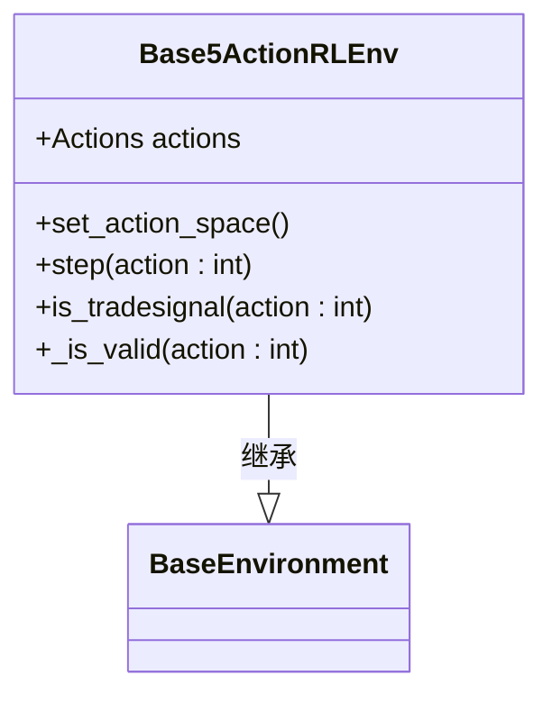
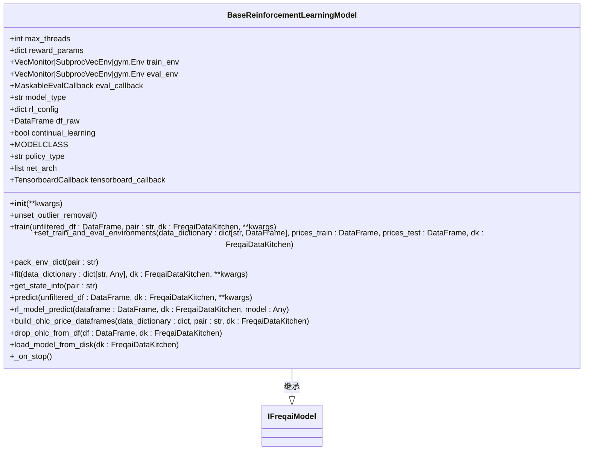
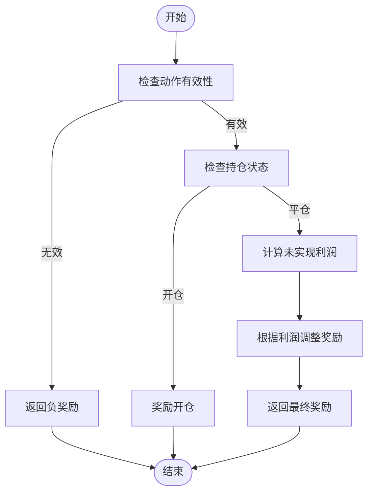
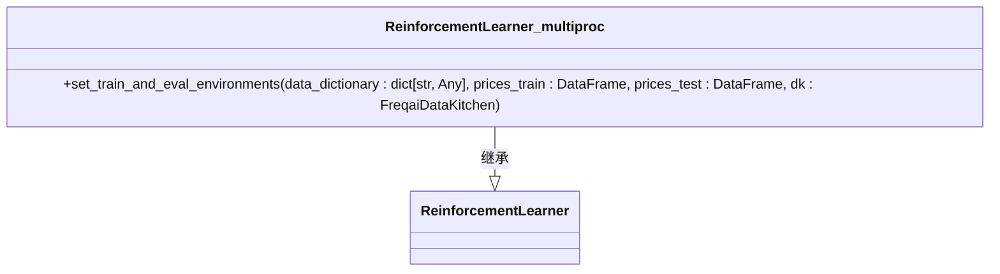

# 强化学习模型

<cite>
**本文档中引用的文件**   
- [Base3ActionRLEnv.py](file://freqtrade/freqai/RL/Base3ActionRLEnv.py)
- [Base4ActionRLEnv.py](file://freqtrade/freqai/RL/Base4ActionRLEnv.py)
- [Base5ActionRLEnv.py](file://freqtrade/freqai/RL/Base5ActionRLEnv.py)
- [BaseEnvironment.py](file://freqtrade/freqai/RL/BaseEnvironment.py)
- [BaseReinforcementLearningModel.py](file://freqtrade/freqai/RL/BaseReinforcementLearningModel.py)
- [ReinforcementLearner.py](file://freqtrade/freqai/prediction_models/ReinforcementLearner.py)
- [ReinforcementLearner_multiproc.py](file://freqtrade/freqai/prediction_models/ReinforcementLearner_multiproc.py)
</cite>

## 目录
1. [简介](#简介)
2. [环境类设计](#环境类设计)
3. [基类设计与实现](#基类设计与实现)
4. [马尔可夫决策过程建模](#马尔可夫决策过程建模)
5. [多进程强化学习实现](#多进程强化学习实现)
6. [模型配置与使用](#模型配置与使用)
7. [与传统监督学习的对比](#与传统监督学习的对比)

## 简介
FreqAI框架提供了完整的强化学习支持，允许用户将交易决策建模为马尔可夫决策过程。该系统通过定义状态空间、动作空间和奖励函数来训练智能体，使其能够在复杂的市场环境中做出最优交易决策。本文档详细解析了RL目录下的环境类和基类的设计与实现，阐述了多进程强化学习的机制，并通过具体示例展示如何配置和使用强化学习模型进行交易策略训练。

## 环境类设计
FreqAI框架提供了多种环境类来支持不同的交易策略需求。这些环境类继承自`BaseEnvironment`基类，并根据不同的动作空间进行定制化实现。

### 三动作环境 (Base3ActionRLEnv)
`Base3ActionRLEnv`类定义了一个包含三个动作的交易环境：中性（Neutral）、买入（Buy）和卖出（Sell）。该环境适用于不允许做空的交易场景。当`can_short`参数为`False`时，系统会自动切换到此环境。环境通过`_is_valid`方法验证动作的有效性，确保在不允许做空的情况下，只有从多头平仓或保持中性才是有效动作。

**图源**
- [Base3ActionRLEnv.py](file://freqtrade/freqai/RL/Base3ActionRLEnv.py#L17-L139)

### 四动作环境 (Base4ActionRLEnv)
`Base4ActionRLEnv`类定义了一个包含四个动作的交易环境：中性（Neutral）、退出（Exit）、做多进入（Long_enter）和做空进入（Short_enter）。这种设计允许智能体明确区分退出交易和保持中性的动作。环境通过`is_tradesignal`方法判断是否为交易信号，只有当智能体想要改变持仓状态时才被视为交易信号。

**图源**
- [Base4ActionRLEnv.py](file://freqtrade/freqai/RL/Base4ActionRLEnv.py#L18-L143)

### 五动作环境 (Base5ActionRLEnv)
`Base5ActionRLEnv`类定义了一个包含五个动作的交易环境：中性（Neutral）、做多进入（Long_enter）、做多退出（Long_exit）、做空进入（Short_enter）和做空退出（Short_exit）。这是最灵活的环境设计，允许智能体对每种交易方向进行精确控制。环境通过`_is_valid`方法确保动作的合法性，例如只有在持有仓位时才能执行退出动作。

**图源**
- [Base5ActionRLEnv.py](file://freqtrade/freqai/RL/Base5ActionRLEnv.py#L19-L152)

**本节源**
- [Base3ActionRLEnv.py](file://freqtrade/freqai/RL/Base3ActionRLEnv.py#L17-L139)
- [Base4ActionRLEnv.py](file://freqtrade/freqai/RL/Base4ActionRLEnv.py#L18-L143)
- [Base5ActionRLEnv.py](file://freqtrade/freqai/RL/Base5ActionRLEnv.py#L19-L152)

## 基类设计与实现
`BaseReinforcementLearningModel`是所有强化学习模型的基类，它定义了强化学习系统的核心架构和训练流程。

### 核心组件
该基类初始化了多个关键组件，包括训练环境、评估环境、评估回调和张量板回调。它还根据配置文件中的`model_type`参数动态导入相应的稳定基线3（stable_baselines3）或sb3_contrib模型。系统支持PPO、A2C、DQN等主流强化学习算法。

**图源**
- [BaseReinforcementLearningModel.py](file://freqtrade/freqai/RL/BaseReinforcementLearningModel.py#L39-L480)

### 训练流程
`train`方法是整个训练过程的核心，它首先过滤特征和标签数据，然后创建训练和测试数据集。系统会标准化所有数据，但仅基于训练数据集进行标准化。`set_train_and_eval_environments`方法负责创建训练和评估环境，其中训练环境直接使用自定义的MyRLEnv，而评估环境则包装在Monitor中以记录评估指标。

**本节源**
- [BaseReinforcementLearningModel.py](file://freqtrade/freqai/RL/BaseReinforcementLearningModel.py#L39-L480)

## 马尔可夫决策过程建模
FreqAI框架将交易决策问题建模为马尔可夫决策过程，其中智能体在每个时间步根据当前状态选择动作，并获得相应的奖励。

### 状态空间
状态空间由技术指标和其他市场特征组成。系统通过`_get_observation`方法获取当前观察值，该方法从信号特征数据框中提取一个时间窗口内的数据。如果启用了`add_state_info`，系统还会添加当前利润百分比、持仓状态和交易持续时间等额外信息。

### 动作空间
动作空间由离散的动作组成，具体取决于所使用的环境类。每个环境类都定义了自己的`Actions`枚举类型，并通过`set_action_space`方法设置动作空间。系统使用gymnasium的`spaces.Discrete`来表示离散动作空间。

### 奖励函数
奖励函数是强化学习系统的核心，它决定了智能体的学习目标。`calculate_reward`方法根据智能体的动作和交易结果计算奖励值。例如，在`ReinforcementLearner`类中，系统会奖励开仓动作，惩罚未开仓行为，并根据未实现利润和交易持续时间调整奖励值。

**图源**
- [BaseReinforcementLearningModel.py](file://freqtrade/freqai/RL/BaseReinforcementLearningModel.py#L402-L480)
- [ReinforcementLearner.py](file://freqtrade/freqai/prediction_models/ReinforcementLearner.py#L105-L170)

**本节源**
- [BaseEnvironment.py](file://freqtrade/freqai/RL/BaseEnvironment.py#L39-L417)
- [BaseReinforcementLearningModel.py](file://freqtrade/freqai/RL/BaseReinforcementLearningModel.py#L402-L480)
- [ReinforcementLearner.py](file://freqtrade/freqai/prediction_models/ReinforcementLearner.py#L105-L170)

## 多进程强化学习实现
`ReinforcementLearner_multiproc`类展示了如何构建向量化环境以提高训练效率。

### 向量化环境
该类重写了`set_train_and_eval_environments`方法，使用`SubprocVecEnv`创建多个并行的环境实例。每个环境实例都在独立的子进程中运行，从而实现了真正的并行化。系统通过`make_env`工具函数为每个子进程创建环境实例。

### 训练效率
多进程训练的主要优势在于能够同时收集多个环境的样本，从而加快数据收集速度。`eval_freq`参数被设置为`len(train_df) // self.max_threads`，这意味着评估频率会根据线程数自动调整。然而，文档中也明确指出，张量板回调不建议与多个环境一起使用，因为它可能会返回错误的信息。

**图源**
- [ReinforcementLearner_multiproc.py](file://freqtrade/freqai/prediction_models/ReinforcementLearner_multiproc.py#L17-L84)

**本节源**
- [ReinforcementLearner_multiproc.py](file://freqtrade/freqai/prediction_models/ReinforcementLearner_multiproc.py#L17-L84)

## 模型配置与使用
用户可以通过继承`ReinforcementLearner`类来创建自己的强化学习模型。系统允许用户覆盖任何可用的函数，以实现自定义的环境控制和训练逻辑。

### 自定义奖励函数
用户最重要的自定义点通常是`calculate_reward`方法。通过重写此方法，用户可以根据自己的交易策略注入创造力。例如，可以基于技术指标值、市场波动性或其他因素来调整奖励值。

### 持续学习
系统支持持续学习（continual_learning），允许在之前训练的代理基础上继续训练。这通过检查`dd.model_dictionary`中是否已存在模型来实现。如果存在且启用了持续学习，则使用之前的模型并设置新的训练环境。

**本节源**
- [ReinforcementLearner.py](file://freqtrade/freqai/prediction_models/ReinforcementLearner.py#L16-L170)

## 与传统监督学习的对比
强化学习模型与传统监督学习模型在应用场景和性能上有显著差异。

### 应用场景
监督学习模型通常用于预测价格方向或生成交易信号，而强化学习模型则直接学习最优交易策略。强化学习更适合复杂的决策问题，如仓位管理和风险控制，因为它能够考虑长期回报而非仅仅短期预测准确性。

### 性能特点
强化学习模型的训练时间通常比监督学习模型长，因为它需要通过试错来学习策略。然而，一旦训练完成，强化学习模型往往能产生更稳健的交易策略，因为它直接优化了交易回报。此外，强化学习模型能够更好地处理非平稳市场环境，因为它不断适应新的市场条件。

**本节源**
- [ReinforcementLearner.py](file://freqtrade/freqai/prediction_models/ReinforcementLearner.py#L16-L170)
- [BaseReinforcementLearningModel.py](file://freqtrade/freqai/RL/BaseReinforcementLearningModel.py#L39-L480)