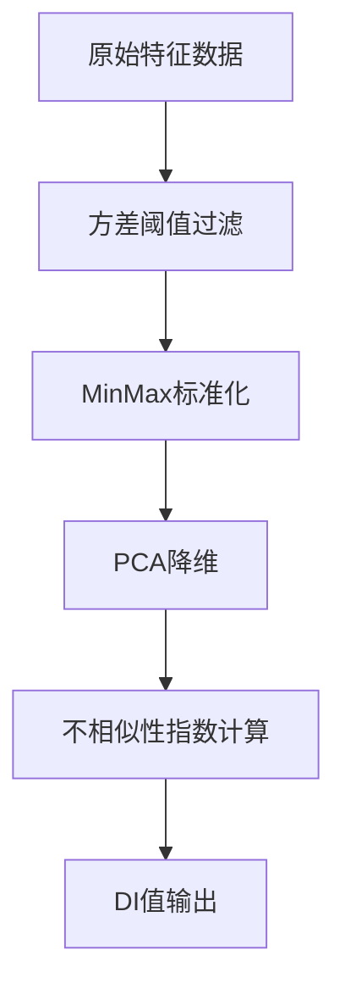
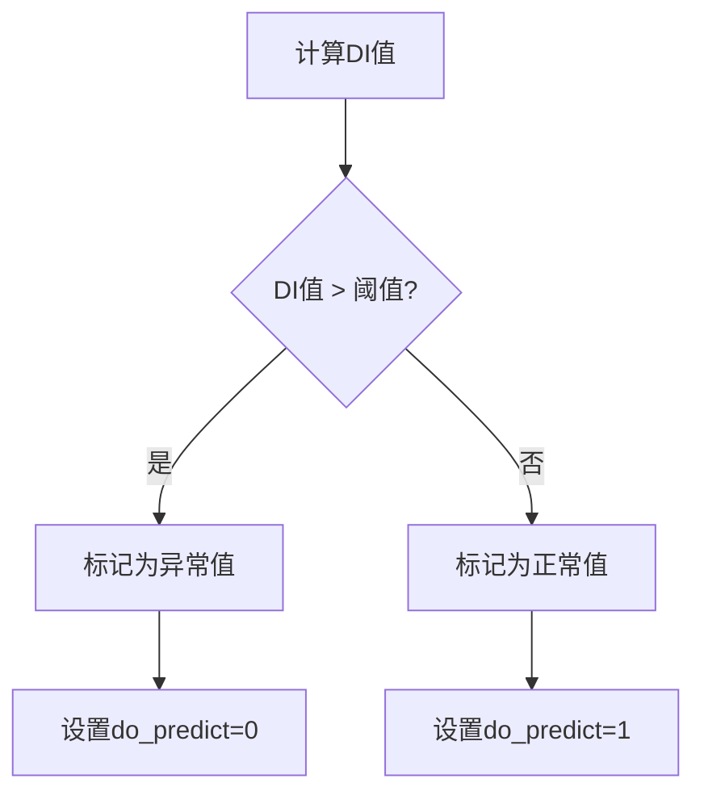
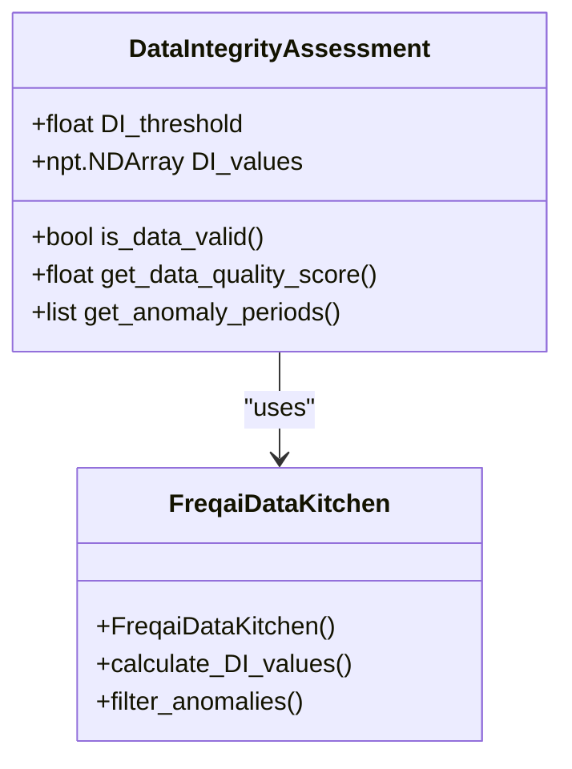
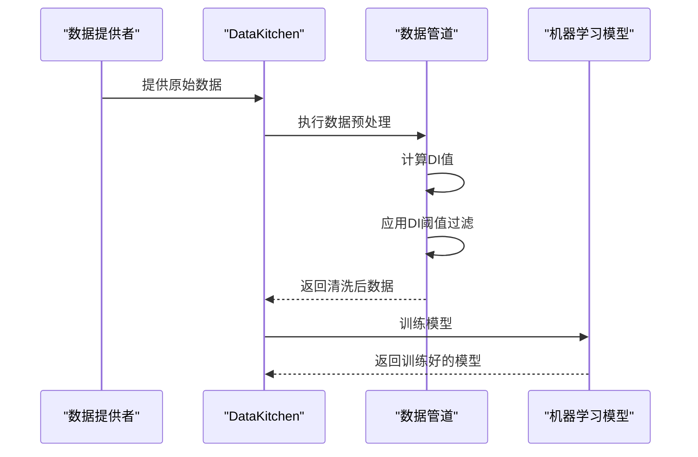
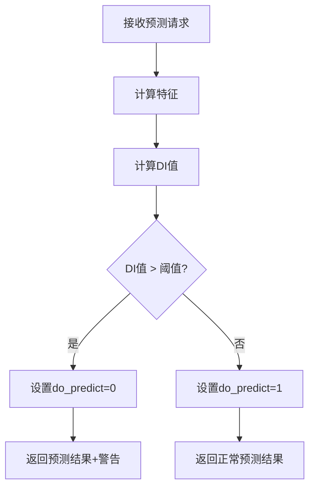
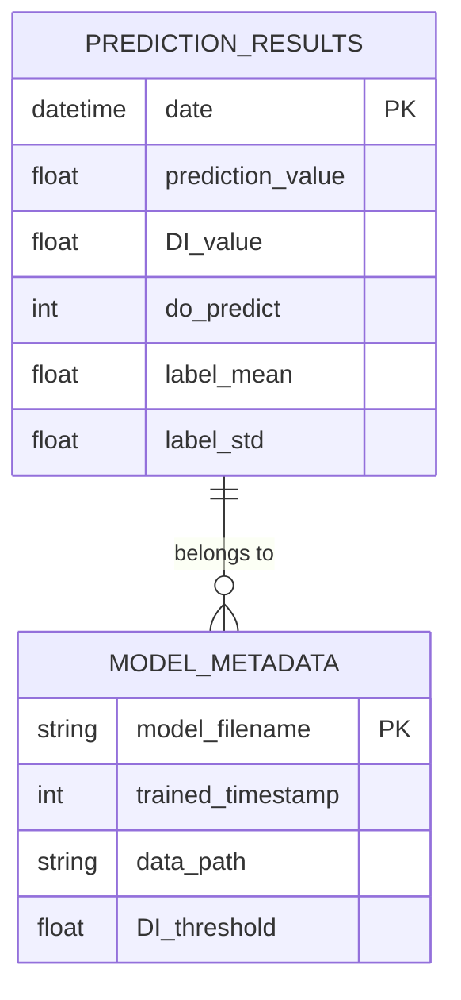
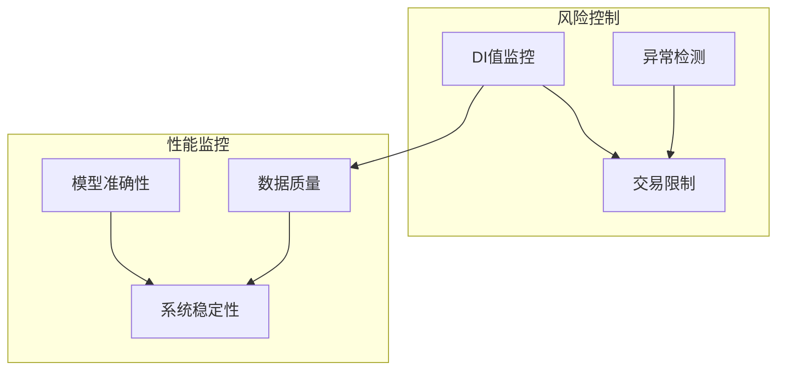

# DI指数与异常值检测

<cite>
**本文档引用的文件**   
- [data_kitchen.py](file://freqtrade/freqai/data_kitchen.py)
- [data_drawer.py](file://freqtrade/freqai/data_drawer.py)
- [config_schema.py](file://freqtrade/config_schema/config_schema.py)
- [freqai_interface.py](file://freqtrade/freqai/freqai_interface.py)
</cite>

## 目录
1. [简介](#简介)
2. [DI指数计算原理](#di指数计算原理)
3. [异常值检测机制](#异常值检测机制)
4. [DI阈值配置](#di阈值配置)
5. [数据完整性评估](#数据完整性评估)
6. [模型训练中的DI应用](#模型训练中的di应用)
7. [预测过程中的DI处理](#预测过程中的di处理)
8. [数据存储与加载](#数据存储与加载)
9. [风险控制与性能监控](#风险控制与性能监控)

## 简介
DI（Data Integrity）指数是FreqAI框架中用于评估数据质量的关键指标。该指数通过量化数据特征的相似性来识别异常模式，为模型训练和预测提供数据完整性保障。本文档深入解析DI指数的计算原理、异常值检测机制及其在FreqAI框架中的应用。

**Section sources**
- [data_kitchen.py](file://freqtrade/freqai/data_kitchen.py#L34-L1033)
- [data_drawer.py](file://freqtrade/freqai/data_drawer.py#L45-L764)

## DI指数计算原理
DI指数的计算基于Datasieve库中的DissimilarityIndex变换器，通过比较数据点之间的特征向量来评估其相似性。在FreqAI框架中，DI值的计算主要在数据预处理管道中完成。

计算过程首先对特征数据进行标准化处理，然后使用主成分分析（PCA）降维（如果启用），最后计算每个数据点的不相似性指数。该指数反映了数据点与正常数据模式的偏离程度，值越高表示数据越异常。



**Diagram sources **
- [data_kitchen.py](file://freqtrade/freqai/data_kitchen.py#L85)
- [freqai_interface.py](file://freqtrade/freqai/freqai_interface.py#L1020-L1039)

**Section sources**
- [data_kitchen.py](file://freqtrade/freqai/data_kitchen.py#L85)
- [freqai_interface.py](file://freqtrade/freqai/freqai_interface.py#L1020-L1039)

## 异常值检测机制
FreqAI框架通过DI阈值机制实现异常值检测。当DI值超过预设阈值时，对应的数据点被视为异常值。检测机制在数据预处理阶段自动执行，确保模型训练和预测使用高质量数据。

异常值检测流程包括：计算每个数据点的DI值、与阈值比较、标记异常数据点。被标记为异常的数据点在训练时可能被排除，在预测时则通过do_predict标志告知策略层。



**Diagram sources **
- [data_kitchen.py](file://freqtrade/freqai/data_kitchen.py#L444)
- [data_drawer.py](file://freqtrade/freqai/data_drawer.py#L373)

**Section sources**
- [data_kitchen.py](file://freqtrade/freqai/data_kitchen.py#L444)
- [data_drawer.py](file://freqtrade/freqai/data_drawer.py#L373)

## DI阈值配置
DI阈值通过配置文件中的feature_parameters.DI_threshold参数进行设置。该参数定义了数据点被视为异常的临界值，值域通常在0到1之间。

配置示例：
```json
{
  "freqai": {
    "feature_parameters": {
      "DI_threshold": 0.9
    }
  }
}
```

当DI_threshold设置为0时，禁用异常值检测功能。该配置在模型初始化时读取，并应用于整个训练和预测过程。

**Section sources**
- [config_schema.py](file://freqtrade/config_schema/config_schema.py#L1183)
- [data_kitchen.py](file://freqtrade/freqai/data_kitchen.py#L444)

## 数据完整性评估
DI指数作为数据完整性评估的核心指标，为模型提供了数据质量的量化度量。高DI值表明数据可能存在异常模式，如市场操纵、数据错误或极端市场条件。

评估过程持续监控数据流，实时计算DI值并生成数据质量报告。这些信息可用于调整模型参数、触发重新训练或通知用户数据质量问题。



**Diagram sources **
- [data_kitchen.py](file://freqtrade/freqai/data_kitchen.py#L85)
- [data_drawer.py](file://freqtrade/freqai/data_drawer.py#L429)

**Section sources**
- [data_kitchen.py](file://freqtrade/freqai/data_kitchen.py#L85)
- [data_drawer.py](file://freqtrade/freqai/data_drawer.py#L429)

## 模型训练中的DI应用
在模型训练过程中，DI指数用于筛选高质量训练数据。通过排除高DI值的数据点，确保模型学习到的是正常市场模式而非异常噪声。

训练数据预处理流程中，DI值计算是数据管道的关键步骤。异常数据点要么被完全排除，要么被赋予较低的训练权重，从而减少其对模型参数的影响。



**Diagram sources **
- [data_kitchen.py](file://freqtrade/freqai/data_kitchen.py#L444)
- [freqai_interface.py](file://freqtrade/freqai/freqai_interface.py#L544)

**Section sources**
- [data_kitchen.py](file://freqtrade/freqai/data_kitchen.py#L444)
- [freqai_interface.py](file://freqtrade/freqai/freqai_interface.py#L544)

## 预测过程中的DI处理
在预测阶段，DI指数用于实时评估输入数据的质量。每个预测请求都会生成相应的DI值，帮助策略层判断预测结果的可靠性。

预测结果包含DI值和do_predict标志，策略可以根据这些信息决定是否执行交易。高DI值可能触发风险控制机制，如降低仓位或暂停交易。



**Diagram sources **
- [data_kitchen.py](file://freqtrade/freqai/data_kitchen.py#L444)
- [data_drawer.py](file://freqtrade/freqai/data_drawer.py#L429)

**Section sources**
- [data_kitchen.py](file://freqtrade/freqai/data_kitchen.py#L444)
- [data_drawer.py](file://freqtrade/freqai/data_drawer.py#L429)

## 数据存储与加载
DI值与模型预测结果一起存储，确保历史数据的完整性和可追溯性。DataDrawer组件负责DI相关数据的持久化管理。

存储内容包括：DI值序列、异常标记、数据质量统计。这些数据在模型重新加载时一并恢复，保持数据处理的一致性。



**Diagram sources **
- [data_drawer.py](file://freqtrade/freqai/data_drawer.py#L373)
- [data_kitchen.py](file://freqtrade/freqai/data_kitchen.py#L85)

**Section sources**
- [data_drawer.py](file://freqtrade/freqai/data_drawer.py#L373)
- [data_kitchen.py](file://freqtrade/freqai/data_kitchen.py#L85)

## 风险控制与性能监控
DI指数在风险控制和性能监控中发挥重要作用。通过长期跟踪DI值分布，可以识别数据质量趋势和潜在风险。

监控指标包括：平均DI值、异常数据比例、DI值波动率。这些指标可用于自动化风险预警、模型性能评估和系统健康检查。



**Diagram sources **
- [data_drawer.py](file://freqtrade/freqai/data_drawer.py#L373)
- [freqai_interface.py](file://freqtrade/freqai/freqai_interface.py#L1034)

**Section sources**
- [data_drawer.py](file://freqtrade/freqai/data_drawer.py#L373)
- [freqai_interface.py](file://freqtrade/freqai/freqai_interface.py#L1034)