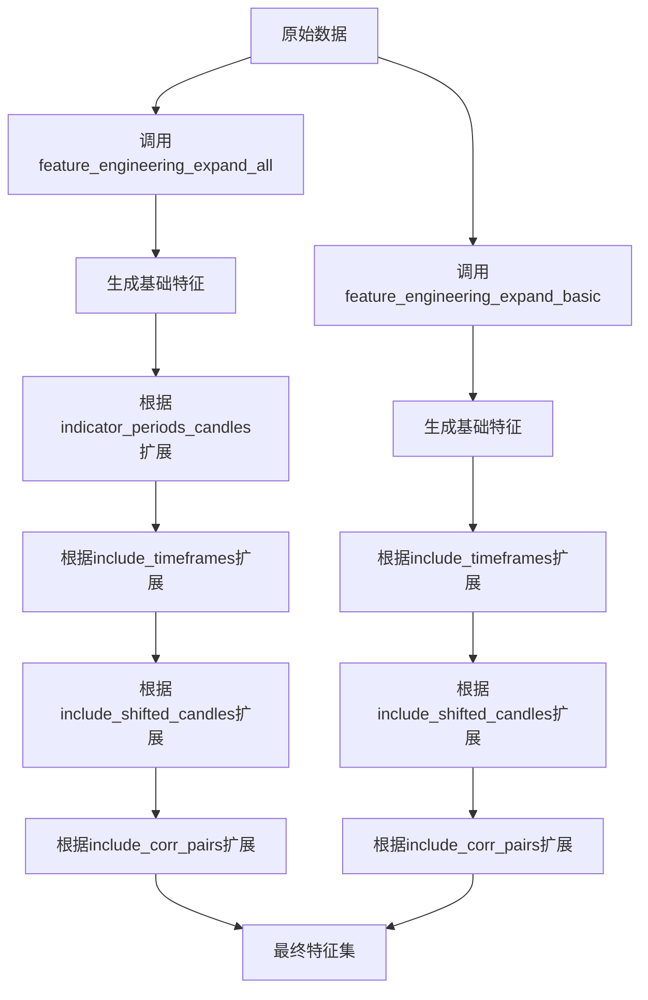
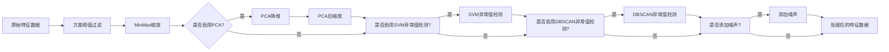

# 数据处理与特征工程

<cite>
**本文档中引用的文件**   
- [data_kitchen.py](file://freqtrade/freqai/data_kitchen.py)
- [FreqaiExampleStrategy.py](file://freqtrade/templates/FreqaiExampleStrategy.py)
- [freqai_interface.py](file://freqtrade/freqai/freqai_interface.py)
</cite>

## 目录
1. [数据处理流程概述](#数据处理流程概述)
2. [特征工程实现机制](#特征工程实现机制)
3. [标签生成与训练集构建](#标签生成与训练集构建)
4. [数据切片与时间范围管理](#数据切片与时间范围管理)
5. [相关交易对数据处理](#相关交易对数据处理)
6. [特征与标签命名规范](#特征与标签命名规范)
7. [数据管道与数据变换](#数据管道与数据变换)
8. [DI指数与异常值检测](#di指数与异常值检测)

## 数据处理流程概述

FreqAI框架的数据处理流程始于`FreqaiDataKitchen`类，该类负责为单个交易对分析数据。数据处理流程包括数据加载、特征提取、标签生成、数据预处理和模型训练等关键步骤。在回测模式下，系统会根据配置的训练周期和回测周期将时间范围划分为多个子时间范围，依次进行训练和回测。在实盘模式下，系统会定期检查是否需要重新训练模型，并在必要时执行训练。数据处理的核心是特征工程，通过策略中定义的特征工程方法生成用于模型训练的特征。

**Section sources**
- [data_kitchen.py](file://freqtrade/freqai/data_kitchen.py#L34-L1035)
- [freqai_interface.py](file://freqtrade/freqai/freqai_interface.py#L35-L1039)

## 特征工程实现机制

特征工程是FreqAI框架的核心功能，主要通过策略中的`feature_engineering_expand_all`和`feature_engineering_expand_basic`方法实现。这些方法会根据配置文件中定义的参数自动扩展特征。`feature_engineering_expand_all`方法会根据`indicator_periods_candles`、`include_timeframes`、`include_shifted_candles`和`include_corr_pairs`等参数，将单个特征扩展为多个特征。`feature_engineering_expand_basic`方法则根据`include_timeframes`、`include_shifted_candles`和`include_corr_pairs`等参数进行特征扩展。所有生成的特征名称必须以`%`开头，以便FreqAI系统识别。

**Diagram sources **
- [data_kitchen.py](file://freqtrade/freqai/data_kitchen.py#L34-L1035)
- [FreqaiExampleStrategy.py](file://freqtrade/templates/FreqaiExampleStrategy.py#L46-L139)

## 标签生成与训练集构建

标签生成通过策略中的`set_freqai_targets`方法实现，所有生成的标签名称必须以`&`开头。标签通常表示未来价格的变化率或分类目标。训练集构建过程包括数据切片、特征过滤和数据集划分。系统首先根据时间范围切片获取训练数据，然后过滤出特征和标签列，移除包含NaN值的行。最后，使用`train_test_split`函数将数据划分为训练集和测试集，划分比例由配置文件中的`test_size`参数决定。权重设置允许最近的数据在训练中具有更高的权重，通过`weight_factor`参数控制。

**Section sources**
- [data_kitchen.py](file://freqtrade/freqai/data_kitchen.py#L34-L1035)
- [FreqaiExampleStrategy.py](file://freqtrade/templates/FreqaiExampleStrategy.py#L173-L222)

## 数据切片与时间范围管理

数据切片和时间范围管理由`FreqaiDataKitchen`类的`slice_dataframe`和`split_timerange`方法实现。`slice_dataframe`方法根据指定的时间范围从完整数据框中提取数据子集。`split_timerange`方法将完整的时间范围划分为多个训练和回测子时间范围。训练时间范围的长度由`train_period_days`参数决定，回测时间范围的长度由`backtest_period_days`参数决定。系统会确保回测时间范围的结束时间与配置的回测时间范围一致。对于实盘模式，系统会从当前时间向前推算训练周期长度来确定训练时间范围。

**Section sources**
- [data_kitchen.py](file://freqtrade/freqai/data_kitchen.py#L34-L1035)

## 相关交易对数据处理

相关交易对（corr_pairlist）数据处理通过`extract_corr_pair_columns_from_populated_indicators`和`attach_corr_pair_columns`方法实现。首先，系统会从已填充指标的数据框中提取相关交易对的特征列，并保存在字典中。然后，在处理当前交易对时，将这些相关交易对的特征数据框通过日期列合并到当前交易对的数据框中。这种方法允许模型利用多个相关交易对的信息进行预测。相关交易对列表在配置文件中通过`include_corr_pairlist`参数定义，并与交易对白名单合并。

**Section sources**
- [data_kitchen.py](file://freqtrade/freqai/data_kitchen.py#L34-L1035)

## 特征与标签命名规范

特征和标签的命名规范是FreqAI框架的重要约定。所有特征名称必须以`%`开头，所有标签名称必须以`&`开头。这种命名约定使系统能够自动识别和处理特征与标签。例如，在`FreqaiExampleStrategy`策略中，RSI指标被命名为`%-rsi-period`，收盘价变化率被命名为`%-pct-change`，而预测目标被命名为`&-s_close`。这些命名规范确保了特征工程方法生成的列能够被系统正确识别和使用。用户自定义的列如果需要在策略中保留，应以`%%`开头。

**Section sources**
- [FreqaiExampleStrategy.py](file://freqtrade/templates/FreqaiExampleStrategy.py#L46-L222)

## 数据管道与数据变换

数据管道由`define_data_pipeline`方法定义，使用`datasieve.pipeline.Pipeline`实现。数据管道包含一系列数据变换步骤，按顺序执行。默认的变换步骤包括方差阈值过滤（移除方差为零的特征）、MinMax缩放（将特征缩放到[-1, 1]范围）。可选的变换步骤包括主成分分析（PCA）、SVM异常值检测、DBSCAN异常值检测和噪声添加。数据管道在训练前应用于特征数据，在预测前应用于新数据，确保数据的一致性。标签数据也有独立的标签管道，通常只包含MinMax缩放。

**Diagram sources **
- [freqai_interface.py](file://freqtrade/freqai/freqai_interface.py#L527-L555)

## DI指数与异常值检测

DI指数（Dissimilarity Index）和异常值检测是FreqAI框架提供的高级数据预处理功能。DI指数通过`DissimilarityIndex`变换实现，用于检测与训练数据分布差异过大的样本，当`DI_threshold`参数大于0时启用。SVM异常值检测通过`SVMOutlierExtractor`变换实现，使用一类SVM算法识别异常值，可通过`svm_params`参数配置。DBSCAN异常值检测通过`DBSCAN`变换实现，使用密度聚类算法识别异常值。这些异常值检测方法可以帮助提高模型的鲁棒性，防止模型被异常数据干扰。异常值检测通常在数据缩放之后、模型训练之前执行。

**Section sources**
- [freqai_interface.py](file://freqtrade/freqai/freqai_interface.py#L527-L555)