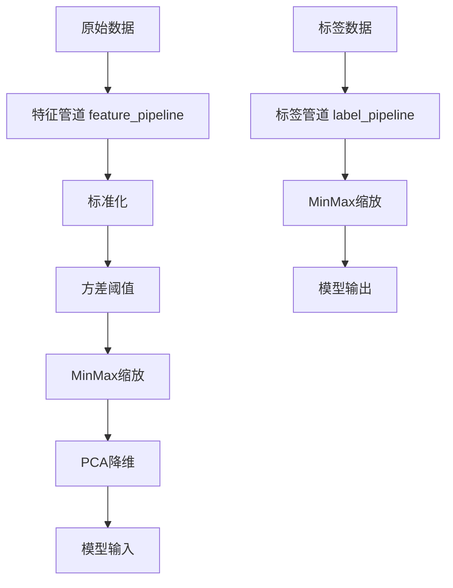
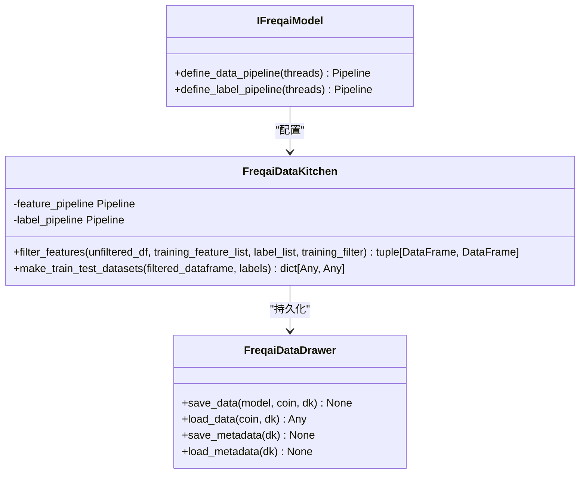
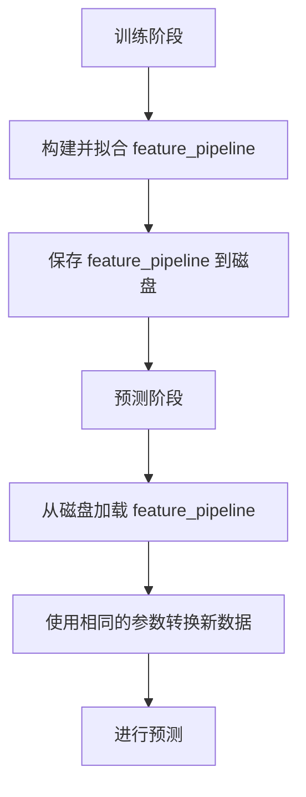

# 数据管道与预处理

<cite>
**本文档引用文件**   
- [data_kitchen.py](file://freqtrade/freqai/data_kitchen.py)
- [data_drawer.py](file://freqtrade/freqai/data_drawer.py)
- [freqai_interface.py](file://freqtrade/freqai/freqai_interface.py)
</cite>

## 目录
1. [引言](#引言)
2. [数据管道架构](#数据管道架构)
3. [特征与标签管道实现](#特征与标签管道实现)
4. [数据变换技术配置](#数据变换技术配置)
5. [数据管道持久化机制](#数据管道持久化机制)
6. [训练与预测阶段一致性](#训练与预测阶段一致性)
7. [结论](#结论)

## 引言
FreqAI框架通过系统化的数据预处理流程，为机器学习模型提供高质量的输入数据。该流程的核心是数据管道（Pipeline）机制，它在`data_kitchen.py`中实现，负责特征和标签的标准化、缩放、降维等预处理操作。数据管道确保了从原始市场数据到模型输入的转换过程既高效又一致，是FreqAI实现稳定预测性能的关键组件。

**Section sources**
- [data_kitchen.py](file://freqtrade/freqai/data_kitchen.py#L34-L1033)

## 数据管道架构
FreqAI的数据管道架构由`FreqaiDataKitchen`类和`FreqaiDataDrawer`类协同工作。`FreqaiDataKitchen`负责单个交易对的数据分析和预处理，其生命周期与每次模型推理或训练相关联。`FreqaiDataDrawer`则是一个持久化对象，负责在内存中管理所有交易对的模型和元数据，并处理与磁盘的读写操作。

数据管道的构建始于`IFreqaiModel`接口的`define_data_pipeline`和`define_label_pipeline`方法。这些方法根据用户在配置文件中的设置，定义了一系列数据变换步骤，并将它们组合成`datasieve.pipeline.Pipeline`对象。特征管道（`feature_pipeline`）和标签管道（`label_pipeline`）作为`FreqaiDataKitchen`的实例属性被初始化，用于后续的数据处理。

**Diagram sources **
- [data_kitchen.py](file://freqtrade/freqai/data_kitchen.py#L82-L83)
- [freqai_interface.py](file://freqtrade/freqai/freqai_interface.py#L534-L560)

**Section sources**
- [data_kitchen.py](file://freqtrade/freqai/data_kitchen.py#L34-L1033)
- [data_drawer.py](file://freqtrade/freqai/data_drawer.py#L45-L764)
- [freqai_interface.py](file://freqtrade/freqai/freqai_interface.py#L1-L1041)

## 特征与标签管道实现
特征管道和标签管道的实现主要在`data_kitchen.py`和`freqai_interface.py`中完成。`FreqaiDataKitchen`类在初始化时创建空的`feature_pipeline`和`label_pipeline`对象。实际的管道配置逻辑则在`IFreqaiModel`基类中通过`define_data_pipeline`和`define_label_pipeline`方法定义。

特征管道的构建过程如下：
1.  **方差阈值过滤**：首先使用`VarianceThreshold`移除方差为零的常量特征。
2.  **数据缩放**：应用`MinMaxScaler`将所有特征缩放到[-1, 1]区间。
3.  **可选降维**：如果配置了`principal_component_analysis`，则使用`PCA`进行主成分分析降维，并在降维后再次进行MinMax缩放以保持数值范围。
4.  **异常值处理**：根据配置，可选择使用SVM或DBSCAN算法来识别和移除异常值。
5.  **相似性指数**：如果设置了`DI_threshold`，则计算数据的相似性指数，用于在预测时判断数据点是否与训练数据足够相似。

标签管道的实现相对简单，通常只包含一个`MinMaxScaler`步骤，用于将标签值也缩放到[-1, 1]区间，以匹配模型的输出范围。

**Diagram sources **
- [freqai_interface.py](file://freqtrade/freqai/freqai_interface.py#L534-L560)
- [data_kitchen.py](file://freqtrade/freqai/data_kitchen.py#L82-L83)
- [data_drawer.py](file://freqtrade/freqai/data_drawer.py#L45-L764)

**Section sources**
- [data_kitchen.py](file://freqtrade/freqai/data_kitchen.py#L34-L1033)
- [freqai_interface.py](file://freqtrade/freqai/freqai_interface.py#L505-L560)

## 数据变换技术配置
数据变换技术的配置完全通过FreqAI的配置文件（config.json）中的`freqai`部分进行。用户无需修改代码，即可灵活调整预处理流程。

-   **方差阈值**：通过`feature_parameters`中的`const`步骤自动应用，移除方差为零的特征。
-   **MinMax缩放**：通过`feature_parameters`中的`scaler`步骤应用，将特征和标签缩放到[-1, 1]范围。
-   **PCA降维**：在`feature_parameters`中设置`principal_component_analysis`为`true`来启用。`n_components=0.999`表示保留99.9%的方差。
-   **异常值处理**：通过`use_SVM_to_remove_outliers`或`use_DBSCAN_to_remove_outliers`等布尔值来启用。
-   **相似性指数（DI）**：通过`DI_threshold`设置一个阈值，用于在预测时过滤掉与训练数据差异过大的数据点。

这些配置在`define_data_pipeline`方法中被解析，并动态地构建出最终的`Pipeline`对象。

**Section sources**
- [freqai_interface.py](file://freqtrade/freqai/freqai_interface.py#L534-L560)

## 数据管道持久化机制
数据管道的持久化是确保训练和预测阶段一致性的关键。这一机制由`FreqaiDataDrawer`类实现。

在模型训练完成后，`FreqaiDataDrawer`的`save_data`方法不仅会保存训练好的模型文件，还会将`FreqaiDataKitchen`中的`feature_pipeline`和`label_pipeline`对象序列化并保存到磁盘。具体来说：
1.  特征管道被保存为`{model_filename}_feature_pipeline.pkl`。
2.  标签管道被保存为`{model_filename}_label_pipeline.pkl`。

在后续的预测阶段，`FreqaiDataDrawer`的`load_data`方法会从磁盘加载这些管道文件，并将它们重新赋值给新的`FreqaiDataKitchen`实例。这样，预测时使用的数据变换参数（如MinMaxScaler的`min_`和`scale_`属性）就与训练时完全一致，避免了数据泄露和预测偏差。

**Diagram sources **
- [data_drawer.py](file://freqtrade/freqai/data_drawer.py#L345-L360)
- [data_kitchen.py](file://freqtrade/freqai/data_kitchen.py#L82-L83)

**Section sources**
- [data_drawer.py](file://freqtrade/freqai/data_drawer.py#L45-L764)

## 训练与预测阶段一致性
FreqAI通过严格的数据管道管理，保证了训练和预测阶段的高度一致性。

在训练阶段，`data_cleaning_train`（已弃用，但逻辑被新管道继承）或直接调用`feature_pipeline.fit_transform`会对训练和测试数据集进行拟合和转换。`fit_transform`方法会学习数据的统计信息（如最小值、最大值），然后应用变换。

在预测阶段，`data_cleaning_predict`（已弃用）或`feature_pipeline.transform`方法会被调用。此时，管道使用的是在训练阶段学到的统计信息，而不是对新数据重新计算。这确保了无论市场数据如何变化，特征的缩放和变换方式都与模型训练时保持一致。

此外，`FreqaiDataDrawer`的持久化机制确保了这些学习到的变换参数在模型重启后依然可用，从而在整个模型生命周期内维持了数据处理的一致性。

**Section sources**
- [freqai_interface.py](file://freqtrade/freqai/freqai_interface.py#L989-L1039)
- [data_drawer.py](file://freqtrade/freqai/data_drawer.py#L345-L360)

## 结论
FreqAI框架通过`data_kitchen.py`中的`feature_pipeline`和`label_pipeline`实现了强大而灵活的数据预处理能力。通过`datasieve`库的`Pipeline`机制，用户可以方便地配置方差阈值、MinMax缩放、PCA降维等多种数据变换技术。更重要的是，`data_drawer.py`提供的持久化机制确保了这些数据管道在训练和预测阶段的一致性，这是构建可靠机器学习交易模型的基石。这种设计将数据预处理的复杂性封装起来，使用户能够专注于策略和模型的开发。