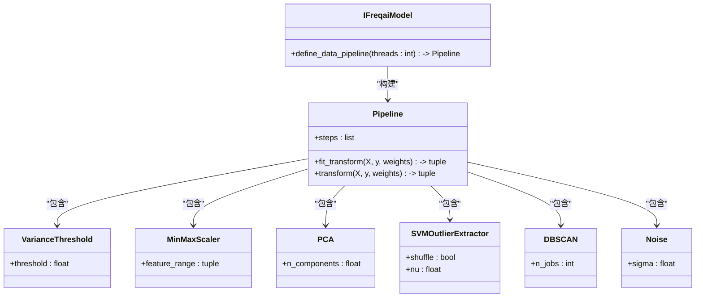
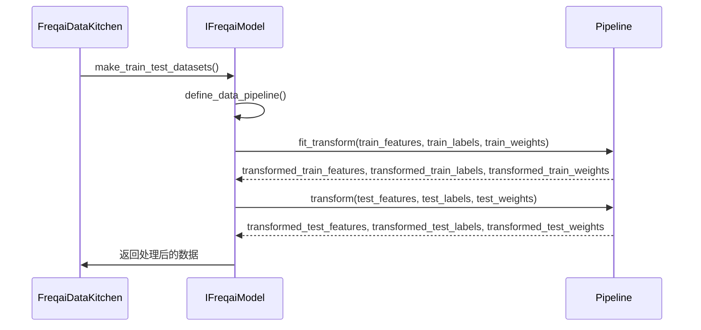
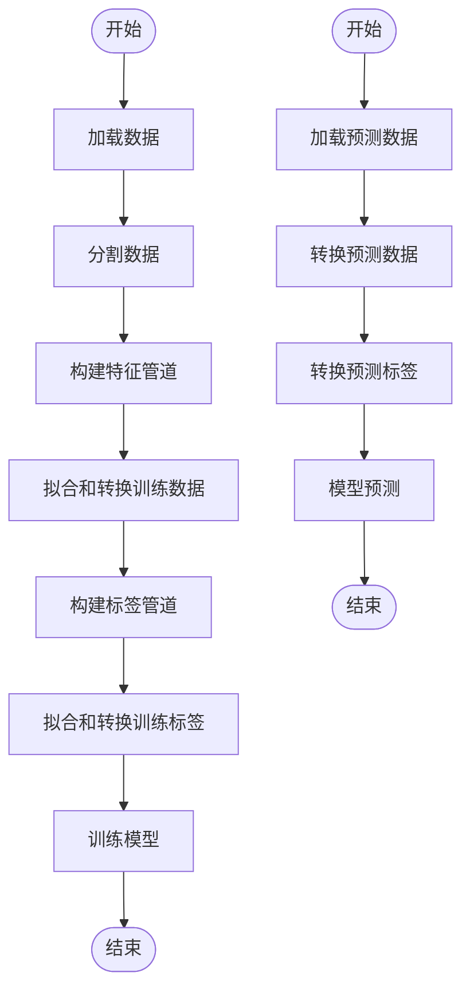

# 特征工程管道

<cite>
**本文档引用的文件**   
- [data_kitchen.py](file://freqtrade/freqai/data_kitchen.py)
- [freqai_interface.py](file://freqtrade/freqai/freqai_interface.py)
</cite>

## 目录
1. [引言](#引言)
2. [特征管道的构建](#特征管道的构建)
3. [特征管道的应用](#特征管道的应用)
4. [数据流路径与方法调用](#数据流路径与方法调用)
5. [配置参数及其对模型性能的影响](#配置参数及其对模型性能的影响)

## 引言
FreqAI 是一个用于加密货币交易策略的机器学习框架，它通过特征工程管道（Feature Pipeline）来处理和转换数据。特征工程管道是 FreqAI 的核心组件之一，负责将原始数据转换为适合机器学习模型训练和预测的格式。本文档详细阐述了特征工程管道的构建与应用，包括如何通过 Pipeline 串联方差阈值过滤、MinMax 缩放、PCA 降维等数据变换步骤。此外，还将解释在 `FreqaiDataKitchen` 类中如何根据配置动态构建特征处理流水线，并在训练和预测阶段保持一致性。

## 特征管道的构建
特征工程管道的构建主要在 `IFreqaiModel` 类的 `define_data_pipeline` 方法中完成。该方法根据配置文件中的参数动态构建一个包含多个数据变换步骤的 Pipeline。以下是构建特征管道的主要步骤：

1. **方差阈值过滤**：使用 `VarianceThreshold` 变换器去除方差为零的特征，以减少噪声和冗余。
2. **MinMax 缩放**：使用 `MinMaxScaler` 将特征值缩放到指定范围（通常是 -1 到 1），以确保不同特征之间的尺度一致。
3. **主成分分析 (PCA)**：如果配置文件中启用了 PCA，则使用 `PCA` 变换器进行降维，以减少特征数量并保留主要信息。
4. **SVM 异常值去除**：如果配置文件中启用了 SVM 异常值去除，则使用 `SVMOutlierExtractor` 变换器去除异常值。
5. **DBSCAN 异常值去除**：如果配置文件中启用了 DBSCAN 异常值去除，则使用 `DBSCAN` 变换器去除异常值。
6. **噪声添加**：如果配置文件中指定了噪声标准差，则使用 `Noise` 变换器向数据中添加噪声，以增强模型的鲁棒性。

**Diagram sources**
- [freqai_interface.py](file://freqtrade/freqai/freqai_interface.py#L505-L532)

**Section sources**
- [freqai_interface.py](file://freqtrade/freqai/freqai_interface.py#L505-L532)

## 特征管道的应用
特征工程管道在 `FreqaiDataKitchen` 类中被应用于训练和预测阶段。`FreqaiDataKitchen` 类负责管理数据的加载、处理和分析。在训练阶段，特征管道通过 `fit_transform` 方法对训练数据进行拟合和转换；在预测阶段，特征管道通过 `transform` 方法对预测数据进行转换。

### 训练阶段
在训练阶段，`FreqaiDataKitchen` 类首先调用 `make_train_test_datasets` 方法将数据分为训练集和测试集。然后，`IFreqaiModel` 类调用 `define_data_pipeline` 方法构建特征管道，并使用 `fit_transform` 方法对训练数据进行拟合和转换。具体步骤如下：

1. **数据分割**：将数据分为训练集和测试集。
2. **特征管道构建**：根据配置文件中的参数构建特征管道。
3. **数据拟合和转换**：使用 `fit_transform` 方法对训练数据进行拟合和转换。
4. **标签管道构建**：构建标签管道并使用 `fit_transform` 方法对训练标签进行拟合和转换。

### 预测阶段
在预测阶段，`FreqaiDataKitchen` 类调用 `transform` 方法对预测数据进行转换。具体步骤如下：

1. **数据加载**：加载预测数据。
2. **数据转换**：使用 `transform` 方法对预测数据进行转换。
3. **标签转换**：使用标签管道的 `transform` 方法对预测标签进行转换。

**Diagram sources**
- [data_kitchen.py](file://freqtrade/freqai/data_kitchen.py#L127-L210)
- [freqai_interface.py](file://freqtrade/freqai/freqai_interface.py#L505-L532)

**Section sources**
- [data_kitchen.py](file://freqtrade/freqai/data_kitchen.py#L127-L210)
- [freqai_interface.py](file://freqtrade/freqai/freqai_interface.py#L505-L532)

## 数据流路径与方法调用
在 FreqAI 中，数据流路径和方法调用是紧密相关的。以下是一个典型的训练和预测流程：

### 训练流程
1. **数据加载**：`FreqaiDataKitchen` 类从数据源加载数据。
2. **数据分割**：`make_train_test_datasets` 方法将数据分为训练集和测试集。
3. **特征管道构建**：`IFreqaiModel` 类调用 `define_data_pipeline` 方法构建特征管道。
4. **数据拟合和转换**：使用 `fit_transform` 方法对训练数据进行拟合和转换。
5. **标签管道构建**：构建标签管道并使用 `fit_transform` 方法对训练标签进行拟合和转换。
6. **模型训练**：使用处理后的数据训练机器学习模型。

### 预测流程
1. **数据加载**：`FreqaiDataKitchen` 类从数据源加载预测数据。
2. **数据转换**：使用 `transform` 方法对预测数据进行转换。
3. **标签转换**：使用标签管道的 `transform` 方法对预测标签进行转换。
4. **模型预测**：使用处理后的数据进行模型预测。

**Diagram sources**
- [data_kitchen.py](file://freqtrade/freqai/data_kitchen.py#L127-L210)
- [freqai_interface.py](file://freqtrade/freqai/freqai_interface.py#L505-L532)

**Section sources**
- [data_kitchen.py](file://freqtrade/freqai/data_kitchen.py#L127-L210)
- [freqai_interface.py](file://freqtrade/freqai/freqai_interface.py#L505-L532)

## 配置参数及其对模型性能的影响
特征工程管道的配置参数对模型性能有重要影响。以下是一些关键配置参数及其对模型性能的影响：

1. **方差阈值**：`threshold` 参数用于设置方差阈值。较低的阈值会去除更多的特征，可能导致信息丢失；较高的阈值会保留更多的特征，可能导致噪声增加。
2. **MinMax 缩放范围**：`feature_range` 参数用于设置特征值的缩放范围。通常设置为 (-1, 1) 或 (0, 1)。合适的缩放范围可以提高模型的收敛速度和稳定性。
3. **PCA 降维**：`n_components` 参数用于设置主成分的数量。较低的 `n_components` 会减少特征数量，可能导致信息丢失；较高的 `n_components` 会保留更多的特征，可能导致过拟合。
4. **SVM 异常值去除**：`nu` 参数用于设置 SVM 的异常值比例。较低的 `nu` 会去除更多的异常值，可能导致正常数据被误判；较高的 `nu` 会保留更多的数据，可能导致噪声增加。
5. **DBSCAN 异常值去除**：`n_jobs` 参数用于设置并行处理的线程数。较高的 `n_jobs` 可以加快处理速度，但可能增加内存消耗。
6. **噪声标准差**：`sigma` 参数用于设置噪声的标准差。适当的噪声可以增强模型的鲁棒性，但过多的噪声可能导致模型性能下降。

通过合理配置这些参数，可以优化特征工程管道，从而提高模型的性能和稳定性。

**Section sources**
- [freqai_interface.py](file://freqtrade/freqai/freqai_interface.py#L505-L532)
- [data_kitchen.py](file://freqtrade/freqai/data_kitchen.py#L127-L210)