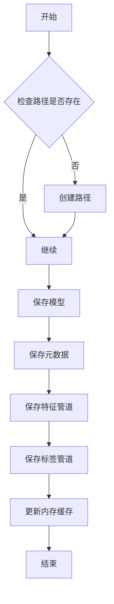
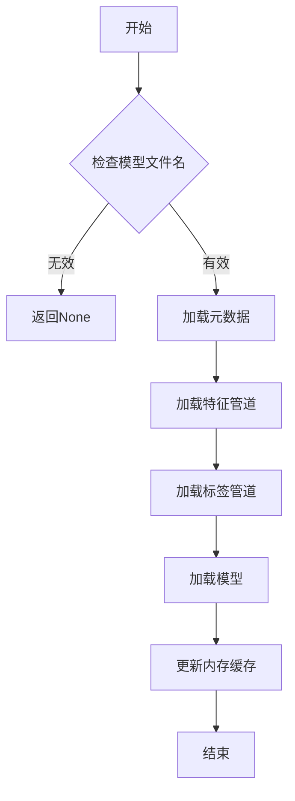

# 管道持久化与加载

<cite>
**本文档引用的文件**   
- [data_drawer.py](file://freqtrade/freqai/data_drawer.py)
- [data_kitchen.py](file://freqtrade/freqai/data_kitchen.py)
</cite>

## 目录
1. [引言](#引言)
2. [持久化机制概述](#持久化机制概述)
3. [序列化与保存](#序列化与保存)
4. [模型重载与状态恢复](#模型重载与状态恢复)
5. [文件命名与路径管理](#文件命名与路径管理)
6. [版本兼容性处理](#版本兼容性处理)
7. [代码示例](#代码示例)
8. [结论](#结论)

## 引言
FreqAI模块是Freqtrade框架中的一个高级功能，它允许用户利用机器学习模型进行交易预测。为了确保模型在训练阶段和预测阶段使用完全相同的预处理参数，必须实现一种可靠的持久化机制。本文档详细说明了`data_drawer.py`如何序列化并保存`feature_pipeline`和`label_pipeline`至磁盘，并解释了在模型重载时如何通过`DataDrawer`恢复预处理状态。

## 持久化机制概述
在FreqAI中，`FreqaiDataDrawer`类负责管理所有配对模型/信息的内存存储，以便更好地进行推理、重新训练、保存和从磁盘加载。该对象在整个实时/干燥运行期间保持持久性。`FreqaiDataKitchen`类则用于分析单个配对的数据，其功能包括持有、保存、加载和分析数据。此对象不是持久性的，在每次需要对硬币模型进行推理或训练时都会重新实例化。

### 核心组件
- **FreqaiDataDrawer**: 负责持久化和加载模型及其相关元数据。
- **FreqaiDataKitchen**: 负责数据预处理和特征工程。

**Section sources**
- [data_drawer.py](file://freqtrade/freqai/data_drawer.py#L45-L764)
- [data_kitchen.py](file://freqtrade/freqai/data_kitchen.py#L34-L1033)

## 序列化与保存
`FreqaiDataDrawer`类提供了`save_data`方法来保存所有与模型相关的数据。这些数据包括训练好的模型、元数据、特征管道和标签管道等。

### 保存流程
1. **创建保存路径**: 如果指定的路径不存在，则创建该路径。
2. **保存模型**: 根据配置中的`model_save_type`参数选择合适的序列化策略（如joblib、keras等）来保存模型。
3. **保存元数据**: 将训练特征列表、标签列表等信息以JSON格式保存。
4. **保存管道**: 使用`cloudpickle`将`feature_pipeline`和`label_pipeline`序列化并保存为`.pkl`文件。
5. **更新内存缓存**: 将模型和管道信息存储到内存中的字典里，以便后续快速访问。



**Diagram sources **
- [data_drawer.py](file://freqtrade/freqai/data_drawer.py#L503-L559)

## 模型重载与状态恢复
当需要重新加载模型时，`FreqaiDataDrawer`类提供了一个`load_data`方法来加载所有必需的数据，以确保预测阶段使用与训练阶段完全相同的变换参数。

### 加载流程
1. **检查模型文件名**: 确认是否存在有效的模型文件名。
2. **加载元数据**: 从JSON文件中读取元数据，包括训练特征列表和标签列表。
3. **加载管道**: 使用`cloudpickle`反序列化`feature_pipeline`和`label_pipeline`。
4. **加载模型**: 根据`model_save_type`参数选择合适的反序列化策略来加载模型。
5. **更新内存缓存**: 将加载的模型和管道信息存储到内存中的字典里，以便后续快速访问。



**Diagram sources **
- [data_drawer.py](file://freqtrade/freqai/data_drawer.py#L571-L629)

## 文件命名与路径管理
为了确保文件的组织性和可追溯性，FreqAI采用了一套严格的文件命名和路径管理规则。

### 文件命名规范
- **模型文件**: `cb_{coin.lower()}_{timestamp_id}_model.joblib`
- **特征管道**: `{model_filename}_feature_pipeline.pkl`
- **标签管道**: `{model_filename}_label_pipeline.pkl`
- **元数据**: `{model_filename}_metadata.json`

### 路径管理
- **主路径**: `Path(config["user_data_dir"] / "models" / str(freqai_config.get("identifier")))`
- **子路径**: `sub-train-{pair.split('/')[0]}_{trained_timestamp}`

**Section sources**
- [data_drawer.py](file://freqtrade/freqai/data_drawer.py#L503-L559)
- [data_kitchen.py](file://freqtrade/freqai/data_kitchen.py#L595-L593)

## 版本兼容性处理
为了处理不同版本之间的兼容性问题，FreqAI在加载数据时会检查元数据中的版本信息，并根据需要进行相应的转换或提示用户更新。

### 兼容性检查
- **元数据版本**: 在加载元数据时，检查其版本号是否与当前系统兼容。
- **管道版本**: 确保`feature_pipeline`和`label_pipeline`的版本与当前使用的库版本一致。

**Section sources**
- [data_drawer.py](file://freqtrade/freqai/data_drawer.py#L561-L569)
- [data_kitchen.py](file://freqtrade/freqai/data_kitchen.py#L104-L105)

## 代码示例
以下是一个完整的代码示例，展示了如何从磁盘加载管道并应用于新数据：

```python
from freqtrade.freqai.data_drawer import FreqaiDataDrawer
from freqtrade.freqai.data_kitchen import FreqaiDataKitchen
from pathlib import Path

# 初始化配置
config = {
    "user_data_dir": Path("path/to/user_data"),
    "freqai": {
        "identifier": "my_model",
        "model_save_type": "joblib"
    }
}

# 创建DataDrawer实例
full_path = Path(config["user_data_dir"] / "models" / str(config["freqai"].get("identifier")))
data_drawer = FreqaiDataDrawer(full_path, config)

# 加载数据
coin = "BTC/USD"
dk = FreqaiDataKitchen(config)
model = data_drawer.load_data(coin, dk)

# 应用管道到新数据
new_data = ...  # 新的数据
processed_data = dk.feature_pipeline.transform(new_data)
predictions = model.predict(processed_data)
```

**Section sources**
- [data_drawer.py](file://freqtrade/freqai/data_drawer.py#L571-L629)
- [data_kitchen.py](file://freqtrade/freqai/data_kitchen.py#L83-L84)

## 结论
通过`data_drawer.py`中的`save_data`和`load_data`方法，FreqAI实现了高效的模型持久化和状态恢复机制。这不仅保证了训练和预测阶段的一致性，还提高了系统的可靠性和可维护性。通过遵循严格的文件命名和路径管理规则，以及处理版本兼容性问题，可以确保跨会话的数据处理一致性。

**Section sources**
- [data_drawer.py](file://freqtrade/freqai/data_drawer.py#L503-L559)
- [data_kitchen.py](file://freqtrade/freqai/data_kitchen.py#L34-L1033)