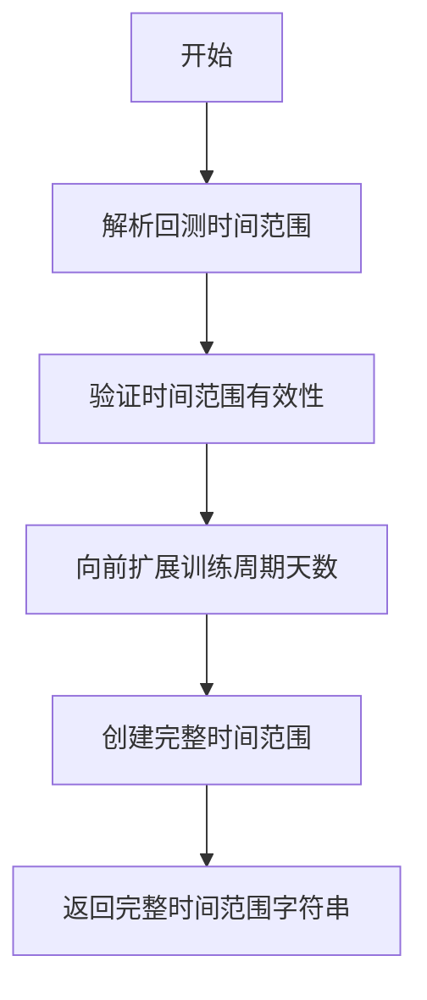
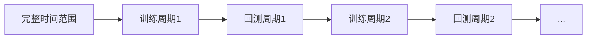
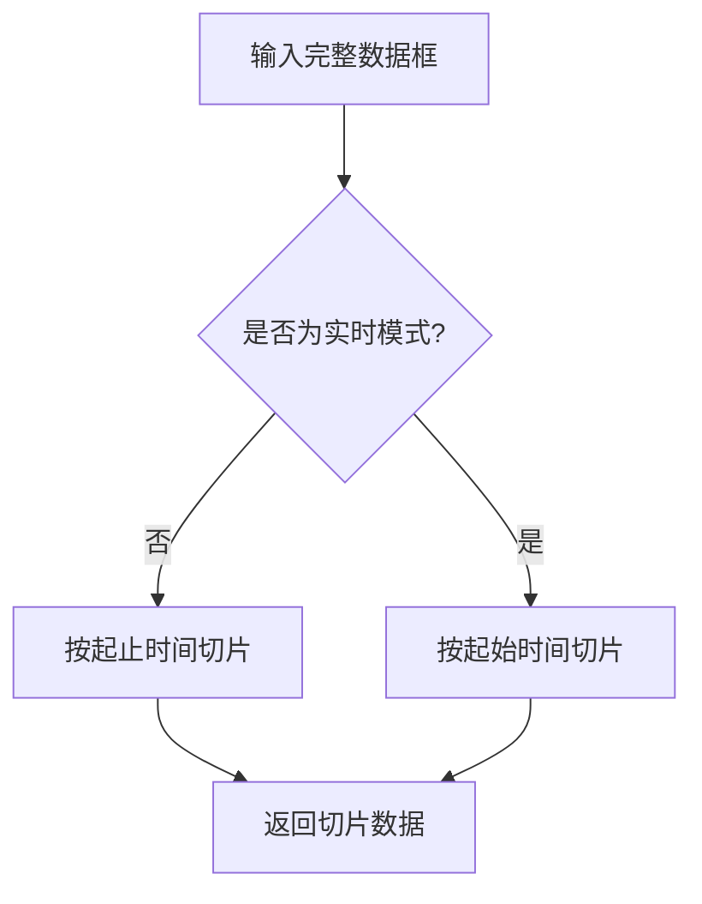
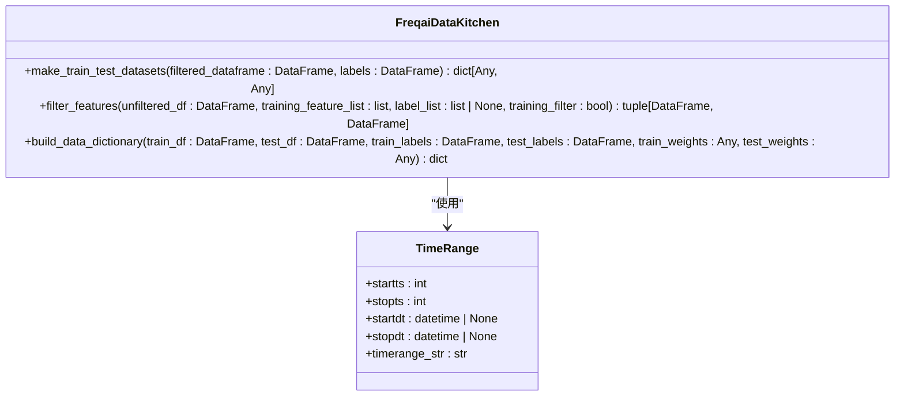
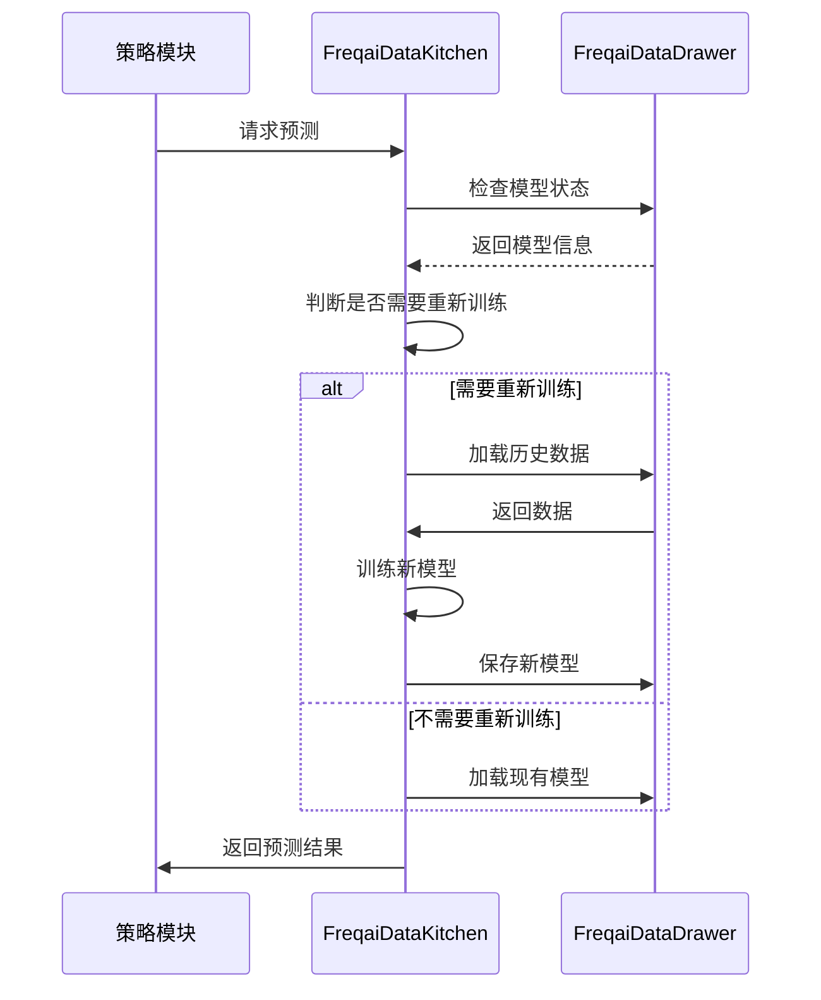
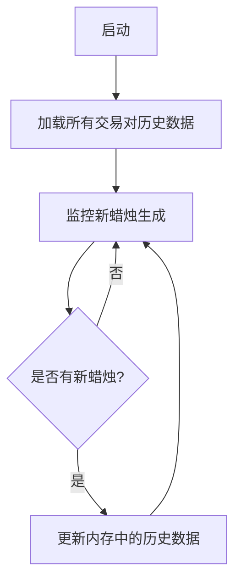

# 时间范围与数据切片

<cite>
**本文档引用文件**   
- [data_kitchen.py](file://freqtrade/freqai/data_kitchen.py)
- [data_drawer.py](file://freqtrade/freqai/data_drawer.py)
- [timerange.py](file://freqtrade/configuration/timerange.py)
- [history_utils.py](file://freqtrade/data/history/history_utils.py)
</cite>

## 目录
1. [时间范围管理机制](#时间范围管理机制)
2. [数据切片实现](#数据切片实现)
3. [训练与测试集划分](#训练与测试集划分)
4. [增量训练与数据加载](#增量训练与数据加载)
5. [历史数据管理](#历史数据管理)

## 时间范围管理机制

FreqAI框架通过`data_kitchen.py`中的`create_fulltimerange`和`split_timerange`方法实现精确的时间范围管理。`create_fulltimerange`方法根据配置的回测时间范围和训练周期天数，创建包含足够历史数据的完整时间范围。该方法首先解析用户指定的回测时间范围，然后向前扩展指定的训练周期天数，确保模型训练时有足够的历史数据。

**图示来源**
- [data_kitchen.py](file://freqtrade/freqai/data_kitchen.py#L481-L517)

`split_timerange`方法将完整时间范围划分为多个训练和回测子时间范围。该方法采用滑动窗口策略，根据用户配置的训练周期和回测周期，将时间范围分割为连续的训练-回测对。每个训练周期结束后立即进行回测，确保时间序列的连续性。

**图示来源**
- [data_kitchen.py](file://freqtrade/freqai/data_kitchen.py#L321-L378)

**本节来源**
- [data_kitchen.py](file://freqtrade/freqai/data_kitchen.py#L321-L517)

## 数据切片实现

`slice_dataframe`方法负责从完整数据集中精确提取指定时间窗口的数据。该方法接收`TimeRange`对象和完整的数据框作为输入，根据时间范围的起止时间进行数据切片。在非实时模式下，方法会同时考虑起始和结束时间；在实时模式下，则只考虑起始时间之后的数据。

**图示来源**
- [data_kitchen.py](file://freqtrade/freqai/data_kitchen.py#L380-L392)

`TimeRange`类提供了时间范围的核心功能，包括时间戳解析、日期格式转换和范围验证。该类支持多种时间格式输入，如YYYYMMDD、Unix时间戳等，并能自动处理时区转换。

**本节来源**
- [data_kitchen.py](file://freqtrade/freqai/data_kitchen.py#L380-L392)
- [timerange.py](file://freqtrade/configuration/timerange.py#L17-L177)

## 训练与测试集划分

FreqAI框架采用严格的训练集和测试集划分策略，确保模型评估的准确性。训练集和测试集的划分基于时间序列的连续性原则，避免未来数据泄露。`make_train_test_datasets`方法使用`train_test_split`函数进行数据分割，同时支持用户自定义的权重分配，使近期数据在训练中具有更高的权重。

**图示来源**
- [data_kitchen.py](file://freqtrade/freqai/data_kitchen.py#L200-L300)

数据过滤过程通过`filter_features`方法实现，该方法会移除包含NaN值的行，确保训练数据的完整性。对于预测数据，虽然会用0填充NaN值，但会通过`do_predict`标志位标记这些位置，防止模型基于不完整数据做出决策。

**本节来源**
- [data_kitchen.py](file://freqtrade/freqai/data_kitchen.py#L200-L300)

## 增量训练与数据加载

在增量训练场景下，FreqAI框架通过`check_if_new_training_required`方法判断是否需要重新训练模型。该方法基于模型的过期时间和训练周期配置，决定是否触发新的训练过程。当需要重新训练时，系统会加载比训练周期更长的历史数据，以确保指标计算的完整性。

**图示来源**
- [data_kitchen.py](file://freqtrade/freqai/data_kitchen.py#L519-L580)
- [data_drawer.py](file://freqtrade/freqai/data_drawer.py#L571-L629)

**本节来源**
- [data_kitchen.py](file://freqtrade/freqai/data_kitchen.py#L519-L580)
- [data_drawer.py](file://freqtrade/freqai/data_drawer.py#L571-L629)

## 历史数据管理

`data_drawer.py`中的`FreqaiDataDrawer`类负责历史数据的内存管理和高效访问。该类通过`load_all_pair_histories`方法一次性加载所有交易对的历史数据到内存中，避免重复从磁盘或交易所获取数据。`update_historic_data`方法则负责在每次新蜡烛生成时更新内存中的历史数据。

**图示来源**
- [data_drawer.py](file://freqtrade/freqai/data_drawer.py#L684-L704)

历史数据的存储采用分层策略，包括模型文件、元数据和预测结果。`save_data`方法将训练好的模型、特征管道和标签管道持久化到磁盘，而`save_historic_predictions_to_disk`方法则定期保存历史预测结果，确保系统重启后能恢复状态。

**本节来源**
- [data_drawer.py](file://freqtrade/freqai/data_drawer.py#L684-L704)
- [data_drawer.py](file://freqtrade/freqai/data_drawer.py#L45-L764)