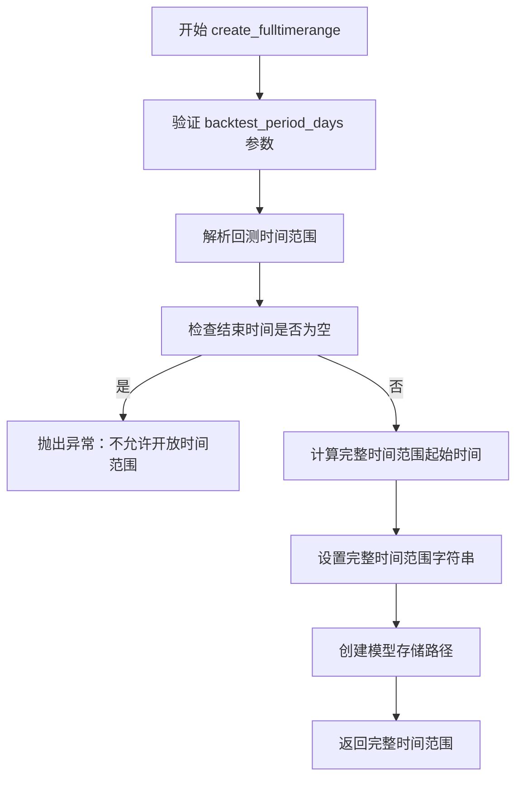
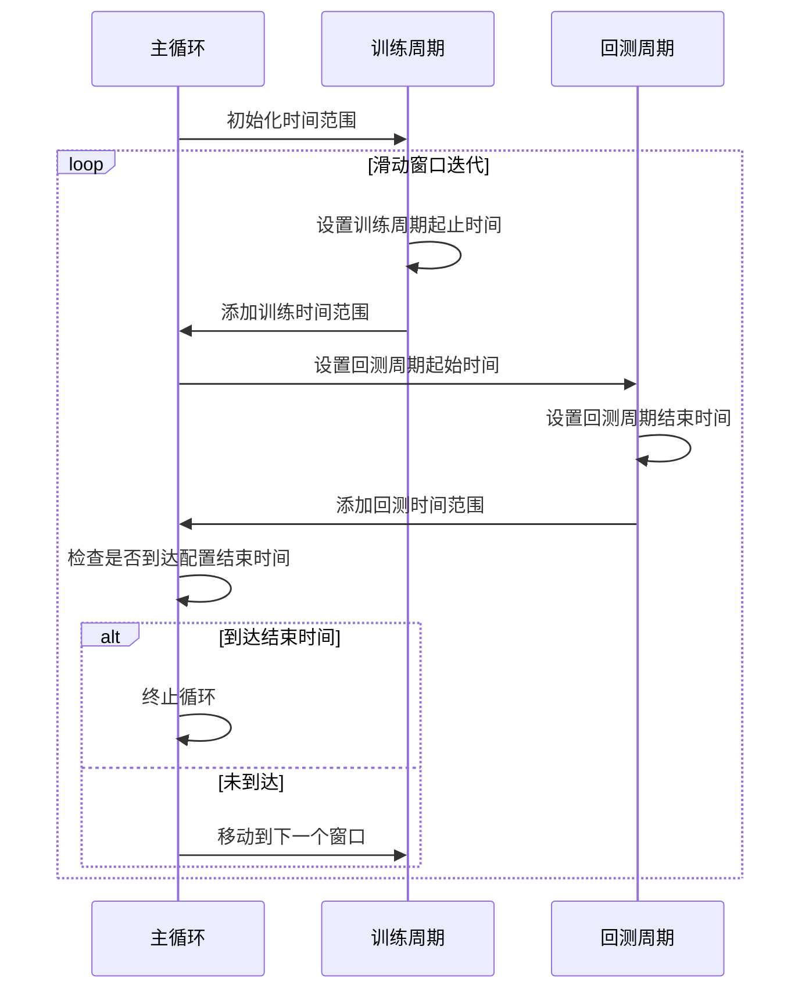
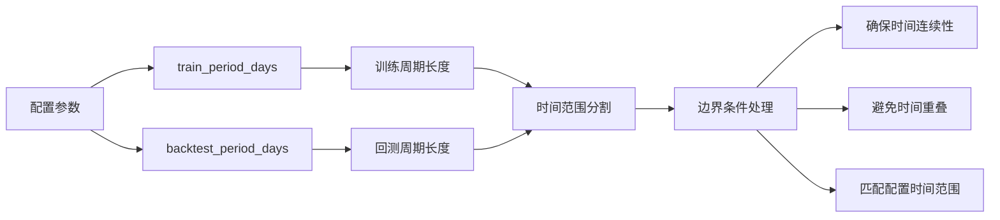

# 时间范围管理

<cite>
**本文档中引用的文件**   
- [data_kitchen.py](file://freqtrade/freqai/data_kitchen.py)
- [timerange.py](file://freqtrade/configuration/timerange.py)
</cite>

## 目录
1. [时间范围管理机制](#时间范围管理机制)
2. [完整时间范围创建](#完整时间范围创建)
3. [时间范围分割算法](#时间范围分割算法)
4. [配置与边界处理](#配置与边界处理)

## 时间范围管理机制

FreqAI框架中的时间范围管理机制通过`data_kitchen.py`文件中的`create_fulltimerange`和`split_timerange`方法实现。该机制负责在回测过程中创建和管理训练与验证所需的时间范围，确保时间序列数据的连续性和无重叠性。

**Section sources**
- [data_kitchen.py](file://freqtrade/freqai/data_kitchen.py#L481-L554)

## 完整时间范围创建

`create_fulltimerange`方法根据回测时间范围和训练周期天数计算完整的训练时间范围。该方法首先验证输入参数的有效性，确保`backtest_period_days`为正整数。

**Diagram sources**
- [data_kitchen.py](file://freqtrade/freqai/data_kitchen.py#L481-L508)

该方法将回测时间范围的起始时间向前扩展`backtest_period_days`天数，从而创建包含足够历史数据的完整训练时间范围。此扩展确保模型训练时有足够的历史数据来生成特征。同时，该方法会验证时间范围的有效性，拒绝开放结束时间的时间范围，要求用户明确指定回测的结束日期。

**Section sources**
- [data_kitchen.py](file://freqtrade/freqai/data_kitchen.py#L481-L508)
- [timerange.py](file://freqtrade/configuration/timerange.py#L155-L177)

## 时间范围分割算法

`split_timerange`方法将完整时间范围分割为多个训练-回测周期对，确保时间序列的连续性和无重叠。该方法采用滑动窗口机制，迭代生成训练和回测时间范围。

**Diagram sources**
- [data_kitchen.py](file://freqtrade/freqai/data_kitchen.py#L321-L378)

算法逻辑如下：首先初始化训练和回测的时间范围对象，然后进入循环。在每次迭代中，设置当前训练周期的起止时间，将其添加到训练时间范围列表中。接着，设置关联的回测周期，其起始时间为训练周期的结束时间，结束时间为回测周期长度加上起始时间。如果回测周期的结束时间超过配置的结束时间，则将其截断。最后，检查回测周期的结束时间是否等于配置的结束时间，如果是则终止循环，确保预测数据量与用户定义的时间范围完全一致。

**Section sources**
- [data_kitchen.py](file://freqtrade/freqai/data_kitchen.py#L321-L378)

## 配置与边界处理

训练周期和回测周期的长度通过配置文件中的`train_period_days`和`backtest_period_days`参数进行配置。`split_timerange`方法对`train_split`参数进行验证，确保其为大于0的整数。

**Diagram sources**
- [data_kitchen.py](file://freqtrade/freqai/data_kitchen.py#L335-L356)

方法处理时间范围边界条件的关键在于：确保最后一个回测周期的结束时间严格等于配置的结束时间，从而保证预测数据量的准确性。同时，通过将下一个训练周期的起始时间设置为前一个回测周期的起始时间，实现了时间序列的无缝衔接。这种方法避免了时间重叠，确保了数据的连续性和完整性，为机器学习模型提供了高质量的训练和验证数据。

**Section sources**
- [data_kitchen.py](file://freqtrade/freqai/data_kitchen.py#L335-L378)
- [config_schema.py](file://freqtrade/config_schema/config_schema.py#L1071-L1078)