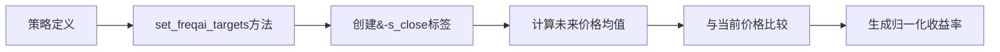
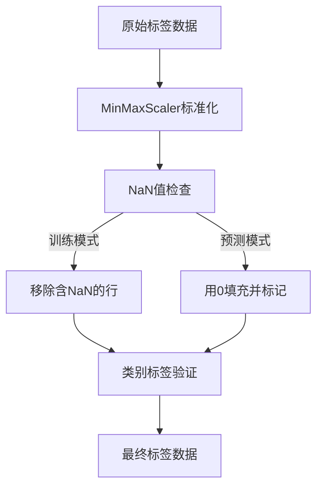

# 标签生成与管理

<cite>
**本文档引用的文件**  
- [data_kitchen.py](file://freqtrade/freqai/data_kitchen.py)
- [FreqaiExampleStrategy.py](file://freqtrade/templates/FreqaiExampleStrategy.py)
- [interface.py](file://freqtrade/strategy/interface.py)
</cite>

## 目录
1. [标签生成与管理概述](#标签生成与管理概述)
2. [DataKitchen中的标签识别](#datakitchen中的标签识别)
3. [标签命名规范与策略应用](#标签命名规范与策略应用)
4. [标签数据预处理与验证](#标签数据预处理与验证)
5. [多模型训练场景下的标签管理](#多模型训练场景下的标签管理)

## 标签生成与管理概述

FreqAI框架中的标签（Labels）是机器学习模型训练和预测的核心目标变量。标签的生成与管理流程贯穿于整个交易策略的生命周期，从数据预处理到模型训练，再到实际交易决策。标签的正确生成和有效管理对于确保模型预测的准确性和交易策略的有效性至关重要。

标签在FreqAI框架中扮演着双重角色：在训练阶段，标签作为监督学习的"答案"，指导模型学习市场行为模式；在预测阶段，标签的预测值成为交易决策的直接依据。整个流程始于策略中定义的标签，通过DataKitchen组件进行识别和提取，经过预处理和验证后用于模型训练，并在多模型场景下进行协调管理。

**Section sources**
- [data_kitchen.py](file://freqtrade/freqai/data_kitchen.py#L34-L1033)
- [FreqaiExampleStrategy.py](file://freqtrade/templates/FreqaiExampleStrategy.py#L1-L294)

## DataKitchen中的标签识别

`data_kitchen.py`文件中的`FreqaiDataKitchen`类是标签识别和提取的核心组件。该类通过`find_labels`方法实现标签的自动识别。`find_labels`方法接收一个包含所有技术指标和特征的DataFrame作为输入，通过扫描列名中包含"&"符号的列来识别标签。

该方法的实现逻辑简洁而高效：遍历DataFrame的所有列名，使用列表推导式筛选出所有包含"&"字符的列名，并将其存储在`self.label_list`实例变量中。这一设计使得标签的识别完全自动化，无需在代码中硬编码标签名称，提高了系统的灵活性和可维护性。

```mermaid
flowchart TD
A[输入DataFrame] --> B{遍历所有列名}
B --> C[检查列名是否包含"&"]
C --> |是| D[将列名添加到标签列表]
C --> |否| E[跳过该列]
D --> F[返回标签列表]
```

**Diagram sources**
- [data_kitchen.py](file://freqtrade/freqai/data_kitchen.py#L409-L412)

`find_labels`方法在`FreqaiDataKitchen`的初始化流程中被调用，通常在`populate_indicators`方法之后执行。一旦标签被识别，它们就会被用于后续的数据过滤、训练集划分和模型训练过程。标签列表的完整性和准确性直接影响到模型训练的质量，因此`find_labels`方法是整个标签管理流程中的关键环节。

**Section sources**
- [data_kitchen.py](file://freqtrade/freqai/data_kitchen.py#L409-L412)

## 标签命名规范与策略应用

在FreqAI框架中，标签的命名遵循严格的规范：所有标签列名必须以"&"符号开头。这一命名约定是框架识别标签的关键机制，确保了系统能够准确区分特征（以"%"开头）和标签。在`FreqaiExampleStrategy.py`示例策略中，这一规范得到了充分体现。

`FreqaiExampleStrategy`类通过`set_freqai_targets`方法定义和使用标签。该方法是策略与FreqAI框架交互的关键接口，负责在DataFrame中创建以"&"开头的目标变量。例如，示例策略中定义了`&-s_close`标签，该标签表示未来一段时间内价格的平均变化率，计算公式为未来价格均值与当前价格之比减1。



**Diagram sources**
- [FreqaiExampleStrategy.py](file://freqtrade/templates/FreqaiExampleStrategy.py#L173-L222)

标签在策略中的应用主要体现在交易信号的生成上。在`populate_entry_trend`和`populate_exit_trend`方法中，策略通过检查`do_predict`标志和`&-s_close`标签的预测值来决定是否开仓或平仓。例如，当`do_predict`为1且`&-s_close`大于0.01时，系统会生成做多信号。这种设计将机器学习模型的预测结果直接转化为具体的交易决策，实现了AI与交易策略的无缝集成。

**Section sources**
- [FreqaiExampleStrategy.py](file://freqtrade/templates/FreqaiExampleStrategy.py#L173-L222)

## 标签数据预处理与验证

标签数据的预处理和验证是确保模型训练质量的重要环节。FreqAI框架通过`define_label_pipeline`方法为标签数据定义了标准化的预处理流程。默认情况下，该流程包含一个MinMaxScaler步骤，将标签数据缩放到(-1, 1)区间，这有助于提高模型训练的稳定性和收敛速度。

在数据过滤阶段，`filter_features`方法会对标签数据进行严格的NaN值检查。在训练模式下，任何包含NaN值的行都会被从训练集中移除，以确保训练数据的完整性。如果所有训练数据都因NaN值被移除，系统会抛出`OperationalException`异常，提示用户可能没有下载足够的训练数据。

对于分类模型，框架还实现了标签名称的编码和验证机制。`BasePyTorchClassifier`等基类提供了`encode_class_names`和`assert_valid_class_names`方法，确保训练数据中的类别标签与预定义的类别列表完全匹配。如果发现未定义的标签，系统会抛出异常，防止模型因标签不一致而产生错误预测。



**Diagram sources**
- [freqai_interface.py](file://freqtrade/freqai/freqai_interface.py#L534-L560)
- [BasePyTorchClassifier.py](file://freqtrade/freqai/base_models/BasePyTorchClassifier.py#L112-L139)

**Section sources**
- [freqai_interface.py](file://freqtrade/freqai/freqai_interface.py#L534-L560)
- [BasePyTorchClassifier.py](file://freqtrade/freqai/base_models/BasePyTorchClassifier.py#L112-L139)

## 多模型训练场景下的标签管理

在多模型训练场景下，FreqAI框架通过统一的标签管理机制支持复杂的预测需求。用户可以在`set_freqai_targets`方法中定义多个以"&"开头的标签，每个标签代表一个独立的预测目标。例如，可以同时定义`&-s_close`用于预测价格变动和`&-s_range`用于预测价格波动范围。

对于多目标预测，框架要求使用支持多输出的模型，如`CatboostRegressorMultiTarget`。这些模型能够同时学习多个标签之间的关系，提供更全面的市场预测。在训练过程中，`make_train_test_datasets`方法会将所有标签数据作为一个整体进行划分，确保不同标签之间的时序一致性。

标签管理还涉及到模型的版本控制和缓存机制。`check_if_model_expired`方法根据配置的`expiration_hours`参数检查模型是否过期，确保交易决策基于最新的市场数据。同时，系统会为每个训练周期生成唯一的模型名称，避免不同训练任务之间的标签数据混淆。

**Section sources**
- [data_kitchen.py](file://freqtrade/freqai/data_kitchen.py#L73-L412)
- [freqai_interface.py](file://freqtrade/freqai/freqai_interface.py#L534-L560)