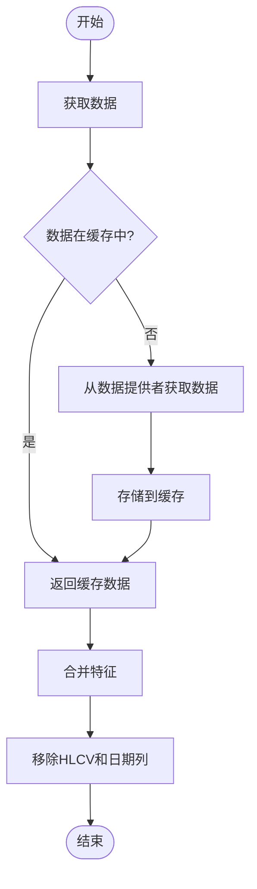
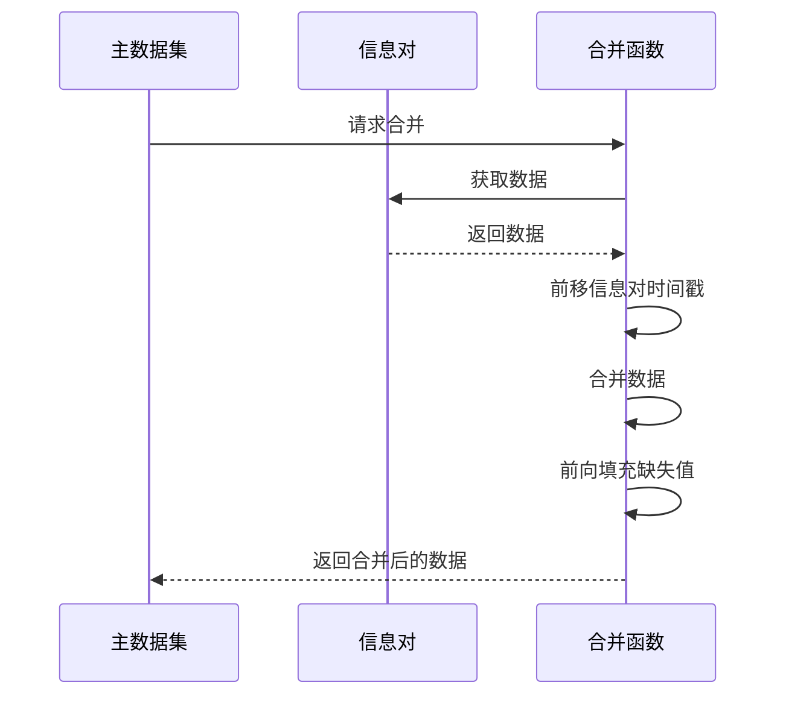

# 多时间框架特征处理

<cite>
**本文档中引用的文件**   
- [data_kitchen.py](file://freqtrade/freqai/data_kitchen.py)
- [FreqaiExampleStrategy.py](file://freqtrade/templates/FreqaiExampleStrategy.py)
- [strategy_helper.py](file://freqtrade/strategy/strategy_helper.py)
</cite>

## 目录
1. [多时间框架特征工程概述](#多时间框架特征工程概述)
2. [数据获取与特征融合机制](#数据获取与特征融合机制)
3. [信息对的使用与特征合并](#信息对的使用与特征合并)
4. [配置参数的作用与影响](#配置参数的作用与影响)
5. [数据对齐与填充处理](#数据对齐与填充处理)

## 多时间框架特征工程概述

FreqAI系统通过多时间框架（multi-timeframe）特征工程，能够从不同时间周期的K线数据中提取特征，从而构建更全面的市场分析模型。该系统允许策略从多个时间框架中获取数据，并将这些数据融合到主数据集中，以增强模型的预测能力。通过这种方式，模型可以同时考虑短期和长期的市场动态，提高交易决策的准确性。

**Section sources**
- [data_kitchen.py](file://freqtrade/freqai/data_kitchen.py#L651-L685)
- [FreqaiExampleStrategy.py](file://freqtrade/templates/FreqaiExampleStrategy.py#L0-L293)

## 数据获取与特征融合机制

FreqAI通过`get_pair_data_for_features`方法从不同时间框架获取数据。该方法首先检查所需数据是否已存在于缓存中，如果存在则直接返回；否则，通过数据提供者（data provider）获取数据。此过程确保了数据的高效利用，避免了重复的数据请求。

特征融合是通过`merge_features`方法实现的。该方法将来自不同时间框架的特征数据合并到主数据集中，并移除不需要的列（如HLCV和日期列）。合并过程中，使用`merge_informative_pair`函数进行时间序列友好的合并，确保数据对齐且无前瞻偏差。

**Diagram sources**
- [data_kitchen.py](file://freqtrade/freqai/data_kitchen.py#L687-L717)
- [strategy_helper.py](file://freqtrade/strategy/strategy_helper.py#L5-L171)

**Section sources**
- [data_kitchen.py](file://freqtrade/freqai/data_kitchen.py#L651-L717)

## 信息对的使用与特征合并

在`FreqaiExampleStrategy.py`中，策略通过定义`informative_pairs`来指定需要获取的额外信息对及其时间框架。这些信息对通常代表市场整体趋势或相关资产的价格行为，可以作为过滤条件或附加特征。例如，一个交易对的策略可能会使用比特币/USDT的1小时K线数据作为市场趋势的参考。

特征合并过程在`populate_features`方法中完成。该方法遍历所有指定的时间框架，为每个时间框架调用`get_pair_data_for_features`获取数据，然后使用`merge_features`将这些数据合并到主数据集中。合并后的数据集包含了来自多个时间框架的特征，为模型提供了更丰富的输入。

**Section sources**
- [FreqaiExampleStrategy.py](file://freqtrade/templates/FreqaiExampleStrategy.py#L0-L293)
- [data_kitchen.py](file://freqtrade/freqai/data_kitchen.py#L719-L775)

## 配置参数的作用与影响

`include_timeframes`配置参数定义了策略需要获取数据的时间框架列表。这个参数直接影响特征的数量，因为每个时间框架都会生成一组独立的特征。例如，如果`include_timeframes`包含["5m", "15m", "1h"]，那么每个指标将在三个不同的时间框架上计算，从而产生三倍的特征数量。

此外，`include_corr_pairlist`参数允许策略引入相关交易对的数据作为额外特征。这进一步增加了特征的维度，但也可能增加模型的复杂性和过拟合的风险。因此，合理选择时间框架和相关交易对对于构建有效的机器学习模型至关重要。

**Section sources**
- [data_kitchen.py](file://freqtrade/freqai/data_kitchen.py#L542-L542)
- [config_schema.py](file://freqtrade/config_schema/config_schema.py#L1161-L1161)

## 数据对齐与填充处理

在处理不同时间框架的数据时，FreqAI系统必须解决数据对齐和填充问题。由于不同时间框架的K线周期不同，直接合并可能导致数据错位或前瞻偏差。为了解决这个问题，`merge_informative_pair`函数在合并数据时会向前移动信息对的时间戳，确保信息对的K线在主数据集的K线开始前已经关闭。

此外，`merge_informative_pair`函数支持前向填充（forward fill）选项，用于处理合并后可能出现的缺失值。前向填充可以确保数据的连续性，但需要谨慎使用，以避免引入不必要的噪声或偏差。

**Diagram sources**
- [strategy_helper.py](file://freqtrade/strategy/strategy_helper.py#L5-L171)

**Section sources**
- [strategy_helper.py](file://freqtrade/strategy/strategy_helper.py#L5-L171)
- [data_kitchen.py](file://freqtrade/freqai/data_kitchen.py#L687-L717)