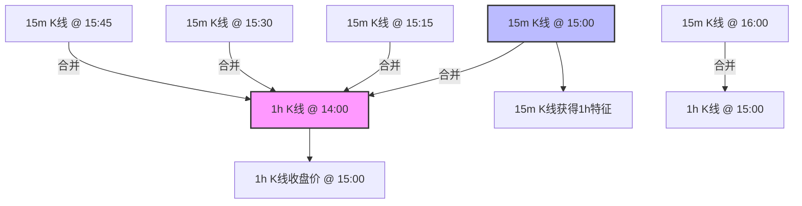
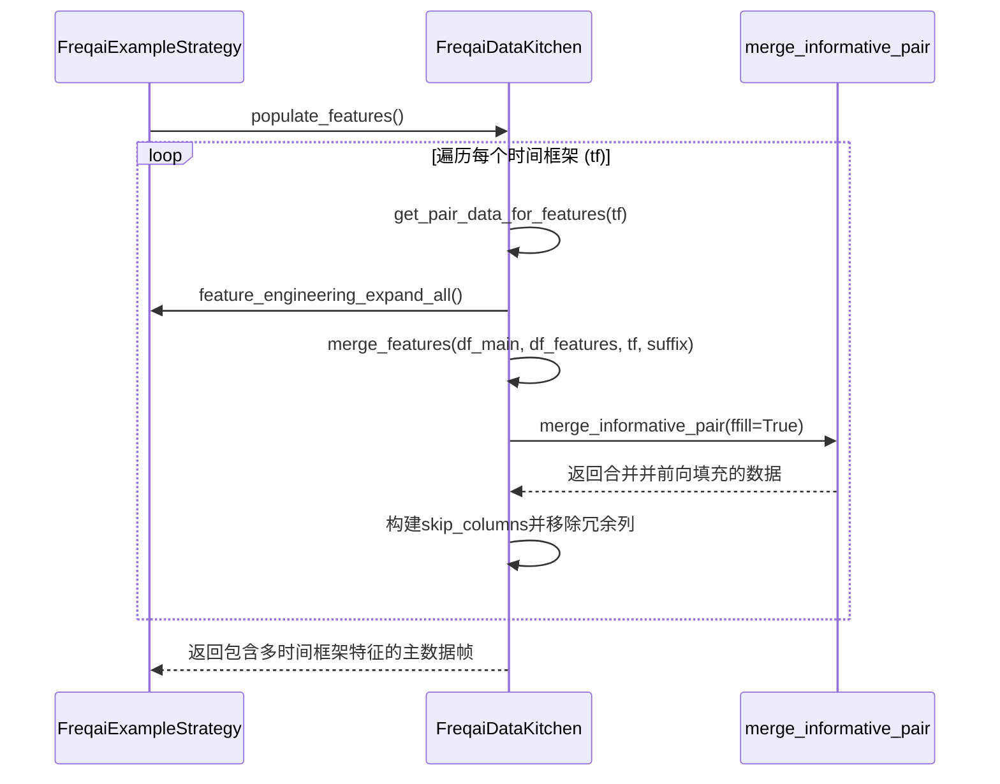

# 多时间框架特征融合

<cite>
**本文档引用的文件**  
- [data_kitchen.py](file://freqtrade/freqai/data_kitchen.py#L687-L717)
- [strategy_helper.py](file://freqtrade/strategy/strategy_helper.py#L5-L100)
- [FreqaiExampleStrategy.py](file://freqtrade/templates/FreqaiExampleStrategy.py#L46-L101)
</cite>

## 目录
1. [多时间框架特征融合概述](#多时间框架特征融合概述)
2. [merge_features方法详解](#merge_features方法详解)
3. [merge_informative_pair函数的时间对齐机制](#merge_informative_pair函数的时间对齐机制)
4. [列名冲突避免与suffix机制](#列名冲突避免与suffix机制)
5. [skip_columns列表的构建逻辑](#skip_columns列表的构建逻辑)
6. [FreqaiExampleStrategy中的调用流程](#freqaiexamplestrategy中的调用流程)

## 多时间框架特征融合概述

在FreqAI框架中，多时间框架特征融合是特征工程的核心环节。该过程通过`merge_features`方法将不同时间框架（timeframe）的特征数据合并到主数据帧中，从而为机器学习模型提供更丰富的输入信息。此机制允许策略从多个时间维度提取技术指标和市场信号，显著提升模型的预测能力。特征融合过程严格遵循时间对齐原则，避免了前瞻偏差（lookahead bias），并采用智能的列名管理策略，确保最终特征集的纯净性和一致性。

**Section sources**
- [data_kitchen.py](file://freqtrade/freqai/data_kitchen.py#L687-L717)

## merge_features方法详解

`merge_features`方法是实现多时间框架特征融合的核心函数。该方法接收主数据帧（`df_main`）和待合并的数据帧（`df_to_merge`），以及相关的时间框架和后缀参数，执行合并操作并清理冗余列。

该方法的执行流程如下：
1.  **调用`merge_informative_pair`进行合并**：首先，它调用`strategy_helper`模块中的`merge_informative_pair`函数，将`df_to_merge`中的数据合并到`df_main`中。此步骤是时间对齐的关键，确保了数据的正确性。
2.  **构建`skip_columns`列表**：创建一个需要被移除的列名列表，主要包括从`df_to_merge`中继承的HLCV（高价、低价、收盘价、成交量）和日期列。
3.  **移除冗余列**：使用Pandas的`drop`方法，根据`skip_columns`列表从合并后的数据帧中删除所有指定的冗余列。
4.  **返回纯净数据帧**：最终返回一个只包含主数据帧原始列和新合并特征列的、经过清理的纯净数据帧。

此方法的设计确保了在引入多时间框架特征的同时，不会引入与主数据帧重复的原始价格数据，从而保持了特征集的独立性和有效性。

**Section sources**
- [data_kitchen.py](file://freqtrade/freqai/data_kitchen.py#L687-L717)

## merge_informative_pair函数的时间对齐机制

`merge_informative_pair`函数是实现时间对齐和避免前瞻偏差的核心工具。其核心参数`ffill=True`在合并过程中起着至关重要的作用。

时间对齐的原理如下：
- **问题**：如果直接将一个1小时（1h）时间框架的K线与一个15分钟（15m）时间框架的K线按相同时间戳合并，会导致15m的K线“提前知道”1h K线的收盘价，从而产生前瞻偏差。
- **解决方案**：`merge_informative_pair`函数通过将信息性K线（informative pair）的日期向前移动一个时间间隔来解决此问题。例如，一个在14:00开始的1h K线，其收盘价代表15:00的价格。该函数会将此K线的日期标记为15:00，然后与15m K线在15:00的数据进行合并。这样，15m K线在15:00时，只能“看到”上一个1h周期（14:00-15:00）的完整信息，而无法预知未来。

`ffill=True`参数的作用是**前向填充（forward fill）**缺失值。由于不同时间框架的K线数量不同，合并后会产生大量空值。`ffill=True`确保了在合并过程中，使用`merge_ordered`方法以“ffill”方式填充，使得每个15m K线都能继承最近一个已完成的1h K线的所有特征值，从而保证了数据的连续性和完整性。

**Diagram sources**
- [strategy_helper.py](file://freqtrade/strategy/strategy_helper.py#L5-L100)

## 列名冲突避免与suffix机制

为了避免在合并多个不同时间框架或相关交易对的数据时发生列名冲突，系统采用了`suffix`（后缀）机制。

- **参数作用**：`suffix`参数是一个字符串，它会被附加到`df_to_merge`中所有列名的末尾。
- **工作原理**：当`merge_features`方法调用`merge_informative_pair`时，会将`suffix`参数传递给后者。`merge_informative_pair`函数会将`df_to_merge`的所有列（如`open`, `high`, `low`, `close`, `rsi`等）重命名为`open_suffix`, `high_suffix`, `low_suffix`, `close_suffix`, `rsi_suffix`等。
- **避免冲突**：通过为每个合并来源指定唯一的后缀（例如，`BTC/USDT_1h`或`ETH/USDT_4h`），可以确保即使不同数据源有相同名称的指标（如`rsi`），它们在合并后的数据帧中也会有唯一的列名（如`rsi_BTC/USDT_1h`和`rsi_ETH/USDT_4h`），从而彻底避免了命名冲突。

这种机制使得系统能够灵活地从任意数量的交易对和时间框架中提取特征，并将它们安全地整合到一个统一的数据结构中。

**Section sources**
- [data_kitchen.py](file://freqtrade/freqai/data_kitchen.py#L687-L717)
- [strategy_helper.py](file://freqtrade/strategy/strategy_helper.py#L5-L100)

## skip_columns列表的构建逻辑

`skip_columns`列表的构建是确保特征集纯净性的关键步骤。其目标是自动识别并移除在合并过程中产生的冗余HLCV和日期列。

构建逻辑如下：
1.  **基础冗余列生成**：首先，通过列表推导式，为`["date", "open", "high", "low", "close", "volume"]`中的每一个基础列名，生成一个带有`suffix`后缀的列名。例如，如果`suffix`为`"BTC/USDT_1h"`，则会生成`"date_BTC/USDT_1h"`, `"open_BTC/USDT_1h"`等。
2.  **扩展冗余列**：系统会检查一个名为`ORDERFLOW_ADDED_COLUMNS`的全局常量列表。如果`ORDERFLOW_ADDED_COLUMNS`中的某个列（如`"buy_volume"`）同时存在于合并后的数据帧和带有`suffix`后缀的版本中，则将该带后缀的列也添加到`skip_columns`列表中。这确保了所有与价格数据相关的衍生列也被正确移除。
3.  **执行移除**：最后，`dataframe = dataframe.drop(columns=skip_columns)`这一行代码会一次性将`skip_columns`列表中的所有列从数据帧中删除。

通过这一机制，最终的数据帧中只保留了主数据帧的原始HLCV数据和从其他时间框架合并而来的、经过重命名的特征列（如`"%-rsi-period_BTC/USDT_1h"`），实现了特征集的“纯净化”。

**Section sources**
- [data_kitchen.py](file://freqtrade/freqai/data_kitchen.py#L687-L717)

## FreqaiExampleStrategy中的调用流程

在`FreqaiExampleStrategy`示例策略中，特征融合过程是特征工程流水线的一部分，其调用流程清晰地展示了该功能在整个系统中的位置和作用。

1.  **特征定义**：策略通过`feature_engineering_expand_all`和`feature_engineering_expand_basic`等方法定义特征。这些方法生成的特征列名均以`%`开头，以便被FreqAI系统识别。
2.  **特征填充**：在`FreqaiDataKitchen`的`populate_features`方法中，系统会遍历所有配置的时间框架（`include_timeframes`）。
3.  **调用`merge_features`**：对于每一个时间框架，系统会：
    - 从数据提供器（`dp`）获取该时间框架下的数据。
    - 在该时间框架的数据上应用`feature_engineering_expand_all`等方法，生成该时间框架的特征。
    - 调用`merge_features`方法，将这个带有特征的、特定时间框架的数据帧合并到主数据帧中。此时，`suffix`参数被设置为`f"{pair}_{tf}"`（例如`"BTC/USDT_1h"`），以确保列名唯一。
4.  **最终输出**：经过所有时间框架的特征合并后，主数据帧包含了来自多个时间维度的丰富特征，这些特征随后被用于模型训练和预测。

此流程表明，`merge_features`方法是连接策略定义的特征计算与最终模型输入之间的桥梁，是实现多时间框架分析不可或缺的一环。

**Diagram sources**
- [data_kitchen.py](file://freqtrade/freqai/data_kitchen.py#L719-L775)
- [FreqaiExampleStrategy.py](file://freqtrade/templates/FreqaiExampleStrategy.py#L46-L101)