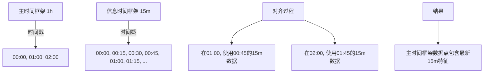

# 多时间框架配置与对齐

<cite>
**本文档引用的文件**   
- [FreqaiExampleStrategy.py](file://freqtrade/templates/FreqaiExampleStrategy.py)
- [config_validation.py](file://freqtrade/configuration/config_validation.py)
- [data_kitchen.py](file://freqtrade/freqai/data_kitchen.py)
- [freqai_interface.py](file://freqtrade/freqai/freqai_interface.py)
</cite>

## 目录
1. [引言](#引言)
2. [include_timeframes配置参数的核心作用](#include_timeframes配置参数的核心作用)
3. [多时间框架数据的时间戳对齐机制](#多时间框架数据的时间戳对齐机制)
4. [数据泄露风险及缓解措施](#数据泄露风险及缓解措施)
5. [策略配置与使用示例](#策略配置与使用示例)
6. [结论](#结论)

## 引言
在Freqtrade的FreqAI模块中，多时间框架（Multi-Timeframe）特征处理是构建高性能量化交易策略的核心技术之一。通过在不同时间框架上计算技术指标，策略可以获得更丰富的市场信息，从而做出更精准的交易决策。然而，这种多时间框架的处理方式也带来了复杂的配置要求和潜在的数据处理风险。本文档将深入分析`include_timeframes`配置参数的作用、系统如何处理不同时间框架数据的时间戳对齐问题、潜在的数据泄露风险以及如何在策略中正确配置和使用多时间框架。

## include_timeframes配置参数的核心作用

`include_timeframes`是FreqAI模块中`feature_parameters`配置项下的一个关键参数，它决定了特征工程的广度和计算复杂度。该参数是一个字符串列表，用于指定在特征工程中需要使用的额外时间框架。

当策略在`feature_engineering_expand_all`或`feature_engineering_expand_basic`等方法中定义一个特征时，FreqAI系统会自动将该特征扩展到`include_timeframes`列表中的每一个时间框架上。例如，如果用户定义了一个RSI指标，并且`include_timeframes`包含`["15m", "1h"]`，那么系统将自动生成`%-rsi-period_15m`和`%-rsi-period_1h`等多个特征。

这种自动扩展机制极大地简化了特征工程的代码编写，但同时也显著增加了特征的数量和模型的计算复杂度。特征的总数是`indicator_periods_candles`（指标周期数） * `include_timeframes`（时间框架数） * `include_shifted_candles`（偏移蜡烛数） * `include_corr_pairs`（相关交易对数）的乘积。因此，`include_timeframes`的配置直接决定了特征空间的维度，进而影响模型的训练时间和预测性能。

此外，系统在配置验证阶段会强制执行两个重要规则：首先，主时间框架（即策略的`timeframe`）必须小于或等于`include_timeframes`中的任何时间框架，以防止使用未来数据；其次，主时间框架必须被包含在`include_timeframes`列表中，以确保基础特征的完整性。

**Section sources**
- [config_validation.py](file://freqtrade/configuration/config_validation.py#L333-L361)
- [data_kitchen.py](file://freqtrade/freqai/data_kitchen.py#L469-L489)

## 多时间框架数据的时间戳对齐机制

在多时间框架特征处理中，一个核心挑战是如何将不同时间框架的数据对齐到主时间框架上。Freqtrade系统通过`merge_informative_pair`函数来实现这一过程，其核心策略是将高频数据向低频数据对齐。

具体来说，系统会从数据提供者（DataProvider）获取指定时间框架（informative timeframe）的K线数据，然后将其与主时间框架（main timeframe）的K线数据进行合并。由于主时间框架的K线周期更长，其时间戳数量更少，因此需要将高频数据“降采样”以匹配低频数据的时间戳。

系统采用前向填充（ffill）策略来处理这种对齐。前向填充意味着使用高频数据中最近的有效值来填充低频数据的时间戳。例如，如果主时间框架是1小时，而信息时间框架是15分钟，那么在每个1小时的边界上，系统会使用该小时内最后一个15分钟K线的数据来填充。这种方法确保了在主时间框架的每个时间点上，都有来自更细粒度时间框架的最新信息。

这种对齐机制在`data_kitchen.py`的`merge_features`方法中实现，该方法调用`merge_informative_pair`并设置`ffill=True`参数。这保证了在特征工程过程中，所有不同时间框架的特征都能被正确地映射到主时间框架的每一个数据点上。



**Diagram sources **
- [data_kitchen.py](file://freqtrade/freqai/data_kitchen.py#L458-L467)

**Section sources**
- [data_kitchen.py](file://freqtrade/freqai/data_kitchen.py#L458-L467)

## 数据泄露风险及缓解措施

尽管前向填充（ffill）策略在技术上是合理的，但它也引入了潜在的数据泄露（Data Leakage）风险。数据泄露是指在模型训练或预测过程中，使用了在实际交易时无法获得的信息，从而导致回测结果过于乐观，无法在实盘中复现。

在这种多时间框架对齐的场景下，风险主要来自于“时间点对齐”的精确性。例如，一个1小时的K线在01:00:00结束，而一个15分钟的K线在00:45:00到01:00:00之间。当系统在01:00:00这个时间点使用00:45:00到01:00:00这个15分钟K线的数据时，它实际上是在使用刚刚闭合的K线信息。在理想情况下，这个K线的完整数据（包括收盘价）在01:00:00这一刻才完全确定。如果策略在01:00:00立即执行交易，那么它就“知道”了这个15分钟K线的最终收盘价，这在实盘中是不可能的，因为数据传输和处理需要时间。

系统通过以下方式来缓解这种风险：
1.  **配置验证**：系统强制要求主时间框架必须小于或等于`include_timeframes`中的任何时间框架，这从根本上防止了使用更细粒度的未来数据。
2.  **数据处理延迟**：在实盘运行中，数据提供者（DataProvider）获取数据存在固有的网络延迟和处理延迟，这在一定程度上模拟了真实世界的数据获取过程，减少了数据泄露的可能性。
3.  **谨慎的策略设计**：用户应避免设计对时间点极度敏感的策略，例如在K线闭合的瞬间立即执行交易。更稳健的策略会考虑一定的延迟或使用更保守的信号。

**Section sources**
- [config_validation.py](file://freqtrade/configuration/config_validation.py#L333-L361)

## 策略配置与使用示例

用户在策略中配置和使用多时间框架时，需要遵循特定的模式以避免常见陷阱。以下以`FreqaiExampleStrategy.py`为例进行说明。

首先，在策略的配置部分，用户需要在`freqai`的`feature_parameters`中明确指定`include_timeframes`。例如：
```python
freqai_info = {
    "feature_parameters": {
        "include_timeframes": ["15m", "1h"],
        "label_period_candles": 10,
        # ... 其他参数
    },
    # ... 其他配置
}
```
这表示系统将为每个特征生成15分钟和1小时两个时间框架的版本。

其次，在`feature_engineering_expand_all`或`feature_engineering_expand_basic`方法中，用户定义特征时，只需编写一次代码。系统会自动根据`include_timeframes`进行扩展。例如，定义`%-rsi-period`后，系统会自动生成`%-rsi-period_15m`和`%-rsi-period_1h`。

最后，用户必须确保策略的主时间框架（`timeframe`）是`include_timeframes`中最小的。例如，如果主时间框架是5分钟，那么`include_timeframes`可以包含`["15m", "1h"]`，但不能包含`["1m"]`，因为1分钟时间框架比5分钟更细，这会导致配置验证失败。

常见的陷阱包括：
- **忽略主时间框架的包含**：系统会自动将主时间框架添加到`include_timeframes`列表中，但用户应明确知晓这一点。
- **过度扩展特征**：过多的时间框架和周期组合会导致特征数量爆炸式增长，增加过拟合风险和计算负担。
- **在`feature_engineering_standard`中定义时间框架相关特征**：此方法不会自动扩展，因此在此方法中定义的特征不会在`include_timeframes`上复制。

**Section sources**
- [FreqaiExampleStrategy.py](file://freqtrade/templates/FreqaiExampleStrategy.py#L46-L139)

## 结论
`include_timeframes`配置参数是FreqAI模块中控制多时间框架特征工程的核心。它通过自动扩展机制极大地提升了特征工程的效率，但也显著增加了计算复杂度。系统通过前向填充策略将高频数据对齐到低频主时间框架，这一过程虽然高效，但存在潜在的数据泄露风险。用户在配置策略时，必须严格遵守主时间框架最小的规则，并谨慎设计策略逻辑，以避免在回测中获得不切实际的优异表现。通过正确理解和使用这些机制，用户可以构建出既强大又稳健的多时间框架交易策略。