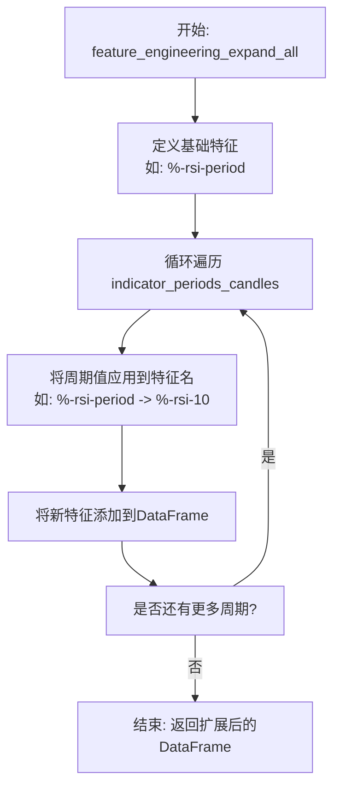
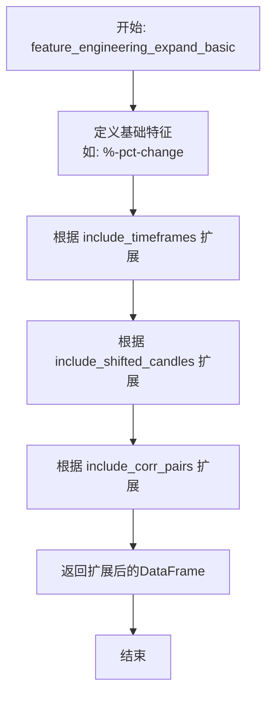
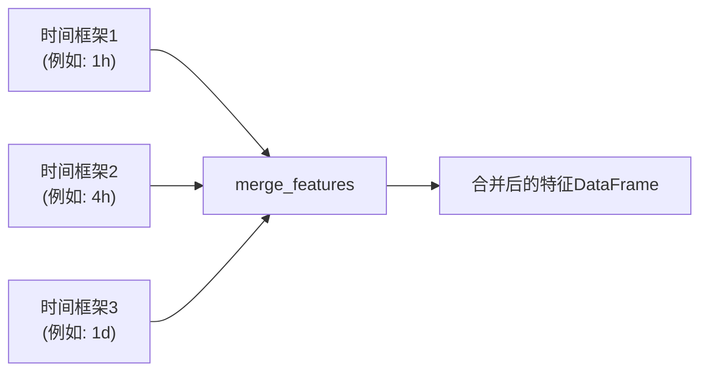
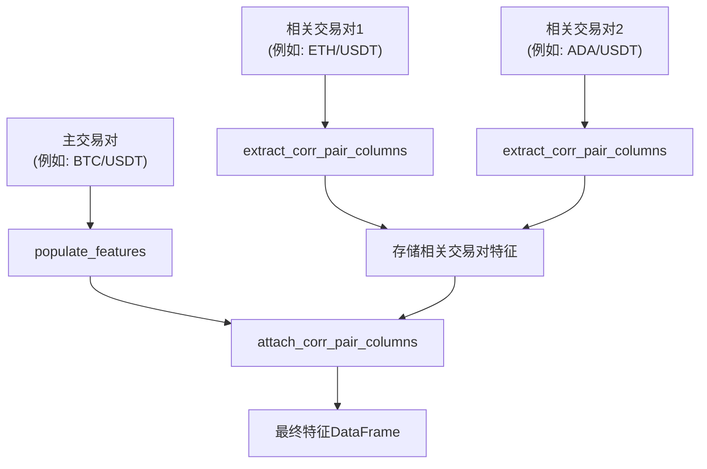
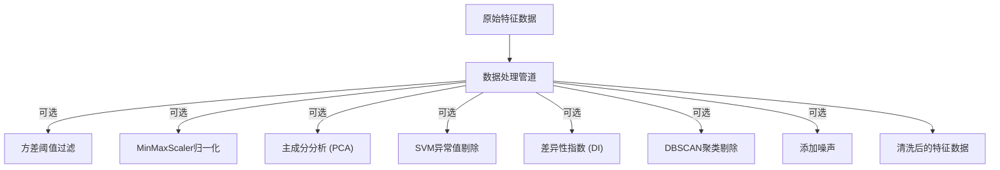

# 特征工程实现

<cite>
**本文档中引用的文件**   
- [data_kitchen.py](file://freqtrade/freqai/data_kitchen.py)
- [FreqaiExampleStrategy.py](file://freqtrade/templates/FreqaiExampleStrategy.py)
</cite>

## 目录
1. [引言](#引言)
2. [特征工程核心机制](#特征工程核心机制)
3. [特征生成策略方法](#特征生成策略方法)
4. [多时间框架与相关交易对特征处理](#多时间框架与相关交易对特征处理)
5. [数据预处理与异常值处理](#数据预处理与异常值处理)
6. [内存优化与性能策略](#内存优化与性能策略)

## 引言
FreqAI框架通过其`FreqaiDataKitchen`类实现了复杂的特征工程流程，旨在为机器学习模型提供高质量的输入数据。该系统通过策略类中的特定方法（如`feature_engineering_expand_all`和`feature_engineering_expand_basic`）自动生成特征，并结合多时间框架、特征移位和相关交易对数据来增强模型的预测能力。本文件深入解析这些机制的实现细节。

**Section sources**
- [data_kitchen.py](file://freqtrade/freqai/data_kitchen.py#L60-L108)
- [FreqaiExampleStrategy.py](file://freqtrade/templates/FreqaiExampleStrategy.py#L46-L139)

## 特征工程核心机制
`FreqaiDataKitchen`类是特征工程的核心，负责管理单个交易对的数据分析。它在每次模型推理或训练时被重新实例化，确保数据的独立性和一致性。该类通过`find_features`方法识别以`%`开头的列作为特征，这是FreqAI内部识别特征的关键命名规范。

**Section sources**
- [data_kitchen.py](file://freqtrade/freqai/data_kitchen.py#L394-L407)
- [data_kitchen.py](file://freqtrade/freqai/data_kitchen.py#L74-L74)

## 特征生成策略方法
特征生成主要依赖于策略类中定义的两个核心方法：`feature_engineering_expand_all`和`feature_engineering_expand_basic`。这些方法根据配置文件中的参数（如`indicator_periods_candles`、`include_timeframes`、`include_shifted_candles`和`include_corr_pairs`）自动扩展特征。

### feature_engineering_expand_all 方法
此方法定义的特征会根据`indicator_periods_candles`参数自动扩展。例如，在`FreqaiExampleStrategy`中，一个`%-rsi-period`特征会根据不同的周期（如10, 20, 30）生成多个具体特征。

**Diagram sources**
- [FreqaiExampleStrategy.py](file://freqtrade/templates/FreqaiExampleStrategy.py#L46-L101)

### feature_engineering_expand_basic 方法
此方法定义的特征不会根据`indicator_periods_candles`进行扩展，但会根据`include_timeframes`、`include_shifted_candles`和`include_corr_pairs`进行扩展。它通常用于定义不依赖于特定周期的基础特征，如价格变化率（pct-change）。

**Diagram sources**
- [FreqaiExampleStrategy.py](file://freqtrade/templates/FreqaiExampleStrategy.py#L103-L139)

## 多时间框架与相关交易对特征处理
特征工程的一个关键方面是处理多时间框架和相关交易对（corr_pairlist）的数据。`populate_features`方法负责协调这一过程。

### 多时间框架特征合并
系统通过`get_pair_data_for_features`获取不同时间框架的数据，并使用`merge_features`方法将其合并。合并过程中，HLCV（最高价、最低价、收盘价、成交量）和日期列会被移除，只保留生成的特征。

**Diagram sources**
- [data_kitchen.py](file://freqtrade/freqai/data_kitchen.py#L719-L775)

### 特征移位（Shifted Candles）处理
为了捕捉时间序列的动态变化，系统会生成移位特征。`populate_features`方法中的循环会将特征列向前移动n个周期，并添加`_shift-n`的后缀，从而创建滞后特征。

### 相关交易对特征提取与合并
对于配置在`include_corr_pairlist`中的交易对，系统会先通过`extract_corr_pair_columns_from_populated_indicators`提取其特征，然后在处理主交易对时，通过`attach_corr_pair_columns`将这些特征合并进来，以提供更全面的市场视角。

**Diagram sources**
- [data_kitchen.py](file://freqtrade/freqai/data_kitchen.py#L603-L627)
- [data_kitchen.py](file://freqtrade/freqai/data_kitchen.py#L629-L649)

## 数据预处理与异常值处理
在特征生成后，系统会进行严格的数据预处理以确保数据质量。

### NaN和无穷大值处理
`filter_features`方法会将`inf`和`-inf`替换为`NaN`，并在训练数据中移除任何包含`NaN`的行。在预测数据中，`NaN`会被填充为0，但系统会通过`do_predict`数组标记这些不可靠的预测点。

### 异常值处理
在`IFreqaiModel`的`define_data_pipeline`方法中，可以配置多种异常值处理技术，如使用SVM或DBSCAN来移除异常值，或使用主成分分析（PCA）进行降维。

**Diagram sources**
- [freqai_interface.py](file://freqtrade/freqai/freqai_interface.py#L534-L560)

## 内存优化与性能策略
为了优化内存使用和性能，系统实现了多种策略。

### 内存占用优化
当配置`reduce_df_footprint`为`True`时，系统会调用`reduce_dataframe_footprint`函数，将DataFrame中的所有数值转换为`float32`或`int32`，从而显著减少内存占用。

### 特征命名规范
所有特征必须以`%`开头，所有标签必须以`&`开头。这种命名规范是FreqAI内部识别特征和标签的基础。在`remove_special_chars_from_feature_names`方法中，还会移除特征名中的特殊字符（如冒号），以确保与某些机器学习库（如LightGBM）的兼容性。

**Section sources**
- [data_kitchen.py](file://freqtrade/freqai/data_kitchen.py#L967-L978)
- [converter.py](file://freqtrade/data/converter/converter.py#L250-L285)