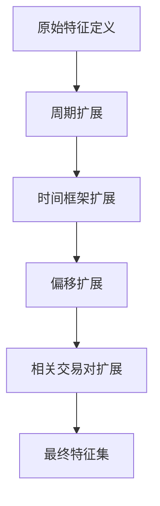
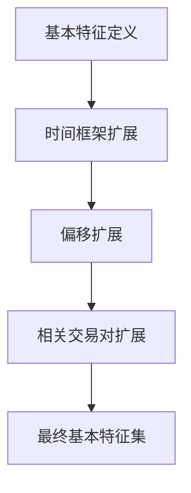
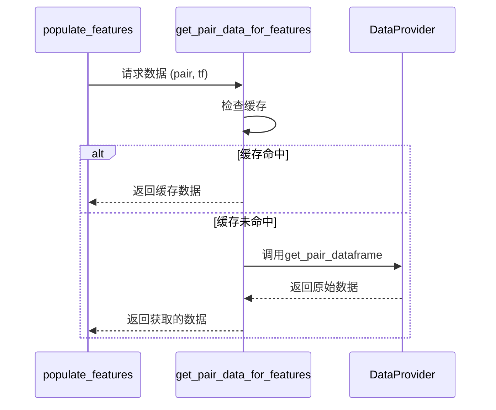
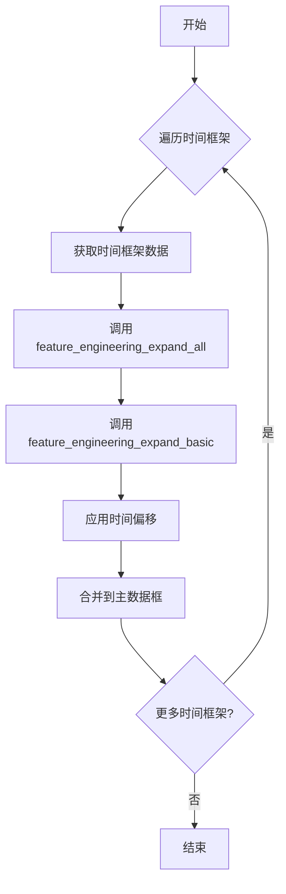
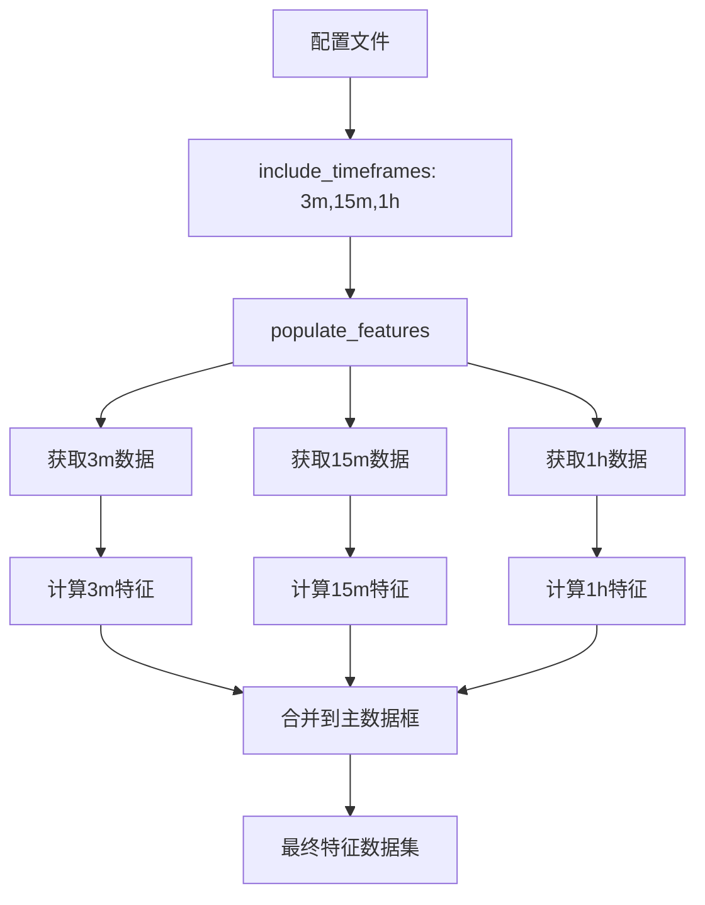

# 多时间框架处理

<cite>
**本文档中引用的文件**   
- [data_kitchen.py](file://freqtrade/freqai/data_kitchen.py)
- [FreqaiExampleStrategy.py](file://freqtrade/templates/FreqaiExampleStrategy.py)
- [config_freqai.example.json](file://config_examples/config_freqai.example.json)
</cite>

## 目录
1. [简介](#简介)
2. [多时间框架配置](#多时间框架配置)
3. [特征工程扩展方法](#特征工程扩展方法)
4. [数据获取与特征填充](#数据获取与特征填充)
5. [特征合并机制](#特征合并机制)
6. [数据流完整示例](#数据流完整示例)

## 简介
FreqAI框架支持多时间框架特征工程，允许策略在不同时间框架上计算技术指标并将其合并到主时间框架中。这种跨时间框架的特征处理机制通过配置文件中的`include_timeframes`参数实现，系统会自动扩展和合并不同时间框架的特征数据。本文档深入解析这一处理机制，重点分析`data_kitchen.py`中的`populate_features`方法和`FreqaiExampleStrategy.py`中的`feature_engineering_expand_all`与`feature_engineering_expand_basic`方法。

**Section sources**
- [data_kitchen.py](file://freqtrade/freqai/data_kitchen.py#L719-L775)
- [FreqaiExampleStrategy.py](file://freqtrade/templates/FreqaiExampleStrategy.py#L46-L139)

## 多时间框架配置
在FreqAI配置文件中，`include_timeframes`参数定义了用于特征工程的多个时间框架。这些时间框架的数据将被获取并用于计算技术指标，然后与主时间框架的数据合并。配置示例中包含了3分钟、15分钟和1小时三个时间框架。

```json
{
    "freqai": {
        "feature_parameters": {
            "include_timeframes": [
                "3m",
                "15m",
                "1h"
            ]
        }
    }
}
```

**Diagram sources**
- [config_freqai.example.json](file://config_examples/config_freqai.example.json#L60-L63)

## 特征工程扩展方法
FreqAI框架提供了两种主要的特征工程扩展方法：`feature_engineering_expand_all`和`feature_engineering_expand_basic`。这些方法在策略类中定义，并由FreqAI系统自动调用以生成多时间框架特征。

### feature_engineering_expand_all方法
此方法定义的特征会自动在`indicator_periods_candles`、`include_timeframes`、`include_shifted_candles`和`include_corr_pairs`等配置参数定义的所有组合上扩展。这意味着单个特征定义会生成大量的衍生特征。



**Diagram sources**
- [FreqaiExampleStrategy.py](file://freqtrade/templates/FreqaiExampleStrategy.py#L46-L101)

### feature_engineering_expand_basic方法
此方法定义的特征不会在`indicator_periods_candles`上自动复制，但会在`include_timeframes`、`include_shifted_candles`和`include_corr_pairs`上扩展。这适用于不需要周期变化的基本特征。



**Diagram sources**
- [FreqaiExampleStrategy.py](file://freqtrade/templates/FreqaiExampleStrategy.py#L103-L139)

## 数据获取与特征填充
`populate_features`方法是多时间框架特征处理的核心，负责协调不同时间框架数据的获取、特征计算和填充。

### 数据获取机制
`get_pair_data_for_features`方法负责获取指定交易对和时间框架的数据。它首先检查缓存中是否存在数据，如果不存在则从数据提供者获取。



**Diagram sources**
- [data_kitchen.py](file://freqtrade/freqai/data_kitchen.py#L651-L685)

### 特征填充流程
`populate_features`方法的执行流程包括：遍历所有配置的时间框架，获取相应数据，调用特征工程方法计算特征，然后将特征合并到主数据框中。



**Diagram sources**
- [data_kitchen.py](file://freqtrade/freqai/data_kitchen.py#L719-L775)

## 特征合并机制
`merge_features`方法负责将不同时间框架的特征数据有效整合到主数据框中，同时移除不需要的列。

### 合并过程
该方法使用`merge_informative_pair`函数将不同时间框架的数据合并，并移除HLCV（最高价、最低价、收盘价、成交量）和日期等重复列，只保留计算出的特征。

```python
def merge_features(
    self, df_main: DataFrame, df_to_merge: DataFrame, 
    tf: str, timeframe_inf: str, suffix: str
) -> DataFrame:
    dataframe = merge_informative_pair(
        df_main, df_to_merge, tf, timeframe_inf=timeframe_inf, 
        append_timeframe=False, suffix=suffix, ffill=True
    )
    skip_columns = [
        (f"{s}_{suffix}") for s in ["date", "open", "high", "low", "close", "volume"]
    ]
    # ... 移除其他不需要的列
    dataframe = dataframe.drop(columns=skip_columns)
    return dataframe
```

**Section sources**
- [data_kitchen.py](file://freqtrade/freqai/data_kitchen.py#L687-L717)

## 数据流完整示例
以下是多时间框架特征工程的完整数据流示例，展示了从配置到最终特征合并的全过程。



**Diagram sources**
- [data_kitchen.py](file://freqtrade/freqai/data_kitchen.py#L719-L775)
- [config_freqai.example.json](file://config_examples/config_freqai.example.json#L60-L63)