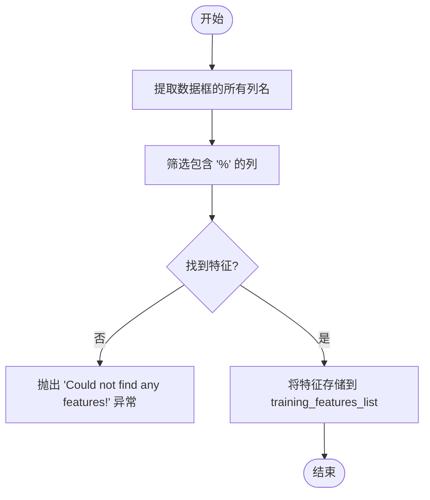
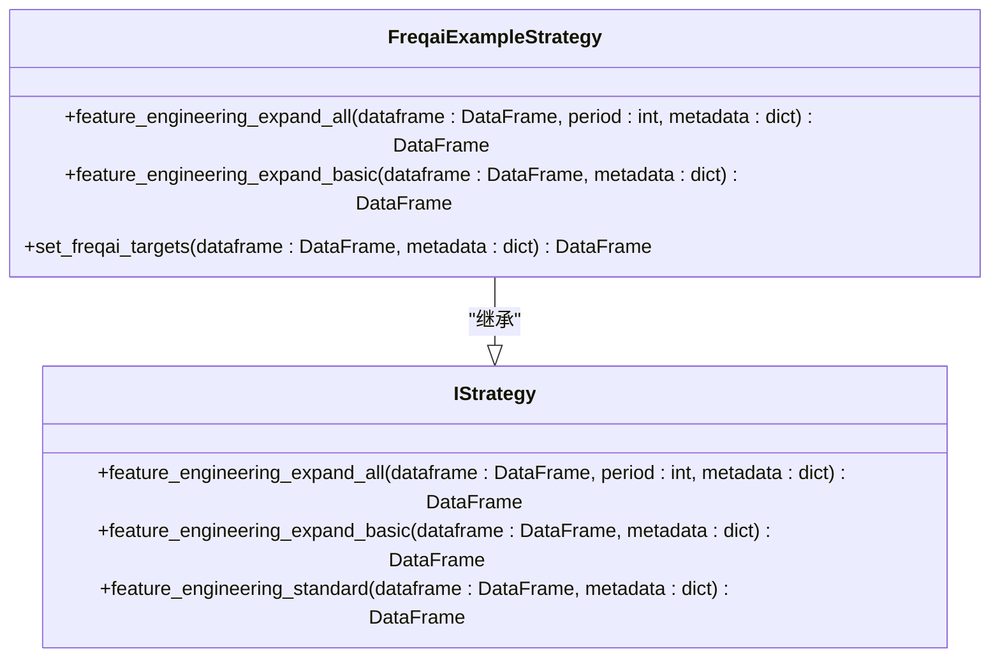
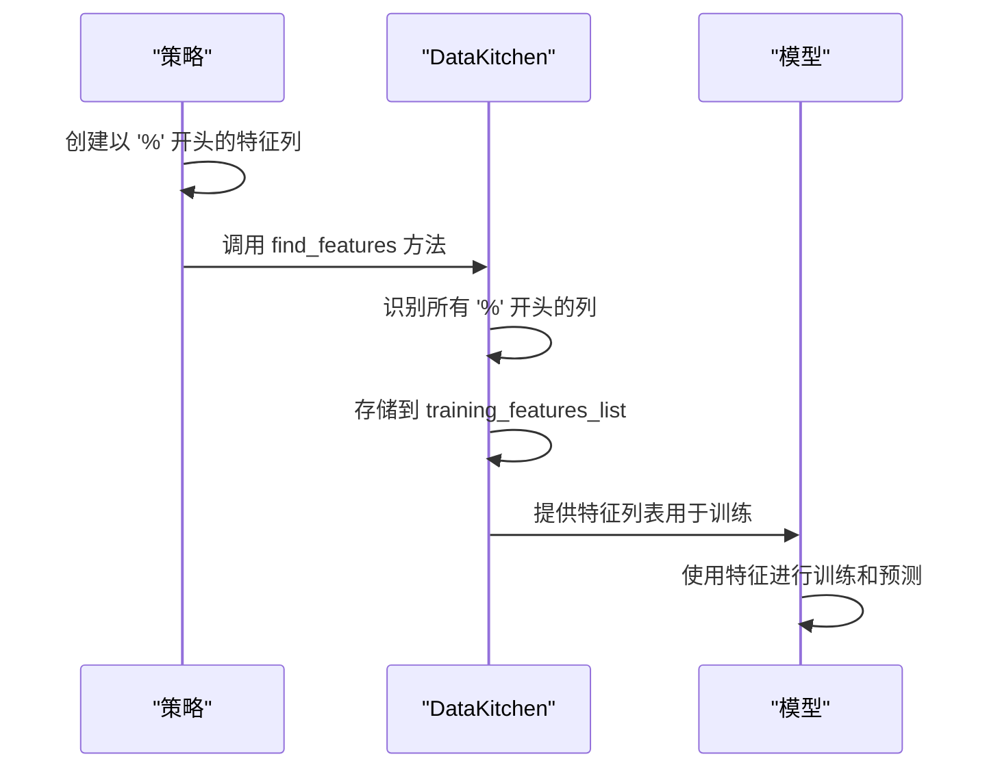

# 特征命名与识别

<cite>
**本文档中引用的文件**  
- [data_kitchen.py](file://freqtrade/freqai/data_kitchen.py)
- [FreqaiExampleStrategy.py](file://freqtrade/templates/FreqaiExampleStrategy.py)
</cite>

## 目录
1. [简介](#简介)
2. [特征命名规范](#特征命名规范)
3. [特征识别逻辑](#特征识别逻辑)
4. [特征工程方法](#特征工程方法)
5. [完整流程示例](#完整流程示例)
6. [常见问题与注意事项](#常见问题与注意事项)

## 简介
FreqAI框架通过严格的命名规范来识别和处理特征列。系统使用以`%`开头的列名作为特征，以`&`开头的列名作为标签。这种命名约定确保了系统能够自动识别哪些数据列应该被用作模型训练和预测的输入特征。本文档将深入解析这一机制，重点分析`data_kitchen.py`中的`find_features`方法和`FreqaiExampleStrategy.py`中的`feature_engineering_expand_all`与`feature_engineering_expand_basic`方法。

**Section sources**
- [data_kitchen.py](file://freqtrade/freqai/data_kitchen.py#L394-L407)
- [FreqaiExampleStrategy.py](file://freqtrade/templates/FreqaiExampleStrategy.py#L46-L139)

## 特征命名规范
在FreqAI框架中，所有特征列必须以`%`符号开头，所有标签列必须以`&`符号开头。这是系统识别特征和标签的关键约定。如果在数据框中找不到以`%`开头的列，系统将抛出"Could not find any features!"异常。这种命名规范贯穿于整个特征工程、模型训练和预测过程，确保了数据的一致性和可追溯性。

**Section sources**
- [data_kitchen.py](file://freqtrade/freqai/data_kitchen.py#L394-L407)
- [FreqaiExampleStrategy.py](file://freqtrade/templates/FreqaiExampleStrategy.py#L46-L139)

## 特征识别逻辑
系统通过`find_features`方法自动识别并提取所有以`%`开头的列作为特征。该方法接收一个数据框作为输入，遍历其所有列名，筛选出包含`%`符号的列，并将其存储在`training_features_list`属性中。如果未找到任何符合条件的列，系统将抛出异常，提示用户检查特征命名是否正确。这一机制确保了只有符合命名规范的列才会被用作模型训练和预测的特征。

**Diagram sources**
- [data_kitchen.py](file://freqtrade/freqai/data_kitchen.py#L394-L407)

**Section sources**
- [data_kitchen.py](file://freqtrade/freqai/data_kitchen.py#L394-L407)

## 特征工程方法
FreqAI框架提供了两个主要的特征工程方法：`feature_engineering_expand_all`和`feature_engineering_expand_basic`。这两个方法都要求用户定义的特征列必须以`%`开头，以便被系统识别。`feature_engineering_expand_all`方法会根据配置文件中定义的`indicator_periods_candles`、`include_timeframes`、`include_shifted_candles`和`include_corr_pairs`参数自动扩展特征。而`feature_engineering_expand_basic`方法则不会在`indicator_periods_candles`上自动复制特征。

**Diagram sources**
- [FreqaiExampleStrategy.py](file://freqtrade/templates/FreqaiExampleStrategy.py#L46-L139)

**Section sources**
- [FreqaiExampleStrategy.py](file://freqtrade/templates/FreqaiExampleStrategy.py#L46-L139)

## 完整流程示例
特征命名与识别的完整流程始于策略中的特征工程方法，这些方法创建以`%`开头的特征列。然后，系统调用`find_features`方法来识别这些特征列，并将其用于模型训练和预测。在整个过程中，正确的特征命名至关重要，任何不符合规范的命名都可能导致特征无法被识别，从而影响模型的性能。

**Diagram sources**
- [data_kitchen.py](file://freqtrade/freqai/data_kitchen.py#L394-L407)
- [FreqaiExampleStrategy.py](file://freqtrade/templates/FreqaiExampleStrategy.py#L46-L139)

**Section sources**
- [data_kitchen.py](file://freqtrade/freqai/data_kitchen.py#L394-L407)
- [FreqaiExampleStrategy.py](file://freqtrade/templates/FreqaiExampleStrategy.py#L46-L139)

## 常见问题与注意事项
错误的特征命名可能导致系统无法识别特征，从而引发训练失败。用户应确保所有特征列都以`%`开头，所有标签列都以`&`开头。此外，用户还应注意配置文件中的相关参数设置，以确保特征能够正确扩展。遵循这些命名规范和注意事项，可以确保FreqAI框架正常工作，提高模型的准确性和可靠性。

**Section sources**
- [data_kitchen.py](file://freqtrade/freqai/data_kitchen.py#L394-L407)
- [FreqaiExampleStrategy.py](file://freqtrade/templates/FreqaiExampleStrategy.py#L46-L139)