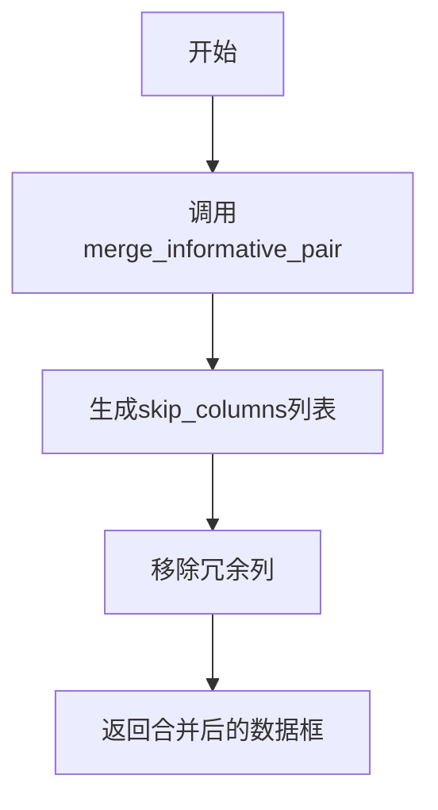
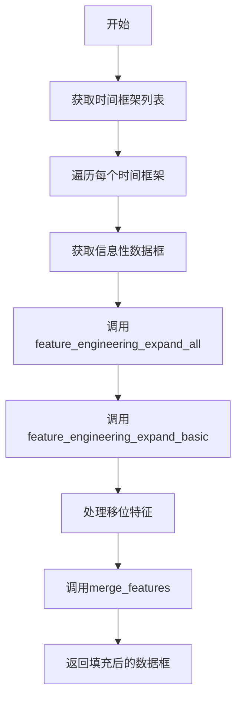
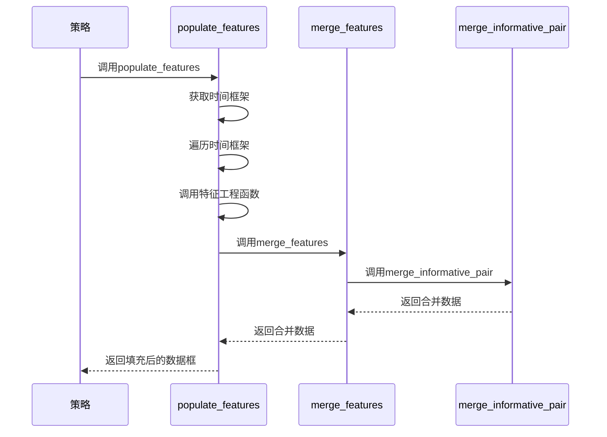
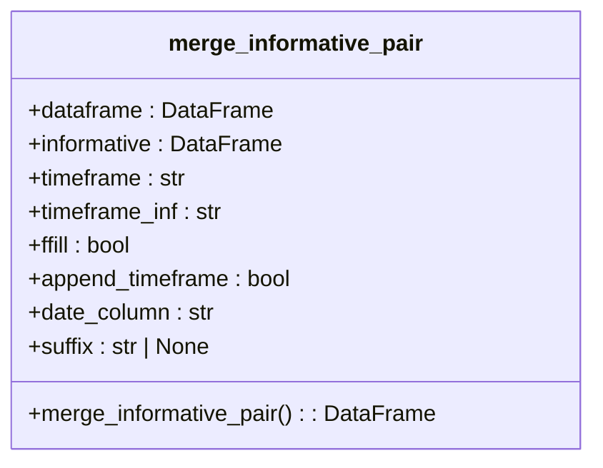
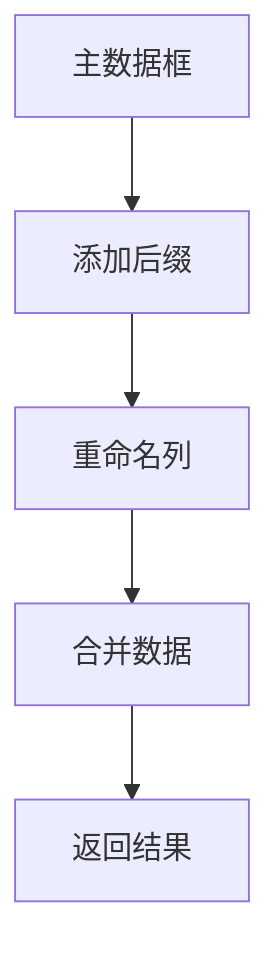
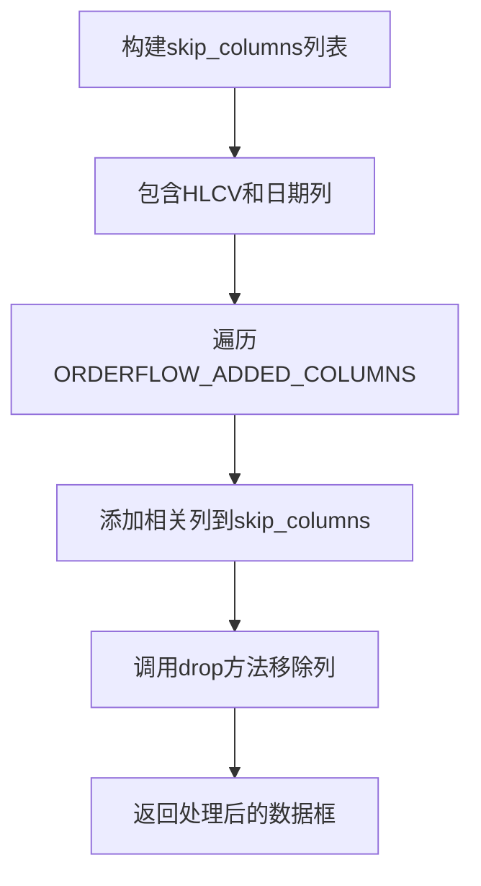

# 特征数据合并

<cite>
**本文档引用的文件**
- [data_kitchen.py](file://freqtrade/freqai/data_kitchen.py)
- [strategy_helper.py](file://freqtrade/strategy/strategy_helper.py)
- [interface.py](file://freqtrade/strategy/interface.py)
</cite>

## 目录
1. [简介](#简介)
2. [核心机制分析](#核心机制分析)
3. [merge_features方法详解](#merge_features方法详解)
4. [populate_features方法详解](#populate_features方法详解)
5. [特征合并流程示例](#特征合并流程示例)
6. [merge_informative_pair函数作用](#merge_informative_pair函数作用)
7. [列名冲突避免机制](#列名冲突避免机制)
8. [冗余列自动移除机制](#冗余列自动移除机制)
9. [结论](#结论)

## 简介
FreqAI框架中的特征数据合并机制是其核心功能之一，负责将不同时间框架、不同周期和移位后的特征数据进行有效整合。该机制主要通过`data_kitchen.py`文件中的`merge_features`和`populate_features`方法实现，确保了特征数据的完整性和一致性，为机器学习模型的训练和预测提供了高质量的数据基础。

## 核心机制分析
FreqAI框架的特征数据合并机制通过一系列精心设计的方法和函数，实现了多维度特征数据的整合。该机制不仅能够处理不同时间框架的数据，还能有效管理特征列名冲突和冗余数据，确保最终数据结构的清晰和高效。

**Section sources**
- [data_kitchen.py](file://freqtrade/freqai/data_kitchen.py#L34-L1033)

## merge_features方法详解
`merge_features`方法是特征数据合并的核心，负责将主数据框与待合并的数据框进行整合，并自动移除HLCV和日期等冗余列。

**Diagram sources**
- [data_kitchen.py](file://freqtrade/freqai/data_kitchen.py#L687-L717)

该方法首先调用`merge_informative_pair`函数进行数据合并，然后构建`skip_columns`列表，包含需要移除的HLCV和日期列，最后通过`drop`方法移除这些冗余列。

**Section sources**
- [data_kitchen.py](file://freqtrade/freqai/data_kitchen.py#L687-L717)

## populate_features方法详解
`populate_features`方法负责使用用户定义的策略函数来填充特征，是特征工程的关键步骤。

**Diagram sources**
- [data_kitchen.py](file://freqtrade/freqai/data_kitchen.py#L719-L775)

该方法首先获取配置中的时间框架列表，然后遍历每个时间框架，依次调用策略中的特征工程函数，并最终通过`merge_features`方法将处理后的特征合并到主数据框中。

**Section sources**
- [data_kitchen.py](file://freqtrade/freqai/data_kitchen.py#L719-L775)

## 特征合并流程示例
以下是一个完整的特征数据合并流程示例：

**Diagram sources**
- [data_kitchen.py](file://freqtrade/freqai/data_kitchen.py#L719-L775)
- [strategy_helper.py](file://freqtrade/strategy/strategy_helper.py#L5-L100)

该流程展示了从策略调用`populate_features`方法开始，到最终返回填充后数据框的完整过程，包括特征工程、数据合并等关键步骤。

**Section sources**
- [data_kitchen.py](file://freqtrade/freqai/data_kitchen.py#L719-L775)
- [strategy_helper.py](file://freqtrade/strategy/strategy_helper.py#L5-L100)

## merge_informative_pair函数作用
`merge_informative_pair`函数在特征合并中起着关键作用，负责正确合并信息性样本到原始数据框，避免前瞻偏差。

**Diagram sources**
- [strategy_helper.py](file://freqtrade/strategy/strategy_helper.py#L5-L100)

该函数通过将信息性数据框的日期向前移动一个时间间隔，确保了数据合并的正确性，避免了前瞻偏差问题。

**Section sources**
- [strategy_helper.py](file://freqtrade/strategy/strategy_helper.py#L5-L100)

## 列名冲突避免机制
系统通过`sufix`参数有效避免了列名冲突问题。

**Diagram sources**
- [data_kitchen.py](file://freqtrade/freqai/data_kitchen.py#L687-L717)

当合并不同时间框架的数据时，系统会自动在列名后添加指定的后缀，确保所有列名的唯一性，避免了数据混淆。

**Section sources**
- [data_kitchen.py](file://freqtrade/freqai/data_kitchen.py#L687-L717)

## 冗余列自动移除机制
系统通过`skip_columns`机制自动移除HLCV和日期等冗余列。

**Diagram sources**
- [data_kitchen.py](file://freqtrade/freqai/data_kitchen.py#L687-L717)

该机制首先构建包含HLCV和日期列的`skip_columns`列表，然后遍历`ORDERFLOW_ADDED_COLUMNS`，将相关列添加到列表中，最后通过`drop`方法一次性移除所有冗余列。

**Section sources**
- [data_kitchen.py](file://freqtrade/freqai/data_kitchen.py#L687-L717)

## 结论
FreqAI框架的特征数据合并机制通过`merge_features`和`populate_features`方法，实现了高效、可靠的特征数据整合。该机制不仅能够处理多时间框架、多周期的特征数据，还能有效避免列名冲突和冗余数据问题，为机器学习模型提供了高质量的训练数据。通过`merge_informative_pair`函数的正确使用，确保了数据合并的准确性和一致性，避免了前瞻偏差等常见问题。