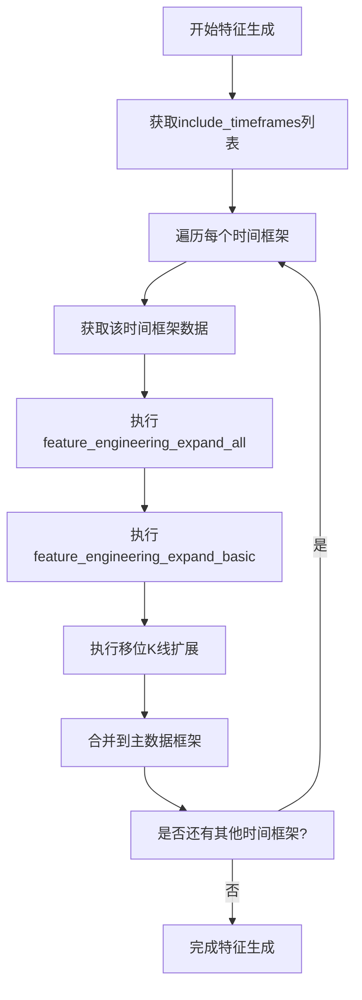
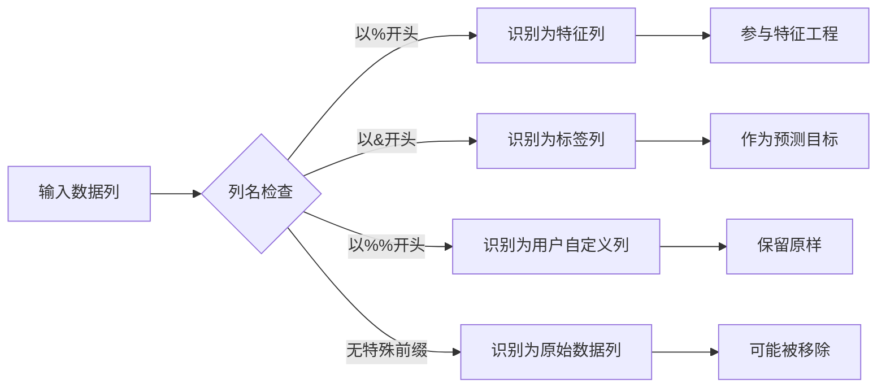
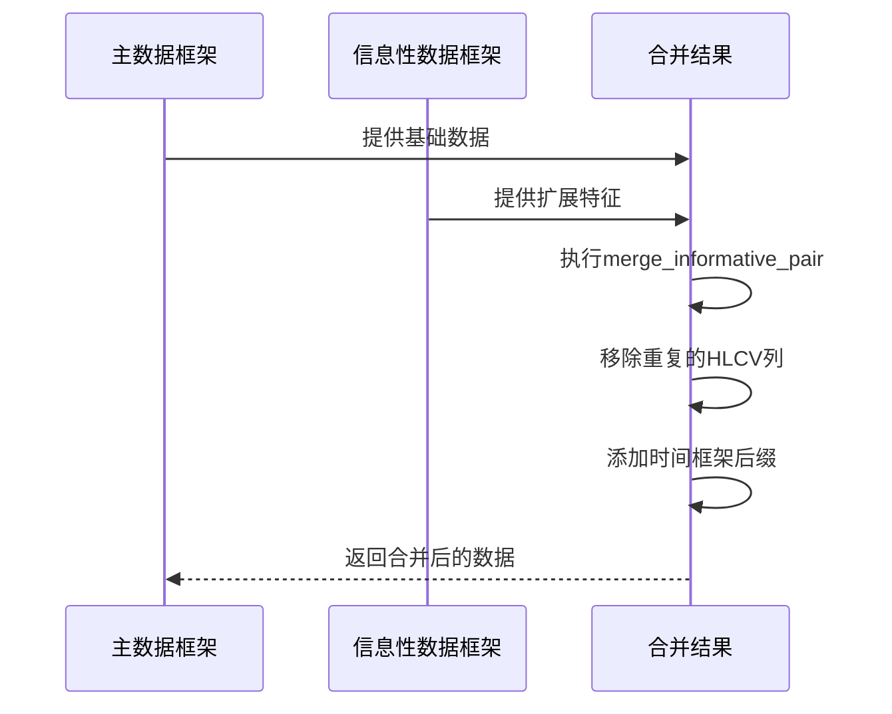

# 特征生成机制

<cite>
**本文档中引用的文件**   
- [data_kitchen.py](file://freqtrade/freqai/data_kitchen.py#L719-L775)
- [FreqaiExampleStrategy.py](file://freqtrade/templates/FreqaiExampleStrategy.py#L46-L101)
- [FreqaiExampleStrategy.py](file://freqtrade/templates/FreqaiExampleStrategy.py#L103-L139)
</cite>

## 目录
1. [特征生成机制概述](#特征生成机制概述)
2. [核心方法分析](#核心方法分析)
3. [特征扩展与合并流程](#特征扩展与合并流程)
4. [特征命名规范处理](#特征命名规范处理)
5. [数据流示例](#数据流示例)

## 特征生成机制概述

FreqAI框架通过自动化特征工程机制，实现多时间框架、多周期指标和移位K线的特征自动扩展与合并。该机制的核心在于`data_kitchen.py`中的`populate_features`方法与策略文件中的`feature_engineering_expand_all`和`feature_engineering_expand_basic`方法的协同工作。

## 核心方法分析

### populate_features方法

`populate_features`方法是特征生成的核心，负责协调不同时间框架和相关交易对的特征生成与合并过程。

**Section sources**
- [data_kitchen.py](file://freqtrade/freqai/data_kitchen.py#L719-L775)

### feature_engineering_expand_all方法

`feature_engineering_expand_all`方法定义了需要根据`indicator_periods_candles`参数进行周期扩展的特征，这些特征会自动在多个周期上计算。

**Section sources**
- [FreqaiExampleStrategy.py](file://freqtrade/templates/FreqaiExampleStrategy.py#L46-L101)

### feature_engineering_expand_basic方法

`feature_engineering_expand_basic`方法定义了基础特征，这些特征不会根据`indicator_periods_candles`进行周期扩展，但会参与时间框架和移位K线的扩展。

**Section sources**
- [FreqaiExampleStrategy.py](file://freqtrade/templates/FreqaiExampleStrategy.py#L103-L139)

## 特征扩展与合并流程

### 多时间框架扩展

系统通过`include_timeframes`配置参数实现多时间框架特征扩展。对于每个指定的时间框架，系统会：

1. 获取对应时间框架的数据
2. 在该时间框架上计算所有特征
3. 将不同时间框架的特征合并到主数据框架中

**Diagram sources**
- [data_kitchen.py](file://freqtrade/freqai/data_kitchen.py#L719-L775)

### 多周期指标扩展

通过`indicator_periods_candles`参数，系统实现了多周期指标的自动扩展。对于每个定义在`feature_engineering_expand_all`中的特征：

1. 遍历`indicator_periods_candles`中定义的所有周期
2. 在每个周期上重新计算该特征
3. 为每个周期的特征添加相应的后缀标识

### 移位K线扩展

`include_shifted_candles`参数控制着历史K线移位特征的生成。系统会：

1. 识别所有以%开头的特征列
2. 对这些特征列进行指定次数的移位
3. 为移位后的特征添加_shift-n后缀

## 特征命名规范处理

### 特征识别逻辑

系统通过特定的命名前缀来识别和处理不同类型的列：

- **%前缀**：标识特征列，这些列会被系统识别为机器学习模型的输入特征
- **&前缀**：标识标签列，这些列作为模型的预测目标
- **%%前缀**：标识用户自定义列，这些列不会被特征处理逻辑影响

### 前缀处理流程

**Diagram sources**
- [data_kitchen.py](file://freqtrade/freqai/data_kitchen.py#L719-L775)

## 数据流示例

### 特征合并过程

`merge_features`方法负责整合不同时间框架的特征数据，其主要步骤包括：

1. 使用`merge_informative_pair`函数合并数据
2. 移除重复的HLCV（最高价、最低价、收盘价、成交量）和日期列
3. 保留特征列并添加适当的时间框架后缀

**Diagram sources**
- [data_kitchen.py](file://freqtrade/freqai/data_kitchen.py#L719-L775)