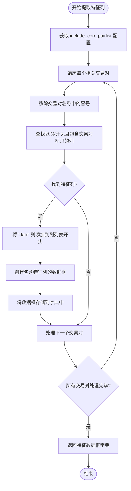

# 特征提取实现

<cite>
**本文档中引用的文件**   
- [data_kitchen.py](file://freqtrade/freqai/data_kitchen.py)
- [freqai_interface.py](file://freqtrade/freqai/freqai_interface.py)
- [pairlist_helpers.py](file://freqtrade/plugins/pairlist/pairlist_helpers.py)
</cite>

## 目录
1. [简介](#简介)
2. [核心机制分析](#核心机制分析)
3. [特征列筛选逻辑](#特征列筛选逻辑)
4. [数据流转换与性能优化](#数据流转换与性能优化)
5. [配置参数与系统集成](#配置参数与系统集成)

## 简介
本文档深入解析FreqAI系统中特征提取的核心实现机制，重点分析`extract_corr_pair_columns_from_populated_indicators`方法如何从完整数据集中识别并提取相关交易对的特征列。系统通过`include_corr_pairlist`配置参数定位以'%'开头且包含特定交易对标识的特征列，并将其按日期索引组织成独立的数据框字典。文档详细说明了特征列筛选的逻辑，包括日期列的保留策略和LightGBM兼容性处理（移除冒号字符），并通过代码示例展示特征提取过程中的数据流转换和性能优化考量。

## 核心机制分析

`extract_corr_pair_columns_from_populated_indicators`方法是FreqAI数据厨房（Data Kitchen）中的核心功能之一，负责从已填充指标的完整数据集中提取相关交易对的特征列。该方法接收一个包含当前交易对和相关交易对指标的完整数据框作为输入，通过遍历`include_corr_pairlist`配置参数中定义的交易对列表，识别并提取相应的特征列。

方法首先从配置中获取`include_corr_pairlist`参数，然后对每个交易对进行处理。在处理过程中，系统会移除交易对名称中的冒号字符，以确保与LightGBM等机器学习框架的兼容性。接着，通过字符串匹配的方式，在数据框的列名中查找以'%'开头且包含特定交易对标识的列。这些列被认为是该交易对的特征列，并被提取出来。

提取的特征列会与日期列一起，按交易对名称组织成一个独立的数据框，并存储在返回的字典中。这种设计允许系统在后续的训练和预测过程中，高效地重用这些特征数据，避免重复计算，从而提升整体性能。

**Section sources**
- [data_kitchen.py](file://freqtrade/freqai/data_kitchen.py#L603-L627)

## 特征列筛选逻辑

特征列的筛选逻辑基于两个关键条件：列名必须以'%'字符开头，并且必须包含特定交易对的标识符。这一设计确保了系统能够准确地识别出由策略生成的特征列，而不会误选其他类型的列（如价格、成交量等）。

在筛选过程中，系统会首先检查候选列是否满足上述两个条件。如果满足，则将该列加入到该交易对的特征列列表中。一旦确定了所有相关的特征列，系统会将日期列（"date"）作为第一列插入到列表的开头。这一步骤至关重要，因为它确保了每个交易对的特征数据框都包含一个共同的索引列，为后续的数据合并操作提供了基础。

对于没有找到任何特征列的交易对，系统会跳过该交易对，不会在返回的字典中创建对应的条目。这种处理方式保证了返回字典的整洁性，避免了包含空数据框的情况。

**Diagram sources **
- [data_kitchen.py](file://freqtrade/freqai/data_kitchen.py#L603-L627)

**Section sources**
- [data_kitchen.py](file://freqtrade/freqai/data_kitchen.py#L603-L627)

## 数据流转换与性能优化

特征提取过程中的数据流转换和性能优化是系统高效运行的关键。`extract_corr_pair_columns_from_populated_indicators`方法的输出——一个按交易对组织的特征数据框字典——被设计为可重用的中间数据结构。这个字典随后会被`attach_corr_pair_columns`方法使用，将相关交易对的特征数据合并到当前交易对的数据框中，为模型训练准备最终的输入数据。

为了优化性能，系统采用了多种策略。首先，通过`set_all_pairs`方法，系统在初始化时就将`include_corr_pairlist`中的交易对与交易所的交易对白名单合并，确保了相关交易对列表的完整性和一致性。其次，`use_strategy_to_populate_indicators`方法在填充指标时，会预先加载所有相关交易对的数据，避免了在循环中重复进行网络请求或文件读取操作。

此外，系统还通过`cache_corr_pairlist_dfs`方法在单个K线周期内缓存相关交易对的特征数据框，从而在处理交易对列表中的后续交易对时，可以直接重用已计算的特征，极大地减少了重复计算的开销。这种缓存机制对于包含大量交易对的策略尤其重要，能够显著缩短模型训练和预测的时间。

**Section sources**
- [data_kitchen.py](file://freqtrade/freqai/data_kitchen.py#L595-L593)
- [data_kitchen.py](file://freqtrade/freqai/data_kitchen.py#L777-L865)
- [freqai_interface.py](file://freqtrade/freqai/freqai_interface.py#L1074-L1098)

## 配置参数与系统集成

`include_corr_pairlist`配置参数是整个特征提取机制的起点。它在策略配置文件中定义，指定了需要提取特征的相关交易对列表。该参数与`pairlist_helpers.py`文件中的`dynamic_expand_pairlist`函数紧密集成，后者负责在系统启动时动态扩展交易对列表，将`include_corr_pairlist`中的交易对添加到主交易对列表中，确保这些相关交易对的数据能够被正确加载。

系统通过`FreqaiDataKitchen`类的`__init__`方法初始化所有必要的状态和配置。`freqai_config`字段存储了从主配置中提取的FreqAI专用配置，而`all_pairs`字段则保存了合并后的完整交易对列表。`extract_corr_pair_columns_from_populated_indicators`方法在执行时，会直接从`freqai_config`中读取`include_corr_pairlist`，实现了配置与功能的无缝对接。

这种设计模式体现了高内聚、低耦合的原则，使得特征提取功能既独立又易于配置，为用户提供了极大的灵活性，可以根据不同的市场环境和策略需求，轻松调整相关交易对的范围。

**Section sources**
- [data_kitchen.py](file://freqtrade/freqai/data_kitchen.py#L60-L108)
- [pairlist_helpers.py](file://freqtrade/plugins/pairlist/pairlist_helpers.py#L32-L48)