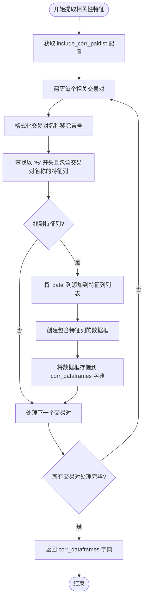
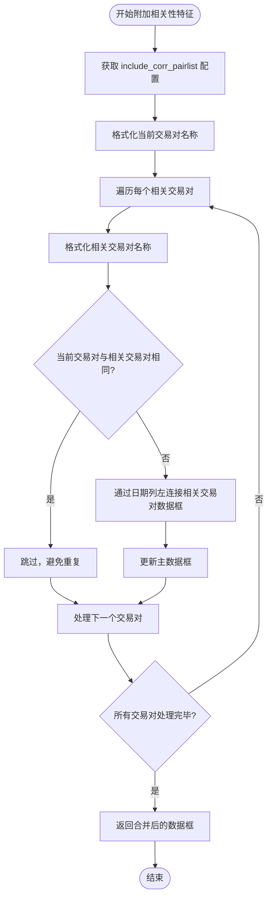
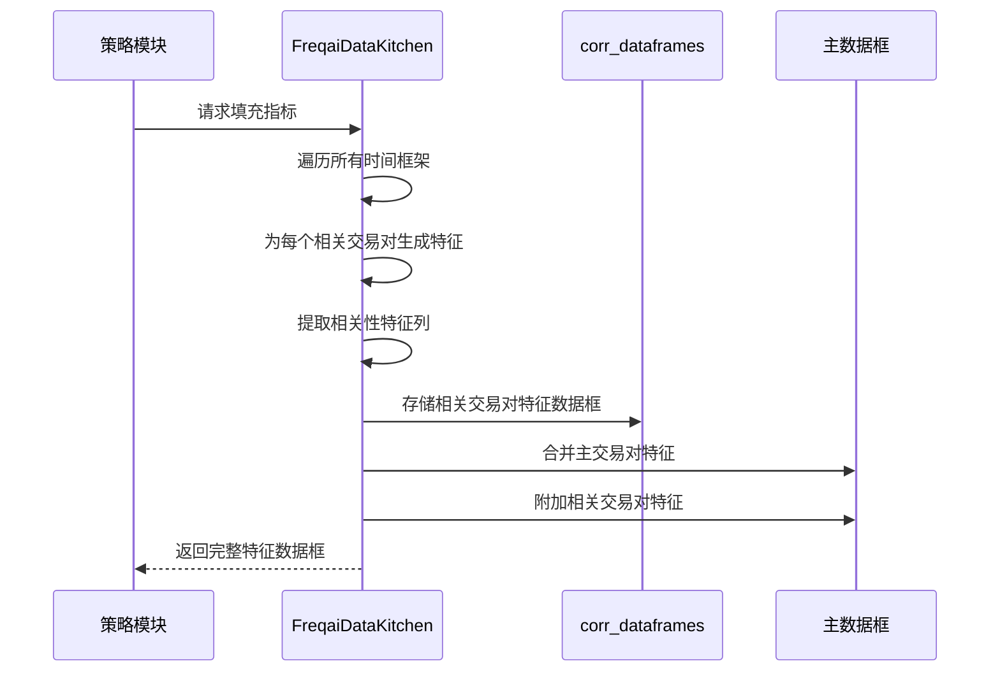
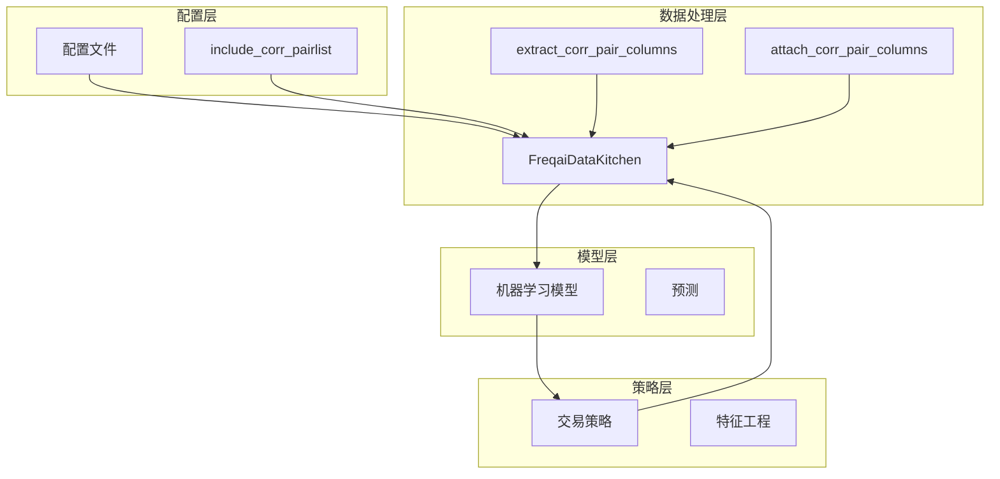

# 相关性分析与特征提取

<cite>
**Referenced Files in This Document**   
- [data_kitchen.py](file://freqtrade/freqai/data_kitchen.py#L603-L649)
- [data_kitchen.py](file://freqtrade/freqai/data_kitchen.py#L34-L1035)
- [interface.py](file://freqtrade/strategy/interface.py#L1059-L1073)
- [pairlist_helpers.py](file://freqtrade/plugins/pairlist/pairlist_helpers.py#L32-L48)
</cite>

## 目录
1. [引言](#引言)
2. [核心组件分析](#核心组件分析)
3. [相关性特征提取机制](#相关性特征提取机制)
4. [配置参数作用](#配置参数作用)
5. [数据流与处理逻辑](#数据流与处理逻辑)
6. [系统架构概述](#系统架构概述)
7. [实际应用示例](#实际应用示例)
8. [结论](#结论)

## 引言
FreqAI框架提供了一套完整的机器学习交易解决方案，其中相关性分析（corr_pairlist）是其核心功能之一。该机制允许系统跨多个交易对提取和整合特征数据，从而增强主交易对的预测能力。通过分析不同资产之间的相关性，模型可以获得更全面的市场视角，提高预测准确性。

## 核心组件分析

FreqAI框架中的相关性分析主要由`FreqaiDataKitchen`类实现，该类负责数据的准备、特征提取和预处理。两个关键方法`extract_corr_pair_columns_from_populated_indicators`和`attach_corr_pair_columns`构成了相关性分析的核心逻辑。

**Section sources**
- [data_kitchen.py](file://freqtrade/freqai/data_kitchen.py#L34-L1035)

## 相关性特征提取机制

### 特征提取方法
`extract_corr_pair_columns_from_populated_indicators`方法负责从已填充指标的完整数据框中提取相关交易对的特征列。该方法首先从配置中获取`include_corr_pairlist`列表，然后遍历每个相关交易对，筛选出以"%"开头且包含交易对名称的特征列。



**Diagram sources**
- [data_kitchen.py](file://freqtrade/freqai/data_kitchen.py#L603-L627)

### 特征附加方法
`attach_corr_pair_columns`方法负责将提取的相关性特征数据框附加到当前交易对的数据框中。该方法通过左连接（left join）操作，基于日期列将相关交易对的特征合并到主数据框中。



**Diagram sources**
- [data_kitchen.py](file://freqtrade/freqai/data_kitchen.py#L629-L649)

**Section sources**
- [data_kitchen.py](file://freqtrade/freqai/data_kitchen.py#L603-L649)

## 配置参数作用

### include_corr_pairlist 配置
`include_corr_pairlist`是FreqAI配置中的一个关键参数，用于指定需要纳入相关性分析的交易对列表。该参数在系统中的作用如下：

1. **定义相关交易对集合**：明确指定哪些交易对的特征数据需要被提取和共享
2. **扩展信息源**：将主交易对的特征集扩展到包括其他相关资产的市场信息
3. **动态数据整合**：在训练和预测过程中自动整合多个交易对的特征数据

该配置参数在多个系统组件中被引用和处理：

```mermaid
erDiagram
CONFIG ||--o{ DATA_KITCHEN : "使用"
CONFIG ||--o{ STRATEGY_INTERFACE : "生成"
CONFIG ||--o{ PAIRLIST_HELPERS : "扩展"
class CONFIG {
dict freqai
list include_corr_pairlist
}
class DATA_KITCHEN {
method extract_corr_pair_columns_from_populated_indicators()
method attach_corr_pair_columns()
}
class STRATEGY_INTERFACE {
method __informative_pairs_freqai()
}
class PAIRLIST_HELPERS {
method dynamic_expand_pairlist()
}
```

**Diagram sources**
- [data_kitchen.py](file://freqtrade/freqai/data_kitchen.py#L34-L1035)
- [interface.py](file://freqtrade/strategy/interface.py#L1059-L1073)
- [pairlist_helpers.py](file://freqtrade/plugins/pairlist/pairlist_helpers.py#L32-L48)

## 数据流与处理逻辑

### 数据处理流程
FreqAI框架中的相关性分析遵循一个清晰的数据处理流程：



**Diagram sources**
- [data_kitchen.py](file://freqtrade/freqai/data_kitchen.py#L34-L1035)

### 特征命名规范
系统采用特定的命名约定来标识不同来源的特征：
- 以"%"开头的列被视为特征列
- 相关交易对的特征列包含交易对名称和时间框架后缀
- 主交易对和相关交易对的特征在合并后保持独立可识别

## 系统架构概述



**Diagram sources**
- [data_kitchen.py](file://freqtrade/freqai/data_kitchen.py#L34-L1035)

## 实际应用示例

### 配置示例
在实际使用中，用户可以在配置文件中定义相关交易对列表：

```json
{
  "freqai": {
    "enabled": true,
    "feature_parameters": {
      "include_corr_pairlist": [
        "BTC/USDT:USDT",
        "ETH/USDT:USDT",
        "XRP/USDT:USDT"
      ],
      "include_timeframes": ["5m", "15m", "1h"]
    }
  }
}
```

这种配置允许系统：
1. 为BTC/USDT主交易对提取ETH/USDT和XRP/USDT的相关特征
2. 在5分钟、15分钟和1小时时间框架上进行特征工程
3. 将三个交易对的市场信息整合到统一的特征集中

### 应用场景
相关性分析特别适用于以下场景：
- **跨市场分析**：当主交易对与其他资产存在强相关性时
- **风险对冲**：通过分析相关资产的价格变动来优化风险管理
- **市场情绪分析**：利用主要资产（如BTC）的走势预测次要资产的可能方向

## 结论
FreqAI框架中的相关性分析机制通过`extract_corr_pair_columns_from_populated_indicators`和`attach_corr_pair_columns`方法实现了高效的跨交易对特征整合。`include_corr_pairlist`配置参数作为系统的核心控制点，允许用户灵活定义相关性分析的范围。这一机制显著增强了机器学习模型的输入特征多样性，为更准确的市场预测提供了数据基础。通过合理的配置和应用，交易者可以充分利用多资产相关性信息，提升交易策略的性能和鲁棒性。