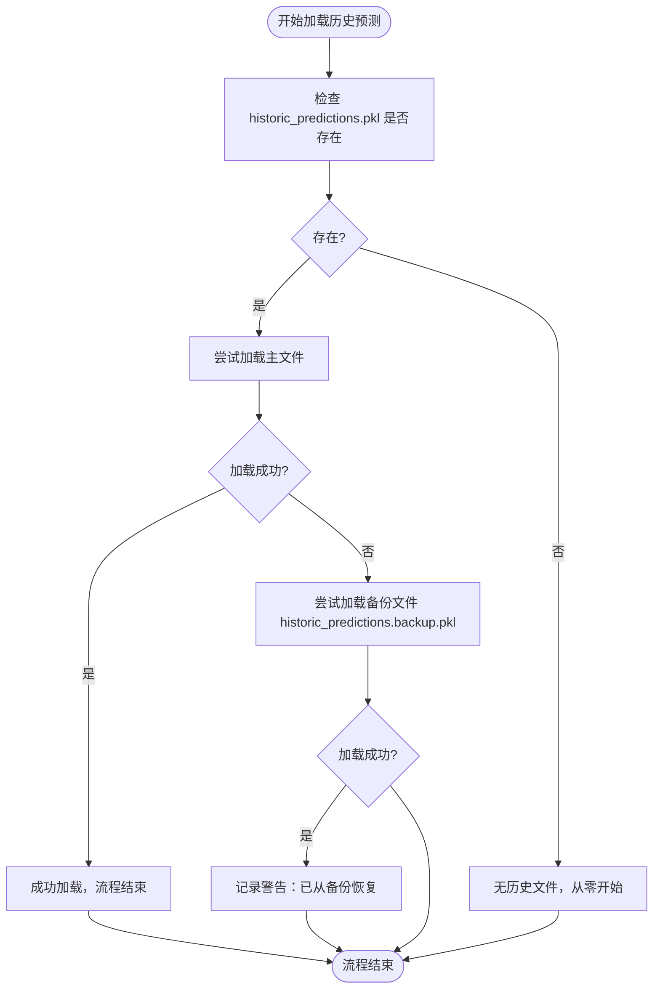

# 历史预测数据存储机制

<cite>
**本文档引用的文件**   
- [data_drawer.py](file://freqtrade/freqai/data_drawer.py#L45-L764)
</cite>

## 目录
1. [引言](#引言)
2. [文件路径管理](#文件路径管理)
3. [数据序列化与反序列化](#数据序列化与反序列化)
4. [文件损坏恢复机制](#文件损坏恢复机制)
5. [线程安全与序列化协议](#线程安全与序列化协议)

## 引言
`historic_predictions.pkl` 文件是 FreqAI 模块中用于持久化存储历史预测数据的核心文件。该文件通过 `FreqaiDataDrawer` 类进行管理，确保在策略重启或系统故障后能够恢复历史预测状态，从而维持交易决策的连续性。本文档详细阐述该文件的存储机制、路径管理、序列化方法、恢复流程以及相关的线程安全措施。

## 文件路径管理
`FreqaiDataDrawer` 类通过其构造函数中的 `full_path` 参数确定模型数据的根目录。在此基础上，类初始化时会创建两个关键的路径属性：
- `historic_predictions_path`：指向 `historic_predictions.pkl` 文件的完整路径。
- `historic_predictions_bkp_path`：指向备份文件 `historic_predictions.backup.pkl` 的完整路径。

这两个路径在类的 `__init__` 方法中被初始化，并在整个对象生命周期内保持不变，为后续的文件读写操作提供明确的定位。

**Section sources**
- [data_drawer.py](file://freqtrade/freqai/data_drawer.py#L69-L105)

## 数据序列化与反序列化
`FreqaiDataDrawer` 类通过 `load_historic_predictions_from_disk` 和 `save_historic_predictions_to_disk` 两个方法实现数据的反序列化和序列化。

### 反序列化
`load_historic_predictions_from_disk` 方法负责从磁盘加载历史预测数据。它首先检查主文件 `historic_predictions.pkl` 是否存在。如果存在，则尝试使用 `cloudpickle.load` 方法将其反序列化到 `self.historic_predictions` 字典中。此字典的键为交易对（pair），值为包含历史预测结果的 `DataFrame`。

### 序列化
`save_historic_predictions_to_disk` 方法负责将内存中的 `self.historic_predictions` 字典持久化到磁盘。它使用 `cloudpickle.dump` 方法将数据序列化并写入 `historic_predictions.pkl` 文件。

**Section sources**
- [data_drawer.py](file://freqtrade/freqai/data_drawer.py#L171-L197)
- [data_drawer.py](file://freqtrade/freqai/data_drawer.py#L199-L207)

## 文件损坏恢复机制
为了应对文件损坏的风险，系统实现了一套自动恢复机制。当 `load_historic_predictions_from_disk` 方法在读取主文件时捕获到 `EOFError` 异常（通常表示文件不完整或已损坏），它会立即执行恢复流程。

该流程会尝试从备份文件 `historic_predictions.backup.pkl` 中加载数据。一旦成功加载备份文件，系统会记录一条警告日志，表明已成功从备份中恢复历史预测数据。这确保了即使主文件损坏，系统也能利用最近的备份恢复大部分历史状态，最大限度地减少数据丢失。

**Diagram sources **
- [data_drawer.py](file://freqtrade/freqai/data_drawer.py#L171-L197)

## 线程安全与序列化协议
### 线程安全机制
为了防止在多线程环境下同时写入文件导致数据损坏，`save_historic_predictions_to_disk` 方法使用了 `save_lock` 这个 `threading.Lock` 对象。在执行文件写入操作前，必须先获取该锁。这种互斥锁机制确保了在任何时刻，只有一个线程能够执行保存操作，从而保证了文件写入的原子性和数据一致性。

### Cloudpickle序列化协议
选择 `cloudpickle` 而非标准 `pickle` 的主要原因是 `cloudpickle` 能够序列化更复杂的 Python 对象，特别是那些在动态环境中定义的函数和类。在 FreqAI 的上下文中，`historic_predictions` 字典中的 `DataFrame` 可能包含由用户自定义策略生成的复杂数据结构或引用。`cloudpickle` 的强大序列化能力确保了这些复杂对象能够被完整、准确地保存和恢复，避免了因对象无法序列化而导致的错误。

**Section sources**
- [data_drawer.py](file://freqtrade/freqai/data_drawer.py#L95)
- [data_drawer.py](file://freqtrade/freqai/data_drawer.py#L199-L207)