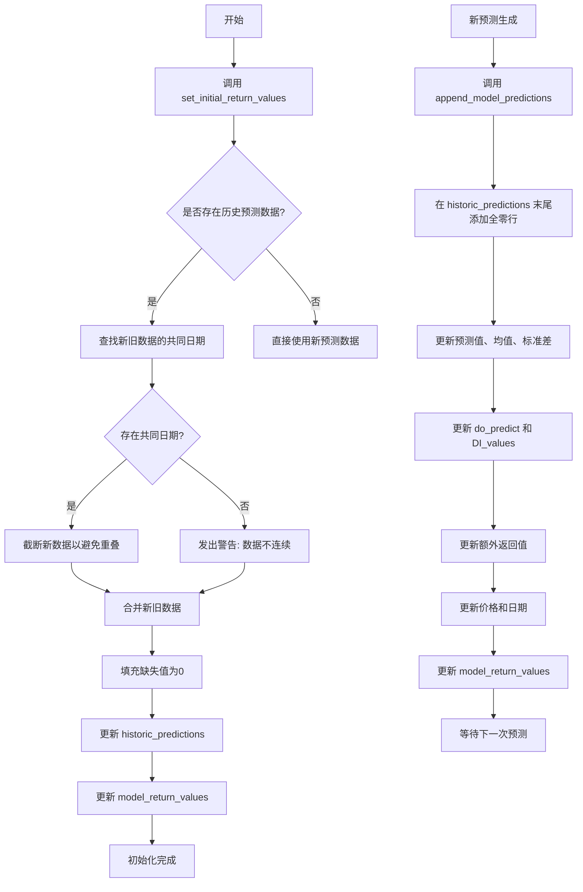

# 历史预测数据生命周期管理

<cite>
**本文档引用的文件**
- [data_drawer.py](file://freqtrade/freqai/data_drawer.py)
</cite>

## 目录
1. [引言](#引言)
2. [历史预测数据初始化](#历史预测数据初始化)
3. [模型预测结果追加](#模型预测结果追加)
4. [策略返回值缓冲机制](#策略返回值缓冲机制)
5. [生命周期管理流程图](#生命周期管理流程图)
6. [结论](#结论)

## 引言
本文档深入分析FreqAI系统中历史预测数据从初始化到更新的完整生命周期。重点解释`set_initial_return_values`方法如何基于策略初始数据框构建历史预测数据结构，并处理新旧数据的时间重叠问题；详细描述`append_model_predictions`方法如何将最新的模型预测结果追加到历史数据中，包括对预测值、统计指标（均值、标准差）、异常检测指标（DI_values）和价格数据的更新逻辑；并说明`model_return_values`字典如何作为策略返回值的缓冲区，确保FreqUI能正确显示连续的预测结果。

## 历史预测数据初始化

`set_initial_return_values`方法负责在系统启动或重新训练时，基于策略提供的初始数据框（`dataframe`）和模型预测数据框（`pred_df`）来初始化历史预测数据结构。该方法的核心目标是避免对历史K线进行重复预测，同时存储历史预测数据以供后续使用。

方法首先创建`pred_df`的副本`new_pred`，并将其`date_pred`列设置为`dataframe`中的日期。随后，除`date_pred`和`date`列外，将`new_pred`的所有其他列值设置为`None`，以表示在系统停机期间没有进行历史预测。

接着，该方法会从`historic_predictions`字典中获取该交易对（`pair`）的现有历史预测数据副本`hist_preds`。为了确保两个数据框的日期格式一致以便合并，会将`new_pred`和`hist_preds`的`date_pred`列都转换为pandas的datetime格式。

关键步骤是处理时间重叠问题。方法通过`pd.merge`在`date_pred`列上进行内连接，找出`new_pred`和`hist_preds`之间的共同日期。如果存在共同日期，说明新生成的预测数据与已有的历史数据有重叠，此时会将`new_pred`从共同日期之后开始截断（`new_pred.iloc[len(common_dates) :]`），从而避免数据重复。如果未找到共同日期，系统会发出警告，提示用户可能因长时间离线而导致数据不连续。

最后，使用`reindex`方法将`new_pred`的列重新索引以匹配`hist_preds`的列，然后使用`pd.concat`将两者连接。任何缺失值（NaN）都会被填充为0，以便在FreqUI中清晰地显示系统停机时段。最终，更新`historic_predictions[pair]`和`model_return_values[pair]`，其中后者通过取连接后数据框的尾部（长度等于原始`dataframe`）并重置索引得到。

**Section sources**
- [data_drawer.py](file://freqtrade/freqai/data_drawer.py#L277-L330)

## 模型预测结果追加

`append_model_predictions`方法负责在每次新的模型预测完成后，将最新的预测结果追加到历史预测数据中。这是维持连续、可追溯预测历史的关键步骤。

该方法首先确定策略数据框（`strat_df`）的长度`len_df`，并获取`historic_predictions[pair]`的最后一个索引和所有列名。接着，创建一个全零的`zeros_df`（行数为1，列数与历史预测数据相同），并将其与现有的`historic_predictions[pair]`连接，从而在历史数据末尾添加一个新行。

随后，方法会遍历最新的`predictions`数据框中的每一列（即每个预测标签）。对于每个标签，它会：
1.  将`predictions`中该标签的最后一行值（最新预测值）赋给`historic_predictions`新行的对应列。
2.  如果该列的数据类型不是对象（object），则同时更新其均值（`_mean`）和标准差（`_std`）列，这些值来源于`dk.data["labels_mean"]`和`dk.data["labels_std"]`。

此外，该方法还会更新异常检测相关的指标：
*   将`do_preds`数组的最后一项（表示是否进行预测的标志）赋给`do_predict`列。
*   如果配置中启用了`DI_threshold`，则将`dk.DI_values`数组的最后一项赋给`DI_values`列。

对于用户在自定义预测模型中添加的额外返回值（`extra_returns_per_train`），该方法也会将其逐一追加到历史数据中。

最后，方法会将`strat_df`中的价格信息（高、低、收盘价）和日期信息复制到新行的对应列中。完成所有更新后，`model_return_values[pair]`被设置为更新后历史数据的尾部（长度等于`strat_df`），并重置索引。

**Section sources**
- [data_drawer.py](file://freqtrade/freqai/data_drawer.py#L332-L397)

## 策略返回值缓冲机制

`model_return_values`是一个在`FreqaiDataDrawer`类初始化时创建的字典（`self.model_return_values: dict[str, DataFrame] = {}`），其作用是作为策略返回值的缓冲区。

该字典的键是交易对（pair），值是一个`DataFrame`，其中存储了该交易对最新的、可供策略直接使用的预测数据。这个`DataFrame`的结构与策略数据框（`dataframe`）兼容，包含了预测值、统计指标、异常检测指标和价格数据。

`set_initial_return_values`和`append_model_predictions`这两个方法在执行完各自的数据处理逻辑后，都会更新`model_return_values[pair]`。`set_initial_return_values`在初始化时设置其值，而`append_model_predictions`在每次新预测后更新其值。

策略通过`attach_return_values_to_return_dataframe`方法将`model_return_values[pair]`中的数据附加到其自身的数据框上。这确保了策略每次执行时都能获得最新、最完整的预测结果，而这些结果是基于一个连续的历史数据流生成的。因此，`model_return_values`充当了一个关键的中间缓冲层，它保证了FreqUI能够显示平滑、连续的预测曲线，即使在模型重新训练或系统重启后，历史预测数据也能被正确地衔接和展示。

**Section sources**
- [data_drawer.py](file://freqtrade/freqai/data_drawer.py#L78-L78)
- [data_drawer.py](file://freqtrade/freqai/data_drawer.py#L399-L410)

## 生命周期管理流程图

**Diagram sources**
- [data_drawer.py](file://freqtrade/freqai/data_drawer.py#L277-L330)
- [data_drawer.py](file://freqtrade/freqai/data_drawer.py#L332-L397)

## 结论
FreqAI通过`FreqaiDataDrawer`类精心管理历史预测数据的生命周期。`set_initial_return_values`方法通过智能地处理时间重叠，确保了历史数据的唯一性和连续性。`append_model_predictions`方法则负责将每一次新的预测结果无缝地追加到历史记录中，维护了一个完整的预测时间线。`model_return_values`字典作为核心的缓冲区，存储了可供策略和UI直接使用的最新预测数据。这一系列机制共同保证了即使在模型频繁重训练或系统重启的情况下，用户也能通过FreqUI观察到一条完整、平滑且准确的预测历史曲线，为交易决策提供了可靠的数据支持。