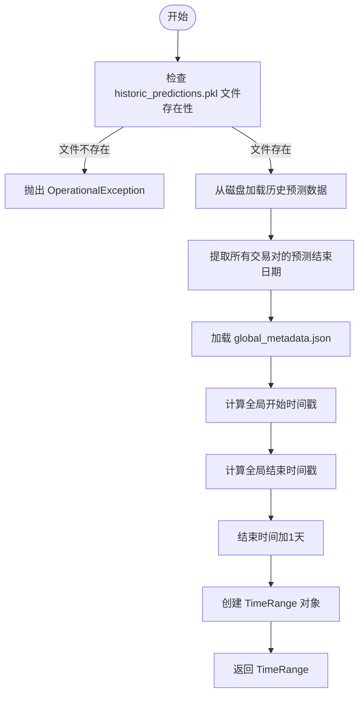
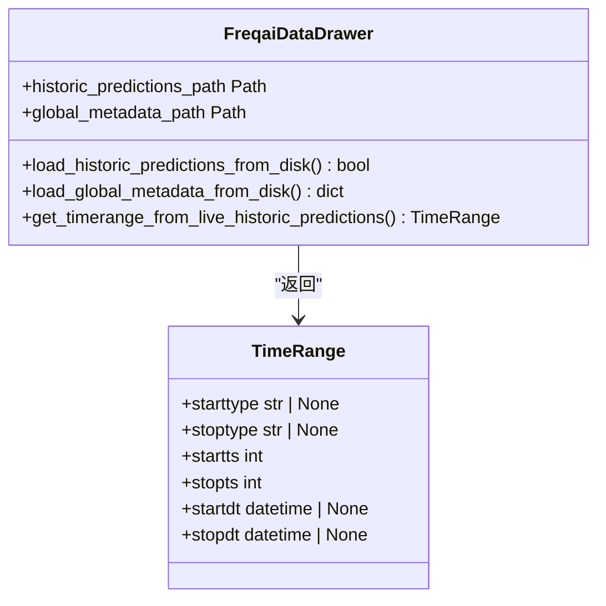

# 回测集成

<cite>
**本文档中引用的文件**  
- [data_drawer.py](file://freqtrade/freqai/data_drawer.py)
- [freqai_interface.py](file://freqtrade/freqai/freqai_interface.py)
- [timerange.py](file://freqtrade/configuration/timerange.py)
</cite>

## 目录
1. [简介](#简介)
2. [核心功能分析](#核心功能分析)
3. [时间范围提取流程](#时间范围提取流程)
4. [历史预测数据管理](#历史预测数据管理)
5. [全局元数据的作用](#全局元数据的作用)
6. [回测真实性保障机制](#回测真实性保障机制)

## 简介
本文档详细解释了Freqtrade系统中历史预测数据如何支持基于真实模型的回测功能。重点阐述了`get_timerange_from_live_historic_predictions`方法如何从`historic_predictions.pkl`文件中提取所有交易对的预测时间范围，计算全局开始和结束时间戳，并生成用于回测的TimeRange对象。该机制确保回测使用与实盘完全相同的模型预测结果，从而提供更真实的性能评估。

## 核心功能分析

`get_timerange_from_live_historic_predictions`方法是实现真实模型回测的核心组件，它通过读取实盘运行期间积累的历史预测数据来确定回测的时间范围。这种方法的关键优势在于能够复现实盘环境中的模型行为，避免了传统回测中因模型重新训练而导致的偏差。

该方法首先验证`historic_predictions.pkl`文件是否存在，如果不存在则抛出操作异常，因为历史预测数据是运行`freqai-backtest-live-models`选项所必需的。一旦确认文件存在，系统会从磁盘加载历史预测数据，并利用这些数据计算出精确的回测时间范围。

**Section sources**
- [data_drawer.py](file://freqtrade/freqai/data_drawer.py#L738-L764)

## 时间范围提取流程

**Diagram sources**
- [data_drawer.py](file://freqtrade/freqai/data_drawer.py#L738-L764)

**Section sources**
- [data_drawer.py](file://freqtrade/freqai/data_drawer.py#L738-L764)

## 历史预测数据管理

系统通过`historic_predictions.pkl`文件持久化存储每个交易对的历史预测数据。这些数据在实盘运行期间不断累积，包含了模型在不同时间点的预测结果。当执行基于真实模型的回测时，系统会读取这些预先保存的预测数据，而不是重新运行模型进行预测。

这种方法确保了回测过程中使用的预测结果与实盘交易时完全一致，包括所有模型的输出、置信度指标和辅助统计信息。通过这种方式，回测能够准确反映策略在实际市场条件下的表现，避免了"未来数据"泄漏和模型过拟合等问题。

**Section sources**
- [data_drawer.py](file://freqtrade/freqai/data_drawer.py#L171-L197)
- [data_drawer.py](file://freqtrade/freqai/data_drawer.py#L194-L230)

## 全局元数据的作用

`global_metadata.json`文件中的`start_dry_live_date`字段在确定回测起始时间中起着关键作用。这个时间戳记录了实盘模式下首次运行的日期，作为回测的统一起点。通过使用这个固定的起始时间，系统确保了所有交易对的回测都从同一个基准点开始，保持了时间一致性。

`start_dry_live_date`的值在首次实盘运行时被设置，之后在整个模型生命周期内保持不变。这种设计保证了即使在不同时间执行回测，只要使用相同的模型实例，回测的起始时间也是一致的，从而提高了结果的可重复性和可靠性。

**Diagram sources**
- [data_drawer.py](file://freqtrade/freqai/data_drawer.py#L69-L92)
- [timerange.py](file://freqtrade/configuration/timerange.py#L17-L177)

**Section sources**
- [freqai_interface.py](file://freqtrade/freqai/freqai_interface.py#L918-L925)
- [data_drawer.py](file://freqtrade/freqai/data_drawer.py#L133-L169)

## 回测真实性保障机制

系统通过一系列机制确保回测的真实性。首先，通过`get_timerange_from_live_historic_predictions`方法计算出的时间范围精确反映了实盘运行的实际时间段。其次，结束时间戳增加一天的设计确保了回测模块能够加载所有必要的数据帧数据。

最重要的是，整个流程依赖于实盘期间积累的真实预测数据，而不是重新生成预测。这种基于真实历史数据的回测方法消除了模型训练随机性带来的影响，提供了更可靠、更可重复的性能评估结果。此外，通过统一的起始时间戳管理，系统确保了跨交易对和跨时间段的回测一致性。

**Section sources**
- [data_drawer.py](file://freqtrade/freqai/data_drawer.py#L749-L764)
- [timerange.py](file://freqtrade/configuration/timerange.py#L82-L121)