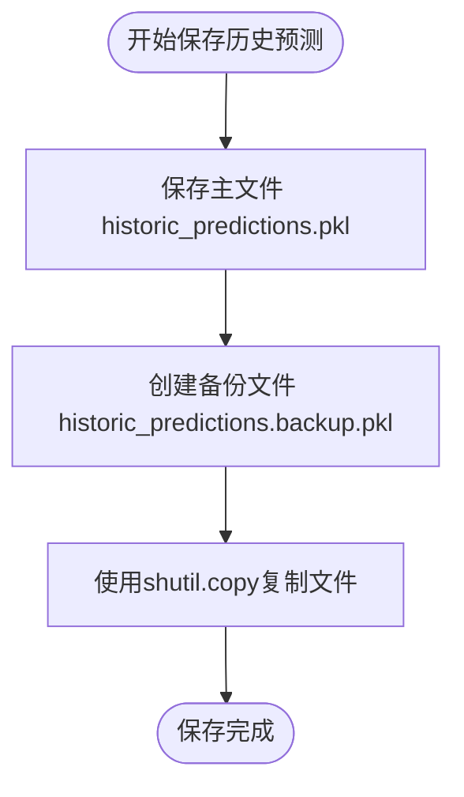
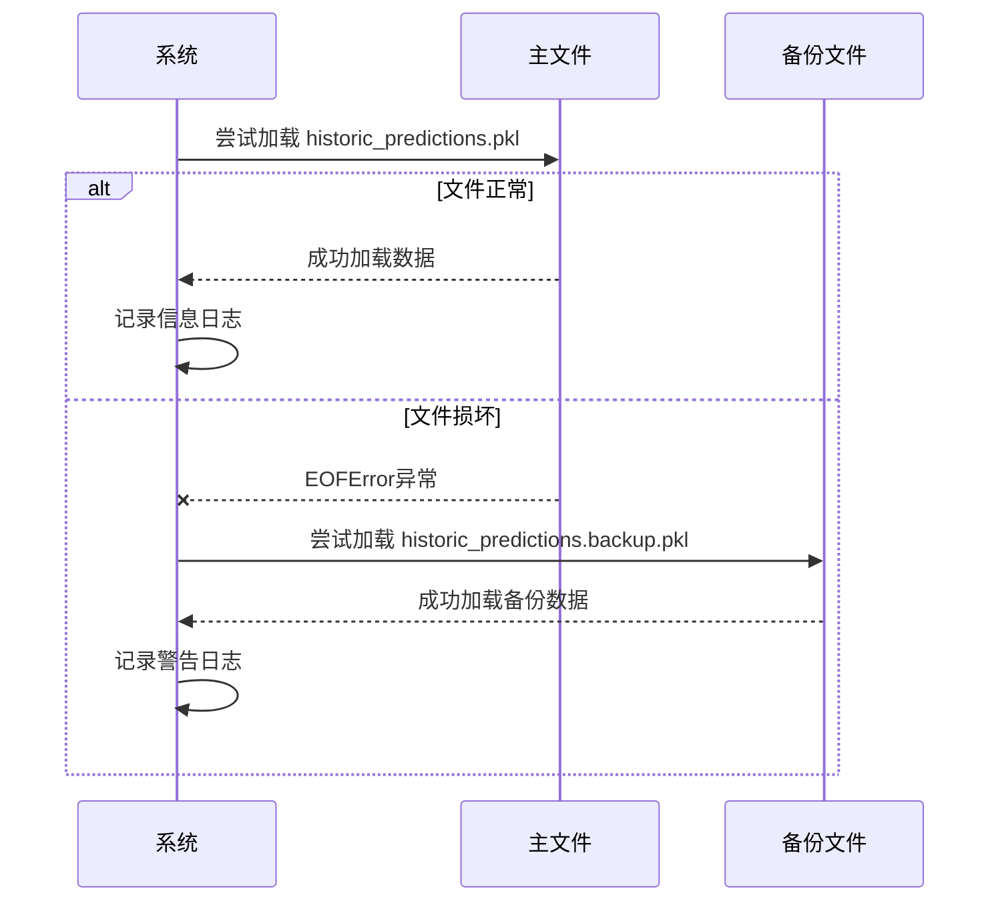
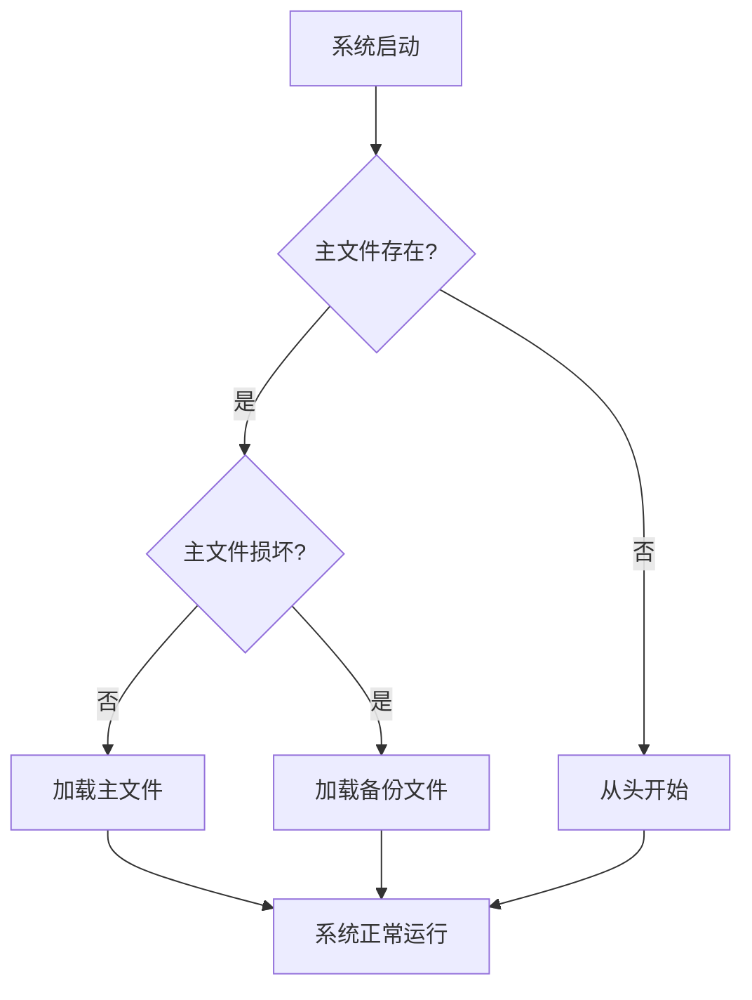
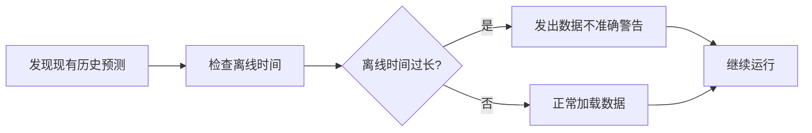

# 备份与恢复机制

<cite>
**Referenced Files in This Document**   
- [data_drawer.py](file://freqtrade/freqai/data_drawer.py)
- [data_kitchen.py](file://freqtrade/freqai/data_kitchen.py)
</cite>

## Table of Contents
1. [简介](#简介)
2. [备份机制](#备份机制)
3. [恢复机制](#恢复机制)
4. [系统可靠性分析](#系统可靠性分析)
5. [数据不准确警告](#数据不准确警告)
6. [结论](#结论)

## 简介
本文档全面阐述了FreqAI系统中历史预测数据的备份与恢复机制。系统通过自动创建备份文件和智能异常处理流程，确保在主文件损坏时能够无缝切换到备份文件，从而提高系统的可靠性和数据安全性。

**Section sources**
- [data_drawer.py](file://freqtrade/freqai/data_drawer.py#L1-L50)

## 备份机制
系统在每次保存`historic_predictions.pkl`文件后，会自动创建`historic_predictions.backup.pkl`备份文件。这一过程通过`save_historic_predictions_to_disk`方法实现，确保了数据的双重保护。

**Diagram sources **
- [data_drawer.py](file://freqtrade/freqai/data_drawer.py#L199-L207)

**Section sources**
- [data_drawer.py](file://freqtrade/freqai/data_drawer.py#L199-L207)

## 恢复机制
当主文件因EOFError损坏时，系统会自动切换到备份文件进行恢复。`load_historic_predictions_from_disk`方法首先尝试加载主文件，如果遇到EOFError，则会自动加载备份文件。

**Diagram sources **
- [data_drawer.py](file://freqtrade/freqai/data_drawer.py#L171-L197)

**Section sources**
- [data_drawer.py](file://freqtrade/freqai/data_drawer.py#L171-L197)

## 系统可靠性分析
该备份与恢复机制显著提升了系统的可靠性。通过双重文件保护策略，系统能够在主文件损坏的情况下继续运行，避免了因数据丢失导致的服务中断。

**Diagram sources **
- [data_drawer.py](file://freqtrade/freqai/data_drawer.py#L171-L207)

**Section sources**
- [data_drawer.py](file://freqtrade/freqai/data_drawer.py#L171-L207)

## 数据不准确警告
系统在长时间离线后可能出现数据不准确的情况。当成功加载历史预测文件时，系统会发出警告，提醒用户统计数据可能不准确。

**Diagram sources **
- [data_drawer.py](file://freqtrade/freqai/data_drawer.py#L180-L185)

**Section sources**
- [data_drawer.py](file://freqtrade/freqai/data_drawer.py#L180-L185)

## 结论
FreqAI系统的备份与恢复机制通过自动创建备份文件和智能异常处理，有效提高了系统的可靠性和数据安全性。该机制确保了在主文件损坏时能够无缝切换到备份文件，同时通过警告机制提醒用户潜在的数据不准确问题。

[No sources needed since this section summarizes without analyzing specific files]