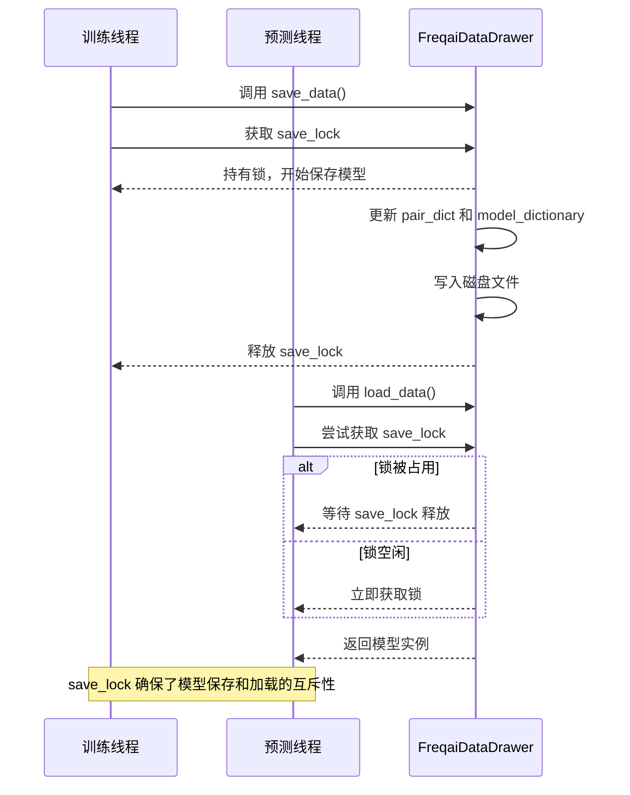
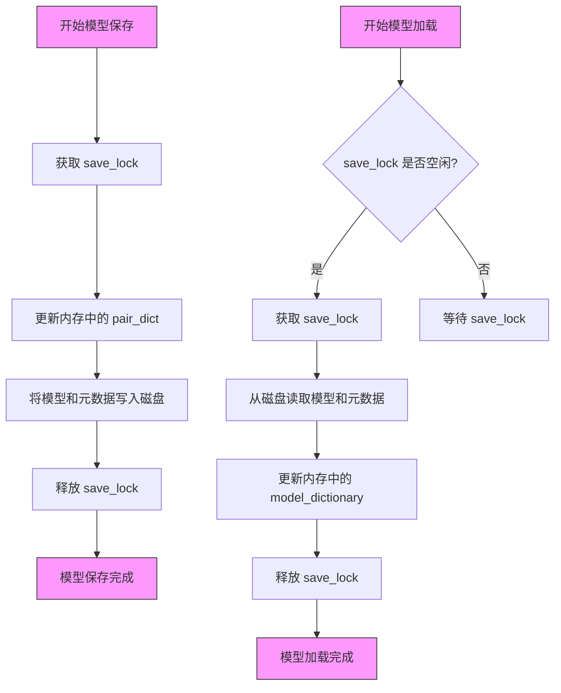

# 并发加载与线程同步机制

<cite>
**本文档引用文件**   
- [data_drawer.py](file://freqtrade/freqai/data_drawer.py)
</cite>

## 目录
1. [引言](#引言)
2. [核心数据结构与共享资源](#核心数据结构与共享资源)
3. [线程锁机制分析](#线程锁机制分析)
4. [模型训练与预测的并发执行](#模型训练与预测的并发执行)
5. [模型加载与保存的原子性保证](#模型加载与保存的原子性保证)
6. [总结](#总结)

## 引言
在多线程或异步环境下，模型的并发加载是机器学习系统面临的核心挑战之一。当多个线程同时访问共享数据结构时，极易发生竞态条件（race condition），导致数据不一致、程序崩溃或不可预测的行为。本文档深入探讨Freqtrade项目中FreqaiDataDrawer类所采用的线程同步机制，重点分析其如何通过多种线程锁（threading.Lock）来确保在高并发场景下的数据一致性和操作原子性。

FreqaiDataDrawer作为FreqAI模块的核心组件，负责在内存中持久化地管理所有交易对的模型和元数据。它需要在模型训练、预测、历史数据更新和文件持久化等多个操作之间进行协调。这些操作可能由不同的线程并发触发，因此，精心设计的锁机制是保证系统稳定运行的关键。

## 核心数据结构与共享资源
FreqaiDataDrawer类维护了多个关键的共享数据结构，这些结构在多线程环境中被频繁读写，是竞态条件的主要发生点。

**Section sources**
- [data_drawer.py](file://freqtrade/freqai/data_drawer.py#L73-L80)

### 共享数据结构
| 数据结构 | 作用 | 并发访问风险 |
| :--- | :--- | :--- |
| `pair_dict` | 字典，存储每个交易对的元数据，如模型文件名、训练时间戳和数据路径 | 多个线程同时训练不同交易对时，可能同时修改此字典，导致数据覆盖或不一致 |
| `historic_predictions` | 字典，存储每个交易对的历史预测结果，用于回测和UI展示 | 在预测和训练过程中，多个线程可能同时追加或读取预测结果，导致数据错乱 |
| `historic_data` | 嵌套字典，存储所有交易对和时间框架的历史K线数据 | 在更新历史数据时，多个线程可能同时向同一个数据帧追加新K线，破坏数据完整性 |
| `model_dictionary` | 字典，缓存已加载到内存中的模型实例，避免重复从磁盘加载 | 在模型加载和预测时，多个线程可能同时尝试加载或访问同一个模型，导致资源浪费或状态不一致 |
| `meta_data_dictionary` | 字典，存储模型的元数据、特征管道和标签管道 | 在模型加载和保存时，多个线程可能同时修改此字典，导致元数据不匹配 |

## 线程锁机制分析
FreqaiDataDrawer通过引入多个细粒度的线程锁，对不同作用域的共享资源进行保护，从而有效防止了竞态条件的发生。

**Section sources**
- [data_drawer.py](file://freqtrade/freqai/data_drawer.py#L94-L97)

### 线程锁作用域分析
```mermaid
classDiagram
class FreqaiDataDrawer {
+pair_dict : dict[str, pair_info]
+historic_predictions : dict[str, DataFrame]
+historic_data : dict[str, dict[str, DataFrame]]
+save_lock : threading.Lock
+history_lock : threading.Lock
+pair_dict_lock : threading.Lock
}
FreqaiDataDrawer --> "1" : 保护
FreqaiDataDrawer --> "2" : 保护
FreqaiDataDrawer --> "3" : 保护
FreqaiDataDrawer --> "4" : 使用
FreqaiDataDrawer --> "5" : 使用
FreqaiDataDrawer --> "6" : 使用
class SaveLock {
+作用域 : pair_dict, metric_tracker, global_metadata
}
class HistoryLock {
+作用域 : historic_data, historic_predictions
}
class PairDictLock {
+作用域 : pair_dict
}
FreqaiDataDrawer --> SaveLock : save_lock
FreqaiDataDrawer --> HistoryLock : history_lock
FreqaiDataDrawer --> PairDictLock : pair_dict_lock
```

**Diagram sources**
- [data_drawer.py](file://freqtrade/freqai/data_drawer.py#L94-L97)

#### history_lock
`history_lock` 是一个细粒度的锁，专门用于保护与历史数据相关的操作。其作用范围包括：
- `historic_data`：所有交易对的历史K线数据。
- `historic_predictions`：所有交易对的历史预测结果。

该锁在 `update_historic_data` 和 `get_base_and_corr_dataframes` 等方法中被使用。例如，在 `update_historic_data` 方法中，当从数据提供者（DataProvider）获取新K线并追加到内存中的历史数据时，会使用 `with self.history_lock:` 语句块来确保整个追加过程的原子性。这防止了多个线程同时修改同一个 `historic_data` 数据帧，从而避免了数据损坏。

#### save_lock
`save_lock` 是一个粗粒度的锁，用于保护所有与文件持久化相关的操作。其作用范围包括：
- `pair_dict`：通过 `save_drawer_to_disk` 方法保存。
- `metric_tracker`：通过 `save_metric_tracker_to_disk` 方法保存。
- `global_metadata`：通过 `save_global_metadata_to_disk` 方法保存。

该锁在所有 `save_*` 方法中被使用。由于文件I/O操作相对较慢，将所有保存操作串行化可以避免多个线程同时写入同一个文件，从而防止文件损坏。虽然这可能成为性能瓶颈，但保证了数据的最终一致性。

#### pair_dict_lock
`pair_dict_lock` 专门用于保护 `pair_dict` 字典的读写操作。尽管 `save_lock` 也保护了 `pair_dict` 的持久化，但 `pair_dict_lock` 提供了更细粒度的控制，允许在不进行文件I/O的情况下安全地更新内存中的元数据。例如，在 `get_pair_dict_info` 和 `set_pair_dict_info` 方法中，可能需要在不保存到磁盘的情况下查询或更新交易对的元信息，此时使用 `pair_dict_lock` 可以减少锁的竞争。

## 模型训练与预测的并发执行
在FreqAI系统中，模型的训练和预测可以并行执行，以提高系统的响应速度和吞吐量。线程锁机制在此场景下扮演着至关重要的角色。

**Section sources**
- [data_drawer.py](file://freqtrade/freqai/data_drawer.py#L503-L559)
- [data_drawer.py](file://freqtrade/freqai/data_drawer.py#L571-L629)

### 训练与预测流程


**Diagram sources**
- [data_drawer.py](file://freqtrade/freqai/data_drawer.py#L503-L559)
- [data_drawer.py](file://freqtrade/freqai/data_drawer.py#L571-L629)

当一个线程正在进行模型训练并调用 `save_data` 方法时，它会首先获取 `save_lock`。在此期间，如果另一个线程尝试为同一个或不同交易对进行预测并调用 `load_data` 方法，`load_data` 方法内部也会尝试获取 `save_lock`。由于锁已被占用，预测线程将被阻塞，直到训练线程完成模型的保存并释放锁。这种设计确保了在模型保存的整个过程中，不会有其他线程加载到一个“半成品”或不一致的模型状态。

## 模型加载与保存的原子性保证
虽然文档中未显式定义名为 `load_lock` 的锁，但 `save_lock` 的存在逻辑上确保了模型加载与保存操作的原子性。

**Section sources**
- [data_drawer.py](file://freqtrade/freqai/data_drawer.py#L222-L240)
- [data_drawer.py](file://freqtrade/freqai/data_drawer.py#L503-L559)

### 原子性操作流程


**Diagram sources**
- [data_drawer.py](file://freqtrade/freqai/data_drawer.py#L222-L240)
- [data_drawer.py](file://freqtrade/freqai/data_drawer.py#L503-L559)

`save_lock` 作为一个互斥锁（mutex），强制所有涉及模型持久化的操作（无论是保存还是加载）都必须按顺序执行。当一个线程持有 `save_lock` 时，其他所有需要该锁的线程都必须等待。这保证了以下原子性：
1.  **数据一致性**：在模型保存过程中，`pair_dict` 中的元数据（如 `model_filename`）和磁盘上的实际文件是同步更新的。其他线程在加载时，要么看到保存前的旧状态，要么看到保存后的完整新状态，而不会看到一个中间的、不一致的状态。
2.  **操作完整性**：整个保存过程（从更新内存到写入磁盘）被视为一个不可分割的单元。如果在保存过程中发生错误，`save_lock` 的释放会确保其他线程不会尝试加载一个损坏的模型。

## 总结
FreqaiDataDrawer通过精心设计的多级线程锁机制，成功解决了在多线程环境下模型并发加载的挑战。`history_lock`、`save_lock` 和 `pair_dict_lock` 各司其职，分别保护了历史数据、持久化操作和元数据字典。这种细粒度的锁策略在保证数据一致性和操作原子性的同时，也尽可能地减少了锁的竞争，提高了系统的并发性能。特别是 `save_lock` 的使用，逻辑上实现了 `load_lock` 的功能，确保了模型加载与保存操作的互斥性，是保证系统数据一致性的关键所在。