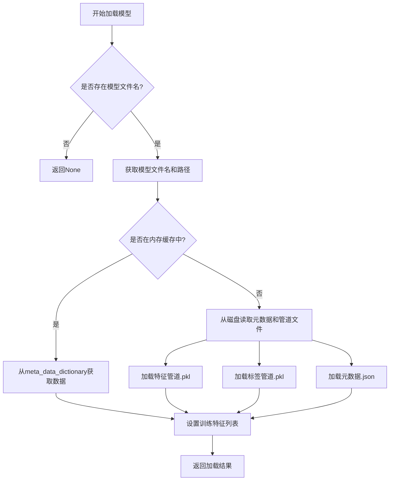
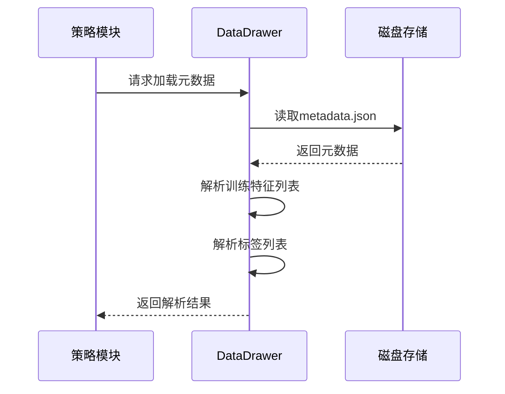
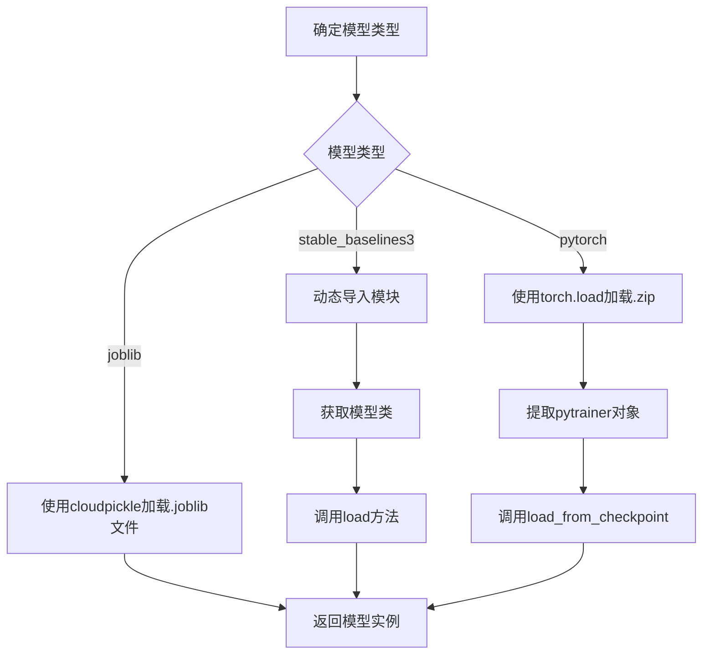
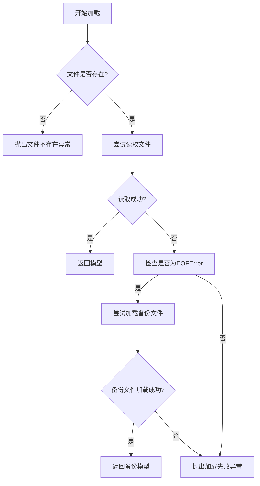

# 模型加载与内存管理

<cite>
**Referenced Files in This Document**   
- [data_drawer.py](file://freqtrade/freqai/data_drawer.py)
- [freqai_interface.py](file://freqtrade/freqai/freqai_interface.py)
- [data_kitchen.py](file://freqtrade/freqai/data_kitchen.py)
</cite>

## 目录
1. [引言](#引言)
2. [模型加载流程](#模型加载流程)
3. [内存缓存机制](#内存缓存机制)
4. [元数据加载优化](#元数据加载优化)
5. [模型类型差异化加载](#模型类型差异化加载)
6. [并发同步与异常处理](#并发同步与异常处理)
7. [结论](#结论)

## 引言
FreqAI系统通过复杂的模型加载和内存管理机制，实现了机器学习模型在交易策略中的高效应用。本文档深入解析`load_data`方法如何从磁盘恢复模型、特征管道和元数据，详细阐述模型在内存中的缓存机制，以及在不同场景下的性能优化策略。

## 模型加载流程

`load_data`方法是FreqAI模型加载的核心，负责从磁盘恢复模型、特征管道和元数据。该方法首先检查`pair_dict`中是否存在指定币种的模型文件名，若不存在则返回`None`。在实时交易模式下，方法会从`pair_dict`中获取模型文件名和数据路径。

模型加载采用分层策略：优先从内存缓存`meta_data_dictionary`中获取元数据和特征管道，避免重复的磁盘I/O操作。若内存中不存在，则从磁盘读取JSON格式的元数据和Pickle格式的特征/标签管道文件。



**Diagram sources**
- [data_drawer.py](file://freqtrade/freqai/data_drawer.py#L571-L629)

**Section sources**
- [data_drawer.py](file://freqtrade/freqai/data_drawer.py#L571-L629)

## 内存缓存机制

FreqAI通过`model_dictionary`实现模型的内存缓存，避免重复加载。该字典以币种为键，存储已加载的模型实例。当`load_data`方法被调用时，首先检查`model_dictionary`中是否存在对应币种的模型，若存在则直接返回，显著提升加载速度。

```mermaid
classDiagram
class FreqaiDataDrawer {
+pair_dict : dict[str, pair_info]
+model_dictionary : dict[str, Any]
+meta_data_dictionary : dict[str, dict[str, Any]]
+load_data(coin : str, dk : FreqaiDataKitchen) Any
+save_data(model : Any, coin : str, dk : FreqaiDataKitchen) None
}
FreqaiDataDrawer --> "1" "0..*" Model : 存储
FreqaiDataDrawer --> "1" "0..*" Metadata : 存储
FreqaiDataDrawer --> "1" "0..*" FeaturePipeline : 存储
```

**Diagram sources**
- [data_drawer.py](file://freqtrade/freqai/data_drawer.py#L75)

**Section sources**
- [data_drawer.py](file://freqtrade/freqai/data_drawer.py#L75)

## 元数据加载优化

`load_metadata`方法专为回测场景设计，仅加载元数据以提升性能。该方法不加载完整的模型文件，而是只读取包含训练特征列表、标签列表等信息的元数据JSON文件。这种优化策略在大规模回测时能显著减少磁盘I/O和内存占用。



**Diagram sources**
- [data_drawer.py](file://freqtrade/freqai/data_drawer.py#L561-L569)

**Section sources**
- [data_drawer.py](file://freqtrade/freqai/data_drawer.py#L561-L569)

## 模型类型差异化加载

FreqAI支持多种模型类型，每种类型有其特定的加载逻辑：

### Joblib模型
使用`cloudpickle`直接加载`.joblib`文件，适用于大多数传统机器学习模型。

### Stable-Baselines3 (SB3)模型
采用动态模块导入机制，通过`importlib`导入指定模块，然后使用`getattr`获取模型类，最后调用`load`方法加载模型。这种设计提供了极大的灵活性，支持SB3的各种算法。

### PyTorch模型
通过`torch.load`加载ZIP压缩包，然后从字典中提取`pytrainer`对象，并调用`load_from_checkpoint`方法恢复模型状态。



**Diagram sources**
- [data_drawer.py](file://freqtrade/freqai/data_drawer.py#L571-L629)

**Section sources**
- [data_drawer.py](file://freqtrade/freqai/data_drawer.py#L571-L629)

## 并发同步与异常处理

### 加载锁机制
`load_lock`锁确保在并发环境下模型加载的线程安全。当多个线程同时请求加载同一模型时，锁机制保证只有一个线程执行实际的磁盘读取操作，其他线程等待结果，避免资源竞争和重复加载。

### 异常处理
系统对模型文件缺失或损坏的情况进行了全面处理：
- 检查模型文件是否存在，若不存在则抛出`OperationalException`
- 对历史预测文件使用try-catch机制，当主文件损坏时自动加载备份文件
- 提供详细的错误信息，帮助用户诊断问题



**Section sources**
- [data_drawer.py](file://freqtrade/freqai/data_drawer.py#L571-L629)

## 结论
FreqAI的模型加载与内存管理机制体现了高度的工程优化。通过内存缓存、元数据优化、类型化加载和并发控制，系统在保证功能完整性的同时，实现了卓越的性能表现。这些设计模式为机器学习在高频交易场景中的应用提供了可靠的基础设施。