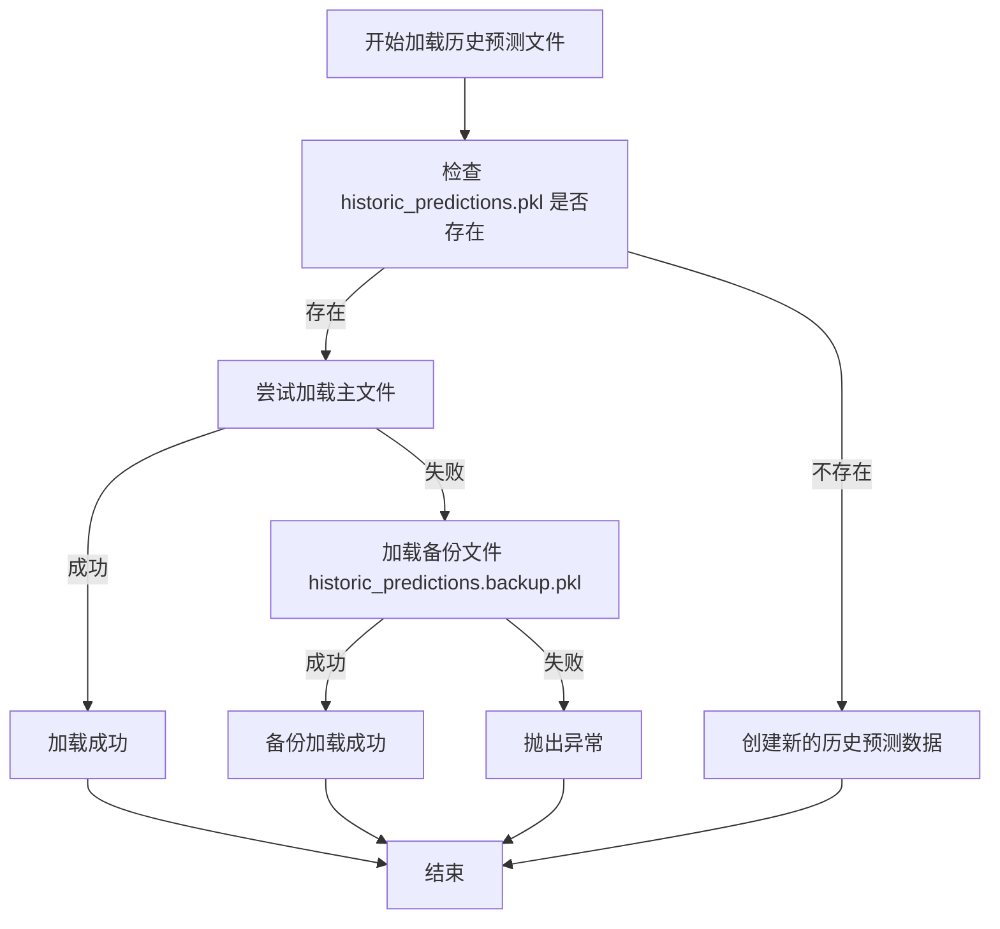

# 模型加载异常处理与容错机制

<cite>
**本文档引用的文件**
- [data_drawer.py](file://freqtrade/freqai/data_drawer.py#L171-L197)
- [data_drawer.py](file://freqtrade/freqai/data_drawer.py#L571-L629)
- [exceptions.py](file://freqtrade/exceptions.py#L7-L11)
- [data_drawer.py](file://freqtrade/freqai/data_drawer.py#L83-L85)
</cite>

## 目录
1. [简介](#简介)
2. [模型文件缺失处理](#模型文件缺失处理)
3. [文件损坏异常处理](#文件损坏异常处理)
4. [元数据不匹配处理](#元数据不匹配处理)
5. [异常捕获与日志记录](#异常捕获与日志记录)
6. [备份恢复机制](#备份恢复机制)
7. [系统中断与用户指导](#系统中断与用户指导)

## 简介
本文档系统性地分析了Freqtrade系统中模型加载过程中可能遇到的各类异常情况及其处理策略。重点阐述了在模型加载失败时的容错机制，包括对模型文件缺失、文件损坏和元数据不匹配等场景的处理方法。文档详细说明了系统如何通过异常捕获、日志记录和备份恢复等机制确保系统的稳定性和可靠性。

**Section sources**
- [data_drawer.py](file://freqtrade/freqai/data_drawer.py#L571-L629)

## 模型文件缺失处理
当模型文件缺失时，系统通过检查`model_filename`字段的值来判断文件是否存在。如果`model_filename`为空或对应的文件不存在，系统将返回None值，表示无法加载模型。这种检查机制在`load_data`方法中实现，确保在尝试加载不存在的模型文件之前就进行预判，避免了不必要的文件操作和异常抛出。

**Section sources**
- [data_drawer.py](file://freqtrade/freqai/data_drawer.py#L571-L575)

## 文件损坏异常处理
系统在加载历史预测文件时采用了完善的文件损坏处理机制。当尝试加载`historic_predictions.pkl`文件时，如果文件已损坏导致反序列化失败，系统会捕获`EOFError`异常。捕获异常后，系统会自动尝试从备份文件`historic_predictions.backup.pkl`中加载数据，确保即使主文件损坏，系统仍能恢复之前的历史预测数据。

**Diagram sources**
- [data_drawer.py](file://freqtrade/freqai/data_drawer.py#L171-L197)
- [data_drawer.py](file://freqtrade/freqai/data_drawer.py#L83-L85)

## 元数据不匹配处理
在模型加载过程中，系统会验证元数据的完整性。当加载`metadata.json`文件时，系统会检查训练特征列表和标签列表等关键元数据。如果发现元数据不匹配或缺失，系统会通过日志记录详细的错误信息，并在必要时中断加载流程。这种机制确保了模型与数据之间的兼容性，防止因元数据不一致导致的预测错误。

**Section sources**
- [data_drawer.py](file://freqtrade/freqai/data_drawer.py#L585-L590)

## 异常捕获与日志记录
系统在`load_data`方法中使用了try-catch块来捕获各种可能的异常。当模型加载失败时，系统会通过logger记录详细的错误信息，包括错误类型、发生位置和可能的原因。日志记录不仅帮助用户诊断问题，也为系统的调试和维护提供了重要依据。详细的错误信息有助于用户快速定位和解决问题。

**Section sources**
- [data_drawer.py](file://freqtrade/freqai/data_drawer.py#L617-L622)
- [exceptions.py](file://freqtrade/exceptions.py#L7-L11)

## 备份恢复机制
系统实现了自动化的备份恢复机制来保护历史预测数据。每次保存`historic_predictions.pkl`文件时，系统会自动创建一个备份文件`historic_predictions.backup.pkl`。当主文件损坏或加载失败时，系统能够无缝切换到备份文件，确保数据的完整性和可用性。这种双重保护机制大大提高了系统的容错能力。

**Diagram sources**
- [data_drawer.py](file://freqtrade/freqai/data_drawer.py#L199-L207)

## 系统中断与用户指导
当模型加载失败且无法通过备份恢复时，系统会通过抛出`OperationalException`来中断流程。这种设计确保了系统不会在错误的模型状态下继续运行，避免了潜在的交易风险。异常信息会明确指导用户检查模型路径和配置，帮助用户快速定位问题根源。系统通过这种方式实现了安全的故障保护机制。

**Section sources**
- [data_drawer.py](file://freqtrade/freqai/data_drawer.py#L617-L622)
- [exceptions.py](file://freqtrade/exceptions.py#L7-L11)