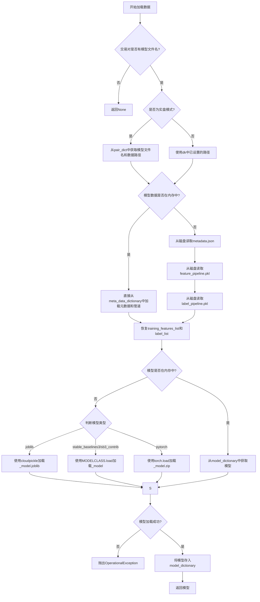
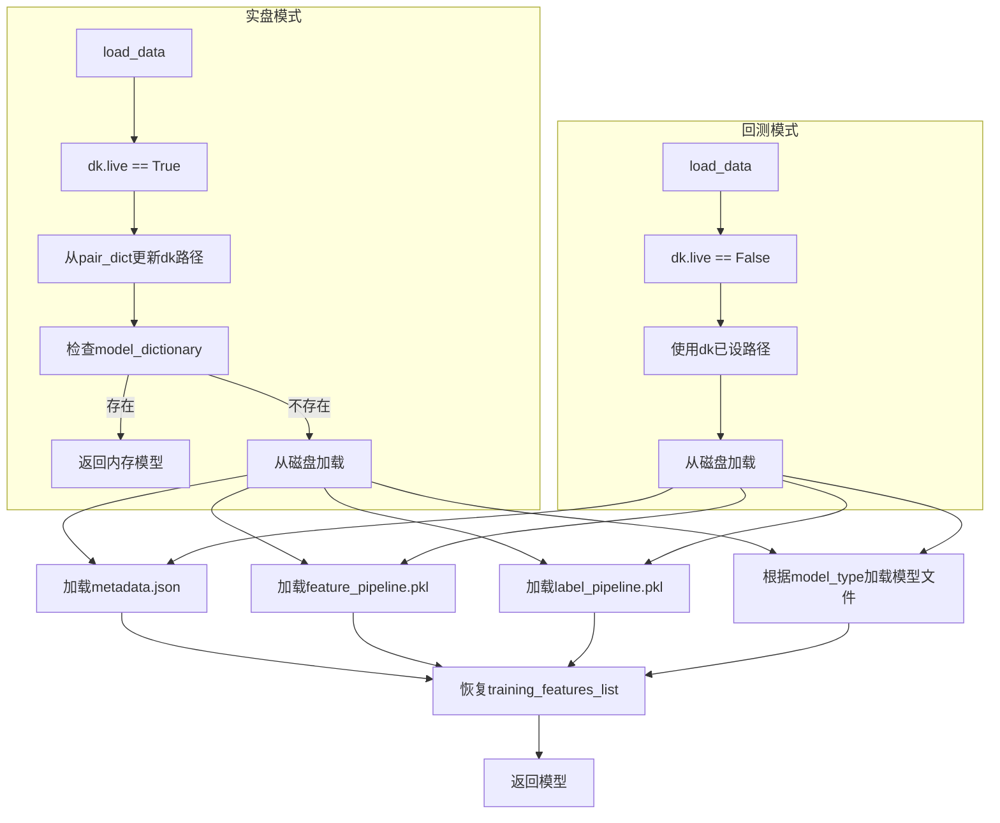
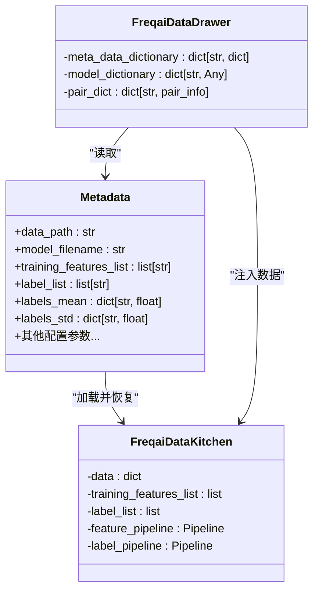
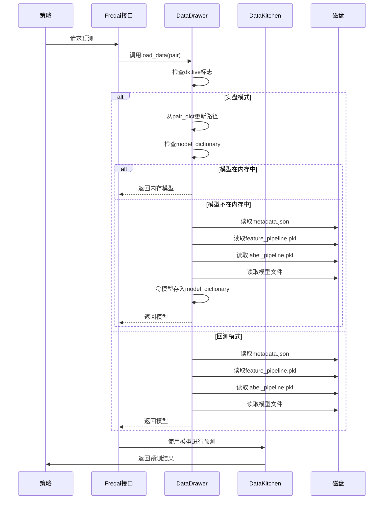

# 模型加载流程详解

<cite>
**Referenced Files in This Document**   
- [data_drawer.py](file://freqtrade/freqai/data_drawer.py)
- [data_kitchen.py](file://freqtrade/freqai/data_kitchen.py)
</cite>

## 目录
1. [引言](#引言)
2. [模型加载核心流程](#模型加载核心流程)
3. [回测与实盘模式差异](#回测与实盘模式差异)
4. [模型元数据结构与作用](#模型元数据结构与作用)
5. [多格式模型加载路径](#多格式模型加载路径)
6. [数据流与组件交互](#数据流与组件交互)
7. [结论](#结论)

## 引言

FreqAI是Freqtrade框架中的机器学习模块，用于实现基于AI的交易策略。其核心功能之一是模型的持久化存储与动态加载。本文档深入解析FreqAI中模型加载的完整流程，重点阐述`FreqaiDataDrawer`类的`load_data`方法如何根据交易对（pair）从磁盘加载模型文件、特征管道（feature_pipeline）和标签管道（label_pipeline）。文档将详细说明在回测与实盘模式下加载逻辑的差异，特别是`dk.live`标志位的影响，并解释模型元数据（metadata）的结构及其在预测过程中的作用。

## 模型加载核心流程

模型加载的核心逻辑由`FreqaiDataDrawer.load_data`方法实现。该方法负责为指定的交易对加载所有必要的数据，以进行预测。



**Diagram sources**
- [data_drawer.py](file://freqtrade/freqai/data_drawer.py#L571-L629)

**Section sources**
- [data_drawer.py](file://freqtrade/freqai/data_drawer.py#L571-L629)

## 回测与实盘模式差异

`dk.live`标志位是区分回测（backtesting）与实盘（live）模式的关键，它直接影响模型加载的路径和行为。

### 实盘模式 (dk.live = True)

在实盘模式下，`load_data`方法会优先从内存中查找模型，以提高加载速度。其流程如下：
1.  **路径设置**：首先，方法会根据`pair_dict`中的信息，更新`dk.model_filename`和`dk.data_path`。这确保了即使在模型重训练后，也能正确指向最新的模型文件。
2.  **内存优先**：方法会检查`model_dictionary`字典，如果模型已存在于内存中，则直接返回，避免了昂贵的磁盘I/O操作。
3.  **元数据缓存**：`meta_data_dictionary`字典用于缓存已加载的元数据和管道，避免重复从磁盘读取。

### 回测模式 (dk.live = False)

在回测模式下，加载逻辑更侧重于数据的完整性和可复现性：
1.  **路径继承**：`dk`对象在初始化时已经通过`set_paths`等方法设置了正确的`data_path`和`model_filename`，因此不会从`pair_dict`中重新获取。
2.  **无内存缓存**：回测过程通常是顺序执行的，且对性能要求相对较低，因此不会将模型长期驻留在`model_dictionary`中。
3.  **直接磁盘读取**：每次预测都可能需要从磁盘重新加载模型，以确保使用的是与特定时间窗口完全匹配的模型版本。



**Diagram sources**
- [data_drawer.py](file://freqtrade/freqai/data_drawer.py#L571-L629)
- [data_kitchen.py](file://freqtrade/freqai/data_kitchen.py#L52-L88)

**Section sources**
- [data_drawer.py](file://freqtrade/freqai/data_drawer.py#L571-L629)

## 模型元数据结构与作用

模型元数据（metadata）是连接训练与预测的关键桥梁，它以JSON文件的形式（`{model_filename}_metadata.json`）存储在磁盘上。

### 元数据结构

元数据是一个包含多种信息的字典，其核心字段包括：
- **`training_features_list`**: 字符串列表，记录了模型在训练时所使用的全部特征名称。在预测时，必须确保输入数据的特征列与该列表完全一致。
- **`label_list`**: 字符串列表，记录了模型所预测的标签名称。
- **`data_path` 和 `model_filename`**: 模型文件的存储路径和文件名，用于定位其他相关文件。
- **`labels_mean` 和 `labels_std`**: 用于标签数据标准化的均值和标准差，是进行预测后处理（如反归一化）所必需的参数。

### 元数据在预测中的作用

1.  **特征对齐**：在预测前，系统会根据`training_features_list`从原始数据中筛选出正确的特征列，确保输入数据的维度和顺序与训练时完全相同。
2.  **标签恢复**：`label_list`被直接赋值给`dk.label_list`，供后续的策略逻辑使用。
3.  **数据标准化**：`labels_mean`和`labels_std`被用于反归一化预测结果，将模型输出的标准化数值转换回原始的价格或指标空间，使其具有实际意义。



**Diagram sources**
- [data_drawer.py](file://freqtrade/freqai/data_drawer.py#L571-L629)

**Section sources**
- [data_drawer.py](file://freqtrade/freqai/data_drawer.py#L571-L629)

## 多格式模型加载路径

`FreqaiDataDrawer`支持多种机器学习框架的模型格式，其加载路径由`model_type`配置项决定。

### 加载路径分析

1.  **Joblib (model_type = "joblib")**:
    *   **文件名**: `{model_filename}_model.joblib`
    *   **加载方式**: 使用`cloudpickle.load()`从`.joblib`文件中反序列化模型对象。这是一种通用的Python对象持久化方法。

2.  **Stable-Baselines3 (model_type = "stable_baselines3" 或 "sb3_contrib")**:
    *   **文件名**: `{model_filename}_model` (无扩展名，实际为一个包含多个文件的目录)
    *   **加载方式**: 通过`importlib`动态导入对应的模型类（如`PPO`, `A2C`），然后调用该类的静态`load()`方法。这是Stable-Baselines3框架的标准加载方式。

3.  **PyTorch (model_type = "pytorch")**:
    *   **文件名**: `{model_filename}_model.zip`
    *   **加载方式**: 使用`torch.load()`加载一个ZIP压缩包。该包内包含模型的权重和结构信息。代码中通过`zipfile["pytrainer"]`获取训练器对象，再调用`load_from_checkpoint()`来重建模型。

4.  **Keras (model_type = "keras")**:
    *   **文件名**: `{model_filename}_model.h5`
    *   **加载方式**: 调用模型自身的`save()`方法，直接保存为HDF5格式。加载时使用`keras.models.load_model()`。

```mermaid
flowchart TD
A[load_data] --> B{判断model_type}
B --> C[model_type == "joblib"]
B --> D[model_type == "stable_baselines3" or "sb3_contrib"]
B --> E[model_type == "pytorch"]
B --> F[model_type == "keras"]
C --> G[使用cloudpickle.load()加载_model.joblib]
D --> H[动态导入模块并调用MODELCLASS.load()]
E --> I[使用torch.load()加载_model.zip]
F --> J[调用model.save()保存为_model.h5]
G --> K[返回模型]
H --> K
I --> K
J --> K
```

**Diagram sources**
- [data_drawer.py](file://freqtrade/freqai/data_drawer.py#L571-L629)

**Section sources**
- [data_drawer.py](file://freqtrade/freqai/data_drawer.py#L503-L559)

## 数据流与组件交互

模型加载是FreqAI数据流中的一个关键环节，它连接了数据存储、模型管理和策略执行。



**Diagram sources**
- [data_drawer.py](file://freqtrade/freqai/data_drawer.py#L571-L629)
- [data_kitchen.py](file://freqtrade/freqai/data_kitchen.py#L52-L88)

**Section sources**
- [data_drawer.py](file://freqtrade/freqai/data_drawer.py#L571-L629)

## 结论

FreqAI的模型加载机制设计精巧，通过`FreqaiDataDrawer`类实现了高效、灵活的模型管理。其核心特点包括：
1.  **模式自适应**：通过`dk.live`标志位，智能地在实盘和回测模式下采用不同的加载策略，兼顾了实盘的性能要求和回测的准确性。
2.  **内存缓存优化**：在实盘模式下，利用`model_dictionary`和`meta_data_dictionary`字典缓存模型和元数据，显著减少了磁盘I/O，提升了预测速度。
3.  **多格式支持**：通过`model_type`配置，无缝支持Joblib、Stable-Baselines3和PyTorch等多种主流机器学习框架，增强了系统的通用性。
4.  **元数据驱动**：`metadata.json`文件作为“模型身份证”，确保了预测时的特征、标签和数据处理流程与训练时完全一致，是保证预测结果可靠性的基石。

理解这一流程对于开发和调试基于FreqAI的策略至关重要，它为构建稳定、高效的AI交易系统提供了坚实的基础。