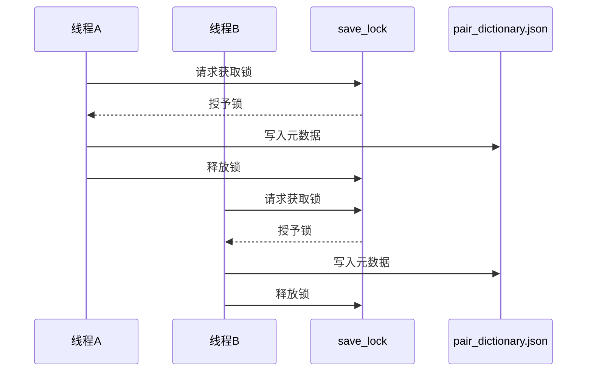
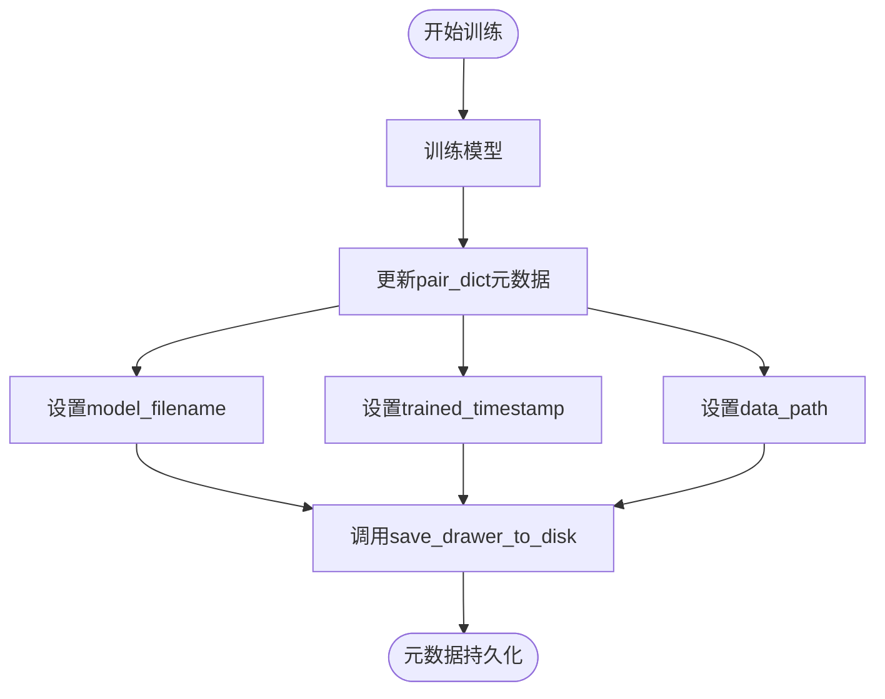
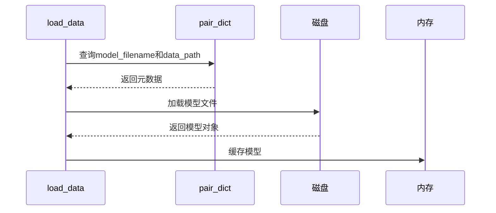

# 元数据同步机制

<cite>
**本文档中引用的文件**  
- [data_drawer.py](file://freqtrade/freqai/data_drawer.py)
</cite>

## 目录
1. [引言](#引言)
2. [核心组件](#核心组件)
3. [元数据文件结构](#元数据文件结构)
4. [线程安全机制](#线程安全机制)
5. [元数据维护逻辑](#元数据维护逻辑)
6. [模型加载与管理](#模型加载与管理)
7. [结论](#结论)

## 引言
FreqAI系统通过精细化的元数据管理机制来支持机器学习模型的训练、推理和持久化。该机制的核心是`pair_dictionary.json`文件，它存储了所有交易对模型的关键元数据。本文档深入解析这一元数据同步机制，重点说明`pair_dictionary.json`文件的结构和作用，以及`save_drawer_to_disk`方法如何在多线程环境下安全地更新元数据文件。

## 核心组件

FreqAI的元数据管理主要由`FreqaiDataDrawer`类负责，该类在内存中维护所有交易对的模型信息，并负责与磁盘上的元数据文件进行同步。其核心功能包括加载、保存和更新元数据，确保模型信息在训练和推理过程中的持久性和一致性。

**Section sources**
- [data_drawer.py](file://freqtrade/freqai/data_drawer.py#L45-L764)

## 元数据文件结构

`pair_dictionary.json`文件是FreqAI系统中存储模型元数据的核心文件。该文件以JSON格式存储一个字典，其中每个键为交易对名称，值为包含模型相关信息的字典。根据代码分析，该文件的结构如下：

```json
{
  "交易对名称": {
    "model_filename": "模型文件名",
    "trained_timestamp": 时间戳,
    "data_path": "数据路径",
    "extras": {}
  }
}
```

其中，`model_filename`字段存储模型的唯一文件名，`trained_timestamp`字段记录模型最后一次训练的时间戳，`data_path`字段存储模型相关数据的存储路径。这些元数据为模型的加载和管理提供了必要的信息。

**Section sources**
- [data_drawer.py](file://freqtrade/freqai/data_drawer.py#L73-L73)

## 线程安全机制

在多线程环境下，对共享资源的并发访问可能导致数据竞争和不一致。FreqAI通过`save_lock`锁机制来确保`pair_dictionary.json`文件的写操作是线程安全的。`save_drawer_to_disk`方法在执行文件写入操作前会获取`save_lock`，从而防止多个线程同时修改元数据文件。



**Diagram sources**
- [data_drawer.py](file://freqtrade/freqai/data_drawer.py#L222-L230)

**Section sources**
- [data_drawer.py](file://freqtrade/freqai/data_drawer.py#L222-L230)

## 元数据维护逻辑

`pair_dict`字典是内存中维护元数据的核心数据结构。当模型训练完成后，`save_data`方法会更新`pair_dict`中的相应条目，设置`model_filename`、`trained_timestamp`和`data_path`等字段。这些更新随后通过`save_drawer_to_disk`方法持久化到`pair_dictionary.json`文件中。



**Diagram sources**
- [data_drawer.py](file://freqtrade/freqai/data_drawer.py#L580-L610)

**Section sources**
- [data_drawer.py](file://freqtrade/freqai/data_drawer.py#L580-L610)

## 模型加载与管理

元数据在模型加载过程中起着关键作用。`load_data`方法通过查询`pair_dict`获取模型的文件名和路径，然后从磁盘加载相应的模型文件。这种基于元数据的加载机制确保了系统能够准确地定位和加载正确的模型版本，支持模型的版本管理和回滚。



**Diagram sources**
- [data_drawer.py](file://freqtrade/freqai/data_drawer.py#L620-L680)

**Section sources**
- [data_drawer.py](file://freqtrade/freqai/data_drawer.py#L620-L680)

## 结论
FreqAI的元数据同步机制通过`pair_dictionary.json`文件和`FreqaiDataDrawer`类实现了模型信息的持久化和一致性管理。`save_lock`锁机制确保了多线程环境下的数据安全，而`pair_dict`字典的维护逻辑则支持了模型的加载和管理。这一机制为FreqAI系统的稳定运行提供了坚实的基础。