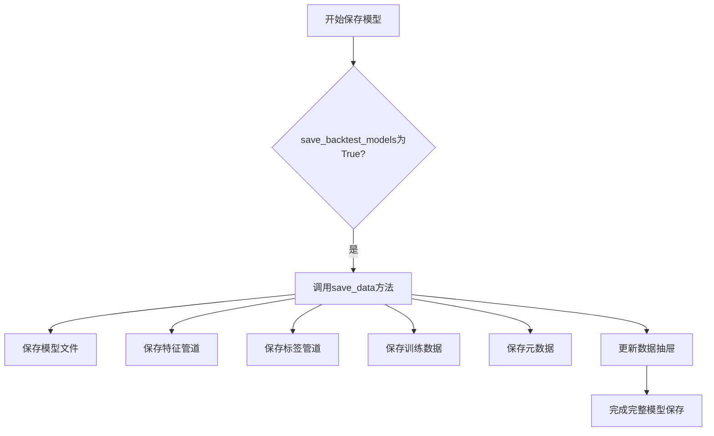
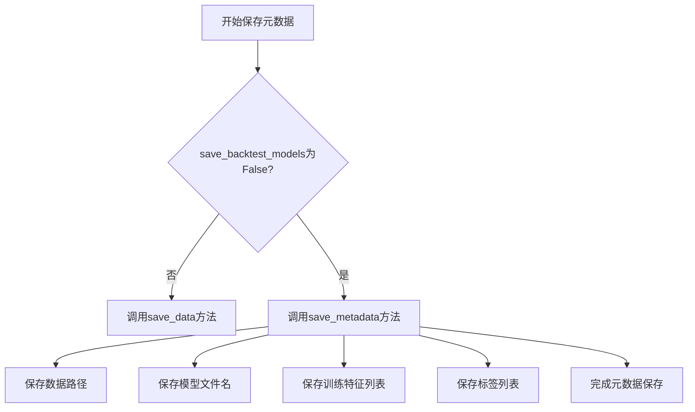

# 回测模型持久化策略

<cite>
**本文档中引用的文件**  
- [freqai_interface.py](file://freqtrade/freqai/freqai_interface.py)
- [data_drawer.py](file://freqtrade/freqai/data_drawer.py)
</cite>

## 目录
1. [简介](#简介)
2. [save_backtest_models配置项分析](#save_backtest_models配置项分析)
3. [完整模型保存策略](#完整模型保存策略)
4. [元数据保存策略](#元数据保存策略)
5. [metadata.json文件内容分析](#metadata.json文件内容分析)
6. [设计权衡与应用场景](#设计权衡与应用场景)

## 简介
本文档详细说明了Freqtrade系统中`save_backtest_models`配置项对回测模型持久化行为的控制机制。该配置项允许用户在进行大规模回测研究时，根据存储空间和分析需求在完整保存模型与仅保存元数据之间进行权衡。文档将深入分析当该配置为true时调用`save_data`方法完整保存模型与相关数据，和为false时仅调用`save_metadata`方法保存元数据的两种策略。

**Section sources**
- [freqai_interface.py](file://freqtrade/freqai/freqai_interface.py#L72)
- [data_drawer.py](file://freqtrade/freqai/data_drawer.py#L481)

## save_backtest_models配置项分析
`save_backtest_models`是FreqAI模块中的一个关键配置项，用于控制回测过程中模型的持久化行为。该配置项在`IFreqaiModel`类的初始化方法中被读取和设置：

```python
self.save_backtest_models: bool = self.freqai_info.get("save_backtest_models", True)
```

此配置项的默认值为`True`，意味着在回测过程中会完整保存所有训练的模型。当配置为`True`时，系统会调用`save_data`方法保存完整的模型文件、数据管道和训练数据；当配置为`False`时，系统仅调用`save_metadata`方法保存模型的元数据信息。这种设计使得用户可以根据具体需求在存储空间和模型可复用性之间进行权衡。

**Section sources**
- [freqai_interface.py](file://freqtrade/freqai/freqai_interface.py#L72)

## 完整模型保存策略
当`save_backtest_models`配置为`True`时，系统采用完整模型保存策略，调用`FreqaiDataDrawer`类的`save_data`方法。该策略会保存所有与模型相关的数据，包括：

1. **训练好的模型文件**：根据模型类型（joblib、keras、stable_baselines3等）保存为相应的文件格式
2. **数据管道**：保存特征工程和标签处理的管道对象
3. **训练数据**：保存用于训练的特征数据和日期数据
4. **元数据**：保存模型路径、文件名、特征列表和标签列表等信息

这种策略确保了模型可以被完全复用，支持后续的详细分析、验证和部署。完整保存的模型可以直接用于实时交易或进一步的回测研究，无需重新训练。



**Diagram sources**
- [data_drawer.py](file://freqtrade/freqai/data_drawer.py#L503)

**Section sources**
- [data_drawer.py](file://freqtrade/freqai/data_drawer.py#L503)

## 元数据保存策略
当`save_backtest_models`配置为`False`时，系统采用元数据保存策略，调用`FreqaiDataDrawer`类的`save_metadata`方法。该策略仅保存模型的关键元数据信息，包括：

1. **数据路径**：模型数据的存储路径
2. **模型文件名**：模型的唯一标识名称
3. **训练特征列表**：用于训练的特征名称列表
4. **标签列表**：预测目标的标签名称列表

这种策略显著减少了存储空间的占用，特别适用于大规模回测研究。虽然无法直接复用模型进行预测，但保存的元数据足以支持回测结果的分析和验证，同时保留了模型的关键配置信息。



**Diagram sources**
- [data_drawer.py](file://freqtrade/freqai/data_drawer.py#L481)

**Section sources**
- [data_drawer.py](file://freqtrade/freqai/data_drawer.py#L481)

## metadata.json文件内容分析
`metadata.json`文件是元数据保存策略的核心，包含了模型的关键信息。该文件通过`save_metadata`方法创建，其内容包括：

- **data_path**: 模型数据的存储路径
- **model_filename**: 模型的唯一文件名
- **training_features_list**: 训练特征的名称列表
- **label_list**: 预测标签的名称列表

这些信息对于模型的管理和后续分析至关重要。即使不保存完整的模型文件，这些元数据也足以验证模型的配置一致性、特征工程的正确性以及回测结果的可靠性。在需要重新训练模型时，这些元数据可以作为重要的参考依据。

**Section sources**
- [data_drawer.py](file://freqtrade/freqai/data_drawer.py#L481-L501)

## 设计权衡与应用场景
`save_backtest_models`配置项的设计体现了在模型完整性和存储效率之间的精心权衡：

1. **完整模型保存（save_backtest_models=True）**：
   - 优势：支持模型复用、详细分析和部署
   - 适用场景：小规模回测、模型验证、生产环境部署

2. **元数据保存（save_backtest_models=False）**：
   - 优势：显著节省存储空间，提高回测效率
   - 适用场景：大规模参数优化、网格搜索、超参数调优

这种设计使得Freqtrade系统能够灵活适应不同的研究需求。用户可以在初步探索阶段使用元数据保存策略快速完成大量回测，然后在确定最佳参数组合后，使用完整模型保存策略进行详细的模型分析和验证。

**Section sources**
- [freqai_interface.py](file://freqtrade/freqai/freqai_interface.py#L72)
- [data_drawer.py](file://freqtrade/freqai/data_drawer.py#L481)
- [data_drawer.py](file://freqtrade/freqai/data_drawer.py#L503)