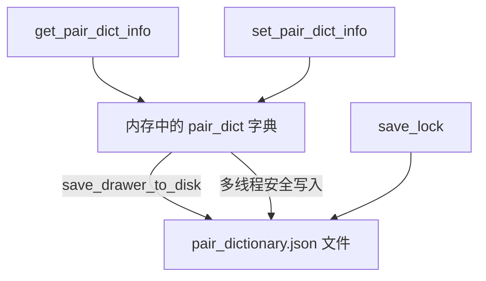
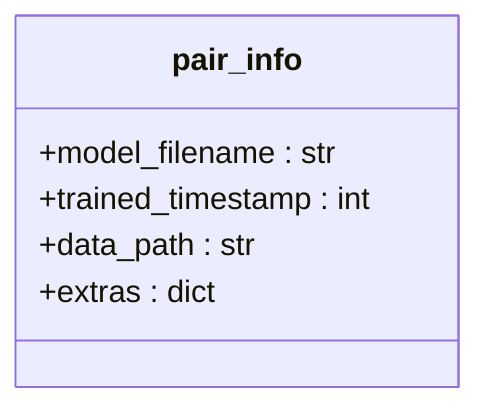
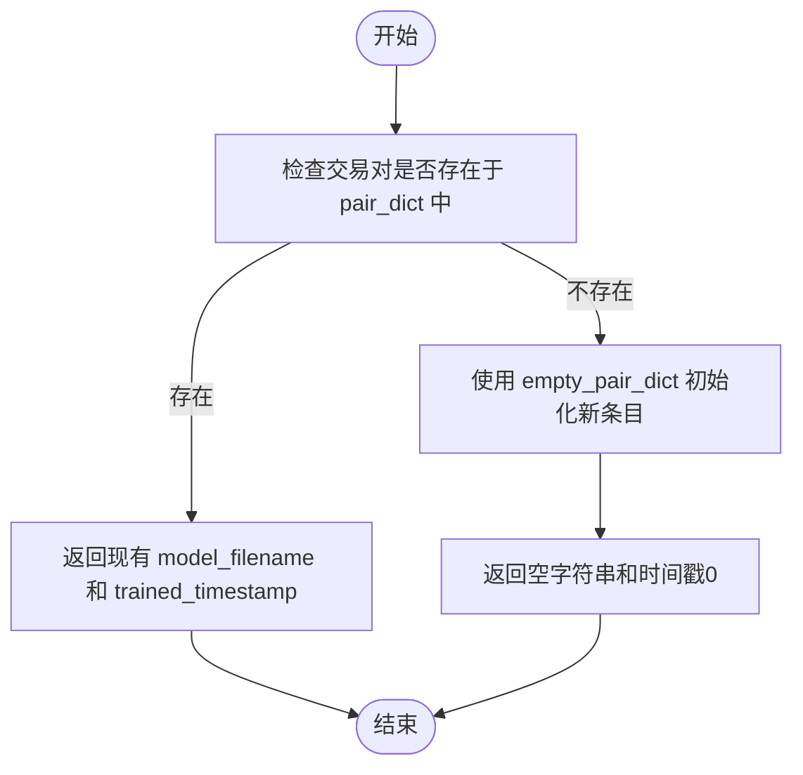
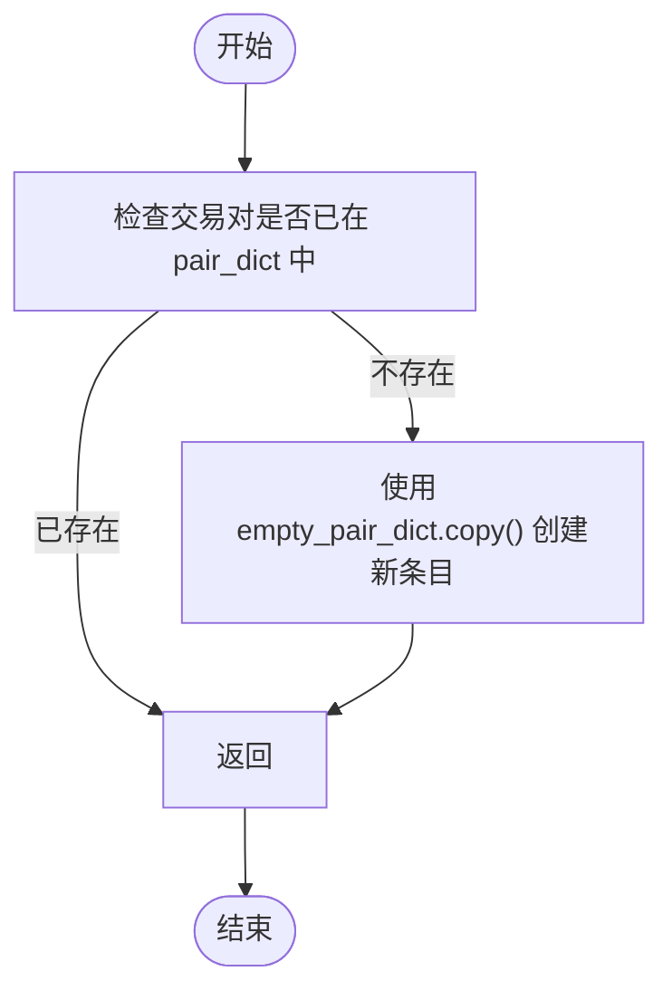
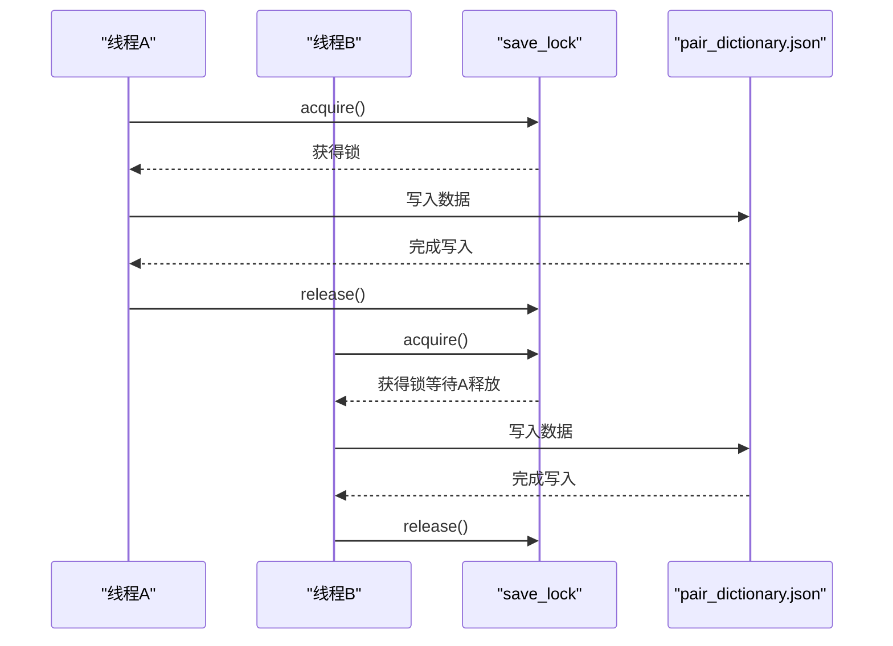
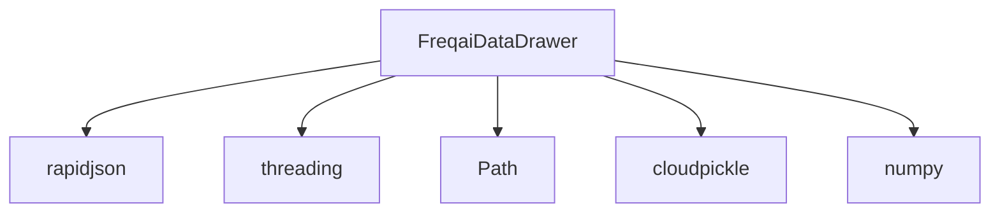

# 模型元数据维护

<cite>
**Referenced Files in This Document**  
- [data_drawer.py](file://freqtrade/freqai/data_drawer.py#L38-L42)
- [data_drawer.py](file://freqtrade/freqai/data_drawer.py#L73-L73)
- [data_drawer.py](file://freqtrade/freqai/data_drawer.py#L99-L104)
- [data_drawer.py](file://freqtrade/freqai/data_drawer.py#L95-L95)
- [data_drawer.py](file://freqtrade/freqai/data_drawer.py#L246-L267)
- [data_drawer.py](file://freqtrade/freqai/data_drawer.py#L269-L275)
</cite>

## 目录
1. [简介](#简介)
2. [核心组件](#核心组件)
3. [架构概述](#架构概述)
4. [详细组件分析](#详细组件分析)
5. [依赖分析](#依赖分析)
6. [性能考虑](#性能考虑)
7. [故障排除指南](#故障排除指南)
8. [结论](#结论)

## 简介
本文档全面介绍FreqAI模块中用于维护模型元数据的核心机制。重点阐述`pair_dict`字典在内存中存储和管理各交易对模型元数据的作用，以及`save_lock`锁如何确保多线程环境下的数据一致性。

## 核心组件
本文档分析的核心组件包括`pair_dict`字典、`pair_info`类型定义、`empty_pair_dict`初始化模板、`get_pair_dict_info`和`set_pair_dict_info`方法，以及`save_lock`同步锁对象。

**Section sources**
- [data_drawer.py](file://freqtrade/freqai/data_drawer.py#L38-L42)
- [data_drawer.py](file://freqtrade/freqai/data_drawer.py#L73-L73)
- [data_drawer.py](file://freqtrade/freqai/data_drawer.py#L99-L104)
- [data_drawer.py](file://freqtrade/freqai/data_drawer.py#L95-L95)

## 架构概述
`FreqaiDataDrawer`类作为模型元数据管理的核心，通过内存中的`pair_dict`字典与磁盘上的`pair_dictionary.json`文件协同工作，实现模型元数据的持久化存储和高效访问。



**Diagram sources**
- [data_drawer.py](file://freqtrade/freqai/data_drawer.py#L73-L73)
- [data_drawer.py](file://freqtrade/freqai/data_drawer.py#L133-L169)
- [data_drawer.py](file://freqtrade/freqai/data_drawer.py#L246-L267)
- [data_drawer.py](file://freqtrade/freqai/data_drawer.py#L269-L275)

## 详细组件分析

### pair_info TypedDict 分析
`pair_info`是一个类型化字典（TypedDict），定义了每个交易对模型元数据的结构和字段类型。



**Diagram sources**
- [data_drawer.py](file://freqtrade/freqai/data_drawer.py#L38-L42)

#### 字段含义与用途
- **model_filename**: 存储模型文件的唯一标识名，用于从磁盘加载已训练的模型文件
- **trained_timestamp**: 记录模型最后一次训练的时间戳，用于判断模型是否需要重新训练
- **data_path**: 指向模型相关数据（如特征管道、标签管道）的存储路径
- **extras**: 额外信息字典，可用于存储自定义的元数据或配置信息

**Section sources**
- [data_drawer.py](file://freqtrade/freqai/data_drawer.py#L38-L42)

### empty_pair_dict 初始化模板
`empty_pair_dict`作为初始化模板，为新加入的交易对提供标准的元数据结构。

```mermaid
classDiagram
class empty_pair_dict {
model_filename : ""
trained_timestamp : 0
data_path : ""
extras : {}
}
```

**Diagram sources**
- [data_drawer.py](file://freqtrade/freqai/data_drawer.py#L99-L104)

该模板确保所有新交易对的元数据都以一致的初始状态开始，避免了因字段缺失导致的运行时错误。

**Section sources**
- [data_drawer.py](file://freqtrade/freqai/data_drawer.py#L99-L104)

### get_pair_dict_info 和 set_pair_dict_info 方法
这两个方法提供了安全的元数据读取和更新接口。

#### get_pair_dict_info 方法流程


**Diagram sources**
- [data_drawer.py](file://freqtrade/freqai/data_drawer.py#L246-L267)

#### set_pair_dict_info 方法流程


**Diagram sources**
- [data_drawer.py](file://freqtrade/freqai/data_drawer.py#L269-L275)

**Section sources**
- [data_drawer.py](file://freqtrade/freqai/data_drawer.py#L246-L267)
- [data_drawer.py](file://freqtrade/freqai/data_drawer.py#L269-L275)

### save_lock 锁对象分析
`save_lock`是`threading.Lock`对象，用于确保对`pair_dictionary.json`文件的写入操作是原子的。



**Diagram sources**
- [data_drawer.py](file://freqtrade/freqai/data_drawer.py#L95-L95)
- [data_drawer.py](file://freqtrade/freqai/data_drawer.py#L232-L237)
- [data_drawer.py](file://freqtrade/freqai/data_drawer.py#L277-L282)

该锁机制防止了多个线程同时写入文件导致的数据损坏，确保了数据的一致性和完整性。

**Section sources**
- [data_drawer.py](file://freqtrade/freqai/data_drawer.py#L95-L95)

## 依赖分析
`FreqaiDataDrawer`类依赖于`rapidjson`进行高效的JSON序列化和反序列化，依赖`threading`模块提供线程同步机制，并通过`Path`对象管理文件路径。



**Diagram sources**
- [data_drawer.py](file://freqtrade/freqai/data_drawer.py#L1-L20)

## 性能考虑
使用内存字典`pair_dict`进行元数据管理，避免了频繁的磁盘I/O操作，提高了读取性能。`save_lock`的粒度控制在文件写入级别，平衡了线程安全和性能。

## 故障排除指南
当遇到模型元数据丢失或损坏时，应检查`pair_dictionary.json`文件的完整性，并确认`save_lock`机制是否正常工作。日志中关于"Could not find existing datadrawer"的警告表明系统从零开始初始化元数据。

**Section sources**
- [data_drawer.py](file://freqtrade/freqai/data_drawer.py#L155-L157)

## 结论
`pair_dict`及其相关组件构成了FreqAI模型元数据管理的核心，通过内存与磁盘的协同、类型安全的结构定义和线程安全的写入机制，确保了模型状态的可靠维护。