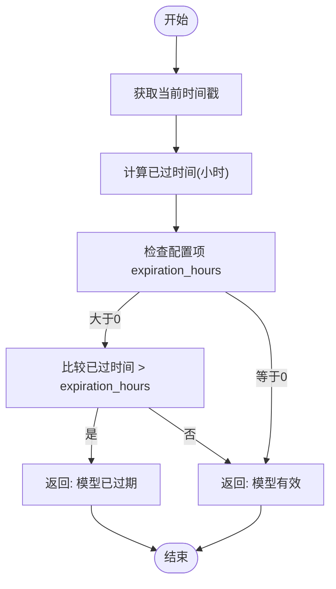
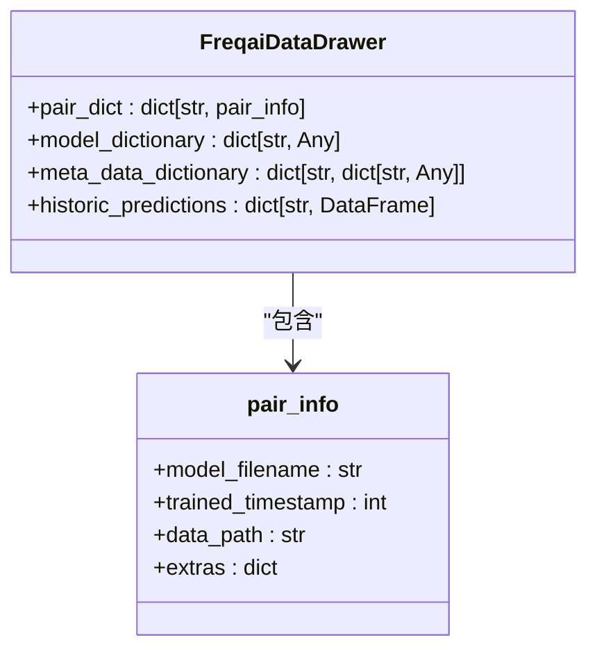
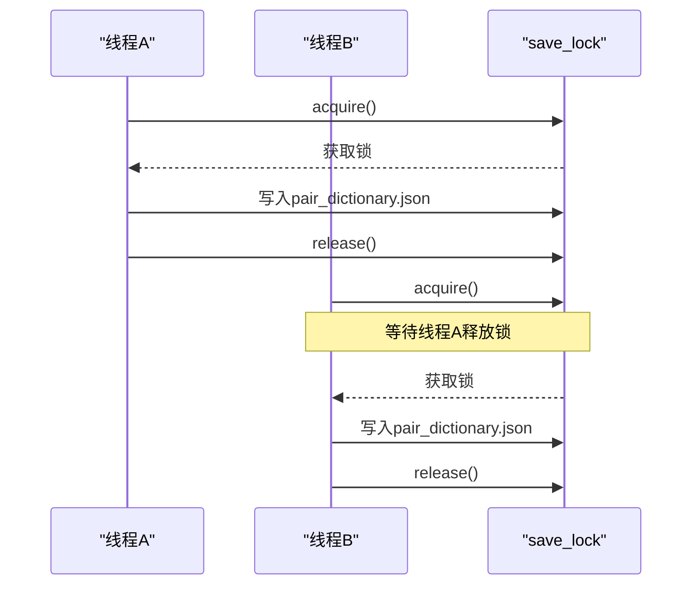
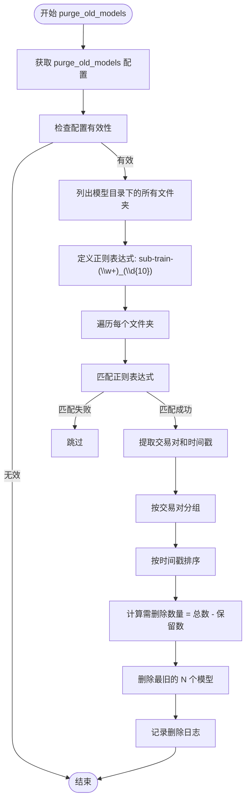

# 模型缓存与过期管理

<cite>
**Referenced Files in This Document**   
- [data_drawer.py](file://freqtrade/freqai/data_drawer.py)
- [data_kitchen.py](file://freqtrade/freqai/data_kitchen.py)
</cite>

## 目录
1. [引言](#引言)
2. [模型生命周期管理](#模型生命周期管理)
3. [模型过期判断机制](#模型过期判断机制)
4. [内存元数据管理](#内存元数据管理)
5. [模型缓存清理策略](#模型缓存清理策略)
6. [数据结构与依赖关系](#数据结构与依赖关系)

## 引言
FreqAI系统通过精细化的模型缓存与生命周期管理策略，确保机器学习模型在交易决策中的可靠性与时效性。本文档深入解析其核心机制，包括模型过期判断、内存元数据维护、磁盘缓存清理等关键组件，揭示系统如何在保证性能的同时维持模型的预测准确性。

## 模型生命周期管理
FreqAI的模型生命周期由`FreqaiDataDrawer`和`FreqaiDataKitchen`两个核心类协同管理。`FreqaiDataDrawer`负责模型的持久化存储、内存缓存和元数据管理，而`FreqaiDataKitchen`则专注于模型的训练、预测和过期判断。这种职责分离的设计确保了模型管理的高效性与可靠性。

**Section sources**
- [data_drawer.py](file://freqtrade/freqai/data_drawer.py#L69-L105)
- [data_kitchen.py](file://freqtrade/freqai/data_kitchen.py#L68-L100)

## 模型过期判断机制
模型的过期判断由`FreqaiDataKitchen`类中的`check_if_model_expired`方法实现。该机制基于配置项`expiration_hours`，通过比较当前时间戳与模型的训练时间戳来判断模型是否过期。



**Diagram sources**
- [data_kitchen.py](file://freqtrade/freqai/data_kitchen.py#L510-L554)

**Section sources**
- [data_kitchen.py](file://freqtrade/freqai/data_kitchen.py#L510-L554)

## 内存元数据管理
### pair_dict 字典
`pair_dict`是`FreqaiDataDrawer`类中的核心字典，用于在内存中维护所有交易对的模型元数据。其结构定义为`dict[str, pair_info]`，其中`pair_info`是一个包含模型文件名、训练时间戳、数据路径等信息的类型字典。



**Diagram sources**
- [data_drawer.py](file://freqtrade/freqai/data_drawer.py#L73-L73)

### save_lock 与元数据持久化
为确保元数据文件写入的原子性，`FreqaiDataDrawer`使用`save_lock`（`threading.Lock`实例）来同步对持久化文件的访问。当需要保存`pair_dict`或其他元数据时，系统会先获取锁，完成写入操作后再释放锁，防止并发写入导致的数据损坏。



**Diagram sources**
- [data_drawer.py](file://freqtrade/freqai/data_drawer.py#L95-L95)
- [data_drawer.py](file://freqtrade/freqai/data_drawer.py#L222-L230)

### empty_pair_dict 初始化
`empty_pair_dict`是一个预定义的`pair_info`字典，用于初始化新交易对的元数据。当系统首次处理某个交易对时，会使用`empty_pair_dict`的副本进行初始化，确保所有字段都有默认值。

```python
self.empty_pair_dict: pair_info = {
    "model_filename": "",
    "trained_timestamp": 0,
    "data_path": "",
    "extras": {},
}
```

**Section sources**
- [data_drawer.py](file://freqtrade/freqai/data_drawer.py#L99-L104)

## 模型缓存清理策略
### purge_old_models 方法
`purge_old_models`方法实现了基于配置的模型缓存清理策略。该方法根据`purge_old_models`配置项，自动清理过期的模型文件夹。



**Diagram sources**
- [data_drawer.py](file://freqtrade/freqai/data_drawer.py#L439-L479)

**Section sources**
- [data_drawer.py](file://freqtrade/freqai/data_drawer.py#L439-L479)

## 数据结构与依赖关系
以下图表展示了FreqAI模型管理组件之间的主要依赖关系。

```mermaid
graph TD
subgraph "内存管理"
A[FreqaiDataDrawer]
B[pair_dict]
C[model_dictionary]
D[meta_data_dictionary]
end
subgraph "磁盘存储"
E[模型文件夹]
F[pair_dictionary.json]
G[global_metadata.json]
end
A --> B : "维护"
A --> C : "缓存"
A --> D : "存储"
B --> F : "持久化"
A --> E : "清理"
A --> G : "写入"
H[FreqaiDataKitchen] --> A : "调用"
H --> I[check_if_model_expired] : "判断"
I --> B : "读取 trained_timestamp"
```

**Diagram sources**
- [data_drawer.py](file://freqtrade/freqai/data_drawer.py#L69-L105)
- [data_kitchen.py](file://freqtrade/freqai/data_kitchen.py#L68-L100)