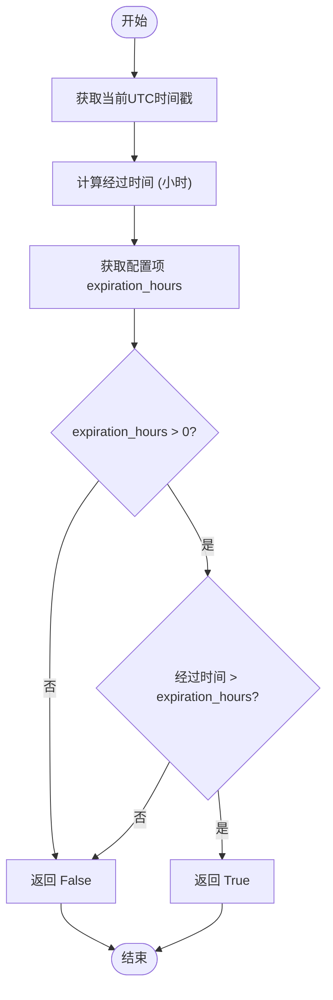
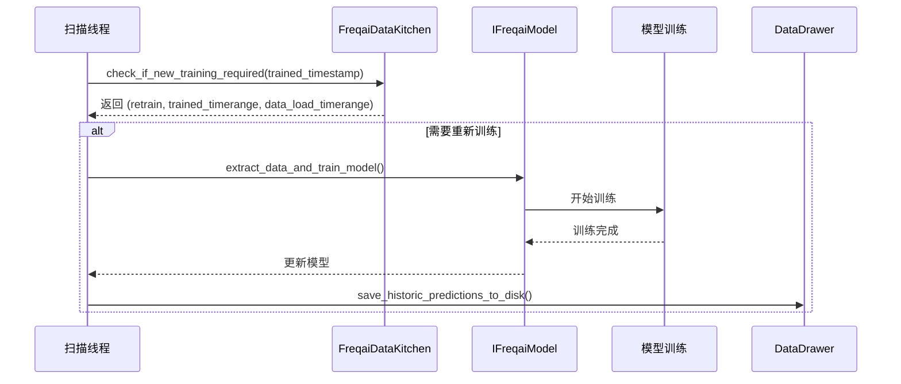
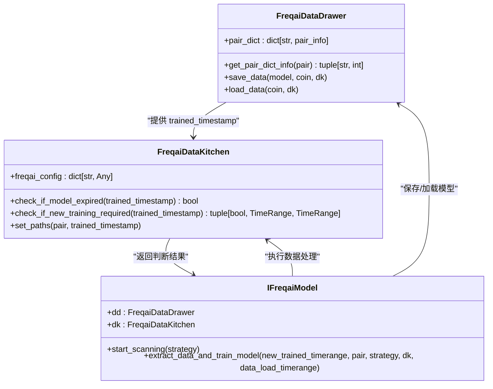

# 模型过期判断机制

<cite>
**本文档中引用的文件**   
- [data_kitchen.py](file://freqtrade/freqai/data_kitchen.py)
- [freqai_interface.py](file://freqtrade/freqai/freqai_interface.py)
- [data_drawer.py](file://freqtrade/freqai/data_drawer.py)
</cite>

## 目录
1. [引言](#引言)
2. [核心机制概述](#核心机制概述)
3. [过期判断逻辑实现](#过期判断逻辑实现)
4. [模型更新触发流程](#模型更新触发流程)
5. [时间戳比较与配置项](#时间戳比较与配置项)
6. [系统架构与组件关系](#系统架构与组件关系)
7. [性能与可靠性考量](#性能与可靠性考量)
8. [结论](#结论)

## 引言
在FreqAI系统中，模型的时效性对于交易决策的准确性至关重要。系统通过一套精密的过期判断机制来确保模型不会因陈旧而影响预测质量。该机制基于`pair_dict`中存储的`trained_timestamp`字段与当前时间进行比较，并结合`retrain_hours`等配置项，动态判断模型是否需要重新训练。本文档将深入解析这一机制，阐明`check_if_new_training_required`和`check_if_model_expired`等方法在模型生命周期管理中的作用，以及时间戳比较的具体实现方式。

## 核心机制概述
FreqAI系统通过`FreqaiDataKitchen`类中的`check_if_model_expired`和`check_if_new_training_required`方法实现模型过期判断。系统在每次推理前，会检查模型的训练时间戳（`trained_timestamp`），将其与当前UTC时间戳进行比较，计算出模型的存活时间（以小时为单位）。如果该时间超过了用户在配置文件中定义的`expiration_hours`或`live_retrain_hours`阈值，系统将判定模型已过期或需要重新训练，从而触发模型更新流程，确保预测的时效性和准确性。

**Section sources**
- [data_kitchen.py](file://freqtrade/freqai/data_kitchen.py#L519-L533)
- [data_kitchen.py](file://freqtrade/freqai/data_kitchen.py#L535-L587)

## 过期判断逻辑实现
模型过期判断的核心逻辑由`check_if_model_expired`方法实现。该方法接收一个`trained_timestamp`参数，代表模型最近一次训练的时间戳。它首先获取当前UTC时间戳，然后计算当前时间与训练时间戳之间的差值，并将其转换为小时数。接着，方法从`freqai_config`配置中读取`expiration_hours`的值。如果该值大于0，则将计算出的经过时间与`expiration_hours`进行比较。若经过时间大于`expiration_hours`，则返回`True`，表示模型已过期；否则返回`False`。此机制确保了模型在达到预设的“保质期”后被标记为不可信，从而避免使用陈旧模型进行交易决策。

**Diagram sources **
- [data_kitchen.py](file://freqtrade/freqai/data_kitchen.py#L519-L533)

## 模型更新触发流程
模型更新的触发流程由`check_if_new_training_required`方法主导。该方法不仅判断是否需要重新训练，还为后续的训练过程准备时间范围。其逻辑与过期判断类似，但使用的是`live_retrain_hours`配置项。当`trained_timestamp`不为0时，计算经过时间并与`live_retrain_hours`比较。如果需要重新训练（`retrain`为`True`），该方法还会计算出用于训练的`trained_timerange`和用于加载数据的`data_load_timerange`。这些时间范围确保了训练数据的完整性和指标的准确性。在`IFreqaiModel`的`_start_scanning`方法中，系统会循环检查训练队列中的每个交易对，调用`check_if_new_training_required`，一旦发现需要重新训练，便立即执行`extract_data_and_train_model`流程，实现模型的自动更新。

**Diagram sources **
- [data_kitchen.py](file://freqtrade/freqai/data_kitchen.py#L535-L587)
- [freqai_interface.py](file://freqtrade/freqai/freqai_interface.py#L246-L266)

## 时间戳比较与配置项
系统中的时间戳比较是基于UTC时间戳（秒）进行的。`check_if_model_expired`方法将时间差除以3600（即`SECONDS_IN_HOUR`）来得到小时数。关键的配置项包括：
- `expiration_hours`：定义了模型的“信任有效期”。超过此时间，模型被视为过期，策略会收到警告并可能返回空值。
- `live_retrain_hours`：定义了模型的“重新训练周期”。超过此时间，系统将触发重新训练流程。
- `train_period_days`：定义了每次训练所使用的数据周期长度，用于计算训练时间范围。
这些配置项均在`freqai_config`字典中获取，为用户提供了灵活控制模型更新频率的手段。

**Section sources**
- [data_kitchen.py](file://freqtrade/freqai/data_kitchen.py#L519-L587)

## 系统架构与组件关系
模型过期判断机制涉及多个核心组件的协同工作。`FreqaiDataDrawer`负责持久化存储所有交易对的模型元数据，包括`trained_timestamp`。`FreqaiDataKitchen`作为数据处理的核心，包含了具体的判断逻辑。`IFreqaiModel`则作为顶层控制器，协调数据准备、模型训练和预测。`DataDrawer`通过`get_pair_dict_info`方法为`DataKitchen`提供`trained_timestamp`，`DataKitchen`进行判断后，结果反馈给`IFreqaiModel`以决定后续操作。这种分层架构确保了逻辑的清晰和组件的低耦合。

**Diagram sources **
- [data_drawer.py](file://freqtrade/freqai/data_drawer.py#L69-L105)
- [data_kitchen.py](file://freqtrade/freqai/data_kitchen.py#L60-L108)
- [freqai_interface.py](file://freqtrade/freqai/freqai_interface.py#L110-L130)

## 性能与可靠性考量
该机制在设计上考虑了性能和可靠性。首先，`trained_timestamp`的获取和比较操作非常轻量，不会对实时推理造成显著延迟。其次，系统通过`purge_old_models`功能自动清理旧模型，防止磁盘空间耗尽。此外，`check_if_model_expired`方法在模型过期时会记录警告日志，提醒用户注意。测试用例（如`test_check_if_model_expired`）的存在也保证了该逻辑的正确性。整个机制通过配置驱动，用户可以根据交易对的波动性和计算资源，灵活调整`expiration_hours`和`retrain_hours`，在模型新鲜度和计算开销之间取得平衡。

**Section sources**
- [data_kitchen.py](file://freqtrade/freqai/data_kitchen.py#L519-L533)
- [data_drawer.py](file://freqtrade/freqai/data_drawer.py#L439-L479)
- [test_freqai_datakitchen.py](file://tests/freqai/test_freqai_datakitchen.py#L67-L105)

## 结论
FreqAI的模型过期判断机制是一个高效、可靠且可配置的系统。它通过精确的时间戳比较和清晰的配置项，自动化地管理模型的生命周期。`check_if_model_expired`和`check_if_new_training_required`方法构成了这一机制的核心，确保了模型始终处于“新鲜”状态，从而保障了预测结果的时效性和准确性。这种设计有效避免了因使用陈旧模型而导致的交易决策失误，是FreqAI系统稳健运行的关键保障。