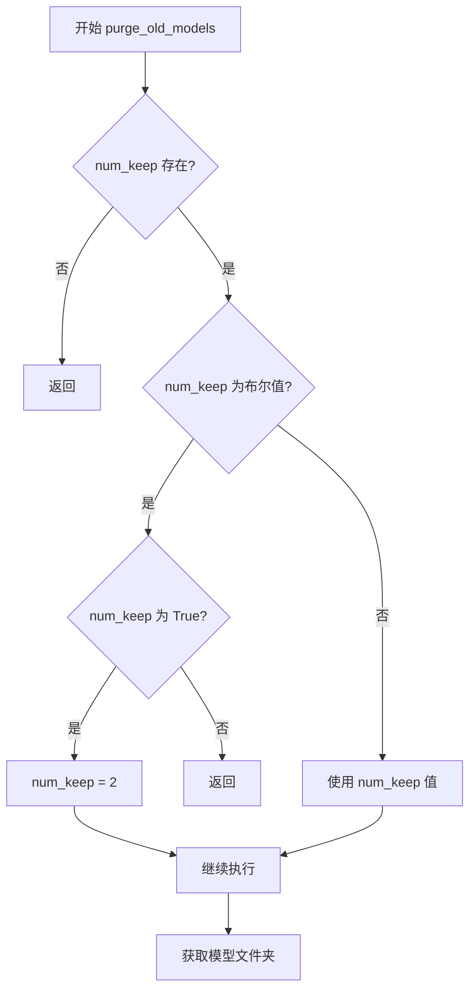
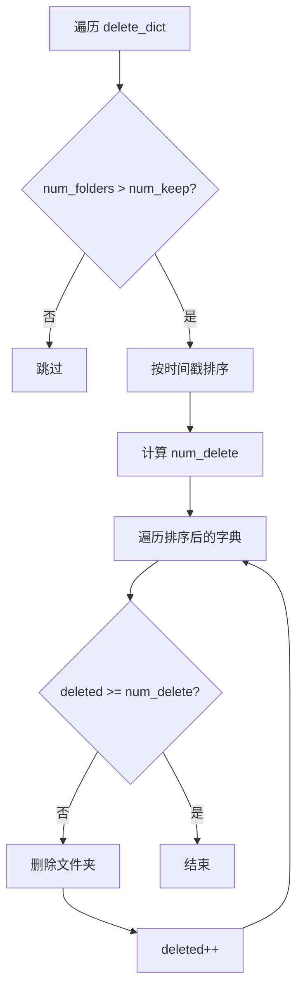
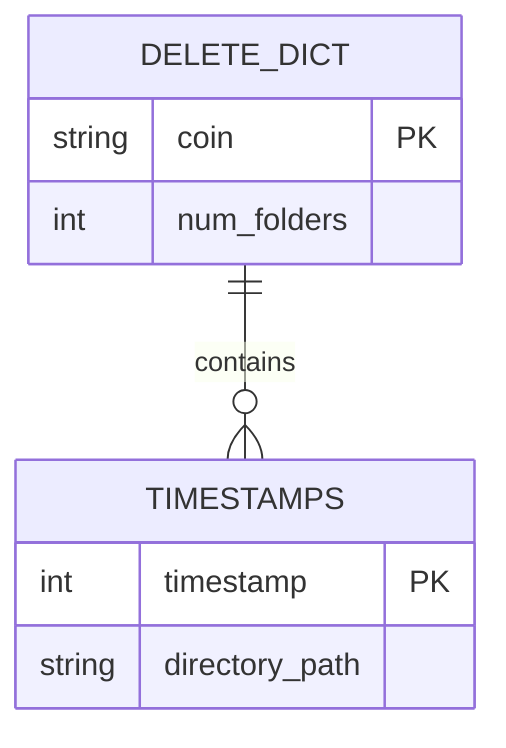
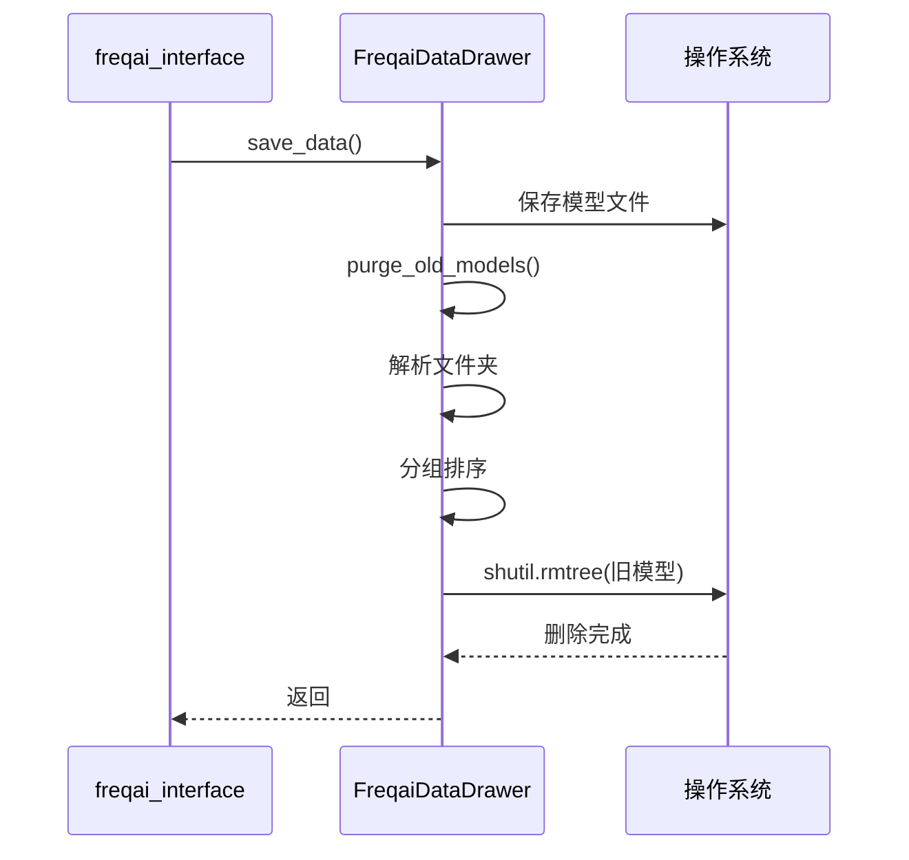

# 自动清理过期模型

<cite>
**本文档中引用的文件**   
- [data_drawer.py](file://freqtrade/freqai/data_drawer.py#L439-L479)
- [config_freqai.example.json](file://config_examples/config_freqai.example.json#L51)
- [schema.json](file://build_helpers/schema.json#L1397)
</cite>

## 目录
1. [方法概述](#方法概述)
2. [配置参数解析](#配置参数解析)
3. [模型文件夹解析与分组](#模型文件夹解析与分组)
4. [删除策略与排序机制](#删除策略与排序机制)
5. [delete_dict字典结构分析](#deletedict字典结构分析)
6. [shutil.rmtree的清理过程](#shutilrmtree的清理过程)
7. [代码调用流程示例](#代码调用流程示例)
8. [磁盘空间管理效果](#磁盘空间管理效果)

## 方法概述

`purge_old_models`方法是FreqAI系统中用于自动清理过期模型文件的核心功能。该方法通过分析模型文件夹的命名规则，提取交易对和时间戳信息，按交易对进行分组，并根据配置决定保留的模型数量，从而有效防止模型文件无限增长，确保磁盘空间的合理利用。

**Section sources**
- [data_drawer.py](file://freqtrade/freqai/data_drawer.py#L439-L479)

## 配置参数解析

`purge_old_models`配置项支持布尔值和整数两种类型。当配置为`False`或`0`时，不执行清理操作；当配置为`True`时，自动设置保留数量为2；当配置为正整数时，保留指定数量的最新模型。这种灵活的配置方式允许用户根据实际需求平衡存储空间和模型历史记录。

**Diagram sources **
- [data_drawer.py](file://freqtrade/freqai/data_drawer.py#L439-L444)

## 模型文件夹解析与分组

该方法使用正则表达式`r'sub-train-(\w+)_(\d{10})'`解析模型文件夹名称。该正则表达式能够从类似`sub-train-BTCUSDT_1698765432`的文件夹名中提取出交易对（如BTCUSDT）和时间戳（如1698765432）。提取的信息用于按交易对对模型文件夹进行分组，确保每个交易对的模型独立管理。

**Section sources**
- [data_drawer.py](file://freqtrade/freqai/data_drawer.py#L446-L457)

## 删除策略与排序机制

清理过程采用时间戳升序排序策略，即保留最新的模型文件。对于每个交易对，系统首先统计其模型文件夹总数，然后计算需要删除的数量（总数减去保留数）。通过`collections.OrderedDict`对时间戳进行排序，确保按时间顺序删除最旧的模型，从而最大化保留近期训练的模型。

**Diagram sources **
- [data_drawer.py](file://freqtrade/freqai/data_drawer.py#L458-L478)

## delete_dict字典结构分析

`delete_dict`字典是组织待删除模型的核心数据结构。其结构为嵌套字典，外层键为交易对名称，值为包含`num_folders`和`timestamps`的子字典。`num_folders`记录该交易对的模型总数，`timestamps`是以时间戳为键、文件夹路径为值的字典。这种结构便于按交易对统计和排序模型，为后续的删除决策提供数据支持。

**Diagram sources **
- [data_drawer.py](file://freqtrade/freqai/data_drawer.py#L450-L457)

## shutil.rmtree的清理过程

在确定需要删除的模型文件夹后，系统使用`shutil.rmtree`函数进行递归删除。该函数能够安全地删除整个目录树，包括目录中的所有文件和子目录。每次删除操作前，系统会通过`logger.info`记录日志，便于用户追踪清理过程。删除操作按时间顺序执行，直到达到预设的保留数量为止。

**Section sources**
- [data_drawer.py](file://freqtrade/freqai/data_drawer.py#L475-L478)

## 代码调用流程示例

该方法通常在模型保存后被调用，形成"训练-保存-清理"的完整流程。例如，在`extract_data_and_train_model`方法中，系统完成模型训练和保存后，立即调用`purge_old_models`进行清理。这种设计确保了每次新模型生成后都能及时清理旧模型，维持系统存储的稳定状态。

**Diagram sources **
- [data_drawer.py](file://freqtrade/freqai/data_drawer.py#L439-L479)
- [freqai_interface.py](file://freqtrade/freqai/freqai_interface.py#L645)

## 磁盘空间管理效果

通过`purge_old_models`方法，FreqAI系统实现了高效的磁盘空间管理。该功能有效防止了模型文件的无限增长，特别适用于长期运行的交易系统。用户可以通过调整`purge_old_models`配置值，在存储空间和模型历史之间找到最佳平衡点，既避免了磁盘耗尽的风险，又保留了足够的模型用于性能分析和回溯测试。

**Section sources**
- [config_freqai.example.json](file://config_examples/config_freqai.example.json#L51)
- [schema.json](file://build_helpers/schema.json#L1397)