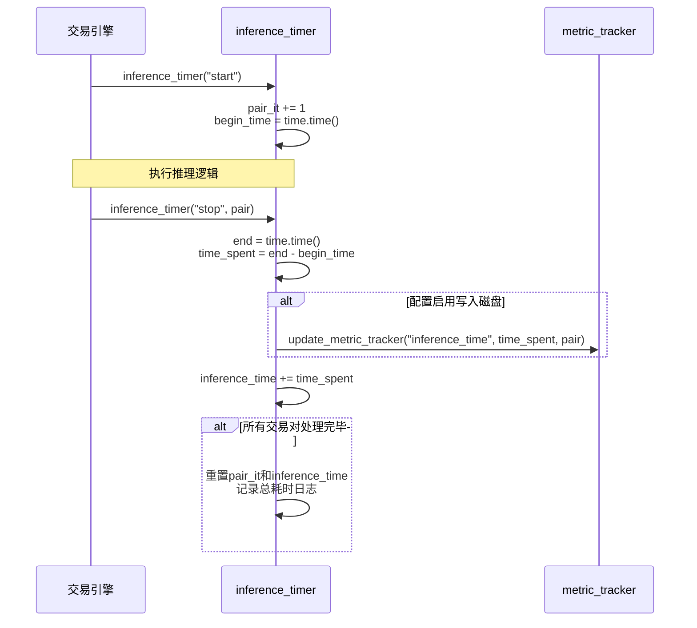
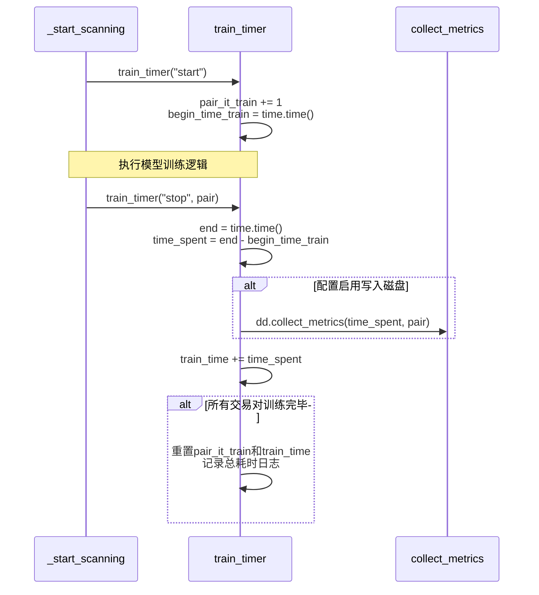
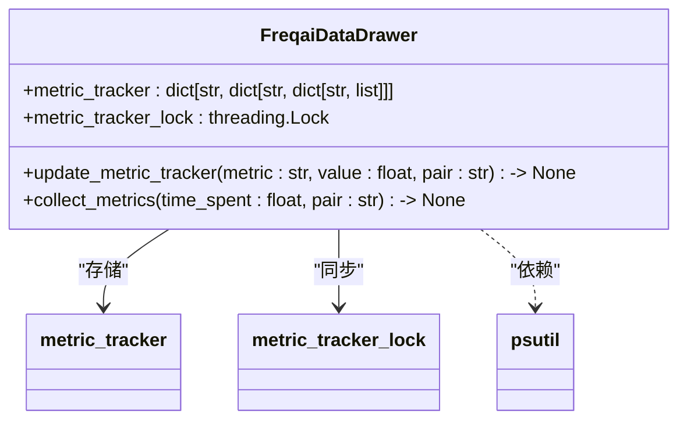

# 性能指标采集机制

<cite>
**本文档引用的文件**
- [data_drawer.py](file://freqtrade/freqai/data_drawer.py)
- [freqai_interface.py](file://freqtrade/freqai/freqai_interface.py)
</cite>

## 目录
1. [引言](#引言)
2. [计时器启动与停止流程](#计时器启动与停止流程)
3. [性能指标采集流程](#性能指标采集流程)
4. [指标存储与关联机制](#指标存储与关联机制)
5. [系统资源监控](#系统资源监控)
6. [配置与持久化](#配置与持久化)

## 引言
本文档深入解析Freqtrade交易引擎中性能指标的采集机制。重点阐述`inference_timer`和`train_timer`计时器如何在推理和训练周期开始时启动，并在结束时计算耗时。同时详细说明`collect_metrics`方法如何调用psutil获取系统CPU负载，并通过`update_metric_tracker`将训练时间、推理时间和系统负载等关键指标关联到特定交易对并存入内存中的`metric_tracker`字典。

## 计时器启动与停止流程

### 推理计时器 (inference_timer)
推理计时器用于跟踪在一次完整交易对列表遍历中，FreqAI所花费的累计时间。当交易引擎开始处理交易对列表进行推理时，`inference_timer`方法以`start`参数被调用，记录开始时间戳。当推理过程结束时，该方法以`stop`参数被调用，计算出本次推理的耗时。



**Diagram sources**
- [freqai_interface.py](file://freqtrade/freqai/freqai_interface.py#L709-L732)

**Section sources**
- [freqai_interface.py](file://freqtrade/freqai/freqai_interface.py#L709-L732)

### 训练计时器 (train_timer)
训练计时器用于跟踪训练整个交易对列表所花费的累计时间。其工作流程与推理计时器类似。当开始训练一个交易对时，`train_timer`以`start`参数被调用，记录开始时间。当该交易对的训练完成时，以`stop`参数调用，计算出本次训练的耗时。



**Diagram sources**
- [freqai_interface.py](file://freqtrade/freqai/freqai_interface.py#L734-L753)

**Section sources**
- [freqai_interface.py](file://freqtrade/freqai/freqai_interface.py#L734-L753)

## 性能指标采集流程
`collect_metrics`方法是性能指标采集的核心。它在每次训练周期结束时被`train_timer`调用，负责收集并记录与本次训练相关的所有关键性能指标。

```mermaid
flowchart TD
Start([开始采集指标]) --> GetTime["获取训练耗时<br/>(time_spent)"]
GetTime --> GetCPU["调用psutil.getloadavg()<br/>获取系统负载"]
GetCPU --> GetCPUs["调用psutil.cpu_count()<br/>获取CPU核心数"]
GetCPUs --> Normalize["将负载值归一化<br/>(load / cpus)"]
Normalize --> Update1["update_metric_tracker<br/>(\"train_time\", time_spent, pair)"]
Normalize --> Update2["update_metric_tracker<br/>(\"cpu_load1min\", load1/cpus, pair)"]
Normalize --> Update3["update_metric_tracker<br/>(\"cpu_load5min\", load5/cpus, pair)"]
Normalize --> Update4["update_metric_tracker<br/>(\"cpu_load15min\", load15/cpus, pair)"]
Update1 --> End([结束])
Update2 --> End
Update3 --> End
Update4 --> End
```

**Diagram sources**
- [data_drawer.py](file://freqtrade/freqai/data_drawer.py#L122-L131)

**Section sources**
- [data_drawer.py](file://freqtrade/freqai/data_drawer.py#L122-L131)

## 指标存储与关联机制
`update_metric_tracker`方法是所有性能指标的最终存储入口。它负责将各种指标（如训练时间、推理时间、CPU负载）与特定的交易对关联起来，并存入内存中的`metric_tracker`字典。



**Diagram sources**
- [data_drawer.py](file://freqtrade/freqai/data_drawer.py#L107-L120)

**Section sources**
- [data_drawer.py](file://freqtrade/freqai/data_drawer.py#L107-L120)

## 系统资源监控
系统资源监控主要通过Python的`psutil`库实现。`collect_metrics`方法调用`psutil.getloadavg()`来获取系统过去1分钟、5分钟和15分钟的平均负载，并调用`psutil.cpu_count()`获取CPU核心数。通过将平均负载除以CPU核心数，可以得到一个归一化的CPU使用率指标，这有助于跨不同硬件配置的机器进行性能比较。

## 配置与持久化
性能指标的采集和持久化行为由配置文件中的`freqai`部分控制。`write_metrics_to_disk`配置项决定了是否将采集到的指标写入磁盘。如果启用，`metric_tracker`字典中的数据会被定期序列化并保存到`metric_tracker.json`文件中，从而实现数据的持久化，即使交易引擎重启，历史性能数据也不会丢失。

**Section sources**
- [data_drawer.py](file://freqtrade/freqai/data_drawer.py#L107-L131)
- [freqai_interface.py](file://freqtrade/freqai/freqai_interface.py#L734-L753)