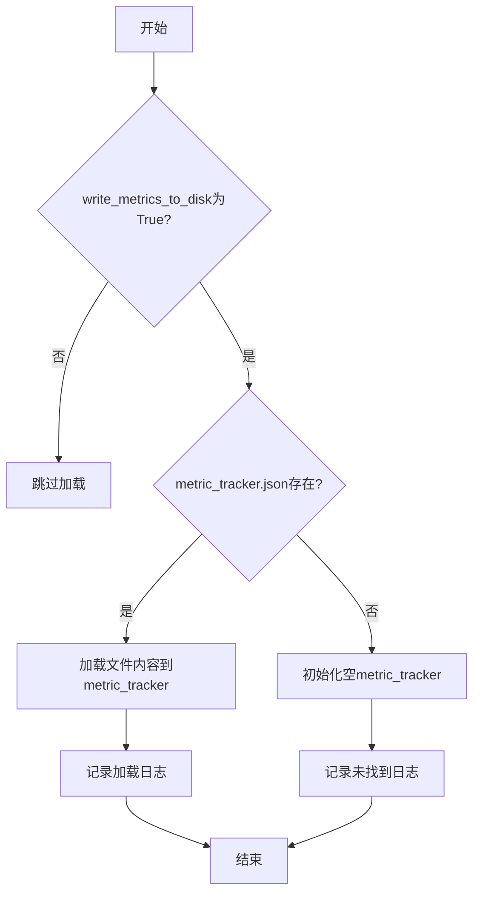
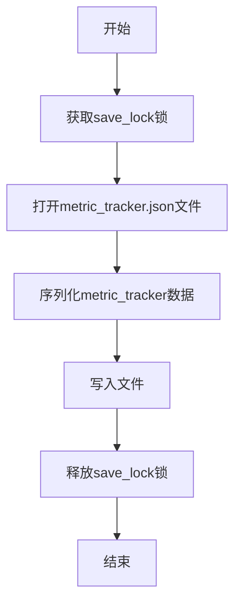

# 指标数据持久化

<cite>
**本文档引用的文件**  
- [data_drawer.py](file://freqtrade/freqai/data_drawer.py)
- [freqai_interface.py](file://freqtrade/freqai/freqai_interface.py)
</cite>

## 目录
1. [引言](#引言)
2. [配置项控制指标写入](#配置项控制指标写入)
3. [初始化时加载指标数据](#初始化时加载指标数据)
4. [训练队列轮换后保存指标数据](#训练队列轮换后保存指标数据)
5. [总结](#总结)

## 引言
FreqAI系统通过持久化指标数据来实现模型性能的持续追踪与分析。该机制依赖于`write_metrics_to_disk`配置项来控制是否将指标写入磁盘，并通过`load_metric_tracker_from_disk`和`save_metric_tracker_to_disk`方法实现数据的加载与保存。这些功能确保了在系统重启或重新训练时能够延续历史数据，从而提供一致的性能评估基础。

**Section sources**
- [data_drawer.py](file://freqtrade/freqai/data_drawer.py#L45-L764)
- [freqai_interface.py](file://freqtrade/freqai/freqai_interface.py#L35-L1039)

## 配置项控制指标写入
`write_metrics_to_disk`是FreqAI配置中的一个布尔型参数，用于决定是否将收集到的指标数据写入磁盘。当此配置项设置为`True`时，系统会在训练过程中收集各种性能指标（如训练时间、推理时间、CPU负载等），并将其记录到内存中的`metric_tracker`字典中。随后，在适当的时机（如训练队列轮换后），这些数据会被序列化并安全地写入磁盘文件`metric_tracker.json`。如果该配置项为`False`，则不会执行任何磁盘写入操作，所有指标仅保留在内存中，随程序结束而丢失。

**Section sources**
- [data_drawer.py](file://freqtrade/freqai/data_drawer.py#L157-L169)
- [freqai_interface.py](file://freqtrade/freqai/freqai_interface.py#L58-L117)

## 初始化时加载指标数据
在FreqAI初始化阶段，`load_metric_tracker_from_disk`方法负责检查是否存在先前保存的`metric_tracker.json`文件。该方法首先读取`write_metrics_to_disk`配置值，若为`True`，则进一步检查`metric_tracker_path`所指向的文件路径是否存在对应的JSON文件。如果文件存在，系统会使用`rapidjson.load`将其内容反序列化并加载到内存中的`self.metric_tracker`字典中，同时输出日志信息“Loading existing metric tracker from disk.”。若文件不存在，则初始化一个空的`metric_tracker`结构，并记录日志“Could not find existing metric tracker, starting from scratch”。这一过程确保了系统能够在重启后恢复之前的指标数据，实现数据的延续性。

**Diagram sources**
- [data_drawer.py](file://freqtrade/freqai/data_drawer.py#L157-L169)

**Section sources**
- [data_drawer.py](file://freqtrade/freqai/data_drawer.py#L157-L169)

## 训练队列轮换后保存指标数据
每当训练队列完成一轮训练后，系统会调用`save_metric_tracker_to_disk`方法将内存中更新的`metric_tracker`安全地写入磁盘。该方法通过`save_lock`锁对象确保写入操作的线程安全性，防止多个线程同时写入导致数据损坏。具体流程为：首先获取`save_lock`锁，然后以写模式打开`metric_tracker_path`指定的文件，接着使用`rapidjson.dump`将`self.metric_tracker`字典序列化并写入文件，同时指定`default=self.np_encoder`以正确处理NumPy数据类型。整个写入过程在锁的保护下进行，确保了数据的一致性和完整性。

**Diagram sources**
- [data_drawer.py](file://freqtrade/freqai/data_drawer.py#L209-L220)

**Section sources**
- [data_drawer.py](file://freqtrade/freqai/data_drawer.py#L209-L220)

## 总结
FreqAI通过`write_metrics_to_disk`配置项灵活控制指标数据的持久化行为。在系统初始化时，`load_metric_tracker_from_disk`方法根据配置检查并加载已有的`metric_tracker.json`文件，实现了数据的延续性。而在每次训练队列轮换后，`save_metric_tracker_to_disk`方法利用`save_lock`锁确保将内存中更新的指标数据安全地序列化并写入磁盘。这一整套机制保障了指标数据在不同运行周期间的连续性和可靠性，为模型性能的长期监控与优化提供了坚实的基础。

**Section sources**
- [data_drawer.py](file://freqtrade/freqai/data_drawer.py#L45-L764)
- [freqai_interface.py](file://freqtrade/freqai/freqai_interface.py#L35-L1039)