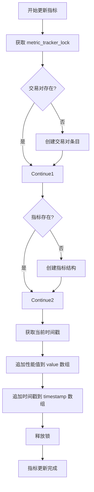
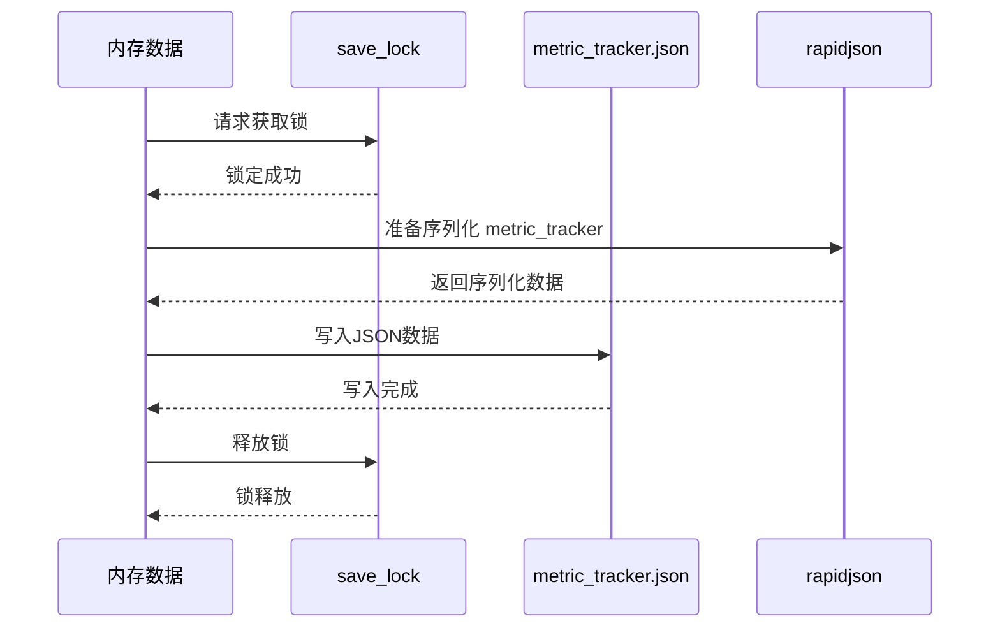

# 指标追踪数据结构

<cite>
**Referenced Files in This Document**   
- [data_drawer.py](file://freqtrade/freqai/data_drawer.py)
</cite>

## Table of Contents
1. [简介](#简介)
2. [核心数据结构](#核心数据结构)
3. [指标更新机制](#指标更新机制)
4. [持久化存储](#持久化存储)
5. [性能分析支持](#性能分析支持)

## 简介
`metric_tracker.json` 文件是FreqAI系统中用于记录和追踪交易对性能指标的关键组件。该文件采用结构化的JSON格式，以交易对为键存储多个性能指标，每个指标包含时间戳和数值数组，为后续的性能分析和可视化提供数据基础。

## 核心数据结构

`metric_tracker.json` 文件的内部结构是一个嵌套的字典结构，其核心组织方式如下：

- **第一层键**：交易对名称（如"BTC/USDT"），作为顶级键，用于区分不同交易对的性能数据
- **第二层键**：性能指标名称（如"train_time"、"inference_time"、"cpu_load1min"等），用于区分同一交易对的不同性能维度
- **第三层结构**：每个性能指标包含两个数组：
  - `timestamp`：记录每次指标采集的时间戳（Unix时间戳格式）
  - `value`：记录对应的性能数值

这种数据结构设计使得系统能够高效地按交易对和指标类型组织性能数据，便于后续的查询和分析。

**Section sources**
- [data_drawer.py](file://freqtrade/freqai/data_drawer.py#L91)

## 指标更新机制

系统通过 `update_metric_tracker` 方法实现指标的动态更新，其工作流程如下：

1. **线程安全**：使用 `metric_tracker_lock` 确保多线程环境下的数据一致性
2. **动态创建**：如果交易对或指标不存在，则自动创建相应的嵌套结构
3. **数据追加**：将新的时间戳和性能值分别追加到对应的数组末尾

`collect_metrics` 方法是指标收集的入口，它会调用 `update_metric_tracker` 来记录多种性能指标，包括：
- `train_time`：模型训练耗时
- `cpu_load1min`：1分钟CPU平均负载
- `cpu_load5min`：5分钟CPU平均负载  
- `cpu_load15min`：15分钟CPU平均负载

这种设计支持灵活扩展，可以轻松添加新的性能指标。

**Diagram sources**
- [data_drawer.py](file://freqtrade/freqai/data_drawer.py#L107-L120)

**Section sources**
- [data_drawer.py](file://freqtrade/freqai/data_drawer.py#L107-L131)

## 持久化存储

系统通过 `save_metric_tracker_to_disk` 方法将内存中的指标数据持久化到 `metric_tracker.json` 文件中，其特点包括：

- **原子性保证**：使用 `save_lock` 确保写操作的原子性，防止并发写入导致数据损坏
- **高效序列化**：使用 `rapidjson` 库进行JSON序列化，提高读写性能
- **条件加载**：仅在配置项 `write_metrics_to_disk` 为 `True` 时才从磁盘加载现有指标数据

**Diagram sources**
- [data_drawer.py](file://freqtrade/freqai/data_drawer.py#L209-L220)

**Section sources**
- [data_drawer.py](file://freqtrade/freqai/data_drawer.py#L209-L220)

## 性能分析支持

`metric_tracker.json` 的数据结构设计为后续的性能分析和可视化提供了良好的支持：

1. **时间序列分析**：`timestamp` 和 `value` 数组的配对结构天然支持时间序列分析，可以轻松绘制性能指标随时间变化的趋势图
2. **多维度比较**：通过交易对和指标的双重键，可以方便地进行跨交易对、跨指标的性能比较
3. **统计计算**：连续的数值数组便于进行各种统计计算，如均值、标准差、最大值、最小值等
4. **异常检测**：完整的时间序列数据有助于识别性能异常和趋势变化

这种结构化的数据存储方式使得用户可以基于 `metric_tracker.json` 文件进行深入的性能分析，优化交易策略和系统配置。

**Section sources**
- [data_drawer.py](file://freqtrade/freqai/data_drawer.py#L91)