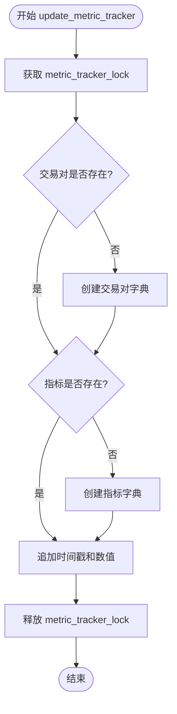

# 线程安全与并发控制

<cite>
**本文档引用的文件**   
- [data_drawer.py](file://freqtrade/freqai/data_drawer.py)
</cite>

## 目录
1. [指标追踪系统的并发控制机制](#指标追踪系统的并发控制机制)
2. [锁机制的实现原理](#锁机制的实现原理)
3. [多线程环境下的必要性](#多线程环境下的必要性)

## 指标追踪系统的并发控制机制

在FreqAI指标追踪系统中，`metric_tracker_lock`锁被用于保护对`metric_tracker`字典的读写操作。该锁通过上下文管理器（with语句）在`update_metric_tracker`方法中实现，确保在多线程环境下对指标数据的访问是线程安全的。

**Section sources**
- [data_drawer.py](file://freqtrade/freqai/data_drawer.py#L107-L120)

## 锁机制的实现原理

`metric_tracker_lock`是一个`threading.Lock`对象，在`FreqaiDataDrawer`类的初始化方法中被创建。当调用`update_metric_tracker`方法时，使用`with self.metric_tracker_lock:`语句来获取锁。在此上下文管理器内部，对`metric_tracker`字典的所有操作（包括检查键是否存在、添加新键值对、追加时间戳和数值）都被保护，确保同一时间只有一个线程可以执行这些操作。

**Diagram sources**
- [data_drawer.py](file://freqtrade/freqai/data_drawer.py#L97-L97)
- [data_drawer.py](file://freqtrade/freqai/data_drawer.py#L107-L120)

**Section sources**
- [data_drawer.py](file://freqtrade/freqai/data_drawer.py#L69-L105)
- [data_drawer.py](file://freqtrade/freqai/data_drawer.py#L107-L120)

## 多线程环境下的必要性

在多线程环境下（如扫描线程进行模型重训练），多个线程可能同时尝试修改同一交易对的指标数据。如果没有锁机制，可能会导致数据竞争和损坏。例如，两个线程同时检查某个指标是否存在，都发现不存在，然后都尝试创建该指标，这可能导致数据不一致或覆盖。通过使用`metric_tracker_lock`，系统确保了对`metric_tracker`字典的原子性操作，防止了此类问题的发生，保证了指标数据的完整性和一致性。

**Section sources**
- [data_drawer.py](file://freqtrade/freqai/data_drawer.py#L107-L120)
- [data_drawer.py](file://freqtrade/freqai/data_drawer.py#L122-L131)