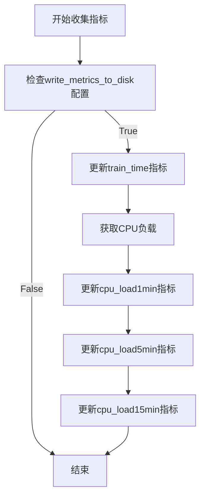
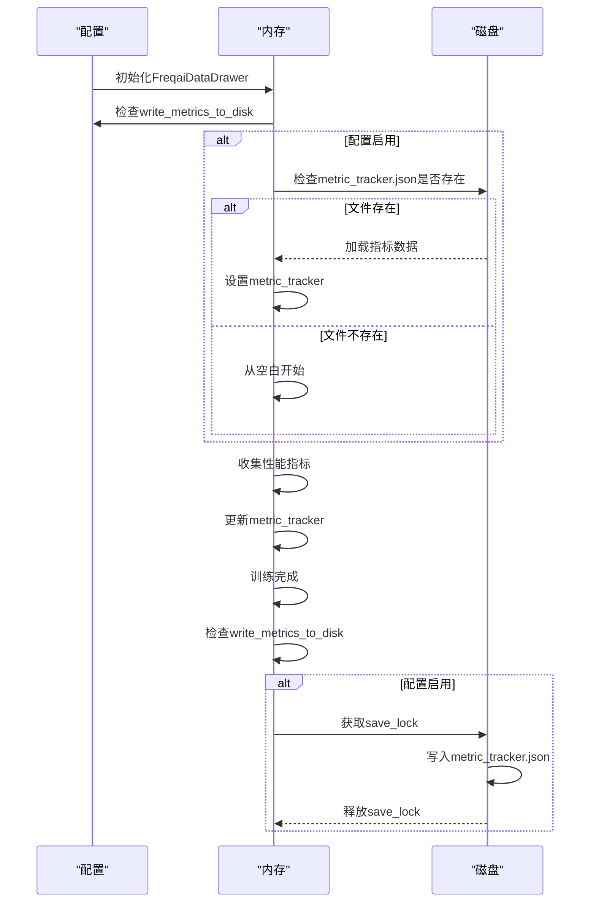
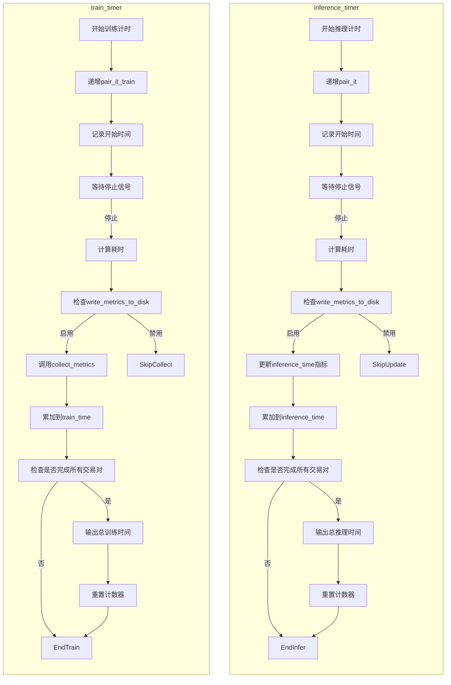
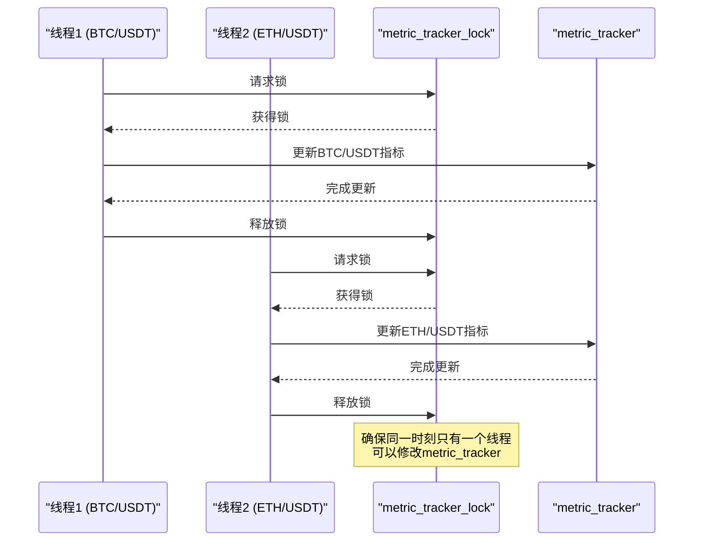

# 训练与推理指标追踪

<cite>
**本文档引用的文件**
- [data_drawer.py](file://freqtrade/freqai/data_drawer.py)
- [freqai_interface.py](file://freqtrade/freqai/freqai_interface.py)
- [config_schema.py](file://freqtrade/config_schema/config_schema.py)
</cite>

## 目录
1. [简介](#简介)
2. [metric_tracker.json文件结构](#metric_trackerjson文件结构)
3. [性能指标的收集与更新](#性能指标的收集与更新)
4. [指标的持久化机制](#指标的持久化机制)
5. [计时器功能与日志输出](#计时器功能与日志输出)
6. [线程安全保证](#线程安全保证)

## 简介
FreqAI模块提供了全面的性能指标追踪功能，用于监控机器学习模型的训练和推理过程。该系统通过`metric_tracker.json`文件记录每个交易对的训练时间、推理时间以及系统负载（CPU负载）等关键性能数据。通过配置项`write_metrics_to_disk`可以控制是否将这些指标持久化到磁盘。系统使用`inference_timer`和`train_timer`计时器在全周期和全交易对维度上累积性能数据，并通过日志输出。同时，`metric_tracker_lock`锁确保了在多线程环境下指标更新的线程安全。

**Section sources**
- [data_drawer.py](file://freqtrade/freqai/data_drawer.py#L45-L765)
- [freqai_interface.py](file://freqtrade/freqai/freqai_interface.py#L40-L799)

## metric_tracker.json文件结构
`metric_tracker.json`文件用于存储每个交易对的性能指标数据。该文件的结构是一个嵌套字典，其顶层键为交易对名称（如"BTC/USDT"），每个交易对下包含多个指标。每个指标又包含两个列表："timestamp"和"value"，分别记录了指标值的时间戳和实际数值。

具体结构如下：
```json
{
  "BTC/USDT": {
    "train_time": {
      "timestamp": [1730435200, 1730438800, ...],
      "value": [120.5, 115.3, ...]
    },
    "inference_time": {
      "timestamp": [1730435201, 1730438801, ...],
      "value": [0.8, 0.75, ...]
    },
    "cpu_load1min": {
      "timestamp": [1730435200, 1730438800, ...],
      "value": [0.45, 0.52, ...]
    },
    "cpu_load5min": {
      "timestamp": [1730435200, 1730438800, ...],
      "value": [0.42, 0.48, ...]
    },
    "cpu_load15min": {
      "timestamp": [1730435200, 1730438800, ...],
      "value": [0.40, 0.45, ...]
    }
  },
  "ETH/USDT": {
    ...
  }
}
```

**Section sources**
- [data_drawer.py](file://freqtrade/freqai/data_drawer.py#L107-L120)

## 性能指标的收集与更新
FreqAI通过`update_metric_tracker`和`collect_metrics`方法来记录和更新性能指标。

`update_metric_tracker`方法是通用的指标更新工具，用于添加和更新自定义指标。该方法接收指标名称、数值和交易对作为参数。在更新指标时，会使用`metric_tracker_lock`锁来确保线程安全。如果指定的交易对或指标不存在，会自动创建相应的数据结构。每次更新时，会将当前时间戳和指标值分别添加到"timestamp"和"value"列表中。

`collect_metrics`方法专门用于收集与训练相关的性能指标。该方法接收训练耗时和交易对作为参数，然后调用`psutil`库获取系统的1分钟、5分钟和15分钟平均负载，并将其除以CPU核心数得到归一化的CPU负载。随后，该方法会调用`update_metric_tracker`方法将训练时间、1分钟CPU负载、5分钟CPU负载和15分钟CPU负载等指标记录到指标追踪器中。



**Diagram sources**
- [data_drawer.py](file://freqtrade/freqai/data_drawer.py#L122-L131)

**Section sources**
- [data_drawer.py](file://freqtrade/freqai/data_drawer.py#L107-L131)

## 指标的持久化机制
FreqAI通过`write_metrics_to_disk`配置项和`load_metric_tracker_from_disk`、`save_metric_tracker_to_disk`方法实现指标的持久化。

`write_metrics_to_disk`是FreqAI配置中的一个布尔类型选项，用于控制是否将性能指标写入磁盘。当该选项设置为`true`时，系统会将收集到的性能指标保存到`metric_tracker.json`文件中；当设置为`false`时，则不会进行持久化存储。该配置项在`config_schema.py`文件中定义，默认值为`false`。

`load_metric_tracker_from_disk`方法在`FreqaiDataDrawer`初始化时被调用，用于从磁盘加载已有的指标追踪器。该方法首先检查`write_metrics_to_disk`配置项是否启用，如果启用则检查`metric_tracker.json`文件是否存在。如果文件存在，则使用`rapidjson`库将其内容加载到内存中的`metric_tracker`字典中；如果文件不存在，则记录日志并从空白状态开始。

`save_metric_tracker_to_disk`方法用于将内存中的指标追踪器保存到磁盘。该方法使用`save_lock`锁来确保在多线程环境下的写操作安全。保存过程使用`rapidjson.dump`方法将`metric_tracker`字典序列化为JSON格式并写入`metric_tracker.json`文件。该方法在训练完成后被调用，确保最新的性能数据被持久化。



**Diagram sources**
- [data_drawer.py](file://freqtrade/freqai/data_drawer.py#L157-L169)
- [data_drawer.py](file://freqtrade/freqai/data_drawer.py#L209-L220)
- [config_schema.py](file://freqtrade/config_schema/config_schema.py#L1020-L1057)

**Section sources**
- [data_drawer.py](file://freqtrade/freqai/data_drawer.py#L157-L169)
- [data_drawer.py](file://freqtrade/freqai/data_drawer.py#L209-L220)
- [config_schema.py](file://freqtrade/config_schema/config_schema.py#L1020-L1057)

## 计时器功能与日志输出
FreqAI使用`inference_timer`和`train_timer`两个计时器来在全周期和全交易对维度上累积性能数据，并通过日志输出。

`inference_timer`计时器用于追踪在一次完整遍历交易对白名单过程中，FreqAI在推理阶段所花费的累积时间。当`do`参数为"start"时，计时器开始计时，并递增交易对计数器`pair_it`。当`do`参数为"stop"时，计时器停止计时，计算本次推理耗时。如果`write_metrics_to_disk`配置项启用，则调用`update_metric_tracker`方法将本次推理时间记录到`inference_time`指标中。同时，将本次耗时累加到`inference_time`总时间中。当所有交易对的推理完成时（即`pair_it`等于`total_pairs`），会通过日志输出总推理时间，并重置计数器。

`train_timer`计时器用于追踪在完整训练交易对白名单过程中，FreqAI在训练阶段所花费的累积时间。其工作原理与`inference_timer`类似，但当`do`参数为"stop"时，会调用`collect_metrics`方法来收集训练时间、CPU负载等指标，而不仅仅是更新`train_time`指标。当所有交易对的训练完成时，会通过日志输出总训练时间。



**Diagram sources**
- [freqai_interface.py](file://freqtrade/freqai/freqai_interface.py#L709-L732)
- [freqai_interface.py](file://freqtrade/freqai/freqai_interface.py#L734-L753)

**Section sources**
- [freqai_interface.py](file://freqtrade/freqai/freqai_interface.py#L709-L753)

## 线程安全保证
为了保证在多线程环境下指标更新的线程安全，FreqAI使用了`metric_tracker_lock`锁。

`metric_tracker_lock`是在`FreqaiDataDrawer`类的`__init__`方法中初始化的`threading.Lock`对象。这个锁专门用于保护对`metric_tracker`字典的访问。在`update_metric_tracker`方法中，整个指标更新过程都被包裹在`with self.metric_tracker_lock:`语句块中。这确保了在同一时刻只有一个线程能够执行指标更新操作，从而避免了多个线程同时修改`metric_tracker`字典导致的数据竞争和不一致问题。

当多个线程尝试同时更新不同交易对或不同指标的性能数据时，`metric_tracker_lock`会确保这些操作按顺序执行。虽然这可能会引入轻微的性能开销，但它保证了指标数据的完整性和一致性。这种设计特别重要，因为在实际运行中，不同的交易对可能在不同的线程中并行进行训练和推理，都需要更新各自的性能指标。



**Diagram sources**
- [data_drawer.py](file://freqtrade/freqai/data_drawer.py#L97-L97)

**Section sources**
- [data_drawer.py](file://freqtrade/freqai/data_drawer.py#L91-L105)